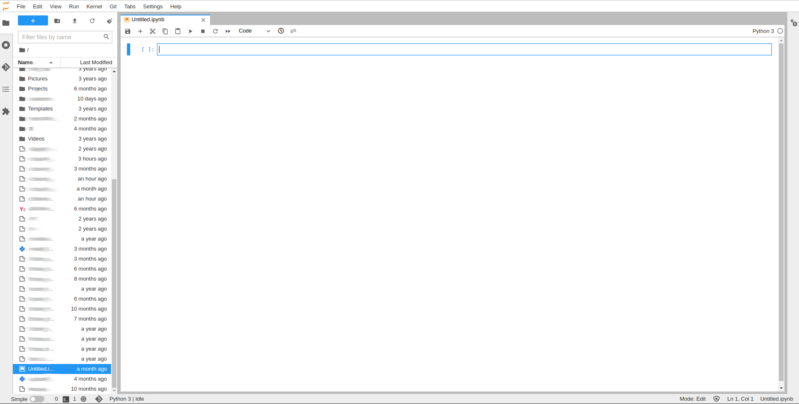

Machine Learning and Deep Learning development is sometimes more challenging than traditional software development. If 
you are working on an average laptop or computer, and you have a sizeable dataset that requires significant computation, 
your local machine may not be able to provide you with the resources for an effective workflow.

If you can run and debug your code on your own machine, congrats you are lucky! Continue doing that, then clone your code 
in the UI and send it for long-term training on a remote machine.

**If you are not that lucky**, this section is for you :)

## What does ClearML Session do?
`clearml-session` is a feature that allows to launch a session of Jupyterlab and VS Code, and to execute code on a remote 
machine that better meets resource needs. With this feature, local links are provided, which can be used to access 
JupyterLab and VS Code on a remote machine over a secure and encrypted SSH connection.

<details className="cml-expansion-panel screenshot">
<summary className="cml-expansion-panel-summary">Jupyter-Lab Window</summary>
<div className="cml-expansion-panel-content">


</div>
</details>

<br/>

<details className="cml-expansion-panel screenshot">
<summary className="cml-expansion-panel-summary">VS Code Window</summary>
<div className="cml-expansion-panel-content">


</div>
</details>

<!---->

## How it Works

ClearML allows to leverage a resource (e.g. GPU or CPU machine) by utilizing the [ClearML Agent](../clearml_agent).
A ClearML Agent will run on a target machine, and ClearML Session will instruct it to execute the Jupyter \ VS Code 
server to develop remotely.
After entering a `clearml-session` command with all specifications: 

   1. `clearml-session` creates a new [Task](../fundamentals/task.md) that is responsible for setting up the SSH and 
      JupyterLab / VS Code environment according to your specifications on the host machine. 
   
   1. The Task is enqueued, and a ClearML Agent pulls and executes it. The agent downloads the appropriate server and 
      launches it.  
   
   1. Once the agent finishes the initial setup of the interactive Task, the local `cleaml-session` connects to the host 
   machine via SSH, and tunnels both SSH and JupyterLab over the SSH connection. If a specific Docker was specified, the 
   JupyterLab environment will run inside the Docker. 
   
   1. The CLI outputs access links to the remote JupyterLab and VS Code sessions:  

    ```console
    Interactive session is running:
    SSH: ssh root@localhost -p 8022 [password: c5d19b3c0fa9784ba4f6aeb568c1e036a4fc2a4bc7f9bfc54a2c198d64ceb9c8]
    Jupyter Lab URL: http://localhost:8878/?token=ff7e5e8b9e5493a01b1a72530d18181320630b95f442b419
    VSCode server available at http://localhost:8898/
    ```

   Notice the links are to 'localhost' since all communication to the remote server itself is done over secure SSH connection.
   
   1. Now start working on the code as if you're running on the target machine itself!

## Features 
### Running in Docker
To run a session inside a Docker container, use the `--docker` flag and enter the docker image to use in the interactive 
session.

### Installing requirements
`clearml-session` can install required Python packages when setting up the remote environment. A `requirement.txt` file 
can be attached to the command using `--requirements </file/location.txt>`.
Alternatively, packages can be manually specified, using `--packages "<package_name>"` 
(for example `--packages "keras" "clearml"`), and they'll be automatically installed.

### Accessing a git repository
To access a git repository remotely, add a `--git-credentials` flag and set it to `true`, so the local .git-credentials 
file will be sent to the interactive session. This is helpful if working on private git repositories, and it allows for seamless 
cloning and tracking of git references, including untracked changes. 

### Re-launching and shutting down sessions 
If a `clearml-session` was launched locally and is still running on a remote machine, users can easily reconnect to it.
To reconnect to a previous session, execute `clearml-session` with no additional flags, and the option of reconnecting 
to an existing session will show up: 

```console
Connect to active session id=c7302b564aa945408aaa40ac5c69399c [Y]/n?`
```

If multiple sessions were launched from a local machine and are still active, choose the desired session:

```console
Active sessions:
0*] 2021-05-09 12:24:11 id=ed48fb83ad76430686b1abdbaa6eb1dd
1] 2021-05-09 12:06:48 id=009eb34abde74182a8be82f62af032ea
Connect to session [0-1] or 'N' to skip
```

To shut down a remote session, which will free the `clearml-agent` and close the CLI, enter "Shutdown". If a session 
is shutdown, there is no option to reconnect to it. 

### Connecting to an existing session
If a `clearml-session` is running remotely, it's possible to continue working on the session from any machine. 
When `clearml-session` is launched, it initializes a task with a unique ID in the ClearML Server. 

To connect to an existing session: 
1. Go to the web UI, find the interactive session task (by default, it's in project "DevOps").
1. Click on the ID button to the right of the task name, and copy the unique ID.
1. Enter the following command: `clearml-session --attach <session_id>`.
1. Click on the JupyterLab / VS Code link that is outputted, or connect directly to the SSH session


### Starting a debugging session 
Previously executed experiments in the ClearML system can be debugged on a remote interactive session. 
Input into `clearml-session` the ID of a Task to debug, then `clearml-session` clones the experiment's git repository and 
replicates the environment on a remote machine. Then the code can be interactively executed and debugged on JupyterLab / VS Code. 

:::note
The Task must be connected to a git repository, since currently single script debugging is not supported.
:::

1. In the **ClearML web UI**, find the experiment (Task) that needs debugging.
1. Click on the ID button next to the Task name, and copy the unique ID.
1. Enter the following command: `clearml-session --debugging-session <experiment_id_here>`
1. Click on the JupyterLab / VS Code link, or connect directly to the SSH session.
1. In JupyterLab / VS Code, access the experiment's repository in the `environment/task_repository` folder. 


### Command line options
#### `--vscode-server` and `--jupyter-lab`
By default, `clearml-session` downloads both Jupyter-Lab and VS Code servers. In order to save on resources and time,
you can choose to download just one of these options. To stop installation of one of the environments, pass either 
`--vscode-server` or `--jupyter-lab` and set it to `false`.  

#### `--public-ip`
`clearml-session` enables scaling-out development to multiple clouds, assigning development machines on AWS / GCP / Azure 
in a seamless way. By default, the remote session runs on-prem on the machine where the ClearML Agent executing the session was
launched. If you are running the session on a public cloud, pass the `--public-ip` flag and set it to `true`
in order to register the public IP of the remote machine.

#### `--init-script`
Use `--init-script` to specify a BASH init script file to be executed when the interactive session
is being set up. The script content is read and stored as the default script for the next sessions. 

#### `--user-folder`
Set the remote base folder for the session by passing the `--user-folder` flag with the path to the folder. 
By default, it is in the home folder(`~/`). The new base folder becomes the default folder in future sessions. 

#### `--config-file`
`clearml-session` stores its previous state by default in the `.clearml_session.json` configuration file. To change 
this configuration file, pass `--config-file` with the path to another configuration file. 

#### `--remote-gateway`
Use `--remote-gateway` to specify a gateway IP to pass to the interactive session, if an external address needs to be accessed.
  
#### `--base-task-id`
If you have a remote session task with your required specification and configurations, that task can be used as a base task
for `clearml-session`. Set a base task for the remote session by passing the task's ID with the `--base-task-id` flag. 
By default, the previously used session task is used as the base. To set the session to the default interactive session,
pass `--base-task-id none`
                        
#### `--disable-keepalive`
By default, `clearml-serving` uses a transparent proxy to keep the sockets alive, in order to maintain the connection to 
the remote resource. To disable this, pass the `--disable-keepalive` flag and set it to `true`. 

#### `--queue-excluded-tag` and `--queue-include-tag`  
When launching `clearml-session`, if a queue isn't specified, the CLI asks which queue to use. The queue list can be filtered 
according to specific tags by using the `--queue-excluded-tag` and `--queue-include-tag` flags, and specifying a list of tags. 
With `--queue-excluded-tag`, all queues with the specified tag/s will not be listed options, and with `--queue-include-tag`,
only tags with the specified tag/s will be listed.

See the `tags` parameter in the [queues.create](../references/api/endpoints#post-queuescreate)
API call. 
  
#### `--skip-docker-network`
Specify whether to pass the `--network host` flag to the Docker that is launching the remote session (see 
[Networking using the host network](https://docs.docker.com/network/network-tutorial-host/)), by using the `--skip-docker-network`.
By default, it is set to `false`.
 
#### `--username` and `--password`
In order to set your own SSH username and / or a password for the interactive session, pass the `--username` and `--password` 
flags. By default, the interactive session uses either a previously used password or a randomly generated 
one, and either  SSH username is `root` or a previously used username. 
