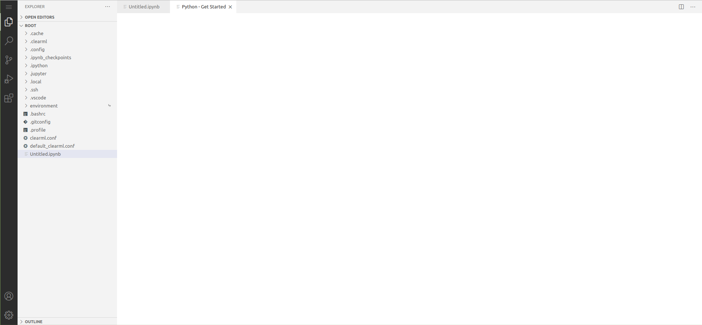

Machine Learning and Deep Learning development is sometimes more challenging than traditional software development. If 
you are working on an average laptop or computer, and you have a sizeable dataset that requires significant computation, 
your local machine may not be able to provide you with the resources for an effective workflow.

If you can run and debug your code on your own machine, congrats you are lucky! Continue doing that, then clone your code 
in the UI and send it for long-term training on a remote machine.

**If you are not that lucky**, this section is for you :)

## What Does ClearML Session Do?
`clearml-session` is a feature that allows to launch a session of JupyterLab and VS Code, and to execute code on a remote 
machine that better meets resource needs. This feature provides local links to access JupyterLab and VS Code on a 
remote machine over a secure and encrypted SSH connection. By default, the JupyterLab and 
VS Code remote sessions use ports 8878 and 8898 respectively. 

<details className="cml-expansion-panel screenshot">
<summary className="cml-expansion-panel-summary">JupyterLab Window</summary>
<div className="cml-expansion-panel-content">


</div>
</details>

<br/>

<details className="cml-expansion-panel screenshot">
<summary className="cml-expansion-panel-summary">VS Code Window</summary>
<div className="cml-expansion-panel-content">



</div>
</details>
<br/>

:::info Remote PyCharm
You can also work with PyCharm in a remote session over SSH. Use the [PyCharm Plugin](../guides/ide/integration_pycharm.md) 
to automatically sync local configurations with a remote session.
:::

## How it Works

ClearML allows you to leverage a resource (e.g. GPU or CPU machine) by utilizing the [ClearML Agent](../clearml_agent.md).
A ClearML Agent runs on a target machine, and ClearML Session instructs it to execute the Jupyter / VS Code 
server to develop remotely.
After entering a `clearml-session` command with all specifications: 

   1. `clearml-session` creates a new [Task](../fundamentals/task.md) that is responsible for setting up the SSH and 
      JupyterLab / VS Code environment according to your specifications on the host machine. 
   
   1. The Task is enqueued, and a ClearML Agent pulls and executes it. The agent downloads the appropriate server and 
      launches it.  
   
   1. Once the agent finishes the initial setup of the interactive Task, the local `cleaml-session` connects to the host 
   machine via SSH, and tunnels both SSH and JupyterLab over the SSH connection. If a Docker is specified, the 
   JupyterLab environment runs inside the Docker. 
   
   1. The CLI outputs access links to the remote JupyterLab and VS Code sessions:  

    ```console
    Interactive session is running:
    SSH: ssh root@localhost -p 8022 [password: c5d19b3c0fa9784ba4f6aeb568c1e036a4fc2a4bc7f9bfc54a2c198d64ceb9c8]
    Jupyter Lab URL: http://localhost:8878/?token=ff7e5e8b9e5493a01b1a72530d18181320630b95f442b419
    VSCode server available at http://localhost:8898/
    ```

   Notice the links are to 'localhost' since all communication to the remote server itself is done over secure SSH connection.
   
   1. Now start working on the code as if you're running on the target machine itself!

## Features 
### Running in Docker
To run a session inside a Docker container, use the `--docker` flag and enter the docker image to use in the interactive 
session.

### Installing Requirements
`clearml-session` can install required Python packages when setting up the remote environment. 
Specify requirements in one of the following ways: 
* Attach a `requirement.txt` file to the command using `--requirements </file/location.txt>`.
* Manually specify packages using `--packages "<package_name>"` 
(for example `--packages "keras" "clearml"`), and they'll be automatically installed.

### Accessing a Git Repository
To access a git repository remotely, add a `--git-credentials` flag and set it to `true`, so the local `.git-credentials` 
file is sent to the interactive session. This is helpful if working on private git repositories, and it allows for seamless 
cloning and tracking of git references, including untracked changes. 

### Re-launching and Shutting Down Sessions 
If a `clearml-session` was launched locally and is still running on a remote machine, users can easily reconnect to it.
To reconnect to a previous session, execute `clearml-session` with no additional flags, and the option of reconnecting 
to an existing session will show up: 

```console
Connect to active session id=c7302b564aa945408aaa40ac5c69399c [Y]/n?`
```

If multiple sessions were launched from a local machine and are still active, choose the desired session:

```console
Active sessions:
0*] 2021-05-09 12:24:11 id=ed48fb83ad76430686b1abdbaa6eb1dd
1] 2021-05-09 12:06:48 id=009eb34abde74182a8be82f62af032ea
Connect to session [0-1] or 'N' to skip
```

To shut down a remote session, which frees the `clearml-agent` and closes the CLI, enter "Shutdown". If a session 
is shutdown, there is no option to reconnect to it. 

### Connecting to an Existing Session
If a `clearml-session` is running remotely, you can continue working on the session from any machine. 
When `clearml-session` is launched, it initializes a task with a unique ID in the ClearML Server. 

To connect to an existing session: 
1. Go to the web UI, find the interactive session task (by default, it's in project "DevOps").
1. Click on the ID button to the right of the task name, and copy the unique ID.
1. Enter the following command: `clearml-session --attach <session_id>`.
1. Click on the JupyterLab / VS Code link that is outputted, or connect directly to the SSH session


### Starting a Debugging Session 
You can debug previously executed experiments registered in the ClearML system on a remote interactive session. 
Input into `clearml-session` the ID of a Task to debug, then `clearml-session` clones the experiment's git repository and 
replicates the environment on a remote machine. Then the code can be interactively executed and debugged on JupyterLab / VS Code. 

:::note
The Task must be connected to a git repository, since currently single script debugging is not supported.
:::

1. In the **ClearML web UI**, find the experiment (Task) that needs debugging.
1. Click on the ID button next to the Task name, and copy the unique ID.
1. Enter the following command: `clearml-session --debugging-session <experiment_id_here>`
1. Click on the JupyterLab / VS Code link, or connect directly to the SSH session.
1. In JupyterLab / VS Code, access the experiment's repository in the `environment/task_repository` folder. 


### Command Line Options

<div className="tbl-cmd">

| Command line options | Description | Default value |
|-----|---|---|
| `--jupyter-lab` | Download a JupyterLab environment | `true` |
| `--vscode-server` | Download a VSCode environment | `true` |
| `--public-ip` | Register the public IP of the remote machine (if you are running the session on a public cloud) | Session runs on the machine whose agent is executing the session|
| `--init-script` | Specify a BASH init script file to be executed when the interactive session is being set up | `none` or previously entered BASH script |
| `--user-folder` | Specify the path for the session's remote base folder for the session | Home folder(`~/`) or previously entered user folder path |
| `--config-file` | Specify a path to another configuration file for `clearml-session` to store its previous state | `.clearml_session.json` or previously entered configuration file |  
| `--remote-gateway` | Specify a gateway IP to pass to the interactive session, if an external address needs to be accessed | `none`|
| `--base-task-id` | Pass the ID of a task that will become the base task, so the session will use its configurations | `none` or the previously entered base task |
| `--disable-keepalive` | Disable transparent proxy that keep sockets alive to maintain the connection to the remote resource | `false` | 
| `--queue-excluded-tag` | The queue option list will exclude queues with specified tags. See the `tags` parameter in the [queues.create](../references/api/queues.md#post-queuescreate) API call | `none` |
| `--queue-include-tag` | The queue option list will include only queues with specified tags. See the `tags` parameter in the [queues.create](../references/api/queues.md#post-queuescreate) API call | `none` |
| `--skip-docker-network` | Don't pass the `--network host` flag to the Docker that is launching the remote session. See [Networking using the host network](https://docs.docker.com/network/network-tutorial-host/) | `false`|
| `--username`| Set your own SSH username for the interactive session | `root` or a previously used username | 
| `--password`| Set your own SSH password for the interactive session | A randomly generated password or a previously used one |

</div>