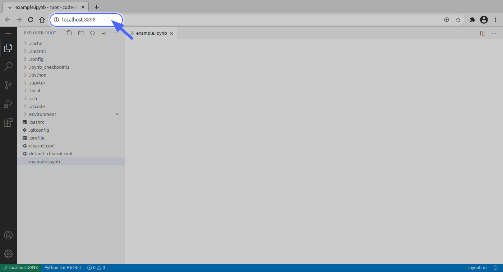

Machine Learning and Deep Learning development is sometimes more challenging than traditional software development. If 
you are working on an average laptop or computer, and you have a sizeable dataset that requires significant computation, 
your local machine may not be able to provide you with the resources for an effective workflow.

If you can run and debug your code on your own machine, congrats you are lucky! Continue doing that, then clone your code 
in the UI and send it for long-term training on a remote machine.

**If you are not that lucky**, this section is for you :)

ClearML provides tools that allow you to launch remote sessions and to execute code on a remote machine that better 
meets resource needs:
* [Clearml Session CLI](#clearml-session-cli) - Launch a JupyterLab and VS Code session on a remote machine
* [GUI Applications](#gui-applications) (available under ClearML Enterprise Plan)
  * [JupyterLab](../webapp/applications/apps_jupyter_lab.md) - Launch a JupyterLab session on a remote machine 
  * [VS Code](../webapp/applications/apps_vscode.md) - Launch a VS Code session on a remote machine 

:::info Remote PyCharm
You can also work with PyCharm in a remote session over SSH. Use the [PyCharm Plugin](../guides/ide/integration_pycharm.md) 
to automatically sync local configurations with a remote session.
:::

## ClearML Session CLI 
`clearml-session` is a feature that allows to launch a session of JupyterLab and VS Code, and to execute code on a remote 
machine that better meets resource needs. This feature provides local links to access JupyterLab and VS Code on a 
remote machine over a secure and encrypted SSH connection. By default, the JupyterLab and 
VS Code remote sessions use ports 8878 and 8898 respectively. 

<Collapsible title="JupyterLab Window" type="screenshot">


</Collapsible>

<br/>

<Collapsible type="screenshot" title="VS Code Window">



</Collapsible>


### Prerequisites
* `clearml` installed and configured. See [Getting Started](../getting_started/ds/ds_first_steps.md) for details.
* At least one `clearml-agent` running on a remote host. See [installation](../clearml_agent.md#installation) for details.
* An SSH client installed on your machine. To verify, open your terminal and execute `ssh`. If you did not receive an 
error, you are good to go.

### Launching ClearML Session 
1. Install `clearml-session`: 

   ```commandline
   pip install clearml-session
   ```

1. Run `clearml-session`:

   ```commandline
   clearml-session 
   ```    

   You can add flags to set a Docker image, the remote SSH port, JupyterLab/VS Code versions, and more. See [CLI options](#command-line-options) 
   for all configuration options.  
   
   `clearml-session` creates a new [Task](../fundamentals/task.md) that is responsible for setting up the SSH and 
   JupyterLab/VS Code environment according to your specifications on the host machine. 
 
1. Follow the `clearml-session` setup wizard:
      
   1. `Select the queue` - Choose the queue where the ClearML Session task will be enqueued. The agent assigned to this queue
   will set up and launch the remote server.
   1. `Launch interactive session?` - Click `y` to launch the interactive session. 

1. The session Task is enqueued in the selected queue, and a ClearML Agent pulls and executes it. The agent downloads the appropriate IDE(s) and 
   launches it.  

1. Once the agent finishes the initial setup of the interactive Task, the local `cleaml-session` connects to the host 
   machine via SSH, and tunnels both SSH and IDE over the SSH connection. If a Docker is specified, the 
   IDE environment runs inside the Docker. 
   
1. The CLI outputs access links to the remote JupyterLab and VS Code sessions:  

    ```console
    Interactive session is running:
    SSH: ssh root@localhost -p 8022 [password: <password>]
    Jupyter Lab URL: http://localhost:8878/?token=<token>
    VSCode server available at http://localhost:8898/
    ```

   Notice the links are to `localhost` since all communication to the remote server itself is done over a secure SSH connection.
   
1. Now start working on the code as if you're running on the target machine itself!

### Re-launching and Shutting Down Sessions 
If a `clearml-session` was launched locally and is still running on a remote machine, you can easily reconnect to it.
To reconnect to a previous session, execute `clearml-session` with no additional flags, and the option of reconnecting 
to an existing session will show up: 

```console
Connect to active session id=c7302b564aa945408aaa40ac5c69399c [Y]/n?
```

If multiple sessions were launched from a local machine and are still active, choose the desired session:

```console
Active sessions:
0*] 2021-05-09 12:24:11 id=ed48fb83ad76430686b1abdbaa6eb1dd
1] 2021-05-09 12:06:48 id=009eb34abde74182a8be82f62af032ea
Connect to session [0-1] or 'N' to skip
```

To shut down a remote session, which frees the `clearml-agent` and closes the CLI, enter "Shutdown". If a session 
is shut down, there is no option to reconnect to it. 

### Connecting to an Existing Session
If a `clearml-session` is running remotely, you can continue working on the session from any machine. 
When `clearml-session` is launched, it initializes a task with a unique ID in the ClearML Server. 

To connect to an existing session: 
1. Go to the web UI, find the interactive session task (by default, it's in project "DevOps").
1. Click on the ID button in the task page's header, and copy the unique ID.
1. Run the following command: `clearml-session --attach <session_id>`.
1. Click on the JupyterLab / VS Code link that is outputted, or connect directly to the SSH session

### Features 
#### Running in Docker
To run a session inside a Docker container, use the `--docker` flag and enter the docker image to use in the interactive 
session.

#### Installing Requirements
`clearml-session` can install required Python packages when setting up the remote environment. 
Specify requirements in one of the following ways: 
* Attach a `requirement.txt` file to the command using `--requirements </file/location.txt>`.
* Manually specify packages using `--packages "<package_name>"` 
(for example `--packages "keras" "clearml"`), and they'll be automatically installed.

#### Accessing a Git Repository
To access a git repository remotely, add a `--git-credentials` flag and set it to `true`, so the local `.git-credentials` 
file is sent to the interactive session. This is helpful if working on private git repositories, and it allows for seamless 
cloning and tracking of git references, including untracked changes. 

#### Uploading Local Files to Remote Session
You can upload local files and directories from your local machine into the remote session by specifying their path with 
`--upload-files <file_path>`. The entire content of the directory or file will be copied into your remote 
`clearml-session` container under the `~/session-files/` directory.

```commandline
clearml-session --upload-files /mnt/data/stuff
```

You can upload your files in conjunction with the `--store-workspace` option to easily move workloads between local 
development machines and remote machines with persistent workspace synchronization. See [Storing and Synchronizing Workspace](#storing-and-synchronizing-workspace).

#### Starting a Debugging Session 
You can debug previously executed experiments registered in the ClearML system on a remote interactive session. 
Input into `clearml-session` the ID of a Task to debug, then `clearml-session` clones the experiment's git repository and 
replicates the environment on a remote machine. Then the code can be interactively executed and debugged on JupyterLab / VS Code. 

:::note
The Task must be connected to a git repository, since currently single script debugging is not supported.
:::

1. In the **ClearML web UI**, find the experiment (Task) that needs debugging.
1. Click the `ID` button next to the Task name, and copy the unique ID.
1. Enter the following command: `clearml-session --debugging-session <experiment_id_here>`
1. Click on the JupyterLab / VS Code link, or connect directly to the SSH session.
1. In JupyterLab / VS Code, access the experiment's repository in the `environment/task_repository` folder. 

#### Storing and Synchronizing Workspace
You can store and sync your interactive session workspace with the `--store-workspace` option. `clearml-session`
will automatically create a snapshot of your entire workspace when shutting it down, and later restore in a 
new session on any remote machine. 

Specify the remote workspace root-folder by adding `--store-workspace <workspace_root_folder>` to the command line. In 
the remote session container, put all your code and data under the `<workspace_root_folder>` directory. When your 
session is shut down, the workspace folder will be automatically packaged and stored on the ClearML file server. 

```commandline
clearml-session --store-workspace ~/workspace --docker python:3.10-bullseye
```

In your next `clearml-session` execution, specify `--store-workspace <workspace_root_folder>` again and `clearml-session` 
will grab the previous workspace snapshot and restore it into the new remote container in `<workspace_root_folder>`.

```commandline
clearml-session --store-workspace ~/workspace --docker python:3.10-bullseye
```

To continue a specific session and restore its workspace, specify the session ID with `--continue-session <session_id>`:

```commandline
clearml-session --continue-session <session_id> --store-workspace ~/workspace --docker python:3.10-bullseye
```

### Command Line Options

<div className="tbl-cmd">

| Command line options | Description | Default value |
|-----|---|---|
| `--attach`| Attach to running interactive session | Previous session|
| `--base-task-id` | Pass the ID of a task that will become the base task, so the session will use its configurations | `none` or the previously entered base task |
| `--config-file` | Specify a path to another configuration file for `clearml-session` to store its previous state | `.clearml_session.json` or previously entered configuration file |  
| `--continue-session` | Pass the session of a previous session to continue, restoring your workspace (see `--store-workspace`) | `none` |
| `--debugging-session` | Pass existing Task ID, create a copy of the experiment on a remote machine, and launch Jupyter/SSH for interactive access. Example `--debugging-session <task_id>`| `none`|
| `--disable-session-cleanup` | If `True`, previous interactive sessions are not deleted | `false`|
| `--docker`| Select the docker image to use in the interactive session on |`nvidia/cuda:11.6.2-runtime-ubuntu20.04` or previously used docker image|
| `--docker-args` | Add additional arguments for the docker image to use in the interactive session | `none` or the previously used docker-args |
| `--force_dropbear`| Force using `dropbear` instead of SSHd |`None`| 
| `--git-credentials` | If `True`, local `.git-credentials` file is sent to the interactive session.| `false`|
| `--init-script` | Specify a BASH init script file to be executed when the interactive session is being set up | `none` or previously entered BASH script |
| `--jupyter-lab` | Install a JupyterLab on interactive session | `true` |
| `--keepalive` | If set, enables transparent proxy that keep sockets alive to maintain the connection to the remote resource | `false` - do not use transparent socket for mitigating connection drops | 
| `--packages`| Additional packages to add. Supports version numbers. Example: `--packages torch==1.7 tqdm` | Previously added packages.| 
| `--password`| Set your own SSH password for the interactive session | A randomly generated password or a previously used one |
| `--project`| Set the project name to the interactive session task| `DevOps` |
| `--public-ip` | If `true`, register the public IP of the remote machine (if you are running the session on a public cloud) | `false` - Session runs on the machine whose agent is executing the session|
| `--queue`| Select the queue to launch the interactive session on | Previously used queue|
| `--queue-excluded-tag` | The queue option list will exclude queues with specified tags. See the `tags` parameter in the [queues.create](../references/api/queues.md#post-queuescreate) API call | `none` |
| `--queue-include-tag` | The queue option list will include only queues with specified tags. See the `tags` parameter in the [queues.create](../references/api/queues.md#post-queuescreate) API call | `none` |
| `--remote-gateway` | Specify a gateway IP to pass to the interactive session, if an external address needs to be accessed | `none`|
| `--remote-ssh-port`| Set the remote SSH server port, running on the agent's machine | 10022|
| `--requirements`| Specify `requirements.txt` file to install when setting the interactive session. | `none` or previously used requirements (can be overridden by calling `--packages`)|
| `--session-name` | Set the name of the interactive session Task| `none` |
| `--session-tags` | Add tags to the interactive session for increased visibility | `none` |
| `--shell` | Open the SSH session directly. Notice, quiting the SSH session will not shut down the remote session|`None`|
| `--shutdowm`, `-S`| Shut down an active session | Previous session|
| `--skip-docker-network` | Don't pass the `--network host` flag to the Docker that is launching the remote session. See [Networking using the host network](https://docs.docker.com/network/network-tutorial-host/) | `false`|
| `--store-workspace` |  Upload/Restore remote workspace folder and extract it into next the session. Use with `--continue-session` to continue your previous work from your exact container state | `none` |
| `--upload-files`|  Specify local files/folders to upload to the remote session|`None`|
| `--user-folder` | Specify the path for the session's remote base folder for the session | Home folder(`~/`) or previously entered user folder path |
| `--username`| Set your own SSH username for the interactive session | `root` or a previously used username | 
| `--verbose` | Increase verbosity of logging | `none` |
| `--version`| Display the clearml-session utility version| N/A|
| `--vscode-extensions` |Install additional VSCode extensions and VSCode python extensions (example: `ms-python.python,ms-python.black-formatter,ms-python.pylint,ms-python.flake8`)|`None`|
| `--vscode-server` | Install VSCode on interactive session | `true` |
| `--vscode-version` | Set VSCode server (code-server) version, as well as VSCode python extension version <vscode:python-ext> (example: "3.7.4:2020.10.332292344")| `4.14.1:2023.12.0`|
| `--yes`, `-y`| Automatic yes to prompts; assume "yes" as answer to all prompts and run non-interactively |N/A|

</div>

## GUI Applications

:::important Enterprise Feature
This feature is available under the ClearML Enterprise plan
:::

The ClearML Enterprise Server provides GUI applications for setting up remote sessions in VS Code and JupyterLab. These
apps provide local links to access JupyterLab or VS Code on a remote machine over a secure and encrypted SSH connection,
letting you use the IDE as if you're running on the target machine itself

For more information, see [JupyterLab](../webapp/applications/apps_jupyter_lab.md) and/or [VS Code](../webapp/applications/apps_vscode.md).
