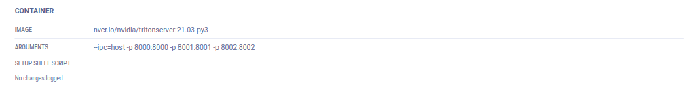
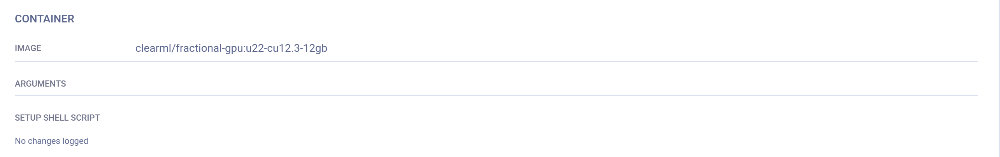

<div class="vid" >
<iframe style={{position: 'absolute', top: '0', left: '0', bottom: '0', right: '0', width: '100%', height: '100%'}} 
        src="https://www.youtube.com/embed/MX3BrXnaULs" 
        title="YouTube video player" 
        frameborder="0" 
        allow="accelerometer; autoplay; clipboard-write; encrypted-media; gyroscope; picture-in-picture; fullscreen" 
        allowfullscreen>
</iframe>
</div>

<br/>

**ClearML Agent** is a virtual environment and execution manager for DL / ML solutions on GPU machines. It integrates with the **ClearML Python Package** and ClearML Server to provide a full AI cluster solution. <br/>
Its main focus is around:
- Reproducing experiments, including their complete environments. 
- Scaling workflows on multiple target machines. 

ClearML Agent executes an experiment or other workflow by reproducing the state of the code from the original machine 
to a remote machine.


The preceding diagram demonstrates a typical flow where an agent executes a task:  

1. Enqueue a task for execution on the queue.
1. The agent pulls the task from the queue.
1. The agent launches a docker container in which to run the task's code.
1. The task's execution environment is set up:
   1.  Execute any custom setup script configured.
   1.  Install any required system packages.
   1.  Clone the code from a git repository.
   1.  Apply any uncommitted changes recorded.
   1.  Set up the python environment and required packages.
1. The task's script/code is executed.  

:::note Python Version
ClearML Agent uses the Python version available in the environment or docker in which it executes the code. It does not 
install Python, so make sure to use a docker or environment with the version you need.
::: 

While the agent is running, it continuously reports system metrics to the ClearML Server (these can be monitored in the 
[**Orchestration**](webapp/webapp_workers_queues.md) page).  

Continue using ClearML Agent once it is running on a target machine. Reproduce experiments and execute 
automated workflows in one (or both) of the following ways: 
* Programmatically (using [`Task.enqueue()`](references/sdk/task.md#taskenqueue) or [`Task.execute_remotely()`](references/sdk/task.md#execute_remotely))
* Through the ClearML Web UI (without working directly with code), by cloning experiments and enqueuing them to the 
  queue that a ClearML Agent is servicing.

The agent facilitates [overriding task execution detail](webapp/webapp_exp_tuning.md) values through the UI without 
code modification. Modifying a task clone’s configuration will have the ClearML agent executing it override the 
original values:
* Modified package requirements will have the experiment script run with updated packages
* Modified recorded command line arguments will have the ClearML agent inject the new values in their stead
* Code-level configuration instrumented with [`Task.connect()`](references/sdk/task.md#connect) will be overridden by modified hyperparameters

For more information, see [ClearML Agent Reference](clearml_agent/clearml_agent_ref.md), 
and [configuration options](configs/clearml_conf.md#agent-section).


## Installation

:::note
If ClearML was previously configured, follow [this](#adding-clearml-agent-to-a-configuration-file) to add 
ClearML Agent specific configurations
:::

To install ClearML Agent, execute
```bash
pip install clearml-agent
```

:::info
Install ClearML Agent as a system Python package and not in a Python virtual environment.
An agent that runs in Virtual Environment Mode or Conda Environment Mode needs to create virtual environments, and
it can't do that when running from a virtual environment.
:::

## Configuration

1. In a terminal session, execute
   ```bash
   clearml-agent init
   ```

    The setup wizard prompts for ClearML credentials (see [here](webapp/webapp_profile.md#clearml-credentials) about obtaining credentials).
    ```
    Please create new clearml credentials through the settings page in your `clearml-server` web app, 
    or create a free account at https://app.clear.ml/settings/webapp-configuration
    
    In the settings > workspace page, press "Create new credentials", then press "Copy to clipboard".

    Paste copied configuration here:    
    ```
    
    If the setup wizard's response indicates that a configuration file already exists, follow the instructions [here](#adding-clearml-agent-to-a-configuration-file). 
   The wizard does not edit or overwrite existing configuration files.

1. At the command prompt `Paste copied configuration here:`, copy and paste the ClearML credentials and press **Enter**. 
   The setup wizard confirms the credentials. 
        
   ```
   Detected credentials key="********************" secret="*******"
   ```
        
1. **Enter** to accept the default server URL, which is detected from the credentials or enter a ClearML web server URL.

   A secure protocol, https, must be used. **Do not use http.**
    
   ```
   WEB Host configured to: [https://app.clear.ml] 
   ```
        
   :::note
   If you are using a self-hosted ClearML Server, the default URL will use your domain.        
   :::
   
1. Do as above for API, URL, and file servers.

1. The wizard responds with your configuration:
   ```
   CLEARML Hosts configuration:
   Web App: https://app.clear.ml
   API: https://api.clear.ml
   File Store: https://files.clear.ml
        
   Verifying credentials ...
   Credentials verified!
   ```

1. Enter your Git username and password. Leave blank for SSH key authentication or when only using public repositories.
   
   This is needed for cloning repositories by the agent.
   ```
   Enter git username for repository cloning (leave blank for SSH key authentication): []
   Enter password for user '<username>':
   ```     
   The setup wizard confirms your git credentials.
   ``` 
   Git repository cloning will be using user=<username> password=<password>        
   ```
1. Enter an additional artifact repository, or press **Enter** if not required.
   
   This is needed for installing Python packages not found in pypi. 

   ```
   Enter additional artifact repository (extra-index-url) to use when installing python packages (leave blank if not required):
   ```
    The setup wizard completes.
   
   ```
   New configuration stored in /home/<username>/clearml.conf
   CLEARML-AGENT setup completed successfully.
   ```
   
    The configuration file location depends upon the operating system:
            
    * Linux - `~/clearml.conf`
    * Mac - `$HOME/clearml.conf`
    * Windows - `\User\<username>\clearml.conf`

1. Optionally, configure ClearML options for **ClearML Agent** (default docker, package manager, etc.). See the [ClearML Configuration Reference](configs/clearml_conf.md)
   and the [ClearML Agent Environment Variables reference](clearml_agent/clearml_agent_env_var.md). 
   
:::note
The ClearML Enterprise server provides a [configuration vault](webapp/webapp_profile.md#configuration-vault), the contents 
of which are categorically applied on top of the agent-local configuration
:::


### Adding ClearML Agent to a Configuration File

In case a `clearml.conf` file already exists, add a few ClearML Agent specific configurations to it.<br/>

**Adding ClearML Agent to a ClearML configuration file:**

1. Open the ClearML configuration file for editing. Depending upon the operating system, it is:
    * Linux - `~/clearml.conf`
    * Mac - `$HOME/clearml.conf`
    * Windows - `\User\<username>\clearml.conf`

1. After the `api` section, add your `agent` section. For example:
   ```
   agent {
       # Set GIT user/pass credentials (if user/pass are set, GIT protocol will be set to https)
       git_user=""
       git_pass=""
       # all other domains will use public access (no user/pass). Default: always send user/pass for any VCS domain
       git_host=""
   
       # Force GIT protocol to use SSH regardless of the git url (Assumes GIT user/pass are blank)
       force_git_ssh_protocol: false
   
       # unique name of this worker, if None, created based on hostname:process_id
       # Overridden with os environment: CLEARML_WORKER_NAME
       worker_id: ""
   }   
   ```
   View a complete ClearML Agent configuration file sample including an `agent` section [here](https://github.com/allegroai/clearml-agent/blob/master/docs/clearml.conf).

1. Save the configuration.

### Dynamic Environment Variables
Dynamic ClearML Agent environment variables can be used to override any configuration setting that appears in the [`agent`](configs/clearml_conf.md#agent-section) 
section of the `clearml.conf`.

The environment variable's name should be `CLEARML_AGENT__AGENT__<configuration-path>`, where `<configuration-path>` 
represents the full path to the configuration field being set. Elements of the configuration path should be separated by 
`__` (double underscore). For example, set the `CLEARML_AGENT__AGENT__DEFAULT_DOCKER__IMAGE` environment variable to 
deploy an agent with a different value to what is specified for `agent.default_docker.image` in the clearml.conf.

:::note NOTES
* Since configuration fields may contain JSON-parsable values, make sure to always quote strings (otherwise the agent 
might fail to parse them)
* To comply with environment variables standards, it is recommended to use only upper-case characters in 
environment variable keys. For this reason, ClearML Agent will always convert the configuration path specified in the 
dynamic environment variable's key to lower-case before overriding configuration values with the environment variable 
value.
:::

## Deployment

### Spinning Up an Agent
You can spin up an agent on any machine: on-prem and/or cloud instance. When spinning up an agent, you assign it to 
service a queue(s). Utilize the machine by enqueuing tasks to the queue that the agent is servicing, and the agent will 
pull and execute the tasks. 

:::tip cross-platform execution
ClearML Agent is platform agnostic. When using the ClearML Agent to execute experiments cross-platform, set platform 
specific environment variables before launching the agent.

For example, to run an agent on an ARM device, set the core type environment variable before spinning up the agent:

```bash
export OPENBLAS_CORETYPE=ARMV8
clearml-agent daemon --queue <queue_name>
```
:::

#### Executing an Agent
To execute an agent, listening to a queue, run:

```bash
clearml-agent daemon --queue <queue_name>
```

#### Executing in Background
To execute an agent in the background, run:
```bash
clearml-agent daemon --queue <execution_queue_to_pull_from> --detached
```
#### Stopping Agents
To stop an agent running in the background, run:
```bash
clearml-agent daemon <arguments> --stop
```

#### Allocating Resources
To specify GPUs associated with the agent, add the `--gpus` flag.
To execute multiple agents on the same machine (usually assigning GPU for the different agents), run:
```bash
clearml-agent daemon --detached --queue default --gpus 0
clearml-agent daemon --detached --queue default --gpus 1
```
To allocate more than one GPU, provide a list of allocated GPUs
```bash
clearml-agent daemon --gpus 0,1 --queue dual_gpu
```

#### Queue Prioritization
A single agent can listen to multiple queues. The priority is set by their order.

```bash
clearml-agent daemon --detached --queue high_q low_q --gpus 0
```
This ensures the agent first tries to pull a Task from the `high_q` queue, and only if it is empty, the agent will try to pull 
from the `low_q` queue.

To make sure an agent pulls from all queues equally, add the `--order-fairness` flag.
```bash
clearml-agent daemon --detached --queue group_a group_b --order-fairness  --gpus 0
```
It will make sure the agent will pull from the `group_a` queue, then from `group_b`, then back to `group_a`, etc. This ensures 
that `group_a` or `group_b` will not be able to starve one another of resources.

#### SSH Access
By default, ClearML Agent maps the host's `~/.ssh` into the container's `/root/.ssh` directory (configurable, 
see [clearml.conf](configs/clearml_conf.md#docker_internal_mounts)).

If you want to use existing auth sockets with ssh-agent, you can verify your host ssh-agent is working correctly with:

```commandline
echo $SSH_AUTH_SOCK
```

You should see a path to a temporary file, something like this:

```console
/tmp/ssh-<random>/agent.<random>
```

Then run your `clearml-agent` in Docker mode, which will automatically detect the `SSH_AUTH_SOCK` environment variable, 
and mount the socket into any container it spins. 

You can also explicitly set the `SSH_AUTH_SOCK` environment variable when executing an agent. The command below will 
execute an agent in Docker mode and assign it to service a queue. The agent will have access to 
the SSH socket provided in the environment variable.

```
SSH_AUTH_SOCK=<file_socket> clearml-agent daemon --gpus <your config> --queue <your queue name>  --docker
```

### Kubernetes 
Agents can be deployed bare-metal or as dockers in a Kubernetes cluster. ClearML Agent adds the missing scheduling 
capabilities to Kubernetes, allows for more flexible automation from code, and gives access to all of ClearML Agent's 
features.

ClearML Agent is deployed onto a Kubernetes cluster through its Kubernetes-Glue which maps ClearML jobs directly to K8s 
jobs:
* Use the [ClearML Agent Helm Chart](https://github.com/allegroai/clearml-helm-charts/tree/main/charts/clearml-agent) to
spin an agent pod acting as a controller. Alternatively (less recommended) run a [k8s glue script](https://github.com/allegroai/clearml-agent/blob/master/examples/k8s_glue_example.py) 
on a K8S cpu node
* The ClearML K8S glue pulls jobs from the ClearML job execution queue and prepares a K8s job (based on provided yaml 
template)
* Inside each job pod the `clearml-agent` will install the ClearML task's environment and run and monitor the experiment's 
process

:::important Enterprise Feature
The ClearML Enterprise plan supports K8S servicing multiple ClearML queues, as well as providing a pod template for each 
queue for describing the resources for each pod to use.

For example, the following configures which resources to use for `example_queue_1` and `example_queue_2`:

```yaml
agentk8sglue:
  queues:
    example_queue_1:
      templateOverrides:
        resources:
          limits:
            nvidia.com/gpu: 1
      nodeSelector:
        nvidia.com/gpu.product: A100-SXM4-40GB-MIG-1g.5gb
    example_queue_2:
      templateOverrides:
        resources:
          limits:
            nvidia.com/gpu: 2
      nodeSelector:
        nvidia.com/gpu.product: A100-SXM4-40GB
```
:::

### Slurm

:::important Enterprise Feature
Slurm Glue is available under the ClearML Enterprise plan
:::

Agents can be deployed bare-metal or inside [`Singularity`](https://docs.sylabs.io/guides/3.5/user-guide/introduction.html) 
containers in linux clusters managed with Slurm. 

ClearML Agent Slurm Glue maps jobs to Slurm batch scripts: associate a ClearML queue to a batch script template, then 
when a Task is pushed into the queue, it will be converted and executed as an `sbatch` job according to the sbatch 
template specification attached to the queue. 

1. Install the Slurm Glue on a machine where you can run `sbatch` / `squeue` etc. 
   
   ```
   pip3 install -U --extra-index-url https://*****@*****.allegro.ai/repository/clearml_agent_slurm/simple clearml-agent-slurm
   ```

1. Create a batch template. Make sure to set the `SBATCH` variables to the resources you want to attach to the queue. 
   The script below sets up an agent to run bare-metal, creating a virtual environment per job. For example:

   ```
   #!/bin/bash
   # available template variables (default value separator ":")
   # ${CLEARML_QUEUE_NAME}
   # ${CLEARML_QUEUE_ID}
   # ${CLEARML_WORKER_ID}.
   # complex template variables  (default value separator ":")
   # ${CLEARML_TASK.id}
   # ${CLEARML_TASK.name}
   # ${CLEARML_TASK.project.id}
   # ${CLEARML_TASK.hyperparams.properties.user_key.value}
   
   
   # example
   #SBATCH --job-name=clearml_task_${CLEARML_TASK.id}       # Job name DO NOT CHANGE
   #SBATCH --ntasks=1                    # Run on a single CPU
   # #SBATCH --mem=1mb                   # Job memory request
   # #SBATCH --time=00:05:00             # Time limit hrs:min:sec
   #SBATCH --output=task-${CLEARML_TASK.id}-%j.log
   #SBATCH --partition debug
   #SBATCH --cpus-per-task=1
   #SBATCH --priority=5
   #SBATCH --nodes=${CLEARML_TASK.hyperparams.properties.num_nodes.value:1}
   
   
   ${CLEARML_PRE_SETUP}
   
   echo whoami $(whoami)
   
   ${CLEARML_AGENT_EXECUTE}
   
   ${CLEARML_POST_SETUP}
   ```

   Notice: If you are using Slurm with Singularity container support replace `${CLEARML_AGENT_EXECUTE}` in the batch 
   template with `singularity exec ${CLEARML_AGENT_EXECUTE}`. For additional required settings, see [Slurm with Singularity](#slurm-with-singularity).

   :::tip 
   You can override the default values of a Slurm job template via the ClearML Web UI. The following command in the 
   template sets the `nodes` value to be the ClearML Task’s `num_nodes` user property:  
   ```
   #SBATCH --nodes=${CLEARML_TASK.hyperparams.properties.num_nodes.value:1}
   ```
   This user property can be modified in the UI, in the task's **CONFIGURATION > User Properties** section, and when the 
   task is executed the new modified value will be used. 
   ::: 

3. Launch the ClearML Agent Slurm Glue and assign the Slurm configuration to a ClearML queue. For example, the following 
   associates the `default` queue to the `slurm.example.template` script, so any jobs pushed to this queue will use the 
   resources set by that script.  
   ```
   clearml-agent-slurm --template-files slurm.example.template --queue default
   ```
   
   You can also pass multiple templates and queues. For example:
   ```
   clearml-agent-slurm --template-files slurm.template1 slurm.template2 --queue queue1 queue2
   ```

#### Slurm with Singularity
If you are running Slurm with Singularity containers support, set the following:

1. Make sure your `sbatch` template contains:
   ```
   singularity exec ${CLEARML_AGENT_EXECUTE}
   ```
   Additional singularity arguments can be added, for example: 
   ```
   singularity exec --uts ${CLEARML_AGENT_EXECUTE}`
   ``` 
1. Set the default Singularity container to use in your [clearml.conf](configs/clearml_conf.md) file:
   ```
   agent.default_docker.image="shub://repo/hello-world"
   ```
   Or
   ```
   agent.default_docker.image="docker://ubuntu"
   ```

1. Add `--singularity-mode` to the command line, for example:
   ```
   clearml-agent-slurm --singularity-mode --template-files slurm.example_singularity.template --queue default
   ```

### Explicit Task Execution

ClearML Agent can also execute specific tasks directly, without listening to a queue.

#### Execute a Task without Queue

Execute a Task with a `clearml-agent` worker without a queue.
```bash
clearml-agent execute --id <task-id>
```
#### Clone a Task and Execute the Cloned Task

Clone the specified Task and execute the cloned Task with a `clearml-agent` worker without a queue.
```bash
clearml-agent execute --id <task-id> --clone
```

#### Execute Task inside a Docker

Execute a Task with a `clearml-agent` worker using a Docker container without a queue.
```bash
clearml-agent execute --id <task-id> --docker
```

### Debugging

Run a `clearml-agent` daemon in foreground mode, sending all output to the console.
```bash
clearml-agent daemon --queue default --foreground
```

## Execution Environments

ClearML Agent has two primary execution modes: [Virtual Environment Mode](#virtual-environment-mode) and [Docker Mode](#docker-mode). 

### Virtual Environment Mode 

In Virtual Environment Mode, the agent creates a virtual environment for the experiment, installs the required Python 
packages based on the task specification, clones the code repository, applies the uncommitted changes and finally 
executes the code while monitoring it. This mode uses smart caching so packages and environments can be reused over 
multiple tasks (see [Virtual Environment Reuse](#virtual-environment-reuse)). 

ClearML Agent supports working with one of the following package managers: 
* [`pip`](https://en.wikipedia.org/wiki/Pip_(package_manager)) (default)
* [`conda`](https://docs.conda.io/en/latest/)
* [`poetry`](https://python-poetry.org/)

To change the package manager used by the agent, edit the [`package_manager.type`](configs/clearml_conf.md#agentpackage_manager) 
field in the of the `clearml.conf`. If extra channels are needed for `conda`, add the missing channels in the 
`package_manager.conda_channels` field in the `clearml.conf`. 

:::note Using Poetry with Pyenv
Some versions of poetry (using `install-poetry.py`) do not respect `pyenv global`.  
If you are using pyenv to control the environment where you use ClearML Agent, you can:
  * Use poetry v1.2 and above (which fixes [this issue](https://github.com/python-poetry/poetry/issues/5077))
  * Install poetry with the deprecated `get-poetry.py` installer
:::

### Docker Mode 
:::note notes
* Docker Mode is only supported in linux.
* Docker Mode requires docker service v19.03 or higher installed.
:::

When executing the ClearML Agent in Docker mode, it will: 
1. Run the provided Docker container 
1. Install ClearML Agent in the container 
1. Execute the Task in the container, and monitor the process. 
   
ClearML Agent uses the provided default Docker container, which can be overridden from the UI. 

:::tip Setting Docker Container via UI
You can set the docker container via the UI: 
1. Clone the experiment
2. Set the Docker in the cloned task's **Execution** tab **> Container** section
   
3. Enqueue the cloned task

The task will be executed in the container specified in the UI.
:::

All ClearML Agent flags (such as `--gpus` and `--foreground`) are applicable to Docker mode as well. 

To execute ClearML Agent in Docker mode, run: 
```bash
clearml-agent daemon --queue <execution_queue_to_pull_from> --docker [optional default docker image to use]
```

To use the current `clearml-agent` version in the Docker container, instead of the latest `clearml-agent` version that is 
automatically installed, pass the `--force-current-version` flag:
```bash
clearml-agent daemon --queue default --docker --force-current-version
```

For Kubernetes, specify a host mount on the daemon host. Do not use the host mount inside the Docker container.
Set the environment variable `CLEARML_AGENT_K8S_HOST_MOUNT`.
For example:
```
CLEARML_AGENT_K8S_HOST_MOUNT=/mnt/host/data:/root/.clearml
``` 

## Environment Caching

ClearML Agent caches virtual environments so when running experiments multiple times, there's no need to spend time reinstalling 
pre-installed packages. To make use of the cached virtual environments, enable the virtual environment reuse mechanism. 

### Virtual Environment Reuse

The virtual environment reuse feature may reduce experiment startup time dramatically.

By default, ClearML uses the package manager's environment caching. This means that even if no 
new packages need to be installed, checking the list of packages can take a long time.

ClearML has a virtual environment reuse mechanism which, when enabled, allows using environments as-is without resolving 
installed packages. This means that when executing multiple experiments with the same package dependencies, 
the same environment will be used.

:::note
ClearML does not support environment reuse when using Poetry package manager
:::

To enable environment reuse, modify the `clearml.conf` file and unmark the venvs_cache section.
```
venvs_cache: {
        # maximum number of cached venvs
        max_entries: 10
        # minimum required free space to allow for cache entry, disable by passing 0 or negative value
        free_space_threshold_gb: 2.0
        # unmark to enable virtual environment caching
        # path: ~/.clearml/venvs-cache
    },
```

## Dynamic GPU Allocation

:::important Enterprise Feature
This feature is available under the ClearML Enterprise plan
:::

The ClearML Enterprise server supports dynamic allocation of GPUs based on queue properties.
Agents can spin multiple Tasks from different queues based on the number of GPUs the queue
needs.

`dynamic-gpus` enables dynamic allocation of GPUs based on queue properties.
To configure the number of GPUs for a queue, use the `--gpus` flag to specify the active GPUs, and use the `--queue` 
flag to specify the queue name and number of GPUs:

```console
clearml-agent daemon --dynamic-gpus --gpus 0-2 --queue dual_gpus=2 single_gpu=1
```

### Example

Let's say a server has three queues:
* `dual_gpu`
* `quad_gpu`
* `opportunistic`

An agent can be spun on multiple GPUs (for example: 8 GPUs, `--gpus 0-7`), and then attached to multiple
queues that are configured to run with a certain amount of resources:

```console
clearml-agent daemon --dynamic-gpus --gpus 0-7 --queue quad_gpu=4 dual_gpu=2 
``` 

The agent can now spin multiple Tasks from the different queues based on the number of GPUs configured to the queue.
The agent will pick a Task from the `quad_gpu` queue, use GPUs 0-3 and spin it. Then it will pick a Task from the `dual_gpu`
queue, look for available GPUs again and spin on GPUs 4-5.

Another option for allocating GPUs:

```console
clearml-agent daemon --dynamic-gpus --gpus 0-7 --queue dual=2 opportunistic=1-4
``` 

Notice that a minimum and maximum value of GPUs is specified for the `opportunistic` queue. This means the agent
will pull a Task from the `opportunistic` queue and allocate up to 4 GPUs based on availability (i.e. GPUs not currently
being used by other agents).

## Fractional GPUs

Some tasks that you send for execution need a minimal amount of compute and memory, but you end up allocating entire 
GPUs to them. In order to optimize your compute resource usage, you can partition GPUs into slices. You can have a GPU 
device run multiple isolated workloads on separate slices that will not impact each other, and will only use the 
fraction of GPU memory allocated to them. 

ClearML provides several GPU slicing options to optimize compute resource utilization: 
* [Container-based Memory Limits](#container-based-memory-limits): Use pre-packaged containers with built-in memory 
limits to run multiple containers on the same GPU (**Available as part of the ClearML open source offering**)
* [Kubernetes-based Static MIG Slicing](#kubernetes-static-mig-fractions): Set up Kubernetes support for NVIDIA MIG 
(Multi-Instance GPU) to define GPU fractions for specific workloads (**Available as part of the ClearML open source offering**)
* Dynamic GPU Slicing: On-demand GPU slicing per task for both MIG and non-MIG devices (**Available under the ClearML Enterprise plan**):
  * [Bare Metal deployment](#bare-metal-deployment) 
  * [Kubernetes deployment](#kubernetes-deployment)
 
### Container-based Memory Limits
Use [`clearml-fractional-gpu`](https://github.com/allegroai/clearml-fractional-gpu)'s pre-packaged containers with 
built-in hard memory limitations. Workloads running in these containers will only be able to use up to the container's 
memory limit. Multiple isolated workloads can run on the same GPU without impacting each other. 


#### Usage 

##### Manual Execution 

1. Choose the container with the appropriate memory limit. ClearML supports CUDA 11.x and CUDA 12.x with memory limits 
ranging from 2 GB to 12 GB (see [clearml-fractional-gpu repository](https://github.com/allegroai/clearml-fractional-gpu/blob/main/README.md#-containers) for full list).
1. Launch the container:

   ```bash
   docker run -it --gpus 0 --ipc=host --pid=host clearml/fractional-gpu:u22-cu12.3-8gb bash 
   ```
   
   This example runs the ClearML Ubuntu 22 with CUDA 12.3 container on GPU 0, which is limited to use up to 8GB of its memory.
   :::note
   --pid=host is required to allow the driver to differentiate between the container's processes and other host processes when limiting memory usage
   :::
1. Run the following command inside the container to verify that the fractional gpu memory limit is working correctly:
   ```bash
   nvidia-smi
   ```
   Here is the expected output for the previous, 8GB limited, example on an A100: 
   ```bash
   +---------------------------------------------------------------------------------------+
   | NVIDIA-SMI 545.23.08              Driver Version: 545.23.08    CUDA Version: 12.3     |
   |-----------------------------------------+----------------------+----------------------+
   | GPU  Name                 Persistence-M | Bus-Id        Disp.A | Volatile Uncorr. ECC |
   | Fan  Temp   Perf          Pwr:Usage/Cap |         Memory-Usage | GPU-Util  Compute M. |
   |                                         |                      |               MIG M. |
   |=========================================+======================+======================|
   |   0  A100-PCIE-40GB                Off  | 00000000:01:00.0 Off |                  N/A |
   | 32%   33C    P0              66W / 250W |      0MiB /  8128MiB |      3%      Default |
   |                                         |                      |             Disabled |
   +-----------------------------------------+----------------------+----------------------+
                                                                                            
   +---------------------------------------------------------------------------------------+
   | Processes:                                                                            |
   |  GPU   GI   CI        PID   Type   Process name                            GPU Memory |
   |        ID   ID                                                             Usage      |
   |=======================================================================================|
   +---------------------------------------------------------------------------------------+
   ```
##### Remote Execution

You can set a ClearML Agent to execute tasks in a fractional GPU container. Set an agent’s default container via its 
command line. For example, all tasks pulled from the `default` queue by this agent will be executed in the Ubuntu 22 
with CUDA 12.3 container, which is limited to use up to 8GB of its memory:

```bash
clearml-agent daemon --queue default --docker clearml/fractional-gpu:u22-cu12.3-8gb
```

The agent’s default container can be overridden via the UI: 
1. Clone the task
1. Set the Docker in the cloned task's **Execution** tab > **Container** section
   
   

1. Enqueue the cloned task

The task will be executed in the container specified in the UI.

For more information, see [Docker Mode](#docker-mode).

##### Fractional GPU Containers on Kubernetes
Fractional GPU containers can be used to limit the memory consumption of your Kubernetes Job/Pod, and have multiple 
containers share GPU devices without interfering with each other.

For example, the following configures a K8s pod to run using the `clearml/fractional-gpu:u22-cu12.3-8gb` container, 
which limits the pod to 8 GB of the GPU's memory:
```
apiVersion: v1
kind: Pod
metadata:
  name: train-pod
  labels:
    app: trainme
spec:
  hostPID: true
  containers:
  - name: train-container
    image: clearml/fractional-gpu:u22-cu12.3-8gb
    command: ['python3', '-c', 'print(f"Free GPU Memory: (free, global) {torch.cuda.mem_get_info()}")']
```

:::note
`hostPID: true` is required to allow the driver to differentiate between the pod's processes and other host processes 
when limiting memory usage.
:::

#### Custom Container
Build your own custom fractional GPU container by inheriting from one of ClearML's containers: In your Dockerfile, make 
sure to include `From <clearml_container_image>` so the container will inherit from the relevant container.

See example custom Dockerfiles in the [clearml-fractional-gpu repository](https://github.com/allegroai/clearml-fractional-gpu/tree/main/examples).

### Kubernetes Static MIG Fractions
Set up NVIDIA MIG (Multi-Instance GPU) support for Kubernetes to define GPU fraction profiles for specific workloads 
through your NVIDIA device plugin.

The ClearML Agent Helm chart lets you specify a pod template for each queue which describes the resources that the pod 
will use. The template should specify the requested GPU slices under `Containers.resources.limits` to have the pods use 
the defined resources. For example, the following configures a K8s pod to run a `3g.20gb` MIG device:
```
# tf-benchmarks-mixed.yaml
apiVersion: v1
kind: Pod
metadata:
 name: tf-benchmarks-mixed
spec:
 restartPolicy: Never
 Containers:
    - name: tf-benchmarks-mixed
    image: ""
     command: []
     args: []
     resources:
       limits:
         nvidia.com/mig-3g.20gb: 1
 nodeSelector:  #optional
   nvidia.com/gpu.product: A100-SXM4-40GB
```

When tasks are added to the relevant queue, the agent pulls the task and creates a pod to execute it, using the 
specified GPU slice.

For example, the following configures tasks from the default queue to use `1g.5gb` MIG slices:
```
agentk8sglue:
 queue: default
 # …
 basePodTemplate:
   # …
   resources:
     limits:
       nvidia.com/gpu: 1
 nodeSelector:
   nvidia.com/gpu.product: A100-SXM4-40GB-MIG-1g.5gb
```

### Dynamic GPU Fractions

:::important Enterprise Feature
Dynamic GPU slicing is available under the ClearML Enterprise plan. 
:::

ClearML dynamic GPU fractions provide on-the-fly, per task GPU slicing, without having to set up containers or 
pre-configure tasks with memory limits. Specify a GPU fraction for a queue in the agent invocation, and every task the 
agent pulls from the queue will run on a container with the specified limit. This way you can safely run multiple tasks 
simultaneously without worrying that one task will use all of the GPU's memory. 

You can dynamically slice GPUs on [bare metal](#bare-metal-deployment) or on [Kubernetes](#kubernetes-deployment), for 
both MIG-enabled and non-MIG devices.

#### Bare Metal Deployment
1. Install the required packages:

   ```bash
   pip install clearml-agent clearml-agent-fractional-gpu
   ```
1. Start the ClearML agent with dynamic GPU allocation. Use `--gpus` to specify the active GPUs, and use the `--queue` 
   flag to specify the queue name(s) and number (or fraction) of GPUs to allocate to them. 

   ```
   clearml-agent daemon --dynamic-gpus --gpus 0, 1 --queue half_gpu=0.5
   ```

The agent can utilize 2 GPUs (GPUs 0 and 1). Every task enqueued to the `half_gpu` queue will be run by the agent and 
only allocated 50% GPU memory (i.e. 4 tasks can run concurrently). 

:::note
You can allocate GPUs for a queue’s tasks by specifying either a fraction of a single GPU in increments as small as 0.125 
(e.g. 0.125, 0.25, 0.50, etc.) or whole GPUs (e.g. 1, 2, 4, etc.). However, you cannot specify fractions greater than 
one GPU (e.g. 1.25).
::: 

You can set up multiple queues, each allocated a different number of GPUs per task. Note that the order that the queues 
are listed is their order of priority, so the agent will service tasks from the first listed queue before servicing 
subsequent queues:
```
clearml-agent daemon --dynamic-gpus --gpus 0-2 --queue dual_gpus=2 quarter_gpu=0.25 half_gpu=0.5 single_gpu=1 
```

This agent will utilize 3 GPUs (GPUs 0, 1, and 2). The agent can spin multiple jobs from the different queues based on 
the number of GPUs configured to the queue. 

##### Example Workflow
Let’s say that four tasks are enqueued, one task for each of the above queues (`dual_gpus`, `quarter_gpu`, `half_gpu`, 
`single_gpu`). The agent will first pull the task from the `dual_gpus` queue since it is listed first, and will run it 
using 2 GPUs. It will next run the tasks from `quarter_gpu` and `half_gpu`--both will run on the remaining available 
GPU. This leaves the task in the `single_gpu` queue. Currently 2.75 GPUs out of the 3 are in use so the task will only 
be pulled and run when enough GPUs become available. 

#### Kubernetes Deployment

ClearML supports fractional GPUs on Kubernetes through custom Enterprise Helm Charts for both MIG and non-MIG devices: 
* `clearml-dynamic-mig-operator` for [MIG devices](#mig-enabled-gpus)
* `clearml-fractional-gpu-injector` for [non-MIG devices](#non-mig-devices) 

For either setup, you can set up in your Enterprise ClearML Agent Helm chart the resources requirements of tasks sent to 
each queue. When a task is enqueued in ClearML, it translates into a Kubernetes pod running on the designated device 
with the specified fractional resource as defined in the Agent Helm chart. 

##### MIG-enabled GPUs 
The **ClearML Dynamic MIG Operator** (CDMO) chart enables running AI workloads on K8s with optimized hardware utilization 
and workload performance by facilitating MIG GPU partitioning. Make sure you have a [MIG capable GPU](https://docs.nvidia.com/datacenter/tesla/mig-user-guide/index.html#supported-gpus).

###### Prepare Cluster 
* Install the [NVIDIA GPU Operator](https://github.com/NVIDIA/gpu-operator):

   ```
   helm repo add nvidia https://helm.ngc.nvidia.com
   helm repo update
   
   helm install -n gpu-operator \
        gpu-operator \
        nvidia/gpu-operator \
        --create-namespace \
        --set migManager.enabled=false \
        --set mig.strategy=mixed
   ```
* Enable MIG support:
    1. Enable dynamic MIG support on your cluster by running following command on all nodes used for training (run for each GPU ID in your cluster):
  
       ```
       nvidia-smi -i <gpu_id> -mig 1
       ```
    1. Reboot node if required.
    1. Add following label to all nodes that will be used for training:
  
       ```
       kubectl label nodes <node-name> "cdmo.clear.ml/gpu-partitioning=mig"
       ```  

###### Configure ClearML Queues
The ClearML Enterprise plan supports K8S servicing multiple ClearML queues, as well as providing a pod template for each 
queue for describing the resources for each pod to use.

In the `values.yaml` file, set the resource requirements of each ClearML queue. For example, the following configures 
what resources to use for the `default025` and the `default050` queues: 
```
agentk8sglue:
  queues:
default025:
      templateOverrides:
        labels:
          required-resources: "0.25"
        resources:
          limits:
            nvidia.com/mig-1g.10gb: 1
default050:
      templateOverrides:
        labels:
          required-resources: "0.50"
        resources:
          limits:
            nvidia.com/mig-1g.10gb: 1
```

##### Non-MIG Devices
The **Fractional GPU Injector** chart enables running AI workloads on k8s in an optimized way, allowing you to use 
fractional GPUs on non-MIG devices.

###### Requirements
Install the [Nvidia GPU Operator](https://github.com/NVIDIA/gpu-operator) through the Helm chart. Make sure `timeSlicing` 
is enabled.

For example:
```
devicePlugin:
  config:
    name: device-plugin-config
    create: true
    default: "any"
    data:
      any: |-
        version: v1
        flags:
          migStrategy: none
        sharing:
          timeSlicing:
            renameByDefault: false
            failRequestsGreaterThanOne: false
            resources:
              - name: nvidia.com/gpu
                replicas: 4
```

The number of replicas is the maximum number of slices on a GPU.

###### Configure ClearML Queues
In the `values.yaml` file, set the resource requirements of each ClearML queue. When a task is enqueued to the queue, 
it translates into a Kubernetes pod running on the designated device with the specified resource slice. The queues must 
be configured with specific labels and annotations. For example, the following configures the `default0500` queue to use 
50% of a GPU and the `default0250` queue to use 25% of a GPU:
```
agentk8sglue:
  queues:
    default0500:
      templateOverrides:
        labels:
          required-resources: "0.5"
          clearml-injector/fraction: "0.500"
        resources:
          limits:
            nvidia.com/gpu: 1
            clear.ml/fraction-1: "0.5"
      queueSettings:
        maxPods: 10
    default0250:
      templateOverrides:
        labels:
          required-resources: "0.25"
          clearml-injector/fraction: "0.250"
        resources:
          limits:
            nvidia.com/gpu: 1
            clear.ml/fraction-1: "0.25"
      queueSettings:
        maxPods: 10
```
If a pod has a label matching the pattern `clearml-injector/fraction: "<gpu_fraction_value>"`, the injector will 
configure that pod to utilize the specified fraction of the GPU:
```
labels:
  clearml-injector/fraction: "<gpu_fraction_value>"
```
Where `<gpu_fraction_value>` must be set to one of the following values:
* "0.125"
* "0.250"
* "0.375"
* "0.500"
* "0.625"
* "0.750"
* "0.875"

## Services Mode
ClearML Agent supports a **Services Mode** where, as soon as a task is launched off of its queue, the agent moves on to the 
next task without waiting for the previous one to complete. This mode is intended for running resource-sparse tasks that 
are usually idling, such as periodic cleanup services or a [pipeline controller](references/sdk/automation_controller_pipelinecontroller.md). 

To run a `clearml-agent` in services mode, run:
```bash
clearml-agent daemon --services-mode --queue services --create-queue --docker <docker_name> --cpu-only
```

To limit the number of simultaneous tasks run in services mode, pass the maximum number immediately after the 
`--services-mode` option (for example: `--services-mode 5`).

:::note Notes
* `services-mode` currently only supports Docker mode. Each service spins on its own Docker image.
* The default `clearml-server` configuration already runs a single `clearml-agent` in services mode that listens to the 
  `services` queue.
:::

Launch a service task like any other task, by enqueuing it to the appropriate queue.

:::warning
Do not enqueue training or inference tasks into the services queue. They will put an unnecessary load on the server.
:::

### Setting Server Credentials

Self-hosted [ClearML Server](deploying_clearml/clearml_server.md) comes by default with a services queue.
By default, the server is open and does not require username and password, but it can be [password-protected](deploying_clearml/clearml_server_security.md#user-access-security).
In case it is password-protected, the services agent will need to be configured with server credentials (associated with a user).

To do that, set these environment variables on the ClearML Server machine with the appropriate credentials:
```
CLEARML_API_ACCESS_KEY
CLEARML_API_SECRET_KEY
```

## Exporting a Task into a Standalone Docker Container

### Task Container

Build a Docker container that when launched executes a specific experiment, or a clone (copy) of that experiment.

- Build a Docker container that at launch will execute a specific Task:

  ```bash
  clearml-agent build --id <task-id> --docker --target <new-docker-name> --entry-point reuse_task
  ```

- Build a Docker container that at launch will clone a Task specified by Task ID, and will execute the newly cloned Task:

  ```bash
  clearml-agent build --id <task-id> --docker --target <new-docker-name> --entry-point clone_task
  ```

- Run built Docker by executing:

  ```bash
  docker run <new-docker-name>
  ```

Check out [this tutorial](guides/clearml_agent/executable_exp_containers.md) for building executable experiment 
containers.

### Base Docker Container

Build a Docker container according to the execution environment of a specific task.

```bash
clearml-agent build --id <task-id> --docker --target <new-docker-name>
```

You can add the Docker container as the base Docker image to a task (experiment), using one of the following methods:

- Using the **ClearML Web UI** - See [Base Docker image](webapp/webapp_exp_tuning.md#base-docker-image) on the "Tuning
  Experiments" page.
- In the ClearML configuration file - Use the ClearML configuration file [`agent.default_docker`](configs/clearml_conf.md#agentdefault_docker)
  options.

Check out [this tutorial](guides/clearml_agent/exp_environment_containers.md) for building a Docker container 
replicating the execution environment of an existing task.

## Google Colab

ClearML Agent can run on a [Google Colab](https://colab.research.google.com/) instance. This helps users to leverage 
compute resources provided by Google Colab and send experiments for execution on it. 

Check out [this tutorial](guides/ide/google_colab.md) on how to run a ClearML Agent on Google Colab!


## Scheduling Working Hours

:::important Enterprise Feature
This feature is available under the ClearML Enterprise plan
:::

The Agent scheduler enables scheduling working hours for each Agent. During working hours, a worker will actively poll 
queues for Tasks, fetch and execute them. Outside working hours, a worker will be idle.

Schedule workers by:

* Setting configuration file options
* Running `clearml-agent` from the command line (overrides configuration file options)

Override worker schedules by:

* Setting runtime properties to force a worker on or off
* Tagging a queue on or off

### Running clearml-agent with a Schedule (Command Line)

Set a schedule for a worker from the command line when running `clearml-agent`. Two properties enable setting working hours:

:::warning
Use only one of these properties
:::

* `uptime` - Time span during which a worker will actively poll a queue(s) for Tasks, and execute them. Outside this 
  time span, the worker will be idle.
* `downtime` - Time span during which a worker will be idle. Outside this time span, the worker will actively poll and 
  execute Tasks.

Define `uptime` or `downtime` as `"<hours> <days>"`, where:

* `<hours>` - A span of hours (`00-23`) or a single hour. A single hour defines a span from that hour to midnight. 
* `<days>` - A span of days (`SUN-SAT`) or a single day.

Use `-` for a span, and `,` to separate individual values. To span before midnight to after midnight, use two spans.

For example:

* `"20-23 SUN"` - 8 PM to 11 PM on Sundays.
* `"20-23 SUN,TUE"` - 8 PM to 11 PM on Sundays and Tuesdays.
* `"20-23 SUN-TUE"` - 8 PM to 11 PM on Sundays, Mondays, and Tuesdays.
* `"20 SUN"` - 8 PM to midnight on Sundays.
* `"20-00,00-08 SUN"` - 8 PM to midnight and midnight to 8 AM on Sundays
* `"20-00 SUN", "00-08 MON"` - 8 PM on Sundays to 8 AM on Mondays (spans from before midnight to after midnight).

### Setting Worker Schedules in the Configuration File

Set a schedule for a worker using configuration file options. The options are:

:::warning
Use only one of these properties
:::

* ``agent.uptime``
* ``agent.downtime``

Use the same time span format for days and hours as is used in the command line.

For example, set a worker's schedule from 5 PM to 8 PM on Sunday through Tuesday, and 1 PM to 10 PM on Wednesday.

    agent.uptime: ["17-20 SUN-TUE", "13-22 WED"]

### Overriding Worker Schedules Using Runtime Properties

Runtime properties override the command line uptime / downtime properties. The runtime properties are:

:::warning
Use only one of these properties
:::

* `force:on` - Pull and execute Tasks until the property expires.
* `force:off` - Prevent pulling and execution of Tasks until the property expires.

Currently, these runtime properties can only be set using an ClearML REST API call to the `workers.set_runtime_properties`
endpoint, as follows: 

* The body of the request must contain the `worker-id`, and the runtime property to add.
* An expiry date is optional. Use the format `"expiry":<time>`. For example,  `"expiry":86400` will set an expiry of 24 hours.
* To delete the property, set the expiry date to zero, `"expiry":0`.

For example, to force a worker on for 24 hours:

```
curl --user <key>:<secret> --header "Content-Type: application/json" --data '{"worker":"<worker_id>","runtime_properties":[{"key": "force", "value": "on", "expiry": 86400}]}' http://<api-server-hostname-or-ip>:8008/workers.set_runtime_properties
```

### Overriding Worker Schedules Using Queue Tags

Queue tags override command line and runtime properties. The queue tags are the following:

:::warning
Use only one of these properties
:::

* ``force_workers:on`` - Any worker listening to the queue will keep pulling Tasks from the queue.
* ``force_workers:off`` - Prevent all workers listening to the queue from pulling Tasks from the queue.

Currently, you can set queue tags using an ClearML REST API call to the ``queues.update`` endpoint, or the 
APIClient. The body of the call must contain the ``queue-id`` and the tags to add.

For example, force workers on for a queue using the APIClient:

```python
from clearml.backend_api.session.client import APIClient

client = APIClient()
client.queues.update(queue="<queue_id>", tags=["force_workers:on"])
```

Or, force workers on for a queue using the REST API:

```bash
curl --user <key>:<secret> --header "Content-Type: application/json" --data '{"queue":"<queue_id>","tags":["force_workers:on"]}' http://<api-server-hostname-or-ip>:8008/queues.update
```

## References

* See [ClearML Agent CLI](clearml_agent/clearml_agent_ref.md) for a reference for `clearml-agent`'s CLI commands. 
* See [ClearML Agent Environment Variables](clearml_agent/clearml_agent_env_var.md) for a list of environment variables
to configure ClearML Agent