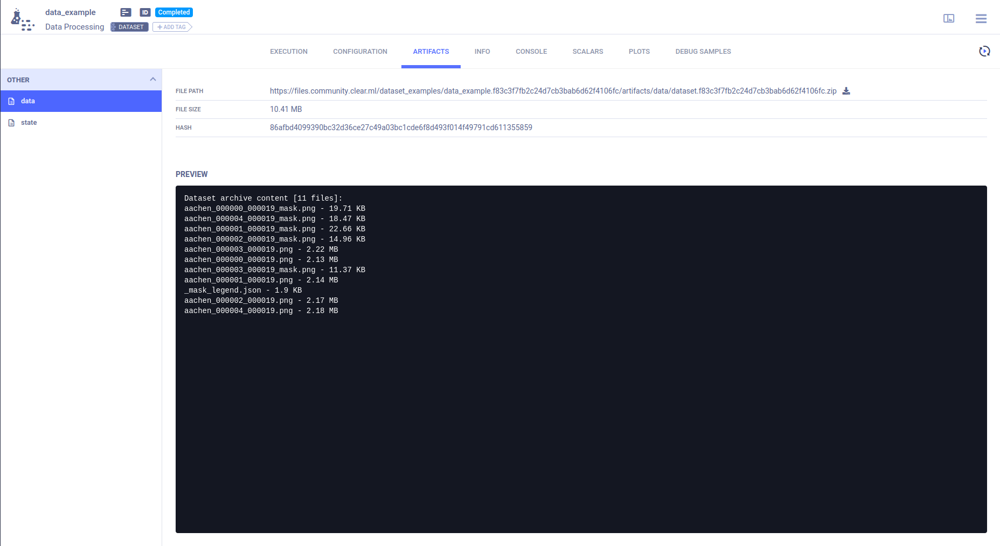
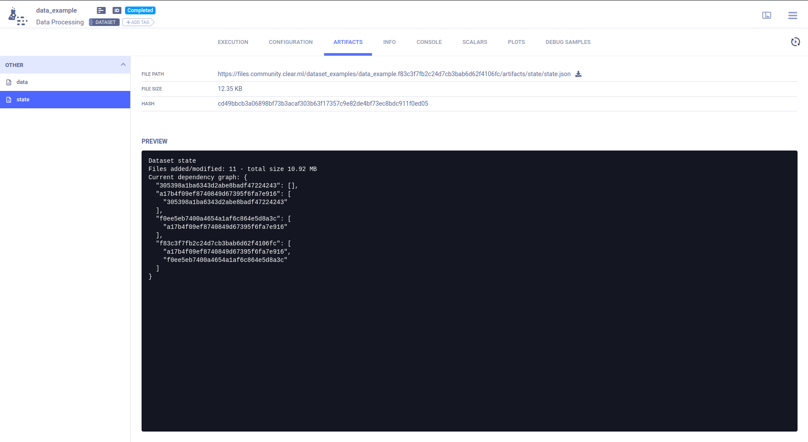
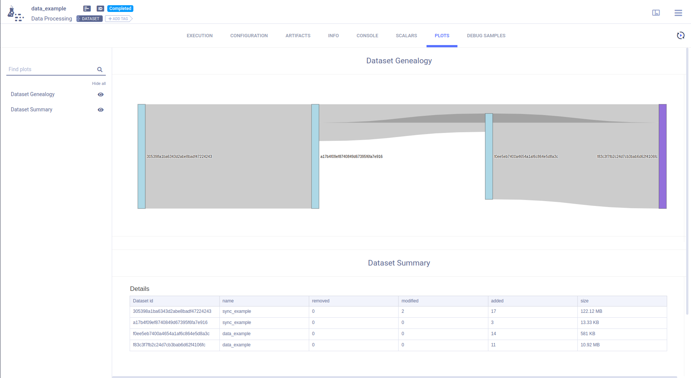

:::important
This page covers `clearml-data`, ClearML's file-based data management solution.
See [Hyper-Datasets](../hyperdatasets/overview.md) for ClearML's advanced queryable dataset management solution.
:::

In Machine Learning, you are very likely dealing with a gargantuan amount of data that you need to put in a dataset,
which you then need to be able to share, reproduce, and track.

ClearML Data Management solves two important challenges:
- Accessibility - Making data easily accessible from every machine,
- Versioning - Linking data and experiments for better **traceability**.

**We believe Data is not code**. It should not be stored in a git tree, because progress on datasets is not always linear.
Moreover, it can be difficult and inefficient to find on a git tree the commit associated with a certain version of a dataset.

A `clearml-data` dataset is a collection of files, stored on a central storage location (S3 / GS / Azure / Network Storage).
Datasets can be set up to inherit from other datasets, so data lineages can be created,
and users can track when and how their data changes.

Dataset changes are stored using differentiable storage, meaning a version will store the change-set from its previous dataset parents.

Local copies of datasets are always cached, so the same data never needs to be downloaded twice.
When a dataset is pulled it will automatically pull all parent datasets and merge them into one output folder for you to work with.

## Setup

`clearml-data` comes built-in with the `clearml` python package! Just check out the [Getting Started](../getting_started/ds/ds_first_steps.md) 
guide for more info!

## Using ClearML Data

ClearML Data offers two interfaces:
- `clearml-data` - A CLI utility for creating, uploading, and managing datasets. See [CLI](clearml_data_cli.md) for a reference of `clearml-data` commands.
- `clearml.Dataset` - A python interface for creating, retrieving, managing, and using datasets. See [SDK](clearml_data_sdk.md) for an overview of the basic methods of the `Dataset` module.

For an overview of our recommendations for ClearML Data workflows and practices, see [Best Practices](best_practices.md).

## WebApp 

ClearML's WebApp provides a visual interface to your datasets through dataset tasks. Dataset tasks are categorized 
as data-processing [task type](../fundamentals/task.md#task-types), and they are labeled with a `DATASET` system tag.

Full log (calls / CLI) of the dataset creation process can be found in a dataset's **EXECUTION** section.

Listing of the dataset differential snapshot, summary of files added / modified / removed and details of files in the 
differential snapshot (location / size / hash), is available in the **ARTIFACTS** section. Download the dataset 
by clicking  ,
next to the **FILE PATH**.

The full dataset listing (all files included) is available in the **CONFIGURATION** section under **Dataset Content**. 
This allows you to quickly compare two dataset contents and visually see the difference.
The dataset genealogy DAG and change-set summary table is visualized in **RESULTS > PLOTS**

Dataset Contents

 

View a DAG of the dataset dependencies (all previous dataset versions and their parents) in the dataset's page **> ARTIFACTS > state**.

Data Dependency DAG

Once a dataset has been finalized, view its genealogy in the dataset's
page **>** **RESULTS** **>** **PLOTS**

Dataset Genealogy

