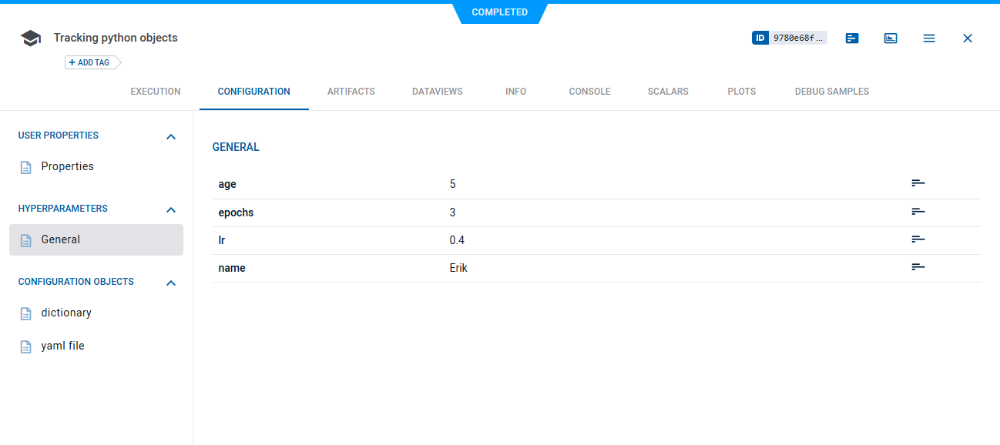
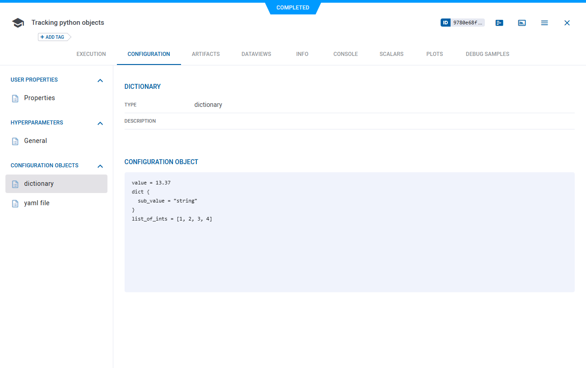
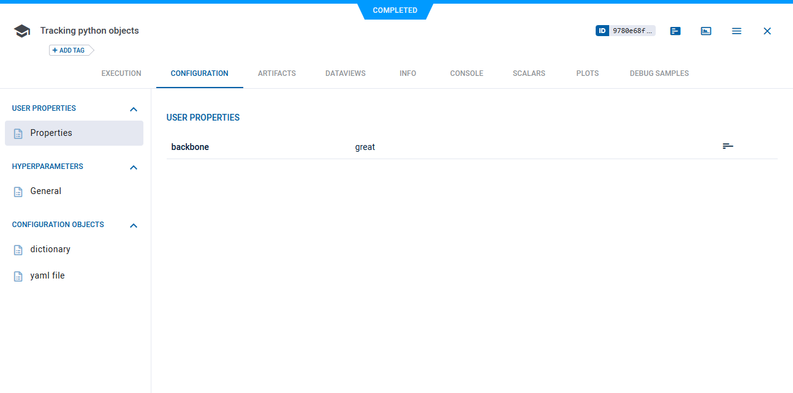

The following page provides an overview of the basic Pythonic interface to ClearML Tasks.

## Task Creation

[`Task.init`](../references/sdk/task.md) is the main method used to create tasks in ClearML. It will create a task, and 
populate it with:
* A link to the running git repository (including commit ID and local uncommitted changes)
* Python packages used (i.e. directly imported Python packages, and the versions available on the machine)
* Argparse arguments (default and specific to the current execution)
* Reports to Tensorboard & Matplotlib and model checkpoints.

:::tip Ensuring Reproducibility 
To ensure every run will provide the same results, ClearML controls the deterministic behaviors of the `tensorflow`, 
`pytorch`, and `random` packages by setting a fixed initial seed. See [Setting Random Seed](#setting-random-seed).
:::

:::note
ClearML object (e.g. task, project) names are required to be at least 3 characters long
:::

```python
from clearml import Task


task = Task.init(
    project_name='example',    # project name of at least 3 characters
    task_name='task template', # task name of at least 3 characters
    task_type=None,
    tags=None,
    reuse_last_task_id=True,
    continue_last_task=False,
    output_uri=None,
    auto_connect_arg_parser=True,
    auto_connect_frameworks=True,
    auto_resource_monitoring=True,
    auto_connect_streams=True,    
)
```

Once a task is created, the task object can be accessed from anywhere in the code by calling [`Task.current_task`](../references/sdk/task.md#taskcurrent_task).

If multiple tasks need to be created in the same process (for example, for logging multiple manual runs), 
make sure to close a task, before initializing a new one. To close a task simply call [`Task.close`](../references/sdk/task.md#close) 
(see example [here](../guides/advanced/multiple_tasks_single_process.md)).

When initializing a task, its project needs to be specified. If the project entered does not exist, it will be created on-the-fly. 
Projects can be divided into subprojects, just like folders are broken into sub-folders.

For example:
```python
Task.init(project_name='main_project/sub_project', task_name='test')
```

Nesting projects works on multiple levels. For example: `project_name=main_project/sub_project/sub_sub_project` 

### Automatic Logging
After invoking `Task.init` in a script, ClearML starts its automagical logging, which includes the following elements:
* **Hyperparameters** - ClearML logs the following types of hyperparameters:
    * Command Line Parsing - ClearML captures any command line parameters passed when invoking code that uses standard python packages, including:
        * [click](https://click.palletsprojects.com) (see code example [here](https://github.com/allegroai/clearml/blob/master/examples/frameworks/click/click_multi_cmd.py)).
        * argparse (see argparse logging example [here](../guides/reporting/hyper_parameters.md).)
        * [Python Fire](https://github.com/google/python-fire)  - see code examples [here](https://github.com/allegroai/clearml/tree/master/examples/frameworks/fire).
        * [LightningCLI](https://pytorch-lightning.readthedocs.io/en/latest/api/pytorch_lightning.cli.LightningCLI.html) - see code example [here](https://github.com/allegroai/clearml/blob/master/examples/frameworks/jsonargparse/pytorch_lightning_cli.py).
    * TensorFlow Definitions (`absl-py`)
    * [Hydra](https://github.com/facebookresearch/hydra) - the Omegaconf which holds all the configuration files, as well as overridden values. 
* **Models** - ClearML automatically logs and updates the models and all snapshot paths saved with the following frameworks:
    * Tensorflow (see [code example](../guides/frameworks/tensorflow/tensorflow_mnist.md))
    * Keras (see [code example](../guides/frameworks/keras/keras_tensorboard.md))
    * Pytorch (see [code example](../guides/frameworks/pytorch/pytorch_mnist.md))
    * scikit-learn (only using joblib) (see [code example](../guides/frameworks/scikit-learn/sklearn_joblib_example.md))
    * XGBoost (only using joblib) (see [code example](../guides/frameworks/xgboost/xgboost_sample.md))
    * FastAI (see [code example](../guides/frameworks/fastai/fastai_with_tensorboard.md))
    * MegEngine (see [code example](../guides/frameworks/megengine/megengine_mnist.md))
    * CatBoost (see [code example](../guides/frameworks/catboost/catboost.md))
    
* **Metrics, scalars, plots, debug images** reported through supported frameworks, including:
    * Matplotlib (see [code example](../guides/frameworks/matplotlib/matplotlib_example.md))
    * Tensorboard (see [code example](../guides/frameworks/pytorch/pytorch_tensorboardx.md))
    * TensorboardX (see [code example](../guides/frameworks/tensorboardx/tensorboardx.md))
  
* **Execution details** including:
    * Git information 
    * Uncommitted code modifications - In cases where no git repository is detected (e.g. when a single python script is 
      executed outside a git repository, or when running from a Jupyter Notebook), ClearML logs the contents 
      of the executed script
    * Python environment
    * Execution [configuration](../webapp/webapp_exp_track_visual.md#configuration) 
  
To control a task's framework logging, use the `auto_connect_frameworks` parameter of the [`Task.init`](../references/sdk/task.md#taskinit) 
method. Turn off all automatic logging by setting the parameter to `False`. For finer grained control of logged frameworks, 
input a dictionary, with framework-boolean pairs. 

For example: 

```python
auto_connect_frameworks={
    'matplotlib': True, 'tensorflow': False, 'tensorboard': False, 'pytorch': True,
    'xgboost': False, 'scikit': True, 'fastai': True, 'lightgbm': False,
    'hydra': True, 'detect_repository': True, 'tfdefines': True, 'joblib': True,
    'megengine': True, 'jsonargparse': True, 'catboost': True
}
```

You can also input wildcards as dictionary values. ClearML will log a model created by a framework only if its local path 
matches at least one wildcard. 

For example, in the code below, ClearML will log PyTorch models only if their paths have the 
`.pt` extension. The unspecified frameworks' values default to `true` so all their models are automatically logged. 

```python
auto_connect_frameworks={'pytorch' : '*.pt'}
```

For TensorBoard, you can specify whether to log hyperparameters. By default, ClearML automatically logs TensorBoard's 
parameters, but you can disable the logging with the following code:

```python
auto_connect_frameworks={'tensorboard': {'report_hparams': False}} 
```
 
### Task Reuse
Every `Task.init` call will create a new task for the current execution.
In order to mitigate the clutter that a multitude of debugging tasks might create, a task will be reused if:
* The last time it was executed (on this machine) was under 72 hours ago (configurable, see 
  [`sdk.development.task_reuse_time_window_in_hours`](../configs/clearml_conf.md#task_reuse) in 
  the ClearML configuration reference)
* The previous task execution did not have any artifacts / models

It's possible to always create a new task by passing `reuse_last_task_id=False`.

See full `Task.init` reference [here](../references/sdk/task.md#taskinit).

### Continuing Task Execution
You can continue the execution of a previously run task using the `continue_last_task` parameter of the `Task.init` 
method. This will retain all of its previous artifacts / models / logs.  

The task will continue reporting its outputs based on the iteration in which it had left off. For example: a task’s last 
train/loss scalar reported was for iteration 100, when continued, the next report will be as iteration 101.  

:::note Reproducibility
Continued tasks may not be reproducible. In order to guarantee task reproducibility, you must ensure that all steps are 
done in the same order (e.g. maintaining learning rate profile, ensuring data is fed in same order).
:::

Pass one of the following in the `continue_last_task` parameter:
* `False` (default) - Overwrite the execution of the previous Task (unless you pass `reuse_last_task_id=False`, see 
  [Task Reuse](#task-reuse)). 
* `True` - Continue the previously run Task. 
* Task ID (string) - The ID of the task to be continued. 
* Initial iteration offset  (Integer) - Specify the initial iteration offset. By default, the task will continue one 
  iteration after the last reported one. Pass `0`, to disable the automatic last iteration offset. To also specify a 
  task ID, use the `reuse_last_task_id` parameter .

You can also continue a task previously executed in offline mode, using the `Task.import_offline_session` method. 
See [Offline Mode](#offline-mode). 

### Empty Task Creation

A task can also be created without the need to execute the code itself.
Unlike the runtime detections, all the environment and configuration details need to be provided explicitly.

For example:
```python
task = Task.create(
    project_name='example', 
    task_name='task template',
    repo='https://github.com/allegroai/clearml.git',
    branch='master',
    script='examples/reporting/html_reporting.py',
    working_directory='.',
    docker=None,
)
```

See full `Task.create` reference [here](../references/sdk/task.md#taskcreate).

## Tracking Task Progress
Track a task’s progress by setting the task progress property using the [`Task.set_progress`](../references/sdk/task.md#set_progress) method. 
Set a task’s progress to a numeric value between 0 - 100. Access the task’s current progress, using the 
[`Task.get_progress`](../references/sdk/task.md#get_progress) method. 

```python
task = Task.init(project_name="examples", task_name="Track experiment progress")
task.set_progress(0)
# task doing stuff
task.set_progress(50)
print(task.get_progress())
# task doing more stuff
task.set_progress(100)
```

While the task is running, the WebApp will show the task’s progress indication in the experiment table, next to the 
task’s status. If a task failed or was aborted, you can view how much progress it had made. 

<div class="max-w-50">


</div>

Additionally, you can view a task’s progress in its [INFO](../webapp/webapp_exp_track_visual.md#general-information) tab 
in the WebApp. 


## Accessing Tasks
A task can be identified by its project and name, and by a unique identifier (UUID string). The name and project of 
a task can be changed after an experiment has been executed, but its ID can't be changed.

Programmatically, task objects can be retrieved by querying the system based on either the task ID or a project and name 
combination using the [`Task.get_task`](../references/sdk/task.md#taskget_task) class method. If a project / name 
combination is used, and multiple tasks have the exact same name, the function will return the *last modified task*.

For example:
* Accessing a task object with a task ID:
  
    ```python
    a_task = Task.get_task(task_id='123456deadbeef')
    ```
* Accessing a task with a project and name:
  
    ```python
    a_task = Task.get_task(project_name='examples', task_name='artifacts')
    ```

Once a task object is obtained, it's possible to query the state of the task, reported scalars, etc.
The task's outputs, such as artifacts and models, can also be retrieved. 

## Querying / Searching Tasks

Search and filter tasks programmatically. Input search parameters into the [`Task.get_tasks`](../references/sdk/task.md#taskget_tasks) 
method, which returns a list of task objects that match the search. Pass `allow_archived=False` to filter out archived 
tasks.


For example:
```python
task_list = Task.get_tasks(
    task_ids=None,  # type Optional[Sequence[str]]
    project_name=None,  # Optional[str]
    task_name=None,  # Optional[str]
    allow_archived=True, # [bool]
    task_filter=None,  # Optional[Dict]#
    # tasks with tag `included_tag` and without tag `excluded_tag`
    tags=['included_tag', '-excluded_tag'] 
)
```

It's possible to also filter tasks by passing filtering rules to `task_filter`. 

For example:
```python
task_filter={
    # filter out archived tasks
    'system_tags': ['-archived'],
    # only completed & published tasks
    'status': ['completed', 'published'],
    # only training type tasks
    'type': ['training'],
    # match text in task comment or task name
    'search_text': 'reg_exp_text'
}
```

See [`Task.get_tasks`](../references/sdk/task.md#taskget_tasks) for all `task_filter` options.

### Tag Filters
The `tags` field supports advanced queries through combining tag names and operators into a list. 

The supported operators are: 
* `not` 
* `and`
* `or`

Input the operators in the following format: `"__$<op>"`. To exclude a tag, you can also use the `-` prefix before the 
tag name, unless the tag name begins with the dash character (`-`), in which case you can use `"__$not"`. 

The `or`, and `and` operators apply to all tags that follow them until another operator is specified. The `not` operator 
applies only to the immediately following tag.

The default operator for a query is `or`, unless `and` is placed at the beginning of the query.

#### Examples

* The following query will return tasks that have at least one of the provided tags, since the default operator is 
  `or` (`"a" OR "b" OR "c"`)
  ```python
  task_list = Task.get_tasks(tags=["a", "b", "c"])
  ```
  
* The following query will return tasks that have all three provided tags, since the `and` operator was placed in the 
  beginning of the list, making it the default operator (`"a" AND "b" AND "c"`). 
  ```python
  task_list = Task.get_tasks(tags=["__$and", "a", "b", "c"])
  ```

* The following query will return tasks that have neither tag `a` nor tag `c`, but do have tag `b` 
  (`NOT "a" AND "b" AND NOT "c"`).
  ```python
  task_list = Task.get_tasks(tags=["__$not", "a", "b", "__$not" "c"])
  ```

  This is equivalent to `task_list = Task.get_tasks(tags=["-a", "b", "-c"])`


* The following query will return tasks with either tag `a` or tag `b` or both `c` and `d` tags 
  (`"a" OR "b" OR ("c" AND "d")`).
  ```python
  task_list = Task.get_tasks(tags=["a", "b", "__$and", "c", "d"])
  ```

* The following query will return tasks that have either tag `a` or tag `b` and both tag `c` and tag `d` 
  (`("a" OR "b") AND "c" AND "d"` ).
  ```python
  task_list = Task.get_tasks(
    tags=["__$and", "__$or", "a", "b", "__$and", "c", "d"]
  )
  ```

## Cloning & Executing Tasks

Once a task object is created, it can be copied (cloned). [`Task.clone`](../references/sdk/task.md#taskclone) returns 
a copy of the original task (`source_task`). By default, the cloned task is added to the same project as the original, 
and it's called "Clone Of ORIGINAL_NAME", but the name / project / comment (description) of the cloned task can be directly overridden.

```python
task = Task.init(project_name='examples', task_name='original task',)
cloned = Task.clone(
    source_task=task,  # type: Optional[Union[Task, str]]
    # override default name
    name='newly created task',  # type: Optional[str]
    comment=None,  # type: Optional[str]
    # insert cloned task into a different project
    project=None,  # type: Optional[str]
)
```

A newly cloned task has a [draft](../fundamentals/task.md#task-states) status, so it's modifiable.

Once a task is modified, launch it by pushing it into an execution queue with the [Task.enqueue](../references/sdk/task.md#taskenqueue)
class method. Then a [ClearML Agent](../clearml_agent.md) assigned to the queue will pull the task from the queue and execute
it. 

```python
Task.enqueue(
    task=task,  # type: Union[Task, str]
    queue_name='default',  # type: Optional[str] 
    queue_id=None  # type: Optional[str]
)
```

See enqueue [example](https://github.com/allegroai/clearml/blob/master/examples/automation/programmatic_orchestration.py).

## Advanced Flows

### Remote Execution

A compelling workflow is:
1. Run code on a development machine for a few iterations, or just set up the environment.
1. Move the execution to a beefier remote machine for the actual training.

Use the [Task.execute_remotely](../references/sdk/task.md#execute_remotely) method to implement this workflow. This method 
stops the current manual execution, and then re-runs it on a remote machine.

For example:
```python
task.execute_remotely(
    queue_name='default',  # type: Optional[str]
    clone=False,  # type: bool
    exit_process=True  # type: bool
)
```

Once the method is called on the machine, it stops the local process and enqueues the current task into the `default` 
queue. From there, an agent can pull and launch it.

See the [Remote Execution](../guides/advanced/execute_remotely.md) example. 

#### Remote Function Execution
A specific function can also be launched on a remote machine with the [`Task.create_function_task`](../references/sdk/task.md#create_function_task)
method.

For example:
```python
def run_me_remotely(some_argument):
    print(some_argument)

a_func_task = task.create_function_task(
    func=run_me_remotely,  # type: Callable
    func_name='func_id_run_me_remotely',  # type:Optional[str]
    task_name='a func task',  # type:Optional[str]
    # everything below will be passed directly to our function as arguments
    some_argument=123
)
```
Arguments passed to the function will be automatically logged under the `Function` section in the Hyperparameters tab. 
Like any other arguments, they can be changed from the UI or programmatically.

:::note Function Task Creation
Function tasks must be created from within a regular task, created by calling `Task.init`
:::

### Offline Mode

You can work with tasks in Offline Mode, in which all the data and logs that the Task captures are stored in a local 
folder, which can later be uploaded to the [ClearML Server](../deploying_clearml/clearml_server.md). 

Before initializing a Task, use the [Task.set_offline](../references/sdk/task.md#taskset_offline) class method and set 
the `offline_mode` argument to `True`. The method returns the Task ID and a path to the session folder. 

```python
from clearml import Task
# Use the set_offline class method before initializing a Task
Task.set_offline(offline_mode=True)
# Initialize a Task
task = Task.init(project_name="examples", task_name="my_task")
 
# Rest of code is executed. All data is logged locally and not onto the server
```

All the information captured by the Task is saved locally. Once the task script finishes execution, it's zipped. 

Upload the execution data that the Task captured offline to the ClearML Server using one of the following:
* [`clearml-task`](../apps/clearml_task.md) CLI
  ```bash
  clearml-task --import-offline-session "path/to/session/.clearml/cache/offline/b786845decb14eecadf2be24affc7418.zip"
  ```  
  Pass the path to the zip folder containing the session with the `--import-offline-session` parameter

* [Task.import_offline_session](../references/sdk/task.md#taskimport_offline_session) class method
  ```python
  from clearml import Task
  Task.import_offline_session(session_folder_zip="path/to/session/.clearml/cache/offline/b786845decb14eecadf2be24affc7418.zip")
  ```

  In the `session_folder_zip` argument, insert the path to the zip folder containing the session.

  You can also use the offline task to update the execution of an existing previously executed task by providing the 
  previously executed task’s ID. To avoid overwriting metrics, you can specify the initial iteration offset with 
  `iteration_offset`.   
  
  ```python
  Task.import_offline_session(
    session_folder_zip="path/to/session/.clearml/cache/offline/b786845decb14eecadf2be24affc7418.zip", 
    previous_task_id="12345679", 
    iteration_offset=1500
  )
  ```

Both options will upload the Task's full execution details and outputs and return a link to the Task's results page on 
the ClearML Server.

### Setting Random Seed
To ensure task reproducibility, ClearML controls the deterministic behaviors of the `tensorflow`, `pytorch`, and `random` 
packages by setting a fixed initial seed. 

ClearML uses `1337` as the default initial seed. To set a different value for your task, use the [`Task.set_random_seed`](../references/sdk/task.md#taskset_random_seed) 
class method and provide the new seed value, **before initializing the task**. 

You can disable the deterministic behavior entirely by passing `Task.set_random_seed(None)`. 

## Artifacts
Artifacts are the output files created by a task. ClearML uploads and logs these products, so they can later be easily 
accessed, modified, and used.

### Logging Artifacts
To log an artifact in a task, use the [`upload_artifact`](../references/sdk/task.md#upload_artifact) method. 

For example:
* Upload a local file containing the preprocessing results of the data:
  ```python
  task.upload_artifact(name='data', artifact_object='/path/to/preprocess_data.csv')
  ```
  
* Upload an entire folder with all its content by passing the folder, which will be zipped and uploaded as a single 
  zip file:
  ```python
  task.upload_artifact(name='folder', artifact_object='/path/to/folder')
  ```

* Serialize and upload a Python object. ClearML automatically chooses the file format based on the object’s type, or you 
  can explicitly specify the format as follows:
    * dict - `.json` (default), `.yaml` 
    * pandas.DataFrame - `.csv.gz` (default), `.parquet`, `.feather`, `.pickle` 
    * numpy.ndarray - `.npz` (default), `.csv.gz` 
    * PIL.Image - Any PIL-supported extensions (default `.png`)

  For example: 
  ```python
  person_dict = {'name': 'Erik', 'age': 30}
  
  # upload as JSON artifact
  task.upload_artifact(name='person dictionary json', artifact_object=person_dict)
  
  # upload as YAML artifact
  task.upload_artifact(
    name='person dictionary yaml', 
    artifact_object=person_dict, 
    extension_name="yaml"
  )
  ```

See more details in the [Artifacts Reporting example](../guides/reporting/artifacts.md) and in the [SDK reference](../references/sdk/task.md#upload_artifact).

### Using Artifacts
A task's artifacts are accessed through the task’s *artifact* property which lists the artifacts’ locations.

The artifacts can subsequently be retrieved from their respective locations by using:
* `get_local_copy()`- Downloads the artifact and caches it for later use, returning the path to the cached copy.
* `get()` - Returns a Python object constructed from the downloaded artifact file.

The code below demonstrates how to access a file artifact using the previously generated preprocessed data:
```python
# get instance of task that created artifact, using task ID
preprocess_task = Task.get_task(task_id='the_preprocessing_task_id')
# access artifact
local_csv = preprocess_task.artifacts['data'].get_local_copy()
```

See more details in the [Using Artifacts example](https://github.com/allegroai/clearml/blob/master/examples/reporting/using_artifacts_example.py).

## Models 
The following is an overview of working with models through a `Task` object. It is also possible to work directly with model
objects (see [Models (SDK)](model_sdk.md)).

### Logging Models Manually

To manually log a model in a task, create an instance of the [OutputModel](../references/sdk/model_outputmodel.md) class. 
An OutputModel object is always registered as an output model of the task it is constructed from.

For example: 

```python
from clearml import OutputModel, Task

# Instantiate a Task 
task = Task.init(project_name="myProject", task_name="myTask")

# Instantiate an OutputModel with a task object argument
output_model = OutputModel(task=task, framework="PyTorch")
```

### Updating Models Manually

The snapshots of manually uploaded models aren't automatically captured. To update a task's model, use the 
[Task.update_output_model](../references/sdk/task.md#update_output_model) method:
  
```python
task.update_output_model(model_path='path/to/model')
```

It's possible to modify the following parameters:
* Model location
* Model name
* Model description
* Iteration number
* Model tags

Models can also be manually updated independently, without any task. See [OutputModel.update_weights](../references/sdk/model_outputmodel.md#update_weights). 

### Using Models

Accessing a task’s previously trained model is quite similar to accessing task artifacts. A task's models are accessed 
through the task’s models property which lists the input models and output model snapshots’ locations.

The models can subsequently be retrieved from their respective locations by using `get_local_copy()` which downloads the 
model and caches it for later use, returning the path to the cached copy (if using Tensorflow, the snapshots are stored 
in a folder, so the `local_weights_path` will point to a folder containing the requested snapshot).

```python
prev_task = Task.get_task(task_id='the_training_task')
last_snapshot = prev_task.models['output'][-1]
local_weights_path = last_snapshot.get_local_copy()
```

Notice that if one of the frameworks loads an existing weights file, the running task will automatically update its 
"Input Model", pointing directly to the original training task's model. This makes it easy to get the full lineage of 
every trained and used model in our system!

Models loaded by the ML framework appear under the "Input Models" section, under the Artifacts tab in the ClearML UI.

### Setting Upload Destination

ClearML automatically captures the storage location of Models created by frameworks such as TF, Pytorch, and scikit-learn. 
By default, it stores the local path they are saved at.

To automatically store all created models by a specific experiment, modify the `Task.init` function as such:

```python
task = Task.init(
  project_name='examples', 
  task_name='storing model', 
  output_uri='s3://my_models/'
)
```

To automatically store all models created by any experiment at a specific location, edit the `clearml.conf` (see
 [ClearML Configuration Reference](../configs/clearml_conf.md#sdkdevelopment)) and set `sdk.developmenmt.default_output_uri` 
to the desired storage (see [Storage](../integrations/storage.md)). This is especially helpful when
using [clearml-agent](../clearml_agent.md) to execute code.

## Configuration

### Manual Hyperparameter Logging

#### Setting Parameters

To define parameters manually use the [`Task.set_parameters`](../references/sdk/task.md#set_parameters) method to specify 
name-value pairs in a parameter dictionary.

Parameters can be designated into sections: specify a parameter’s section by prefixing its name, delimited with a slash 
(i.e. `section_name/parameter_name:value`). `General` is the default section.

Call the [`set_parameter`](../references/sdk/task.md#set_parameter) method to set a single parameter. 

```python
task = Task.init(project_name='examples', task_name='parameters')

# override parameters with provided dictionary 
task.set_parameters({'Args/epochs':7, 'lr': 0.5})

# setting a single parameter
task.set_parameter(name='decay',value=0.001)
```

:::warning Overwriting Parameters
The `set_parameters` method replaces any existing hyperparameters in the task.
:::

#### Adding Parameters
To update the parameters in a task, use the [`Task.set_parameters_as_dict`](../references/sdk/task.md#set_parameters_as_dict) 
method. Arguments and values are input as a dictionary. Like in `set_parameters` above, the parameter's section can 
be specified.

```python
task = Task.task_get(task_id='123456789')

# add parameters
task.set_parameters_as_dict({'my_args/lr':0.3, 'epochs':10})
```

### Accessing Parameters 

To access all task parameters, use the [`Task.get_parameters`](../references/sdk/task.md#get_parameters) method. This 
method returns a flattened dictionary of the `'section/parameter': 'value'` pairs.

```python
task = Task.get_task(project_name='examples', task_name='parameters')

# will print a flattened dictionary of the 'section/parameter': 'value' pairs
print(task.get_parameters())
```

Access a specific parameter with the [`Task.get_parameter`](../references/sdk/task.md#get_parameter) method specifying 
the parameter name and section.

```python
param = task.get_parameter(name="Args/batch_size")
```

:::note Case sensitivity
The parameters and their section names are case-sensitive 
:::

### Tracking Python Objects

ClearML can track Python objects (such as dictionaries and custom classes) as they evolve in your code, and log them to 
your task’s configuration using the [`Task.connect`](../references/sdk/task.md#connect) method. Once objects are connected 
to a task, ClearML automatically logs all object elements (e.g. class members, dictionary key-values pairs).

```python
class Person:
    def __init__(self, name, age):
        self.name = name
        self.age = age
        
me = Person('Erik', 5)

params_dictionary = {'epochs': 3, 'lr': 0.4}

task = Task.init(project_name='examples',task_name='argparser')

task.connect(me)
task.connect(params_dictionary)
```



### Configuration Objects

To log configuration more elaborate than a key-value dictionary (such as nested dictionaries or configuration files), 
use the [`Task.connect_configuration`](../references/sdk/task.md#connect_configuration) method. 
This method saves configuration objects as blobs (i.e. ClearML is not aware of their internal structure).

```python
# connect a configuration dictionary
model_config_dict = {
   'value': 13.37,  'dict': {'sub_value': 'string'},  'list_of_ints': [1, 2, 3, 4],
}
model_config_dict = task.connect_configuration(
  name='dictionary', configuration=model_config_dict
)
 
# connect a configuration file
config_file_yaml = task.connect_configuration(
  name="yaml file", configuration='path/to/configuration/file.yaml'
)
```



### User Properties
A task’s user properties do not impact task execution, so you can add / modify the properties at any stage. Add user 
properties to a task with the [Task.set_user_properties](../references/sdk/task.md#set_user_properties) method.

```python
task.set_user_properties(
  {"name": "backbone", "description": "network type", "value": "great"}
)
```

The above example sets the "backbone" property in a task.



## SDK Reference
For detailed information, see the complete [Task SDK reference page](../references/sdk/task.md). 