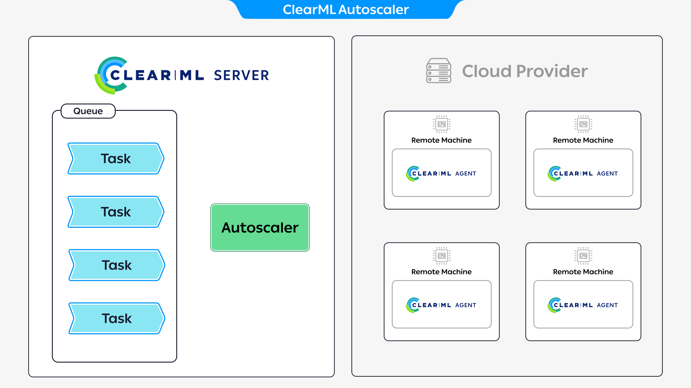
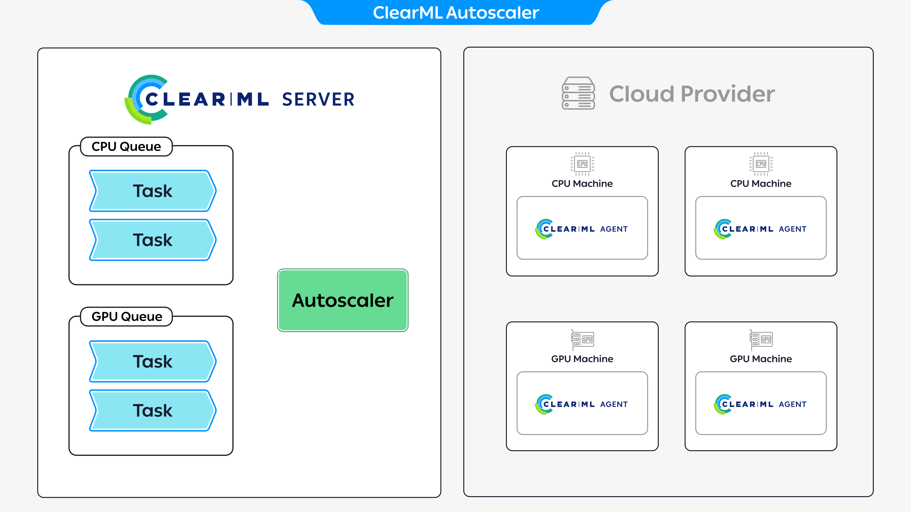

<iframe style={{position: 'absolute', top: '0', left: '0', bottom: '0', right: '0', width: '100%', height: '100%'}} 
        src="https://www.youtube.com/embed/j4XVMAaUt3E" 
        title="YouTube video player" 
        frameborder="0" 
        allow="accelerometer; autoplay; clipboard-write; encrypted-media; gyroscope; picture-in-picture; fullscreen" 
        allowfullscreen>
</iframe>

 

Using [ClearML Agent](../clearml_agent.md) and [queues](../fundamentals/agents_and_queues.md#what-is-a-queue), you can 
easily run your code remotely on more powerful machines, including cloud instances. 

Manually spinning up new virtual machines and setting up ClearML Agents on them can become a recurring task as your 
workload grows, not to mention avoiding paying for running machines that aren’t being used, which can become pricey. 
This is where autoscaling comes into the picture. 

ClearML provides the following options to automate your resource scaling, while optimizing machine usage:
* [ClearML autoscaler applications](#autoscaler-applications) - Use the apps to define your compute resource budget, 
and have the apps automatically manage your resource consumption as needed–with no code!
* [Kubernetes integration](#kubernetes) - Deploy agents through Kubernetes, which handles resource management and scaling 

## Autoscaler Applications
ClearML provides the following GUI autoscaler applications:
* [AWS Autoscaler](../webapp/applications/apps_aws_autoscaler.md)
* [GCP Autoscaler](../webapp/applications/apps_gcp_autoscaler.md)

The autoscalers automatically spin up or down cloud instances as needed and according to a budget that you set, so you 
pay only for the time that you actually use the machines. 

The **AWS** and **GCP** autoscaler applications will manage instances on your behalf in your cloud account. When 
launching an app instance, you will provide your cloud service credentials so the autoscaler can access your account.  

## How ClearML Autoscaler Apps Work 

The diagram above demonstrates a typical flow for executing tasks through an autoscaler app:
1. [Create a queue](../webapp/webapp_workers_queues.md#queues) to attach the autoscaler to 
1. Set up an autoscaler app instance: assign it to a queue and define a compute resource budget (see the specific 
autoscaler pages for further setup details)
1. Launch the autoscaler app instance
1. Enqueue a task to the queue the autoscaler has been assigned to
1. The autoscaler attached to the queue spins up and prepares a new compute resource to execute the enqueued task
1. Enqueue additional tasks: if there are not enough machines to execute the tasks, the autoscaler spins up additional 
machines to execute the tasks (until the maximum number specified in the budget is reached)
1. If a machine becomes idle since there are no tasks to execute, the autoscaler automatically spins it down

### Utilizing Multiple Compute Resource Types

You can work with multiple compute resources through the autoscalers, where each compute resource is associated with a 
different queue. When a queue detects a task, the autoscaler spins up the appropriate resource to execute the task. 

The diagram above demonstrates an example where an autoscaler app instance is attached to two queues. Each queue is 
associated with a different resource, CPU and GPU, and each queue has two enqueued tasks. To execute the tasks, 
the autoscaler spins up four machines, two CPU machines to execute the tasks in the CPU queue and two GPU machines to 
execute the tasks in the GPU queue.

### Task Execution Configuration

#### Docker
Every task a cloud instance pulls will be run inside a docker container. When setting up an autoscaler app instance, 
you can specify a default container to run the tasks inside. If the task has its own container configured, it will 
override the autoscaler’s default docker image (see [Base Docker Image](../clearml_agent/clearml_agent_docker.md#base-docker-container)).

#### Git Configuration 
If your code is saved in a private repository, you can add your Git credentials so the ClearML Agents running on your
cloud instances will be able to retrieve the code from your repos.

#### Cloud Storage Access
If your tasks need to access data stored in cloud storage, you can provide your cloud storage credentials, so the 
executed tasks will have access to your storage service. 

#### Additional Configuration

Go to a specific app’s documentation page to view all configuration options:
* [AWS Autoscaler](../webapp/applications/apps_aws_autoscaler.md)
* [GCP Autoscaler](../webapp/applications/apps_gcp_autoscaler.md) 

## Kubernetes 
You can install `clearml-agent` through a Helm chart. 
 
The Clearml Agent deployment is set to service a queue(s). When tasks are added to the queues, the agent pulls the task 
and creates a pod to execute the task. Kubernetes handles resource management. Your task pod will remain pending until 
enough resources are available.
 
You can set up Kubernetes' cluster autoscaler to work with your cloud providers, which automatically adjusts the size of 
your Kubernetes cluster as needed; increasing the amount of nodes when there aren't enough to execute pods and removing 
underutilized nodes. See [charts](https://github.com/kubernetes/autoscaler/tree/master/charts) for specific cloud providers.

:::important Enterprise features
The ClearML Enterprise plan supports K8S servicing multiple ClearML queues, as well as providing a pod template for each 
queue for describing the resources for each pod to use. See [ClearML Helm Charts](https://github.com/allegroai/clearml-helm-charts/tree/main).  
:::
