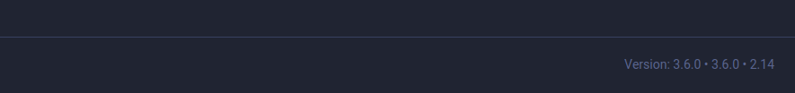
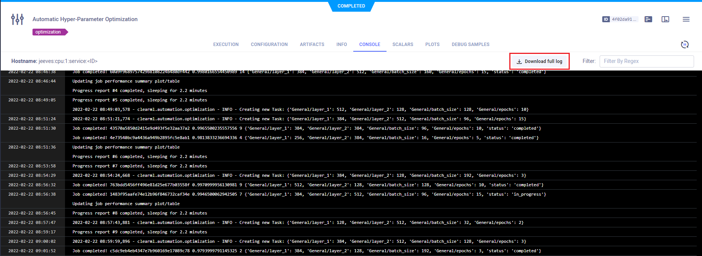
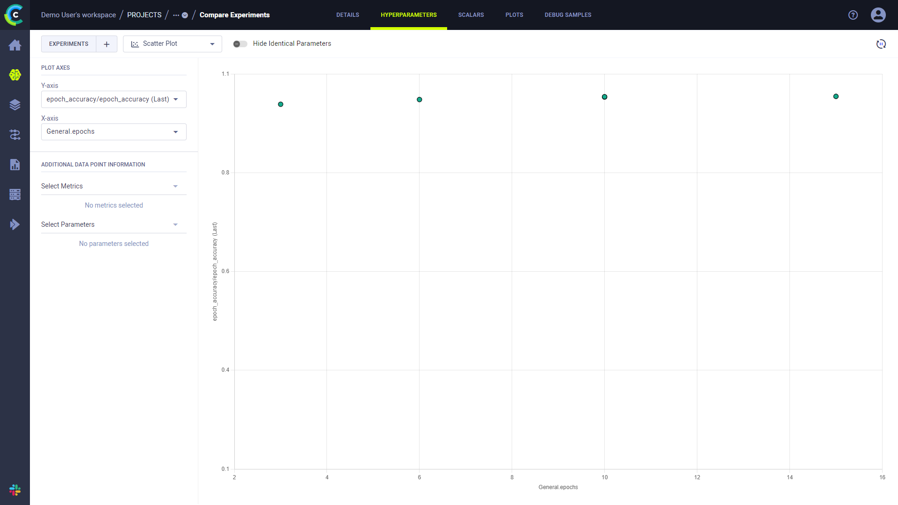
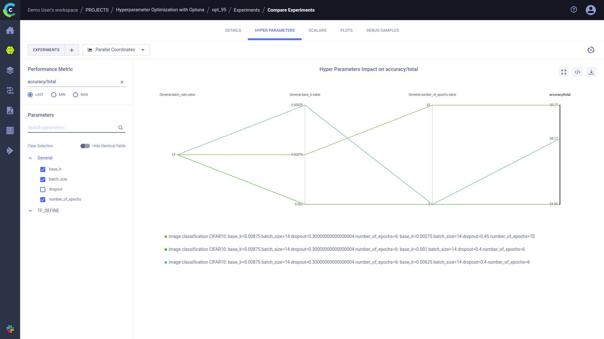

**General Information**

* [How do I know a new version came out?](#new-version-auto-update)
* [How do I find out ClearML version information?](#versions)

**Models**

* [How can I sort models by a certain metric?](#custom-columns)
* [Can I store more information on the models?](#store-more-model-info)
* [Can I store the model configuration file as well?](#store-model-configuration)
* [I am training multiple models at the same time, but I only see one of them. What happened?](#only-last-model-appears)
* [Can I log input and output models manually?](#manually-log-models)
* [Models are not accessible from the UI after I migrated ClearML Server to a new address. How do I fix this?](#migrate_server_models)
* [Models are not accessible from the UI after I moved them (different bucket / server). How do I fix this?](#relocate_models)

**Experiments**

* [I noticed I keep getting the message "warning: uncommitted code". What does it mean?](#uncommitted-code-warning)
* [I do not use argparse for hyperparameters. Do you have a solution?](#dont-want-argparser)
* [I noticed that all of my experiments appear as "Training". Are there other options?](#other-experiment-types)
* [Sometimes I see experiments as running when in fact they are not. What's going on?](#experiment-running-but-stopped)
* [My code throws an exception, but my experiment status is not "Failed". What happened?](#exception-not-failed)
* [CERTIFICATE_VERIFY_FAILED - When I run my experiment, I get an SSL Connection error. Do you have a solution?](#ssl-connection-error)
* [How do I modify experiment names once they have been created?](#modify_exp_names)
* [Using Conda and the "typing" package, I get the error "AttributeError: type object 'Callable' has no attribute '_abc_registry'". How do I fix this?](#typing)
* [My ClearML Server disk space usage is too high. What can I do about this?](#delete_exp)
* [Can I change the random seed my experiment uses?](#random_see)
* [In the Web UI, I can't access files that my experiment stored. Why not?](#access_files)
* [I get the message "ClearML Monitor: Could not detect iteration reporting, falling back to iterations as seconds-from-start". What does it mean?](#resource_monitoring)
* [Can I control what ClearML automatically logs?](#controlling_logging)
* [Can I run a ClearML Task while working offline?](#offline_mode)

**Graphs and Logs**

* [The first log lines are missing from the experiment console tab. Where did they go?](#first-log-lines-missing)
* [How do I create a graph comparing hyperparameters vs model accuracy?](#compare-graph-parameters)
* [I want to add more graphs, not just with TensorBoard. Is this supported?](#more-graph-types)
* [How can I report more than one scatter 2D series on the same plot?](#multiple-scatter2D)

**GIT and Storage**

* [Is there something ClearML can do about uncommitted code running?](#help-uncommitted-code)
* [I read there is a feature for centralized model storage. How do I use it?](#centralized-model-storage)
* [When using PyCharm to remotely debug a machine, the Git repo is not detected. Do you have a solution?](#pycharm-remote-debug-detect-git)
* [Debug images and/or artifacts are not loading in the UI after I migrated ClearML Server to a new address. How do I fix this?](#migrate_server_debug)


**Remote Debugging (ClearML PyCharm Plugin)**

* [I am using your ClearML PyCharm Plugin for remote debugging. I get the message "clearml.Task - INFO - Repository and package analysis timed out (10.0 sec), giving up". What should I do?](#package_thread)

**Jupyter**

* [I am using Jupyter Notebook. Is this supported?](#jupyter-notebook)

**scikit-learn**

* [Can I use ClearML with scikit-learn?](#use-scikit-learn)

**ClearML Configuration**

* [How do I explicitly specify the ClearML configuration file to be used?](#change-config-path)
* [How can I override ClearML credentials from the OS environment?](#credentials-os-env)
* [How can I track OS environment variables with experiments?](#track-env-vars)

**ClearML Hosted Service**

* [I run my script, but my experiment is not in the ClearML Hosted Service Web UI. How do I fix this?](#hosted-service-no-config)

**ClearML Server Deployment**

* How do I deploy ClearML Server on:
    * [Stand alone Linux Ubuntu systems?](#Ubuntu)
    * [macOS?](#Ubuntu)
    * [Windows 10?](#docker_compose_win10)
    * [AWS EC2 AMIs?](#aws_ec2_amis)
    * [Google Cloud Platform?](#google_cloud_platform)
* [How do I restart ClearML Server?](#restart)
* [Can I create a Helm Chart for ClearML Server Kubernetes deployment?](#helm)
* [My Docker cannot load a local host directory on SELinux?](#selinux)

**ClearML Server Configuration**

* [How do I configure ClearML Server for subdomains and load balancers?](#subdomains)
* [Can I add web login authentication to ClearML Server?](#web-auth)
* [Can I modify non-responsive task settings?](#watchdog)

**ClearML Server Troubleshooting**

* [After reinstalling, why can't I create credentials in the WebApp (UI)?](#clearml-server-reinstall-cookies)
* [How do I fix Docker upgrade errors?](#common-docker-upgrade-errors)
* [Why is web login authentication not working?](#port-conflict)
* [How do I bypass a proxy configuration to access my local ClearML Server?](#proxy-localhost)
* [Trains is failing to update ClearML Server. I get an error 500 (or 400). How do I fix this?](#elastic_watermark)
* [Why is my Trains WebApp (UI) not showing any data?](#web-ui-empty)
* [Why can't I access my ClearML Server when I run my code in a virtual machine?](#vm_server)

**ClearML Agent**

* [How can I execute ClearML Agent without installing packages each time?](#system_site_packages)


**ClearML API**

* [How can I use the ClearML API to fetch data?](#api)

## General Information

#### How do I know a new version came out? <a className="tr_top_negative" id="new-version-auto-update"></a>  

Starting with ClearML v0.9.3, ClearML issues a new version release notification, which appears in the log and is 
output to the console, when a Python experiment script is run.

For example, when a new ClearML Python Package version is available, the notification is:

```
CLEARML new package available: UPGRADE to vX.Y.Z is recommended!
```

When a new ClearML Server version is available, the notification is:

```
CLEARML-SERVER new version available: upgrade to vX.Y is recommended!
```

<br/>

#### How do I find out ClearML version information?   <a id="versions"></a>

ClearML server version information is available in the ClearML WebApp **Settings** page. On the bottom right of the page, 
the following numbers are displayed: 
* Web application version
* API server version
* API version



ClearML python package information can be obtained by using `pip freeze`.

For example: 

```
pip freeze|grep clearml
```

should return something like this:

```console
clearml==1.0.3rc1
clearml-agent==1.0.0
clearml-session==0.3.2
```


## Models

#### How can I sort models by a certain metric?   <a id="custom-columns"></a>

To sort models by a metric, in the ClearML Web UI, 
add a [custom column](webapp/webapp_model_table.md#customizing-the-models-table) in the models table and sort by 
that metric column. Available custom column options depend upon the models in the table and the metrics that have been
attached to them (see [Logging Metrics and Plots](clearml_sdk/model_sdk.md#logging-metrics-and-plots)). 

ClearML associates models with the experiments that created them, so you can also add a [custom column](webapp/webapp_exp_table.md#customizing-the-task-table) 
in an experiments table and sort by that metric column. 

<br/> 

#### Can I store more information on the models?   <a id="store-more-model-info"></a>

Yes! For example, you can use [`Task.set_model_label_enumeration()`](references/sdk/task.md#set_model_label_enumeration) 
to store label enumeration:

```python
Task.current_task().set_model_label_enumeration( {"label": int(0), } )
```
    

For more information about `Task` class methods, see the [Task Class](fundamentals/task.md) reference page.

<br/>

#### Can I store the model configuration file as well?    <a id="store-model-configuration"></a>

Yes! Use [`Task.connect_configuration()`](references/sdk/task.md#connect_configuration):

```python
Task.current_task().connect_configuration("a very long text with the configuration file's content")
```
 
<br/>

#### I am training multiple models at the same time, but I only see one of them. What happened?   <a id="only-last-model-appears"></a>

This issue was resolved in ClearML Server v1.0.0. 

See server upgrade instructions for any of the available formats:
* [AWS EC2 AMIs](deploying_clearml/upgrade_server_aws_ec2_ami.md)
* [Google Cloud Platform](deploying_clearml/upgrade_server_gcp.md)
* [Linux or MacOS](deploying_clearml/upgrade_server_linux_mac.md)
* [Windows 10](deploying_clearml/upgrade_server_win.md)
* [Kubernetes](deploying_clearml/upgrade_server_kubernetes_helm.md)

<br/>

#### Can I log input and output models manually?   <a id="manually-log-models"></a>

Yes! Use [`InputModel.import_model()`](references/sdk/model_inputmodel.md#inputmodelimport_model) 
and [`Task.connect()`](references/sdk/task.md#connect) to connect an input model. Use
[`OutputModel.update_weights()`](references/sdk/model_outputmodel.md#update_weights) 
to connect a model weights file.

```python
input_model = InputModel.import_model(link_to_initial_model_file)
Task.current_task().connect(input_model)

OutputModel(Task.current_task()).update_weights(link_to_new_model_file_here)
```

For more information about models, see [InputModel](references/sdk/model_inputmodel.md) 
and [OutputModel](references/sdk/model_outputmodel.md) classes.

<br/>

#### Models are not accessible from the UI after I migrated ClearML Server to a new address. How do I fix this?   <a id="migrate_server_models"></a>

This can happen if your models were uploaded to the ClearML files server, since the value registered was their full URL 
at the time of registration (e.g. `https://files.<OLD_ADDRESS>/path/to/model`).

To fix this, the registered URL of each model needs to be replaced with its current URL.

To replace the URL of each model, execute the following commands:

1. Open bash in the mongo DB docker container: 

    ```bash 
    sudo docker exec -it clearml-mongo /bin/bash
    ```

1. Create the following script inside the Docker shell (as well as the URL protocol if you aren't using `s3`).
   Make sure to replace `<old-bucket-name>` and `<new-bucket-name>`.   

    ```bash
    cat <<EOT >> script.js
    db.model.find({uri:{$regex:/^s3/}}).forEach(function(e,i) {
    e.uri = e.uri.replace("s3://<old-bucket-name>/","s3://<new-bucket-name>/");
    db.model.save(e);});
    EOT 
    ```

1. Run the script against the backend DB:

   ```bash
   mongo backend script.js
   ```
   
<br/>

#### Models are not accessible from the UI after I moved them (different bucket / server). How do I fix this?   <a id="relocate_models"></a>

This can happen if your models were uploaded to the ClearML files server, since the value registered was their full URL 
at the time of registration (e.g. `https://files.<OLD_ADDRESS>/path/to/model`).

To fix this, the registered URL of each model needs to be replaced with its current URL:

1. Open bash in the mongo DB Docker container: 

   ```bash
   sudo docker exec -it clearml-mongo /bin/bash
   ```

1. Create the following script inside the Docker shell (Make sure to replace `<old-bucket-name>` and `<new-bucket-name>`, as well as the URL protocol prefixes if you aren't using S3):  
    ```bash
    cat <<EOT >> script.js
    db.model.find({uri:{$regex:/^s3/}}).forEach(function(e,i) {
    e.uri = e.uri.replace("s3://<old-bucket-name>/","s3://<new-bucket-name>/");
    db.model.save(e);});
    EOT 
    ```
1. Run the script against the backend DB:

    ```bash
    mongo backend script.js
    ```

## Experiments

#### I noticed I keep getting the message "warning: uncommitted code". What does it mean?   <a id="uncommitted-code-warning"></a>

This message is only a warning. ClearML not only detects your current repository and git commit, but also warns you 
if you are using uncommitted code. ClearML does this because uncommitted code means this experiment will be difficult 
to reproduce. You can see uncommitted changes in the ClearML Web UI, in the **EXECUTION** tab of the experiment info panel.

#### I do not use argparse for hyperparameters. Do you have a solution?   <a id="dont-want-argparser"></a>

Yes! ClearML provides multiple ways to configure your task and track your parameters! 

In addition to argparse, ClearML also automatically captures and tracks command line parameters created using:
* [click](integrations/click.md) 
* [Python Fire](integrations/python_fire.md) 
* [Hydra](integrations/hydra.md)
* [LightningCLI](https://lightning.ai/docs/pytorch/stable/cli/lightning_cli.html#lightning-cli)

ClearML also supports tracking code-level configuration dictionaries using [`Task.connect()`](references/sdk/task.md#connect).

For example, the code below connects hyperparameters (`learning_rate`, `batch_size`, `display_step`,
`model_path`, `n_hidden_1`, and `n_hidden_2`) to a task:

```python
# Create a dictionary of parameters
parameters_dict = { 'learning_rate': 0.001, 'batch_size': 100, 'display_step': 1, 
                    'model_path': "/tmp/model.ckpt", 'n_hidden_1': 256, 'n_hidden_2': 256 }
        
# Connect the dictionary to your CLEARML Task
parameters_dict = Task.current_task().connect(parameters_dict)
```

For more task configuration options, see [Hyperparameters](fundamentals/hyperparameters.md). 
    

<br/>

#### I noticed that all of my experiments appear as "Training". Are there other options?   <a id="other-experiment-types"></a>

Yes! ClearML supports [multiple experiment types](fundamentals/task.md#task-types). When creating experiments and 
calling [`Task.init()`](references/sdk/task.md#taskinit), you can provide an experiment type. For example:

```python
task = Task.init(project_name, task_name, Task.TaskTypes.testing)
```
    

<br/>

#### Sometimes I see experiments as running when in fact they are not. What's going on?   <a id="experiment-running-but-stopped"></a>

ClearML monitors your Python process. When the process exits properly, ClearML closes the experiment. When the process crashes and terminates abnormally, it sometimes misses the stop signal. In this case, you can safely right-click the experiment in the WebApp and abort it.

<br/>

#### My code throws an exception, but my experiment status is not "Failed". What happened?   <a id="exception-not-failed"></a>

This issue was resolved in Trains v0.9.2. Upgrade to ClearML by executing the following command:

```    
pip install -U clearml
```

<a id="ssl-connection-error"></a>

<br/>

#### When I run my experiment, I get an SSL Connection error CERTIFICATE_VERIFY_FAILED. Do you have a solution?  

Your firewall may be preventing the connection. Try one of the following solutions:

* Direct python "requests" to use the enterprise certificate file by setting the OS environment variables `CURL_CA_BUNDLE` or `REQUESTS_CA_BUNDLE`. For a detailed discussion of this topic, see [https://stackoverflow.com/questions/48391750/disable-python-requests-ssl-validation-for-an-imported-module](https://stackoverflow.com/questions/48391750/disable-python-requests-ssl-validation-for-an-imported-module).
* Disable certificate verification   
  
  :::warning
  For security reasons, it is not recommended to disable certificate verification.
  :::
    1. Upgrade ClearML to the current version:
       ``` 
       pip install -U clearml
       ``` 
    1. Create a new `clearml.conf` configuration file (see a [sample configuration file](https://github.com/allegroai/clearml/blob/master/docs/clearml.conf)), containing:
       
       ``` 
       api { verify_certificate = False }
       ```
    1. Copy the new `clearml.conf` file to:
         * Linux - `~/clearml.conf`
         * Mac - `$HOME/clearml.conf`
         * Windows - `\User\<username>\clearml.conf``~/clearml.conf` 
   
<a id="modify_exp_names"></a>

<br/>

#### How do I modify experiment names once they have been created?  

An experiment's name is a user-controlled property, which can be accessed via the `Task.name` property. This lets you use meaningful naming schemes to easily filter and compare experiments.

For example, to distinguish between different experiments, you can append the task ID to the task name:
```python
task = Task.init(project_name='examples', task_name='train')
task.name += ' {}'.format(task.id)
```

Or, append the Task ID post-execution:
```python
tasks = Task.get_tasks(project_name='examples', task_name='train')
for t in tasks:
    t.name += ' {}'.format(task.id)
```

Another example is to append a specific hyperparameter and its value to each task's name:
```python
tasks = Task.get_tasks(project_name='examples', task_name='my_automl_experiment')
for t in tasks:
    params = t.get_parameters()
    if 'my_secret_parameter' in params:
        t.name += ' my_secret_parameter={}'.format(params['my_secret_parameter'])
```
Use this experiment naming when creating automation pipelines with a naming convention.

<a id="typing"></a>

<br/>

#### Using Conda and the "typing" package, I get the error "AttributeError: type object 'Callable' has no attribute '_abc_registry'". How do I fix this?  

Conda and the [typing](https://pypi.org/project/typing/) package may have some compatibility issues. 

However, [since Python 3.5](https://docs.python.org/3.5/library/typing.html), the `typing` package is part of the standard library. 

To resolve the error, uninstall `typing` and rerun your script. If this does not fix the issue, create a [new ClearML issue](https://github.com/allegroai/clearml/issues/new), including the full error, and your environment details.  

<a id="delete_exp"></a>

<br/>

#### My ClearML Server disk space usage is too high. What can I do about this?  

To clear up space, you can delete ClearML objects (e.g. experiments, models, datasets, etc.). 

To delete an object via the UI: 
1. Go to the relevant object table (e.g. [Experiments Table](webapp/webapp_exp_table.md), [Models Table](webapp/webapp_model_table.md), etc.) 
1. Archive the object - Right-click the object in the table **>** click **Archive**
1. Click **Open Archive** on the top of the table
1. In the archive table, right-click the object **>** click **Delete**. 

To delete an object programmatically, use the relevant method:
* Tasks - [`Task.delete()`](references/sdk/task.md#delete)
* Models
  * [`Model.remove()`](references/sdk/model_model.md#modelremove)
  * [`InputModel.remove()`](references/sdk/model_inputmodel.md#inputmodelremove)
* Datasets - [`Dataset.delete()`](references/sdk/dataset.md#datasetdelete)


:::warning
You cannot undo the deletion of a ClearML object.
:::


<a id="random_see"></a>

<br/>

#### Can I change the random seed my experiment uses?  

Yes! By default, ClearML initializes Tasks with an initial seed of `1337` to ensure reproducibility. To set a different 
value for your task, use the [`Task.set_random_seed()`](references/sdk/task.md#taskset_random_seed) class method and 
provide the new seed value, **before initializing the task**.

You can disable the deterministic behavior entirely by passing `Task.set_random_seed(None)`.

<a id="access_files"></a>

<br/>

#### In the Web UI, I can't access files that my experiment stored. Why not?  

ClearML stores file locations. The machine running your browser must have access to the location where the machine 
that ran the Task stored the file. This applies to debug samples and artifacts. If, for example, the machine running the browser does not have access, you may see `Unable to load image`, instead of the image.

<a id="resource_monitoring"></a>

<br/>

#### I get the message "CLEARML Monitor: Could not detect iteration reporting, falling back to iterations as seconds-from-start". What does it mean?  

If metric reporting begins within the first three minutes, ClearML reports resource monitoring by iteration. Otherwise, 
it reports resource monitoring by seconds from start, and logs a message:
```      
CLEARML Monitor: Could not detect iteration reporting, falling back to iterations as seconds-from-start. 
```
However, if metric reporting begins after three minutes and anytime up to thirty minutes, resource monitoring reverts to 
by iteration, and ClearML logs a message 
```
CLEARML Monitor: Reporting detected, reverting back to iteration based reporting. 
```
After thirty minutes, it remains unchanged.

<br/>

#### Can I control what ClearML automatically logs?   <a id="controlling_logging"></a>

Yes! ClearML lets you control automatic logging for frameworks, argument parsers, `stdout`, and `stderr`  when 
initializing a Task by calling [`Task.init()`](references/sdk/task.md#taskinit). 

##### Frameworks

To control a Task's framework logging, use the `auto_connect_frameworks` parameter. Turn off all automatic logging by setting the 
parameter to `False`. For finer grained control of logged frameworks, input a dictionary, with framework-boolean pairs. 

For example: 
```python
auto_connect_frameworks={
    'matplotlib': True, 'tensorflow': False, 'tensorboard': False, 'pytorch': True,
    'xgboost': False, 'scikit': True, 'fastai': True, 'lightgbm': False,
    'hydra': True, 'detect_repository': True, 'tfdefines': True, 'joblib': True,
    'megengine': True, 'catboost': True
}
```

##### Argument Parsers

To control a task's logging of parameters from supported argument parsers, use the `auto_connect_arg_parser` parameter. 
Completely disable all automatic logging by setting the parameter to `False`. For finer grained control of logged 
parameters, input a dictionary with parameter-boolean pairs. The `False` value excludes the specified parameter. 
Unspecified parameters default to `True`.

For example, the following code will not log the `Example_1` parameter, but will log all other arguments.

```python
auto_connect_arg_parser={"Example_1": False}
```

To exclude all unspecified parameters, set the `*` key to `False`. 

For example, the following code will log **only** the `Example_2` parameter.

```python
auto_connect_arg_parser={"Example_2": True, "*": False}
```

An empty dictionary completely disables all automatic logging of parameters from argument parsers: 

```python
auto_connect_arg_parser={}
```

##### stdout and stderr 

To control the `stdout`, `stderr`, and standard logging, use the `auto_connect_streams` parameter. 
To disable logging all three, set the parameter to `False`. For finer grained control, input a dictionary, where the keys are `stout`, `stderr`, 
and `logging`, and the values are booleans. For example: 

```python
auto_connect_streams={'stdout': True, 'stderr': True, 'logging': False}
```

See [`Task.init`](references/sdk/task.md#taskinit).

<br/>


#### Can I run ClearML Task while working offline?   <a id="offline_mode"></a>

Yes! You can use ClearML's Offline Mode, in which all the data and logs that a task captures from the code are stored in a 
local folder. 

You can enable offline mode in one of the following ways:
* Before initializing a task, use the [`Task.set_offline()`](references/sdk/task.md#taskset_offline) class method and set 
the `offline_mode` argument to `True`
* Before running a task, set `CLEARML_OFFLINE_MODE=1`

:::warning 
Offline mode only works with tasks created using [`Task.init()`](references/sdk/task.md#taskinit) and not with those created 
using [`Task.create()`](references/sdk/task.md#taskcreate). 
:::

The task's console output displays the task ID and a path to the folder with the session's captured information:

```console
ClearML Task: created new task id=offline-372657bb04444c25a31bc6af86552cc9
...
...
ClearML Task: Offline session stored in /home/user/.clearml/cache/offline/b786845decb14eecadf2be24affc7418.zip
```

In order to upload to the ClearML Server the execution data that the Task captured offline, do one of the
following:
* Use the `import-offline-session <session_path>` option of the [clearml-task](apps/clearml_task.md) CLI
* Use the [`Task.import_offline_session()`](references/sdk/task.md#taskimport_offline_session) method. 
  
See [Storing Task Data Offline](guides/set_offline.md).


## Graphs and Logs

#### The first log lines are missing from the experiment console tab. Where did they go?   <a id="first-log-lines-missing"></a>

Due to speed/optimization issues, the console displays only the last several hundred log lines.

You can always download the full log as a file using the ClearML Web UI. In the **ClearML Web UI >** experiment's **CONSOLE** 
tab, click `Download full log`.



<br/>

#### How do I create a graph comparing hyperparameters vs. model accuracy?   <a id="compare-graph-parameters"></a>

You can use the UI's [experiment comparison features](webapp/webapp_exp_comparing.md) to compare the logged hyperparameter 
and accuracy values of several experiments. In the experiment comparison page, under the **HYPERPARAMETERS** tab
you can visualize experiments' hyperparameter values in relation to performance metrics in a scatter plot or parallel
coordinates plot:
* [Scatter plot](webapp/webapp_exp_comparing.md#scatter-plot): View the correlation between a selected hyperparameter and 
  metric. For example, the image below shows a scatter plot that displays the values of a performance metric (`epoch_accuracy`) 
  and a hyperparameter (`epochs`) of a few experiments:
  
  

* [Parallel coordinates plot](webapp/webapp_exp_comparing.md#parallel-coordinates-mode): View the impact of hyperparameters 
  on selected metric(s). For example, the image below shows 
  a parallel coordinates plot which displays the values of selected hyperparameters (`base_lr`, `batch_size`, and 
  `number_of_epochs`) and a performance metric (`accuracy`) of three experiments: 

  

<br/>

#### I want to add more graphs, not just with TensorBoard. Is this supported?   <a id="more-graph-types"></a>

Yes! The [`Logger`](fundamentals/logger.md) module includes methods for explicit reporting. For examples of explicit reporting, see the [Explicit Reporting](guides/reporting/explicit_reporting.md) 
tutorial.

<br/>

#### How can I report more than one scatter 2D series on the same plot?    <a id="multiple-scatter2D"></a>

The [`Logger.report_scatter2d()`](references/sdk/logger.md#report_scatter2d) 
method reports all series with the same `title` and `iteration` parameter values on the same plot.

For example, the following two scatter2D series are reported on the same plot, because both have a `title` of `example_scatter` and an `iteration` of `1`:

```python
scatter2d_1 = np.hstack((np.atleast_2d(np.arange(0, 10)).T, np.random.randint(10, size=(10, 1))))
logger.report_scatter2d(
    title="example_scatter",
    series="series_1", 
    iteration=1, 
    scatter=scatter2d_1,
    xaxis="title x", 
    yaxis="title y"
)
    
scatter2d_2 = np.hstack((np.atleast_2d(np.arange(0, 10)).T, np.random.randint(10, size=(10, 1))))
logger.report_scatter2d(
    title="example_scatter", 
    series="series_2", 
    iteration=1, 
    scatter=scatter2d_2,
    xaxis="title x", 
    yaxis="title y"
)
```

## GIT and Storage

#### Is there something ClearML can do about uncommitted code running?    <a id="help-uncommitted-code"></a>

Yes! ClearML stores the git diff as part of the experiment's information. You can view the git diff in the **ClearML Web UI >** 
experiment's **EXECUTION** tab.

<br/>

#### I read there is a feature for centralized model storage. How do I use it?   <a id="centralized-model-storage"></a>

When calling [`Task.init`](references/sdk/task.md#taskinit), 
providing the `output_uri` parameter lets you specify the location in which model checkpoints (snapshots) will be stored.

For example, to store model checkpoints (snapshots) in `/mnt/shared/folder`:

```python
task = Task.init(project_name, task_name, output_uri="/mnt/shared/folder")
```

ClearML will copy all stored snapshots into a subfolder under `/mnt/shared/folder`. The subfolder's name will contain 
the experiment's ID. If the experiment's ID is `6ea4f0b56d994320a713aeaf13a86d9d`, the following folder will be used:
```
/mnt/shared/folder/task.6ea4f0b56d994320a713aeaf13a86d9d/models/
```

ClearML supports other storage types for `output_uri`:
* S3: `s3://bucket/folder`
* Non-AWS S3-like services (such as MinIO): `s3://host_addr:port/bucket`. **Note that port specification is required**. 
* Google Cloud Storage: `gs://bucket-name/folder`
* Azure Storage: `azure://<account name>.blob.core.windows.net/path/to/file`

For example:
```python
# AWS S3 bucket
task = Task.init(project_name, task_name, output_uri="s3://bucket-name/folder")

# Google Cloud Storage bucket
task = Task.init(project_name, task_name, output_uri="gs://bucket-name/folder")
```

To use cloud storage with ClearML, configure the storage credentials in your `~/clearml.conf`. For detailed information, 
see [ClearML Configuration Reference](configs/clearml_conf.md).

<a id="pycharm-remote-debug-detect-git"></a>

<br/>

#### When using PyCharm to remotely debug a machine, the Git repo is not detected. Do you have a solution?  

Yes! ClearML provides a PyCharm plugin that allows a remote debugger to grab your local 
repository / commit ID. For detailed information about using the plugin, see the [ClearML PyCharm Plugin](guides/ide/integration_pycharm.md).

<br/>

#### Debug images and/or artifacts are not loading in the UI after I migrated ClearML Server to a new address. How do I fix this?    <a id="migrate_server_debug"></a>  

This can happen if your debug images and/or artifacts were uploaded to the ClearML file server, since the value
registered was their full URL at the time of registration (e.g. `https://files.<OLD_ADDRESS>/path/to/artifact`).

To fix this, the registered URL of each debug image and/or artifact needs to be replaced with its current URL.

* For **debug images**, use the following command. Make sure to insert the old address and the new address that will replace it:

   :::important
   Note that in the following command, the `'\''` sequences end with double single quotes (`''`) and not double quotes (`"`)
   :::

   ```bash
   curl -XPOST -H "Content-Type: application/json" "localhost:9200/events-training_debug_image-*/_update_by_query?conflicts=proceed" -d'{
       "script": {
           "source": "ctx._source.url = ctx._source.url.replace('\''https://files.<OLD_ADDRESS>'\'', '\''https://files.<NEW_ADDRESS>'\'')",
           "lang": "painless"
       },
       "query": {"prefix": {"url": {"value": "https://files.<OLD_ADDRESS>"}}}
   }'
   ```

* For **artifacts**, you can do the following:

    1. Run shell in the `apiserver` container:

       ```bash 
       sudo docker exec -it clearml-apiserver /bin/bash
       ```

    1. Navigate to the `apiserver` folder: 
   
       ```bash
       cd /opt/clearml/apiserver
       ```

   1. Run the `fix_mongo_urls.py` script for fixing the artifacts. Make sure to insert the old address and the new 
      address that will replace it:

      ```bash
      python3 fix_mongo_urls.py --host-source http://old_address_and_port --host-target http://new_address_and_port
      ```
   

## Jupyter

#### I am using Jupyter Notebook. Is this supported?   <a id="jupyter-notebook"></a>

Yes! You can run ClearML in Jupyter Notebooks using either of the following:

* [Option 1: Install ClearML on your Jupyter Notebook host machine](#opt1)
* [Option 2: Install ClearML in your Jupyter Notebook and connect using ClearML credentials](#opt2)

**Option 1: Install ClearML on your Jupyter host machine** <a id="opt1"></a>

1. Connect to your Jupyter host machine.
1. Install the ClearML Python Package:

   ```
   pip install clearml
   ```
   
1. Run the ClearML setup wizard:

   ```
   clearml-init
   ```
    
1. In your Jupyter Notebook, you can now use ClearML.
        
**Option 2: Install ClearML in your Jupyter Notebook** <a id="opt2"></a>

1. Install the ClearML Python Package:
   
   ```
   pip install clearml
   ```
   
1. Get ClearML credentials. Open the ClearML Web UI in a browser. On the **SETTINGS > WORKSPACE** page, click **Create new credentials**. 
   The **JUPYTER NOTEBOOK** tab shows the commands required to configure your notebook (a copy to clipboard action is available on hover)

1. Add these commands to your notebook
   
1. You can now use ClearML in your notebook!
   ```python
   # create a task and start training
   task = Task.init(project_name='jupyter project', task_name='my notebook')
   ```
        

<a id="commit-git-in-jupyter"></a>

<br/>

## Remote Debugging (ClearML PyCharm Plugin)

#### I am using your ClearML PyCharm Plugin for remote debugging. I get the message "clearml.Task - INFO - Repository and package analysis timed out (10.0 sec), giving up". What should I do?  <a id="package_thread"></a>

ClearML uses a background thread to analyze the script. This includes package requirements. At the end of the execution
of the script, if the background thread is still running, ClearML allows the thread another 10 seconds to complete. 
If the thread does not complete, it times out.

This can occur for scripts that do not import any packages, for example short test scripts.

To fix this issue, you can import the `time` package and add a `time.sleep(20)` statement to the end of your script.

## scikit-learn

#### Can I use ClearML with scikit-learn?   <a id="use-scikit-learn"></a>

Yes! `scikit-learn` is supported. ClearML automatically logs models which are stored using `joblib`.
For more information, see [scikit-learn](integrations/scikit_learn.md).

## ClearML Configuration

#### How do I explicitly specify the ClearML configuration file to be used?   <a id="change-config-path"></a>

To override the default configuration file location, set the `CLEARML_CONFIG_FILE` OS environment variable.

For example:

```    
export CLEARML_CONFIG_FILE="/home/user/myclearml.conf"
```

<br/>

#### How can I override ClearML credentials from the OS environment?   <a id="credentials-os-env"></a>

To override your configuration file / defaults, set the following OS environment variables:

```
export CLEARML_API_ACCESS_KEY="key_here"
export CLEARML_API_SECRET_KEY="secret_here"
export CLEARML_API_HOST="http://localhost:8008"
```

<br/>

#### How can I track OS environment variables with experiments?    <a id="track-env-vars"></a>

You can set environment variables to track in an experiment by specifying them in the `sdk.development.log_os_environments` 
field of the [`clearml.conf`](configs/clearml_conf.md#log_env_var) file:

```editorconfig
log_os_environments: ["AWS_*", "CUDA_VERSION"]
```

You can also use the `CLEARML_LOG_ENVIRONMENT` variable to track environment variables:

* All environment variables:

  ```
  export CLEARML_LOG_ENVIRONMENT=*
  ```
    
* Specific environment variables, for example, log `PWD` and `PYTHONPATH`:

  ```
  export CLEARML_LOG_ENVIRONMENT=PWD,PYTHONPATH
  ```
    
* No environment variables:

  ```
  export CLEARML_LOG_ENVIRONMENT=
  ```

:::note Overriding clearml.conf
The `CLEARML_LOG_ENVIRONMENT` variable always overrides the `clearml.conf` file. 
:::

## ClearML Hosted Service
        
#### I run my script, but my experiment is not in the ClearML Hosted Service Web UI. How do I fix this?   <a id="hosted-service-no-config"></a>

If you joined the ClearML Hosted Service and ran a script, but your experiment does not appear in Web UI, you may not have configured ClearML for the hosted service. Run the ClearML setup wizard. It will request your hosted service ClearML credentials and create the ClearML configuration you need.

```
pip install clearml
    
clearml-init
```

## ClearML Server Deployment

#### How do I deploy ClearML Server on stand-alone Linux Ubuntu or macOS systems?   <a id="Ubuntu"></a>

For detailed instructions, see [Deploying ClearML Server: Linux or macOS](deploying_clearml/clearml_server_linux_mac.md).

<br/>

#### How do I deploy ClearML Server on Windows 10?   <a id="docker_compose_win10"></a>

For detailed instructions, see [Deploying ClearML Server: Windows 10](deploying_clearml/clearml_server_win.md).

<br/>

#### How do I deploy ClearML Server on AWS EC2 AMIs?   <a id="aws_ec2_amis"></a>

For detailed instructions, see [Deploying ClearML Server: AWS EC2 AMIs](deploying_clearml/clearml_server_aws_ec2_ami.md).

<br/>

#### How do I deploy ClearML Server on the Google Cloud Platform?   <a id="google_cloud_platform"></a>

For detailed instructions, see [Deploying ClearML Server: Google Cloud Platform](deploying_clearml/clearml_server_gcp.md).

<br/>

#### How do I restart ClearML Server?   <a id="restart"></a>

For detailed instructions, see the "Restarting" section of the documentation page for your deployment format. For example, 
if you deployed to Linux, see [Restarting](deploying_clearml/clearml_server_linux_mac.md#restarting) on the "Deploying ClearML Server: Linux or macOS" page.

<br/>


#### Can I create a Helm Chart for ClearML Server Kubernetes deployment?   <a id="helm"></a>

Yes! You can create a Helm Chart of ClearML Server Kubernetes deployment. For detailed instructions,
see [Deploying ClearML Server: Kubernetes using Helm](deploying_clearml/clearml_server_kubernetes_helm.md).

<br/>

#### My Docker cannot load a local host directory on SELinux?   <a id="selinux"></a>

If you are using SELinux, run the following command (see this [discussion](https://stackoverflow.com/a/24334000)):

```
chcon -Rt svirt_sandbox_file_t /opt/clearml
```

## ClearML Server Configuration

#### How do I configure ClearML Server for subdomains and load balancers?   <a id="subdomains"></a>

For detailed instructions, see [Configuring Subdomains and load balancers](deploying_clearml/clearml_server_config.md#subdomains-and-load-balancers).

<br/>

#### Can I add web login authentication to ClearML Server?   <a id="web-auth"></a>

By default, anyone can log in to the ClearML Server WebApp. You can configure the ClearML Server to allow only a specific set of users to access the system.

For detailed instructions, see [Web Login Authentication](deploying_clearml/clearml_server_config.md#web-login-authentication).

<br/>

#### Can I modify non-responsive task settings?   <a id="watchdog"></a>

The non-responsive experiment watchdog monitors experiments that were not updated for a specified time interval, and 
marks them as `aborted`. The watchdog is always active.

You can modify the following settings for the watchdog:
 
* The time threshold (in seconds) of task inactivity (default value is 7200 seconds which is 2 hours).
* The time interval (in seconds) between watchdog cycles.

For detailed instructions, see [Modifying non-responsive Task watchdog settings](deploying_clearml/clearml_server_config.md#non-responsive-task-watchdog).

## ClearML Server Troubleshooting

#### After reinstalling, why can't I create credentials in the WebApp (UI)?   <a id="clearml-server-reinstall-cookies"></a>

The issue is likely your browser cookies for ClearML Server. Clearing your browser cookies for ClearML Server is recommended. 
For example: 
* For Firefox - go to Developer Tools > Storage > Cookies > delete all cookies under the ClearML Server URL.
* For Chrome - Developer Tools > Application > Cookies > delete all cookies under the ClearML Server URL.

<br/>

#### How do I fix Docker upgrade errors?   <a id="common-docker-upgrade-errors"></a>

To resolve the Docker error:

```
... The container name "/trains-???" is already in use by ...
```

try removing deprecated images:

```
$ docker rm -f $(docker ps -a -q)
```

<br/>

#### Why is web login authentication not working?   <a className="tr_top_negative" id="port-conflict"></a>

A port conflict between the ClearML Server MongoDB and/or Elastic instances, and other instances running on your system may prevent web login authentication from working correctly. 

ClearML Server uses the following default ports which may be in conflict with other instances:

* MongoDB port `27017`
* Elastic port `9200`

You can check for port conflicts in the logs in `/opt/clearml/log`.

If a port conflict occurs, change the MongoDB and/or Elastic ports in the `docker-compose.yml`, and then run the Docker compose commands to restart the ClearML Server instance.

To change the MongoDB and/or Elastic ports for your ClearML Server, do the following:

1. Edit the `docker-compose.yml` file.
1. Add the following environment variable(s) in the `services/trainsserver/environment` section:

    * For MongoDB:
    
        ```bash
        MONGODB_SERVICE_PORT: <new-mongodb-port>
        ```        
    
    * For Elastic:
    
        ```bash
        ELASTIC_SERVICE_PORT: <new-elasticsearch-port>
        ```         
    
        For example:
        
        ```bash
        MONGODB_SERVICE_PORT: 27018
        ELASTIC_SERVICE_PORT: 9201
        ```
    
1. For MongoDB, in the `services/mongo_4/ports` section, expose the new MongoDB port:

    ```bash
    <new-mongodb-port>:27017
    ```    
   
    For example:
    
    ```bash
    20718:27017
    ```
       
1. For Elastic, in the `services/elasticsearch/ports` section, expose the new Elastic port:

    ```bash
   <new-elasticsearch-port>:9200
   ```         
   
   For example:

   ```bash
   9201:9200
   ```
   
1. Restart ClearML Server, see [Restarting ClearML Server](#restart).

<br/>

#### How do I bypass a proxy configuration to access my local ClearML Server?   <a className="tr_top_negative" id="proxy-localhost"></a>

A proxy server may block access to ClearML Server configured for `localhost`.

To fix this, you may allow bypassing of your proxy server to `localhost` using a system environment variable, and configure ClearML for ClearML Server using it.

Do the following:

1. Allow bypassing of your proxy server to `localhost`
    using a system environment variable, for example:
    
   ```
   NO_PROXY = localhost
   ```
   
1. If a ClearML configuration file (`clearml.conf`) exists, delete it.
1. Open a terminal session.
1. Set the system environment variable to `127.0.0.1` in the terminal session. For example:
    
    * Linux:
    
        ```bash
        no_proxy=127.0.0.1
        NO_PROXY=127.0.0.1
        ```
   
    * Windows:
    
        ```bash
        set no_proxy=127.0.0.1
        set NO_PROXY=127.0.0.1
        ```
   
1. Run the ClearML wizard `clearml-init` to configure ClearML for ClearML Server, which will prompt you to open the ClearML Web UI at, [http://127.0.0.1:8080/](http://127.0.0.1:8080/), and create new ClearML credentials.
   
   The wizard completes with:
   ```
   Verifying credentials ...
   Credentials verified!
   New configuration stored in /home/<username>/clearml.conf
   ClearML setup completed successfully.
   ```

<a className="tr_top_negative" id="elastic_watermark"></a>

<br/>

#### The ClearML Server keeps returning HTTP 500 (or 400) errors. How do I fix this?   <a id="elastic_watermark"></a>

The ClearML Server will return HTTP error responses (5XX, or 4XX) when some of its [backend components](deploying_clearml/clearml_server.md) 
are failing. 

  
A common cause for such a failure is low available disk space, as the Elasticsearch service used by your server will go 
into read-only mode when it hits Elasticsearch flood watermark (by default, set to 95% disk space used).

This can be readily fixed by making more disk space available to the Elasticsearch service (either freeing up disk space 
disk, or if using dynamic cloud storage, increasing the disk size).

:::note
A likely indication of this situation can be determined by searching your clearml logs for *"\[FORBIDDEN/12/index read-only 
/ allow delete (api)]*".
:::

<br/>

#### Why is my ClearML WebApp (UI) not showing any data?   <a className="tr_top_negative" id="web-ui-empty"></a>

If your ClearML WebApp (UI) does not show anything, it may be an error authenticating with the server. Try clearing the application cookies for the site in your browser's developer tools. 
    
#### Why can't I access my ClearML Server when I run my code in a virtual machine?   <a id="vm_server"></a>

The network definitions inside a virtual machine (or container) are different from those of the host. The virtual machine's 
and the server machine's IP addresses are different, so you have to make sure that the machine that is executing the 
experiment can access the server's machine. 

Make sure to have an independent configuration file for the virtual machine where you are running your experiments. 
Edit the `api` section of your `clearml.conf` file and insert IP addresses of the server machine that are accessible 
from the VM. It should look something like this:

```
api {
    web_server: http://192.168.1.2:8080
    api_server: http://192.168.1.2:8008
    credentials {
        "access_key" = "KEY"
        "secret_key" = "SECRET"
    }
}
```


## ClearML Agent

#### How can I execute ClearML Agent without installing packages each time?   <a className="tr_top_negative" id="system_site_packages"></a>

Instead of installing the Python packages in the virtual environment created by ClearML Agent, you can optimize execution 
time by inheriting the packages from your global site-packages directory. In the ClearML configuration file, set the 
configuration option `agent.package_manager.system_site_packages` to `true`.


## ClearML API

#### How can I use the ClearML API to fetch data?   <a className="tr_top_negative" id="api"></a>

You can use the `APIClient` class, which provides a Pythonic interface to access ClearML's backend REST API. Through 
an `APIClient` instance, you can access ClearML's REST API services and endpoints. 

To use `APIClient`, create an instance of it, then call the method corresponding to the desired REST API endpoint, with 
its respective parameters as described in the [REST API reference page](references/api/index.md). 

For example, the [`POST/ projects.get_all`](references/api/projects.md#post-projectsget_all) call returns all projects 
in your workspace. The following code uses APIClient to retrieve a list of all projects whose name starts with "example."

```python
from clearml.backend_api.session.client import APIClient

# Create an instance of APIClient
client = APIClient()
project_list = client.projects.get_all(name="example*")
print(project_list)
```

For more information, see [`APIClient`](clearml_sdk/apiclient_sdk.md).