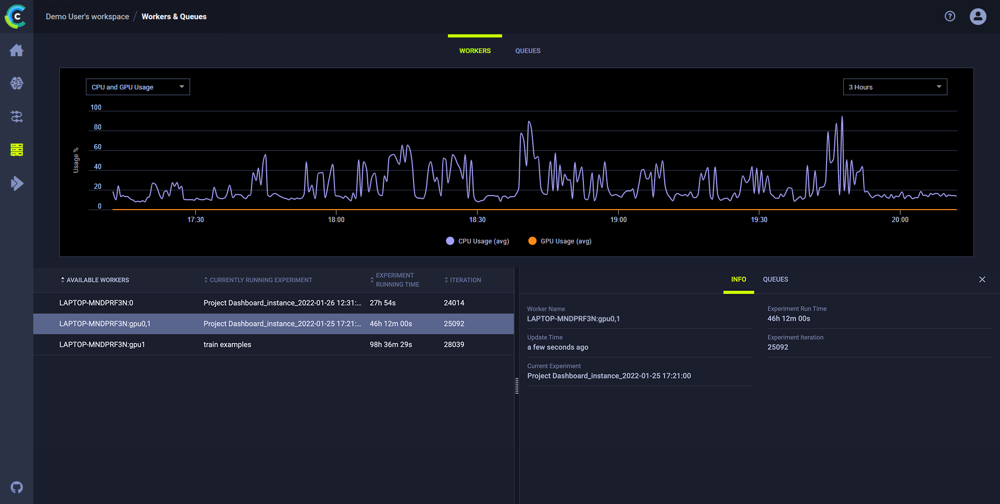

Two major components of MLOps is experiment reproducibility, and the ability to scale work to multiple machines. ClearML Agent, 
coupled with execution queues, addresses both these needs. 

The ClearML Agent is the base for **Automation** in ClearML and can be leveraged to build automated pipelines, launch custom services 
(e.g. a [monitor and alert service](https://github.com/allegroai/clearml/tree/master/examples/services/monitoring)) and more.

## What does a ClearML Agent do?
An agent (also referred to as a Worker) allows users to execute code on any machine it's installed on, thus facilitating the 
scaling of data science work beyond one's own machine.  
The agent takes care of deploying the code to the target machine as well as setting up the entire execution environment: 
from installing required packages to setting environment variables, 
all leading to executing the code (supporting both virtual environment or flexible docker container configurations)

The Agent also supports overriding parameter values on-the-fly without code modification, thus enabling no-code experimentation (This is also the foundation on which 
ClearML [Hyper Parameter Optimization](hpo.md) is implemented).  
An agent can be associated with specific GPUs, enabling workload distribution. For example, on a machine with 8 GPUs you can allocate several GPUs to an agent and use the rest for a different workload 
(even through another agent).   

## What is a Queue?

A ClearML queue is an ordered list of Tasks scheduled for execution.  
A queue can be serviced by one or multiple ClearML agents.  
Agents servicing a queue pull the queued tasks in order and execute them. 

A ClearML Agent can service multiple queues in either of the following modes: 

* Strict priority: The agent services the higher priority queue before servicing lower priority ones.
* Round robin: The agent pulls a single task from a queue then moves to service the next queue.

## Agent and Queue workflow 

The diagram above demonstrates a typical flow where an agent executes a task:  

1. Enqueue a task for execution on the queue.
1. The agent pulls the task from the queue.
1. The agent launches a docker container in which to run the task's code.
1. The task's execution environment is set up:
   1.  Execute any custom setup script configured.
   1.  Install any required system packages.
   1.  Clone the code from a git repository.
   1.  Apply any uncommitted changes recorded.
   1.  Set up the python environment and required packages.
1. The task's script/code is executed.  

While the agent is running, it continuously reports system metrics to the ClearML Server (These can be monitored in the **Workers and Queues** page).  

## Resource management
Installing an Agent on machines allows it to monitor all the machine's status (GPU \ CPU \ Memory \ Network \ Disk IO). 
When managing multiple machines, this allows users to have an overview of their entire HW resources. What is the status of each machine, what is the expected workload
on each machine and so on.

You can organize your queues according to resource usage. Say you have a single-GPU machine. You can create a queue called
"single-gpu-queue" and assign the machine's agent, as well as other single-GPU agents to that queue. This way you will know 
that Tasks assigned to that queue will be executed by a single GPU machine.

While the agents are up and running in your machines, you can access these resources from any machine by enqueueing a 
Task to one of your queues, according to the amount of resources you want to allocate to the Task. 

With queues and ClearML Agent, you can easily add and remove machines from the cluster, and you can 
reuse machines without the need for any dedicated containers or images.

## Additional features

Agents can be deployed bare-metal, with multiple instances allocating 
specific GPUs to the agents. They can also be deployed as dockers in a Kubernetes cluster.

The Agent has three running modes:
- Docker mode: The agent spins a docker image based on the Task’s definition then inside the docker the agent will clone 
  the specified repository/code, apply the original execution’s uncommitted changes, install the required python packages 
  and start executing the code while monitoring it.
- Virtual Environment Mode: The agent creates a new virtual environment for the experiment, installs the required python 
  packages based on the Task specification, clones the code repository, applies the uncommitted changes and finally 
  executes the code while monitoring it.
- Conda Environment Mode: Similar to the Virtual Environment mode, only instead of using pip, it uses conda install and 
  pip combination. Notice this mode is quite brittle due to the Conda package version support table.

## Services Agent & Queue

The ClearML Agent, in its default setup, spins a single Task per Agent. It's possible to run multiple agents on the same machine,
but each one will execute a single Task at a time. 
This setup makes sense compute-heavy Tasks that might take some time to complete.
Some tasks, mainly control (Like a pipeline controller) or services (Like an archive cleanup service) are mostly idling, and only implement a thin control logic. 

This is where the `services-modes` comes into play. An agent running in services-mode will spin multiple tasks at the same time, each Task will register itself as a sub-agent (visible in the workers Tab in the UI).
Some examples for suitable tasks are:

- [Pipeline controller](../guides/pipeline/pipeline_controller.md) - Implementing the pipeline scheduling and logic
- [Hyper-Parameter Optimization](../guides/optimization/hyper-parameter-optimization/examples_hyperparam_opt.md) - Implementing an active selection of experiments
- [Control Service](../guides/services/aws_autoscaler.md) - AWS Autoscaler for example
- [External services](../guides/services/slack_alerts.md) - Such as Slack integration alert service

By default, [ClearML Server](../deploying_clearml/clearml_server.md) comes with an Agent running on the machine that runs it. It also comes with a Services queue.
