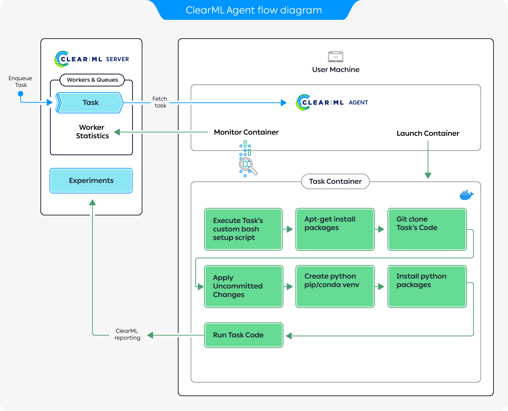

Two major components of MLOps/LLMOps are experiment reproducibility, and the ability to scale work to multiple machines. ClearML workers, 
coupled with execution queues, address both these needs. 

A ClearML worker is instantiated by launching a ClearML Agent, which is the base for **Automation** in ClearML and can be leveraged to build automated pipelines, launch custom services 
(e.g. a [monitor and alert service](https://github.com/allegroai/clearml/tree/master/examples/services/monitoring)) and more.

## What Does a ClearML Agent Do?
The ClearML agent allows users to execute code on any machine it's installed on, thus facilitating the 
scaling of data science work beyond one's own machine.

The agent takes care of deploying the code to the target machine as well as setting up the entire execution environment: 
from installing required packages to setting environment variables, 
all leading to executing the code (supporting both virtual environment or flexible docker container configurations).

The agent also supports overriding parameter values on-the-fly without code modification, thus enabling no-code experimentation (this is also the foundation on which 
ClearML [Hyperparameter Optimization](hpo.md) is implemented).  

An agent can be associated with specific GPUs, enabling workload distribution. For example, on a machine with 8 GPUs you 
can allocate several GPUs to an agent and use the rest for a different workload, even through another agent (see [Dynamic GPU Allocation](../clearml_agent/clearml_agent_dynamic_gpus.md)).   

## What is a Queue?

A ClearML queue is an ordered list of Tasks scheduled for execution. One or multiple agents can service a queue. 
Agents servicing a queue pull the queued tasks in order and execute them. 

A ClearML Agent can service multiple queues in either of the following modes: 

* Strict priority: The agent services the higher priority queue before servicing lower priority ones.
* Round robin: The agent pulls a single task from a queue then moves to service the next queue.

## Agent and Queue Workflow 

The diagram above demonstrates a typical flow where an agent executes a task:  

1. Enqueue a task for execution on the queue.
1. The agent pulls the task from the queue.
1. The agent launches a docker container in which to run the task's code.
1. The task's execution environment is set up:
   1.  Execute any custom setup script configured.
   1.  Install any required system packages.
   1.  Clone the code from a git repository.
   1.  Apply any uncommitted changes recorded.
   1.  Set up the python environment and required packages.
1. The task's script/code is executed.  

While the agent is running, it continuously reports system metrics to the ClearML Server. You can monitor these metrics
in the [**Orchestration**](../webapp/webapp_workers_queues.md) page.  

## Resource Management
Installing an Agent on machines allows it to monitor all the machine's status (GPU / CPU / Memory / Network / Disk IO). 
When managing multiple machines, this allows users to have an overview of their HW resources: the status of each machine, 
the expected workload on each machine, etc.

You can organize your queues according to resource usage. Say you have a single-GPU machine. You can create a queue called
`single-gpu-queue` and assign the machine's agent, as well as other single-GPU agents to that queue. This way you will know 
that Tasks assigned to that queue will be executed by a single GPU machine.

While the agents are up and running in your machines, you can access these resources from any machine by enqueueing a 
Task to one of your queues, according to the amount of resources you want to allocate to the Task. 

With queues and ClearML Agent, you can easily add and remove machines from the cluster, and you can 
reuse machines without the need for any dedicated containers or images.

## Running Modes

Agents can be deployed bare-metal, with multiple instances allocating 
specific GPUs to the agents. They can also be deployed as dockers in a Kubernetes cluster.

The Agent supports the following running modes:
* **Virtual Environment Mode** - The agent creates a new virtual environment for the experiment, installs the required 
  python packages based on the Task specification, clones the code repository, applies the uncommitted changes and 
  finally executes the code while monitoring it. This mode uses smart caching so packages and environments can be reused
  over multiple tasks (see [Virtual Environment Reuse](../clearml_agent/clearml_agent_env_caching.md#virtual-environment-reuse)). 

  ClearML Agent supports using the following package managers: `pip` (default), `conda`, `poetry`. 

  :::tip Agents and virtual environments 
  An agent that runs in Virtual Environment Mode needs to create virtual environments, and
  it can't do that when running from a virtual environment. You can run agents in these modes with 
  system Python.
  :::

* **Docker Mode** - The agent spins a Docker image based on the Task's definitions. Inside the Docker the agent clones 
  the specified repository/code, applies the original execution's uncommitted changes, sets up the Python environment and 
  required packages, and starts executing the code while monitoring it.  

## Services Mode

In its default mode, a ClearML Agent executes a single task at a time, since training tasks typically require all resources 
available to them. Some tasks are mostly idling and require less computation power, such as controller tasks (e.g. 
a pipeline controller) or service tasks (e.g. cleanup service). 

This is where the `services-mode` comes into play. An agent running in `services-mode` will let multiple tasks execute 
in parallel (each task will register itself as a sub-agent, visible in the [Orchestration](../webapp/webapp_workers_queues.md) tab in the UI).

This mode is intended for running maintenance tasks. Some suitable tasks include:

- [Pipeline controller](../guides/pipeline/pipeline_controller.md) - Implementing the pipeline scheduling and logic
- [Hyperparameter Optimization](../guides/optimization/hyper-parameter-optimization/examples_hyperparam_opt.md) - Implementing an active selection of experiments
- [Control Service](../guides/services/aws_autoscaler.md) - AWS Autoscaler for example
- [External services](../guides/services/slack_alerts.md) - Such as Slack integration alert service

:::warning
Do not enqueue training or inference tasks into the services queue. They will put an unnecessary load on the server.
:::

By default, the open source [ClearML Server](../deploying_clearml/clearml_server.md) runs a single clearml-agent in 
services mode that listens to the `services` queue.
