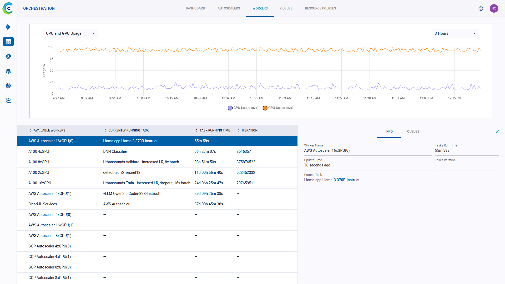

Two major components of MLOps is experiment reproducibility, and the ability to scale work to multiple machines. ClearML Agent, 
coupled with execution queues, addresses both of those needs. 

The Agent is the base for **Automation** in ClearML and can be leveraged to build automated pipelines, services (such as alerts) and more.

## What does a ClearML Agent do?
An agent (Also referred to as a Worker) allows users to execute code on any machine it's installed on, which is used to scale data science work beyond one's own machine.
ClearML Agent not only clones the code, applies uncommitted changes, tracks experiment metrics and machine's status, but it also recreates the entire execution environment, be it by pulling the docker container or installing specified packages.
Once the environment is set up, and the code is cloned, the script is executed by the Agent, which reports metrics as well as monitor the machine it runs in. 

The Agent also allows code parameters to be modified on-the-fly without code modification, this is the base for [Hyper Parameter Optimization](https://github.com/allegroai/clearml/tree/master/examples/optimization/hyper-parameter-optimization).
An agent can be associated with specific GPUs, so a machine with 8 GPUs can execute code only on a few GPUs or all the GPUs together.   

## What is a Queue?

A queue is a list of Task IDs to be executed. You can configure a specific agent or agents to listen to a certain queue, 
and to execute all Tasks pushed to that queue one after the other. 

The Agent can also listen to multiple queues, according to one of the following options: 

* The Agent pulls first from tfhe high priority queue then from the low priority queue.

* The Agent can pull in a round-robin (i.e. each queue has the same priority).

## Resource management
Installing an Agent on machines allows it to monitor all the machine's status (GPU \ CPU \ Memory \ Network \ Disk IO). 
When managing multiple machines, this allows users to have an overview of their entire HW resources. What is the status of each machine, what is the expected workload
on each machine and so on.

You can organize your queues according to resource usage. Say you have a single-GPU machine. You can create a queue called
"single-gpu-queue" and assign the machine's agent, as well as other single-GPU agents to that queue. This way you will know 
that Tasks assigned to that queue will be executed by a single GPU machine.

While the agents are up and running in your machines, you can access these resources from any machine by enqueueing a  
Task to one of your queues, according to the amount of resources you want to allocate to the Task. 

With queues and ClearML Agent, you can easily add and remove machines from the cluster, and you can 
reuse machines without the need for any dedicated containers or images.

## Additional features

Agents can be deployed bare-metal, with multiple instances allocating 
specific GPUs to the agents. They can also be deployed as dockers in a Kubernetes cluster.

The Agent has three running modes:
- Docker mode: The agent spins a docker image based on the Task’s definition then inside the docker the agent will clone 
  the specified repository/code, apply the original execution’s uncommitted changes, install the required python packages 
  and start executing the code while monitoring it.
- Virtual Environment Mode: The agent creates a new virtual environment for the experiment, installs the required python 
  packages based on the Task specification, clones the code repository, applies the uncommitted changes and finally 
  executes the code while monitoring it.
- Conda Environment Mode: Similar to the Virtual Environment mode, only instead of using pip, it uses conda install and 
  pip combination. Notice this mode is quite brittle due to the Conda package version support table.

## Services Agent & Queue

The ClearML Agent, in its default setup, spins a single Task per Agent. It's possible to run multiple agents on the same machine,
but each one will execute a single Task at a time. 
This setup makes sense compute-heavy Tasks that might take some time to complete.
Some tasks, mainly control (Like a pipeline controller) or services (Like an archive cleanup service) are mostly idling, and only implement a thin control logic. 

This is where the `services-modes` comes into play. An agent running in services-mode will spin multiple tasks at the same time, each Task will register itself as a sub-agent (visible in the workers Tab in the UI).
Some examples for suitable tasks are:

- [Pipeline controller](https://github.com/allegroai/clearml/blob/master/examples/pipeline/pipeline_controller.py) - Implementing the pipeline scheduling and logic
- [Hyper-Parameter Optimization](https://github.com/allegroai/clearml/blob/master/examples/optimization/hyper-parameter-optimization/hyper_parameter_optimizer.py) - Implementing an active selection of experiments
- [Control Service](https://github.com/allegroai/clearml/blob/master/examples/services/aws-autoscaler/aws_autoscaler.py) - AWS Autoscaler for example
- [External services](https://github.com/allegroai/clearml/blob/master/examples/services/monitoring/slack_alerts.py) - Such as Slack integration alert service

By default, [ClearML Server](../deploying_clearml/clearml_server.md) comes with an Agent running on the machine that runs it. It also comes with a Services queue.
