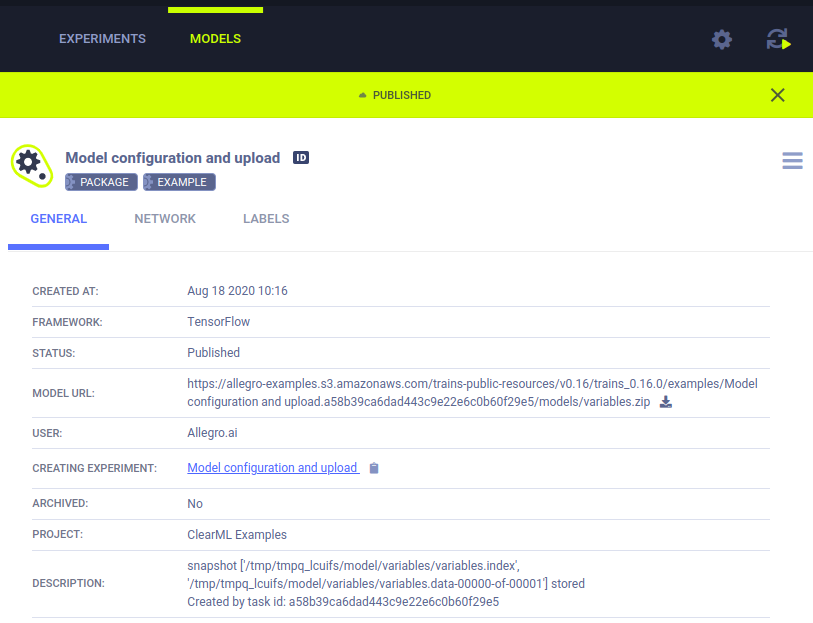

ClearML allows easy storage of experiments' output products as **artifacts** that can later be accessed easily 
and used, through the web UI or programmatically. 

A few examples of artifacts are: 
* Model snapshot / weights file 
* Data preprocessing
* Feature representation of data
* and more!

## Artifacts
### Logging Artifacts
To log any type of artifact to a Task, use the `upload_artifact()` method. For example:

* Upload a local file containing the preprocessing results of the data.
```python
task.upload_artifact(name='data', artifact_object='/path/to/preprocess_data.csv')
```
* Upload an entire folder with all its content by passing the folder, which will be zipped and uploaded as a single 
  zip file:
```python
task.upload_artifact(name='folder', artifact_object='/path/to/folder/')
```
* Upload an instance of an object, Numpy / Pandas / PIL (converted to npz / csv.gz / jpg formats accordingly). If the 
  object type is unknown, it is pickled and uploaded.
```python
person_dict = {'name': 'Erik', 'age': 30}
task.upload_artifact(name='person dictionary', artifact_object=person_dict)
```

See more details in the artifacts [example](../guides/reporting/artifacts.md).

### Using Artifacts
To access a Task's artifact in order to use it:
1. Get the Task that created the artifact (see more details on [querying](task.md#querying--searching-tasks) 
Tasks).

1. Retrieve all the Task's artifacts with the *artifact* property, which is essentially a dictionary, 
where the key is the artifact name, and the value is the artifact itself.
1. Access a specific artifact using one of the following methods:
   - Access files by calling `get_local_copy()`, which caches the files for later use and returns a path to the cached 
  file
   - Access object artifacts by using the `get()` method that returns the Python object.
    
The code below demonstrates how to access a file artifact using the previously generated preprocessed data:
```python
# get instance of Task that created artifact, using Task ID
preprocess_task = Task.get_task(task_id='the_preprocessing_task_id')
# access artifact
local_csv = preprocess_task.artifacts['data'].get_local_copy()
```

See more details in the using artifacts [example](../guides/reporting/using_artifacts.md).

### List of Supported Artifacts

- Numpy array (as npz file)
- Pandas dataframe
- PIL (converted to jpg)
- Files and folders
- Python objects (pickled)

## Models 
Models are a special kind of artifact and, unlike regular artifacts, which can only be accessed with the creating Task's ID,
Models are entities with their own unique ID that can be accessed directly or via the creating task.

This property makes Models a standalone entry that can be used as an artifactory interface.

### Automatic Model Logging

When models are saved using certain frameworks (for instance, by calling the `torch.save()` method), ClearML automatically 
logs the models and all snapshot paths.



See automatic model logging examples: 
* [TF](../guides/frameworks/tensorflow/tensorflow_mnist.md)
* [PyTorch](../guides/frameworks/pytorch/pytorch_mnist.md)
* [Keras](../guides/frameworks/keras/keras_tensorboard.md)
* [Scikit-Learn](../guides/frameworks/scikit-learn/sklearn_joblib_example.md)
* [XGBoost](../guides/frameworks/xgboost/xgboost_sample.md)
* [FastAI](../guides/frameworks/fastai/fastai_with_tensorboard.md)


### Manual Model Logging 

To manually log a model, create an instance of OutputModel class:
```python
from clearml import OutputModel, Task

# Instantiate a Task 
task = Task.init(project_name="myProject", task_name="myTask")

# Instantiate an OutputModel, with a Task object argument
output_model = OutputModel(task=task, framework="PyTorch")
```

The OutputModel object is always connected to a Task object as it's instantiated with a Task object as an argument. 
It is, therefore, automatically registered as the Task’s output model.

The snapshots of manually uploaded models aren't automatically captured, but there are two methods
to update an output model. 

#### Updating Via Task Object
Using the [Task.update_output_model](../references/sdk/task.md#update_output_model) method:
  
```python
task.update_output_model(model_path='path/to/model')
```
It's possible to modify the following parameters:
* Weights file / folder - Uploads the files specified with the `model_path`.
  If a remote storage is provided (S3 / GS / Https etc...), it saves the URL.
* Model Metadata - Model name, description, iteration number of model, and tags. 

#### Updating Via Model Object
Using the [OutputModel.update_weights](../references/sdk/model_outputmodel.md#update_weights) method:
  
```python
output_model.update_weights()
```
* Specify either the name of a locally stored weights file to upload (`weights_filename`), or the URI of a storage destination
for model weight upload (`registered_uri`).
* Model Metadata - Model description and iteration number. 

See [Model Configuration](../guides/reporting/model_config.md) example.

### Using Models

Loading a previously trained model is quite similar to loading artifacts.

```python
prev_task = Task.get_task(task_id='the_training_task')
last_snapshot = prev_task.models['output'][-1]
local_weights_path = last_snapshot.get_local_copy()
```
1. Get the instance of the Task that created the original weights files
2. Query the Task on its output models (a list of snapshots)
3. Get the latest snapshot (if using Tensorflow, the snapshots are stored in a folder, so the `local_weights_path` will point to a folder containing the requested snapshot).

Notice that if one of the frameworks will load the weights file, the running Task will automatically update, with 
"Input Model" pointing directly to the original training Task's model. With this feature, it's easy to get a full genealogy 
of every trained and used model in our system!

Loading framework models appear under the "Input Models" section, under the Artifacts tab in the ClearML UI.

### Setting Upload Destination

ClearML automatically captures the storage path of Models created by frameworks such as TF, Pytorch, and scikit-learn. By default, 
it stores the local loading path they are saved to.

To automatically store all created models by a specific experiment, modify the `Task.init()` function as such:
```python
task = Task.init(project_name='examples', task_name='storing model', output_uri='s3://my_models/')
```

To automatically store all created models from all experiments in a certain storage medium, edit the `clearml.conf` (see
 [ClearML Configuration Reference](../configs/clearml_conf#sdkdevelopment)) and set `sdk.developmenmt.default_output_uri` to the desired 
storage (see [Storage](../integrations/storage.md)).
This is especially helpful when using [clearml-agent](../clearml_agent.md) to execute code.

### List of Supported Frameworks

- Tensorflow 
- Keras 
- Pytorch 
- scikit-learn (only using joblib)
- XGBoost (only using joblib)