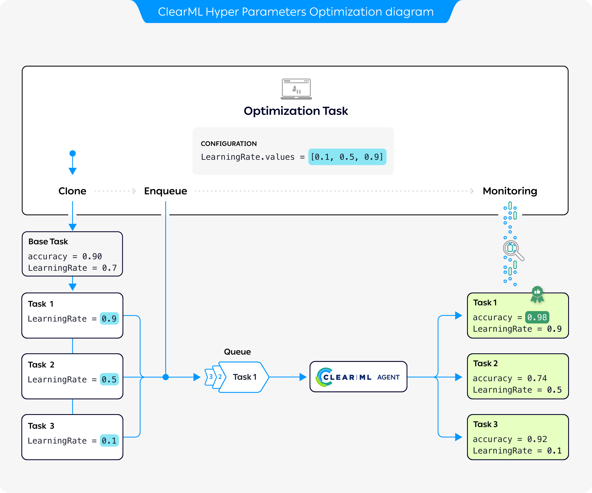

## What is Hyperparameter Optimization?
Hyperparameters are variables that directly control the behaviors of training algorithms, and have a significant effect on 
the performance of the resulting machine learning models. Finding the hyperparameter values that yield the best 
performing models can be complicated. Manually adjusting hyperparameters over the course of many training trials can be 
slow and tedious. Luckily, you can automate and boost hyperparameter optimization (HPO) with ClearML's 
[**`HyperParameterOptimizer`**](../references/sdk/hpo_optimization_hyperparameteroptimizer.md) class.

## ClearML's Hyperparameter Optimization

ClearML provides the `HyperParameterOptimizer` class, which takes care of the entire optimization process for users 
with a simple interface.  

ClearML's approach to hyperparameter optimization is scalable, easy to set up and to manage, and it makes it easy to 
compare results.

### Workflow



The preceding diagram demonstrates the typical flow of hyperparameter optimization where the parameters of a base task are optimized: 

1. Configure an Optimization Task with a base task whose parameters will be optimized, optimization targets, and a set of parameter values to 
   test
1. Clone the base task. Each clone's parameter is overridden with a value from the optimization task  
1. Enqueue each clone for execution by a ClearML Agent
1. The Optimization Task records and monitors the cloned tasks' configuration and execution details, and returns a 
   summary of the optimization results in tabular and parallel coordinate formats, and in a scalar plot. 
 


<Collapsible title="Parallel coordinate and scalar plots" type="screenshot">


</Collapsible>

### Supported Optimizers

The `HyperParameterOptimizer` class contains ClearML's hyperparameter optimization modules. Its modular design enables 
using different optimizers, including existing software frameworks, enabling simple, accurate, and fast hyperparameter 
optimization.

* **Optuna** - [`automation.optuna.OptimizerOptuna`](../references/sdk/hpo_optuna_optuna_optimizeroptuna.md). Optuna is the default optimizer in ClearML. It makes use of 
  different samplers such as grid search, random, bayesian, and evolutionary algorithms. 
  For more information, see the [Optuna](https://optuna.readthedocs.io/en/latest/) 
  documentation.
* **BOHB** - [`automation.hpbandster.OptimizerBOHB`](../references/sdk/hpo_hpbandster_bandster_optimizerbohb.md). BOHB performs robust and efficient hyperparameter optimization 
  at scale by combining the speed of Hyperband searches with the guidance and guarantees of convergence of Bayesian Optimization. 
  For more information about HpBandSter BOHB, see the [HpBandSter](https://automl.github.io/HpBandSter/build/html/index.html) 
  documentation and a [code example](../guides/frameworks/pytorch/notebooks/image/hyperparameter_search.md).
* **Random** uniform sampling of hyperparameters - [`automation.RandomSearch`](../references/sdk/hpo_optimization_randomsearch.md).
* **Full grid** sampling strategy of every hyperparameter combination - [`automation.GridSearch`](../references/sdk/hpo_optimization_gridsearch.md).
* **Custom** - [`automation.optimization.SearchStrategy`](https://github.com/allegroai/clearml/blob/master/clearml/automation/optimization.py#L268) - Use a custom class and inherit from the ClearML automation base strategy class. 


## Defining a Hyperparameter Optimization Search Example

1. Import ClearML's automation modules: 

   ```python 
   from clearml.automation import UniformParameterRange, UniformIntegerParameterRange
   from clearml.automation import HyperParameterOptimizer
   from clearml.automation.optuna import OptimizerOptuna
   ```
1. Initialize the Task, which will be stored in ClearML Server when the code runs. After the code runs at least once, 
   it can be reproduced, and the parameters can be tuned:
   ```python
   from clearml import Task
  
   task = Task.init(
       project_name='Hyper-Parameter Optimization',
       task_name='Automatic Hyper-Parameter Optimization',
       task_type=Task.TaskTypes.optimizer,
       reuse_last_task_id=False
   )
   ```

1. Define the optimization configuration and resources budget:
   ```python
   optimizer = HyperParameterOptimizer(
         # specifying the task to be optimized, task must be in system already so it can be cloned
         base_task_id=TEMPLATE_TASK_ID,  
         # setting the hyperparameters to optimize
         hyper_parameters=[
             UniformIntegerParameterRange('number_of_epochs', min_value=2, max_value=12, step_size=2),
             UniformIntegerParameterRange('batch_size', min_value=2, max_value=16, step_size=2),
             UniformParameterRange('dropout', min_value=0, max_value=0.5, step_size=0.05),
             UniformParameterRange('base_lr', min_value=0.00025, max_value=0.01, step_size=0.00025),
             ],
         # setting the objective metric we want to maximize/minimize
         objective_metric_title='accuracy',
         objective_metric_series='total',
         objective_metric_sign='max',  
 
         # setting optimizer  
         optimizer_class=OptimizerOptuna,
     
         # configuring optimization parameters
         execution_queue='default',  
         max_number_of_concurrent_tasks=2,  
         optimization_time_limit=60., 
         compute_time_limit=120, 
         total_max_jobs=20,  
         min_iteration_per_job=15000,  
         max_iteration_per_job=150000,  
         )
   ```

   :::tip Locating Task ID
   To locate the base task's ID, go to the task's info panel in the [WebApp](../webapp/webapp_overview.md). The ID appears 
   in the task header.
   :::

   :::tip Multi-objective Optimization
   If you are using the Optuna framework (see [Supported Optimizers](#supported-optimizers)), you can list multiple optimization objectives. 
   When doing so, make sure the `objective_metric_title`, `objective_metric_series`, and `objective_metric_sign` lists 
   are the same length. Each title will be matched to its respective series and sign. 

   For example, the code below sets two objectives: to minimize the `validation/loss` metric and to maximize the `validation/accuracy` metric. 
   ```python
   objective_metric_title=["validation", "validation"]
   objective_metric_series=["loss", "accuracy"]
   objective_metric_sign=["min", "max"]
   ```
   :::


## Optimizer Execution Options
The `HyperParameterOptimizer` provides options to launch the optimization tasks locally or through a ClearML [queue](agents_and_queues.md#what-is-a-queue).
Start a `HyperParameterOptimizer` instance using either [`HyperParameterOptimizer.start()`](../references/sdk/hpo_optimization_hyperparameteroptimizer.md#start) 
or [`HyperParameterOptimizer.start_locally()`](../references/sdk/hpo_optimization_hyperparameteroptimizer.md#start_locally). 
Both methods run the optimizer controller locally. `start()` launches the base task clones through a queue 
specified when instantiating the controller, while `start_locally()` runs the tasks locally.

:::tip Remote Execution
You can also launch the optimizer controller through a queue by using [`Task.execute_remotely()`](../references/sdk/task.md#execute_remotely) 
before starting the optimizer.  
::: 


## Tutorial

Check out the [Hyperparameter Optimization tutorial](../guides/optimization/hyper-parameter-optimization/examples_hyperparam_opt.md) for a step-by-step guide.

## SDK Reference

For detailed information, see the complete [HyperParameterOptimizer SDK reference page](../references/sdk/hpo_optimization_hyperparameteroptimizer.md).

## CLI

ClearML also provides `clearml-param-search`, a CLI utility for managing the hyperparameter optimization process. See 
[ClearML Param Search](../apps/clearml_param_search.md) for more information. 

## UI Application

:::info Pro Plan Offering
The ClearML HPO App is available under the ClearML Pro plan.
:::

ClearML provides the [Hyperparameter Optimization GUI application](../webapp/applications/apps_hpo.md) for launching and 
managing the hyperparameter optimization process. 
