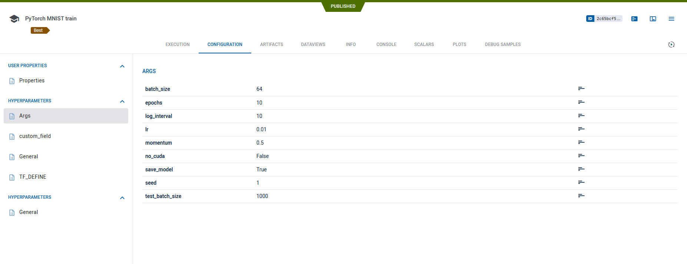

Hyperparameters are the configuration options given for a script.
ClearML logs hyperparameters used in experiments from multiple different sources.

In ClearML, parameters are split into 3 sections:
- User Properties - Modifiable section that can be edited post execution.
- Hyperparameters - Individual parameters for configuration.
- Configuration Objects - Usually configuration files (Json / YAML) or python objects. 
  
These sections are further broken down into sub-sections (General / Args / TF_Define) for convenience.



## Command Line Parsing 
ClearML captures any command line parameters passed when invoking code that uses standard python packages such as 
argparse or [click](https://click.palletsprojects.com). This happens automatically with no additional code required beyond 
initializing ClearML.

### Argparse Example 

```python
from clearml import Task
import argparse

parser = argparse.ArgumentParser(description="Script Argparser")
parser.add_argument("-lr", default=0.001, help="Initial learning rate")
parser.add_argument("-epochs", default= 10, help="Total number of epochs")
args = parser.parse_args()


task = Task.init(project_name="examples",task_name="argparser logging")
``` 

See another argparse logging example [here](../guides/reporting/hyper_parameters.md).

### Click Example

```python
from clearml import Task
import click

task = Task.init(project_name='examples', task_name='click single command')

@click.command()
@click.option('--count', default=1, help='Number of greetings.')
@click.option('--name', prompt='Your name',
              help='The person to greet.')
def hello(count, name):
    for x in range(count):
        click.echo("Hello {}!".format(name))

hello()
```

See another code example [here](https://github.com/allegroai/clearml/blob/master/examples/frameworks/click/click_multi_cmd.py).

## Connecting Objects

Users can directly connect objects, such as dictionaries or even custom classes, to Tasks.
All class members will be automatically fetched and logged by ClearML.

* Connecting a class:
```python
class person:
    def __init__(self, name, age):
        self.name = name
        self.age = age


me = person('Erik',5)

task = Task.init(project_name='examples',task_name='argparser')

task.connect(me)
```
See connecting configuration objects example [here](../guides/reporting/hyper_parameters.md).


* Connecting a dictionary:
```python
task = Task.init(project_name='examples', task_name='dictionary logging')

params_dictionary = {'epochs': 3, 'lr': 0.4}

task.connect(params_dictionary)
```

## User Properties

User properties are an editable key / value store, which enables adding information to an experiment, 
making it easier to search / filter. User properties are like parameters that can also be added after a Task's execution, which 
can also be added to an [experiment table](../webapp/webapp_exp_table.md) (i.e. customize columns). 

For example:
```python
task.set_user_properties({"name": "backbone", 
                          "description": "network type", 
                          "value": "great"})
```

The above example will connect to the Task a user property named "backbone", with the description "network type", and
the value of "great". 

## Environment Variables

:::important
Relying on environment variables makes an experiment not fully reproducible, since ClearML Agent can't reproduce them at 
runtime.
:::

Environment variables can be logged by modifying the [clearml.conf](../configs/clearml_conf) file. Modify the *log_os_environments* 
parameter specifying parameters to log.

`log_os_environments: ["AWS_*", "CUDA_VERSION"]`

It's also possible to specify environment variables using the CLEARML_LOG_ENVIRONMENT variable.

:::note
The CLEARML_LOG_ENVIRONMENT always overrides the clearml.conf file. 
:::

## TF Defines

ClearML automatically captures TensorFlow definitions, which are used as configuration files for Tensorflow.

See examples of ClearML's automatic logging of TF Defines:
* [TensorFlow MNIST](../guides/frameworks/tensorflow/tensorflow_mnist.md)
* [TensorBoard PR Curve](../guides/frameworks/tensorflow/tensorboard_pr_curve.md)

## Hydra

[Hydra](https://github.com/facebookresearch/hydra) is a module developed by FaceBook AI Research to manage experiments' 
parameters. Hydra offers the best of both worlds, managing configurations with files while making parameters overridable at runtime.

ClearML logs the Omegaconf which holds all the configuration files, as well as overridden values. 

Check out the [example code](https://github.com/allegroai/clearml/blob/master/examples/frameworks/hydra/hydra_example.py),
which demonstrates the creation of a configuration object to which configuration values can be added and overridden using the 
command line.

## Configuration Objects

Configuration objects are dictionaries or configuration files connected to the Task. Unlike Hyperparameters, these are saved as a whole and not
divided into individual parameters.

To connect a configuration dictionary:
```python
model_config_dict = {
    'value': 13.37,
    'dict': {'sub_value': 'string', 'sub_integer': 11},
    'list_of_ints': [1, 2, 3, 4],
}
model_config_dict = task.connect_configuration(name='dictionary', configuration=model_config_dict)
```


To connect a configuration file:
```python
config_file_yaml = task.connect_configuration(name="yaml file", configuration='path/to/configuration/file.yaml', )
```

Configuration objects can be split into categories in the Configuration section.
The "name" argument, is the name of the section that the object will go into. If a section name is not specified, the default section is *General*.

See [here](https://github.com/allegroai/clearml/blob/master/examples/reporting/model_config.py) for a detailed example.


## Manual Parameter Access

### Manual Parameter Input

In addition to connecting a dictionary or a class to log hyperparameters, users can also use the `set_parameters` method 
 to define parameters manually. Parameters are inputted as dictionaries. 

Additionally, parameters can be categorized, and each category appears in its own section in the hyperparameter tab of the web UI. 
Specify a section by putting its name before the parameter, for example `'Args/epochs': 'value'` - 'epochs' will go into the 
'Args' section. If a section isn't specified, the parameter will go into the *General* section by default.

Calling the `set_parameter` method will set a single parameter.

```python
task = Task.init(project_name='examples', task_name='parameters')

# override parameters with provided dictionary 
task.set_parameters({'Args/epochs':7, 'lr': 0.5})

# setting a single parameter
task.set_parameter(name='decay',value=0.001)
```
:::warning
The *set_parameters* method will override any parameters already logged.
:::

### Adding Parameters
To update the parameters in an experiment, use the `set_parameters_as_dict` method . Arguments and values are inputted as a dictionary.
Like in the `set_parameters` method, the dictionary can be nested, so the parameter's section can be specified.

```python
task = Task.task_get(task_id='123456789')

# add parameters
task.set_parameters_as_dict({'my_args/lr':0.3, 'epochs':10})
```


### Accessing Parameters 

To get all Task's parameters, use the `get_parameters()` method, which will return a dictionary with the parameters, including 
their section. 

```python
task = Task.get_task(project_name='examples', task_name='parameters')

# will print a flattened dictionary of the 'section/parameter': 'value' pairs. {'Args/epochs': '7', 'General/lr': '0.5'}  
print(task.get_parameters())
```
