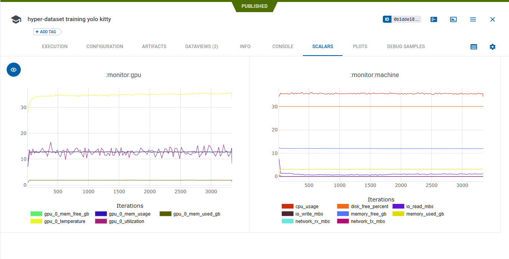

The ClearML **Logger** object is used to report experiments' results such as metrics, graphs, and debug samples. It is a 
member of the [Task](task.md) object. 

ClearML integrates with the leading visualization libraries, and automatically captures reports to them. 

## Types of Logged Results
In ClearML, there are four types of reports:
- Text - Mostly captured automatically from stdout and stderr but can be logged manually.
- Scalars - Time series data. X-axis is always a sequential number, usually iterations but can be epochs or others.
- Plots - General graphs and diagrams, such as histograms, confusion matrices line plots, and custom plotly charts.
- Debug Samples - Images, audio, and videos. Can be reported per iteration.


## Automatic Reporting

ClearML automatically captures metrics reported to tools, such as TensorBoard and Matplotlib, with no additional code
necessary.

In addition, ClearML will capture and log everything written to standard output, from debug messages to errors to 
library warning messages.

GPU, CPU, Memory and Network information is also automatically captured.



### Supported packages
- [TensorBoard](https://www.tensorflow.org/tensorboard)
- [TensorBoardX](https://github.com/lanpa/tensorboardX)
- [Matplotlib](https://matplotlib.org/)

### Automatic reporting examples
Check out some of ClearML's automatic reporting examples for supported packages:
* TensorBoard
  * [TensorBoard PR Curve](../guides/frameworks/tensorflow/tensorboard_pr_curve.md)
  * [TensorBoard Toy](../guides/frameworks/tensorflow/tensorboard_toy.md)
* [TensorBoardX](../guides/frameworks/tensorboardx/tensorboardx.md) 
* Matplotlib examples in [script](../guides/frameworks/matplotlib/matplotlib_example.md) and [Jupyter Notebook](../guides/frameworks/matplotlib/allegro_clearml_matplotlib_example.md)
  


## Manual Reporting

ClearML also supports manually reporting multiple types of metrics and plots, such as line plots, histograms, and even plotly 
charts.


The object used for reporting metrics is called **logger** and is obtained by calling

```python
logger = task.get_logger()
```

Check out all the available object types that can be reported in the [Explicit Reporting](../guides/reporting/scalar_reporting.md) 
example or in the [Jupyter Notebook](../guides/reporting/clearml_logging_example.md) Explicit Reporting example.

### Media reporting

ClearML also supports reporting media (such as audio, video and images) for every iteration.
This section is mostly used for debugging. It's recommended to use [artifacts](artifacts.md#artifacts) for storing script 
outputs that would be used later on.

Only the last X results of each title \ series are saved to prevent overloading the server.
See details in [Logger.report_media](../references/sdk/logger.md#report_media). 


Check out the Media Reporting [example](../guides/reporting/media_reporting.md).

### Explicit reporting examples

Check out ClearML's explicit reporting examples for various types of results:
- [Text](../guides/reporting/text_reporting.md) 
- [Scalars](../guides/reporting/scalar_reporting.md)
- Plots 
    - [2d plots](../guides/reporting/scatter_hist_confusion_mat_reporting.md)
    - [3d plots](../guides/reporting/3d_plots_reporting.md)
    - [Tables (Pandas and CSV file)](../guides/reporting/pandas_reporting.md)
    - [Matplotlib figures](../guides/reporting/manual_matplotlib_reporting.md)
    - [Plotly figures](../guides/reporting/plotly_reporting.md)
- Debug Samples
    - [Images](../guides/reporting/image_reporting.md)
    - [HTML](../guides/reporting/html_reporting.md)
    - [Media - images, audio, video](../guides/reporting/media_reporting.md)
    
