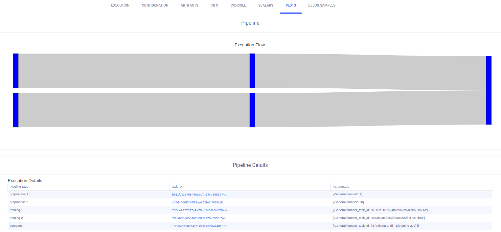

Pipelines are a way to streamline and connect multiple processes, plugging the output of one process as the input of another. 

Pipelines are controlled by a *Controller Task* that holds the logic of the pipeline execution steps (i.e. the python-code 
control logic, configuring and launching the pipeline steps / components). Like any other [Task](task.md) in ClearML,
the Controller Task can be cloned, modified and relaunched.

The pipeline logic can be executed on any machine, while the pipeline steps themselves are launched on remote machines 
using the `clearml-agent`. The pipeline logic itself can also be executed on a remote machine, by default it will be 
executed on the `services` queue machine. See [queues](agents_and_queues.md), [remote-executions](task.md#advanced-remote-execution),
and [services queues](../clearml_agent.md#services-mode).

ClearML supports two types of Pipelines, both logic driven, fully customizable, and not limited to a simple DAG: 
* Pipelines from [pre-existing Tasks](#pipelines-from-tasks)
* Pipeline from [function decorators](#pipeline-from-function-decorator)

## Pipelines from Tasks
This type of pipeline is a DAG-like pipeline where each node / step on the DAG is a pre-existing Task in ClearML. The DAG 
specification tells the pipeline which node to launch based on parent nodes completing their execution. DAG 
specification can also modify the inputs of each Task, thus enabling you to point the output of one Task as the input of 
another Task.

### How Do Pipelines Work? 

Users can automate [Tasks](task) to run consecutively or according to some logic by putting the tasks into a pipeline. 
Tasks in a pipeline can leverage other tasks' work products such as artifacts and parameters. 

Before running a pipeline, we need to configure a Controller Task, in which the pipeline is defined. Pipelines are made 
up of steps. Each step consists of a task that already exists in the ClearML Server and is used as a template. The 
user decides the controlling logic of the step interactions, whether it be simple ([DAG](https://en.wikipedia.org/wiki/Directed_acyclic_graph)) 
or more complex. 

Once the pipeline is running, it starts sequentially launching the steps configured in the Controller. In each step, the template task 
is cloned, and the cloned task is sent for execution. Depending on the specifications laid out in the Controller Task, a 
step's parameters can be overridden, and / or a step can use a previous step's work products. 

Callbacks can be utilized to control pipeline execution flow. A callback can be defined 
to be called before and / or after the execution of every task in a pipeline. Additionally, there is an option to 
create customized, step-specific callbacks. 




### Simple DAG Pipelines

For a simple, DAG based logic, use the off-the-shelf [`PipelineController`](../references/sdk/automation_controller_pipelinecontroller.md) class to define the DAG (see an example 
[here](../guides/pipeline/pipeline_controller)). Once the `PipelineController` object is populated and configured, 
we can start the pipeline, which will begin executing the steps in succession, then it waits until the pipeline is completed. 
The pipeline control logic is processed in a background thread. 

:::note
We recommend enqueuing Pipeline Controller Tasks into a 
[services](../clearml_agent.md#services-mode) queue.
:::

Callback functions can be specified to be called in the steps of a `PipelineController` object. 
There is an option to define a callback to be called before and / or after every step in the pipeline, 
using the `step_task_created_callback` or the `step_task_completed_callback` parameters of the [`start`](../references/sdk/automation_controller_pipelinecontroller.md#start) 
method. Alternatively, step-specific callback functions can be specified with the `pre_execute_callback` and / or 
`post_execute_callback` parameters of the [`add_step`](../references/sdk/automation_controller_pipelinecontroller.md#add_step) 
method. 

### Advanced Pipelines

Since a pipeline *Controller Task* is itself a ClearML Task, it can be used as a pipeline step and can be used to create 
more complicated workflows, such as pipelines running other pipelines, or a pipeline running multiple tasks concurrently.

For example, it could be useful to have one pipeline for data preparation, which triggers a second pipeline that trains
networks.

It could also be useful to run a pipeline that runs tasks concurrently, training multiple networks with different hyperparameter
values simultaneously. See the [Tabular training pipeline](../guides/frameworks/pytorch/notebooks/table/tabular_training_pipeline.md) 
example of a pipeline with concurrent steps. 

### Custom Pipelines

In cases where a DAG is insufficient (for example, when needing to launch one pipeline, then, if performance is inadequate, 
rerun pipeline again), users can apply custom logic, using generic methods to enqueue tasks, implemented in python code.
The custom logic of the pipeline sits in the *Controller Task*'s script.  

Custom pipelines usually involve cloning template tasks, modifying their parameters, and manually enqueuing 
them to queues (for execution by [agents](../clearml_agent.md)). It's possible to create custom logic that controls inputs 
(e.g. overriding hyperparameters and artifacts) and acts upon task outputs.

See examples of custom pipelines: 
   * [Task Piping](../guides/automation/task_piping.md)
   * [Manual Random Parameter Search](../guides/automation/manual_random_param_search_example.md)


## Pipeline from Function Decorator

This pipeline type is a pipeline fully created from code. This means each step in the pipeline is a function that will 
be launched as an independent job on a remote machine. The function input arguments are converted into Task 
hyperparameters with the section name `kwargs`. The function return value is stored as an artifact (or artifacts when 
multiple objects are returned), on the component Task. Both inputs / outputs are handled automatically and are transparent to the 
user, see details below.

We will demonstrate how to build a pipeline using the function decorator method. The pipeline will include the following 
four steps:
1. Get data into the system (e.g. download data from DB, internet address etc)
1. Pre-process Data (e.g. fix missing values, or conform time zone etc.)
1. Train Model based on Data
1. Verify model against blind static dataset

The example pipeline is a 4-step pipeline, or in other words, four functions that will be called one after the other. 
We start with a simple python code, four functions, and one main control function actually making the calls moving 
inputs / outputs between the steps:

```python
from clearml.automation.controller import PipelineDecorator
from clearml import TaskTypes

def step_one(pickle_data_url: str, extra: int = 43):
    import sklearn  # noqa
    import pickle
    import pandas as pd
    from clearml import StorageManager
    local_iris_pkl = StorageManager.get_local_copy(remote_url=pickle_data_url)
    with open(local_iris_pkl, 'rb') as f:
        iris = pickle.load(f)
    data_frame = pd.DataFrame(iris['data'], columns=iris['feature_names'])
    data_frame.columns += ['target']
    data_frame['target'] = iris['target']
    return data_frame

def step_two(data_frame, test_size=0.21, random_state=421):
    import pandas as pd  # noqa
    from sklearn.model_selection import train_test_split
    y = data_frame['target']
    X = data_frame[(c for c in data_frame.columns if c != 'target')]
    X_train, X_test, y_train, y_test = train_test_split(
        X, y, test_size=test_size, random_state=random_state)
    return X_train, X_test, y_train, y_test

def step_three(data, X_train, y_train):
    print('step_three')
    # make sure we have pandas for this step, we need it to use the data_frame
    import pandas as pd  # noqa
    from sklearn.linear_model import LogisticRegression
    model = LogisticRegression(solver='liblinear', multi_class='auto')
    model.fit(X_train, y_train)
    return model

def step_four(model, X_data, Y_data):
    from sklearn.linear_model import LogisticRegression  # noqa
    from sklearn.metrics import accuracy_score
    Y_pred = model.predict(X_data)
    return accuracy_score(Y_data, Y_pred, normalize=False)

def main(pickle_url, mock_parameter='mock'):
    data_frame = step_one(pickle_url)
    X_train, X_test, y_train, y_test = step_two(data_frame)
    model = step_three(X_train, y_train)
 accuracy = 100 * step_four(model, X_data=X_test, Y_data=y_test)
 print(f"Accuracy={accuracy}%")
```

Notice that the driver is the `main` function, calling ("launching") the different steps. Next we add the decorators over 
all the steps, and the main pipeline decorator over the main function. From this point onwards, any 
call for one of the decorated steps will actually create a ClearML Task from the code, and launch 
the Task (see `queue` argument of the decorator function). 

Notice, the returned object is a "proxy object" that returns immediately, even if the associated pipeline step Task is 
still running. Only when the code tries to use the returned "proxy object" in the logic, we stop and wait for the Task 
to complete the execution. This is the equivalent of using python coroutines where a function call is `async` , 
`await` is called before using the return value.

Now we can add the "@ decorators" and create the pipeline from the functions:

```python
from clearml.automation.controller import PipelineDecorator
from clearml import TaskTypes

@PipelineDecorator.component(return_values=['data_frame'], cache=True, task_type=TaskTypes.data_processing)
def step_one(pickle_data_url: str, extra: int = 43):
    import sklearn  # noqa
    import pickle
    import pandas as pd
    from clearml import StorageManager
    local_iris_pkl = StorageManager.get_local_copy(remote_url=pickle_data_url)
    with open(local_iris_pkl, 'rb') as f:
        iris = pickle.load(f)
    data_frame = pd.DataFrame(iris['data'], columns=iris['feature_names'])
    data_frame.columns += ['target']
    data_frame['target'] = iris['target']
    return data_frame

@PipelineDecorator.component(
  return_values=['X_train, X_test, y_train, y_test'], cache=True, task_type=TaskTypes.data_processing)
def step_two(data_frame, test_size=0.21, random_state=421):
    import pandas as pd  # noqa
    from sklearn.model_selection import train_test_split
    y = data_frame['target']
    X = data_frame[(c for c in data_frame.columns if c != 'target')]
    X_train, X_test, y_train, y_test = train_test_split(
        X, y, test_size=test_size, random_state=random_state)
    return X_train, X_test, y_train, y_test

@PipelineDecorator.component(return_values=['model'], cache=True, task_type=TaskTypes.training)
def step_three(data, X_train, y_train):
    print('step_three')
    # make sure we have pandas for this step, we need it to use the data_frame
    import pandas as pd  # noqa
    from sklearn.linear_model import LogisticRegression
    model = LogisticRegression(solver='liblinear', multi_class='auto')
    model.fit(X_train, y_train)
    return model

@PipelineDecorator.component(return_values=['accuracy'], cache=True, task_type=TaskTypes.qc)
def step_four(model, X_data, Y_data):
    from sklearn.linear_model import LogisticRegression  # noqa
    from sklearn.metrics import accuracy_score
    Y_pred = model.predict(X_data)
    return accuracy_score(Y_data, Y_pred, normalize=False)

@PipelineDecorator.pipeline(name='pipeline', project='examples', version='0.1')
def main(pickle_url, mock_parameter='mock'):
    data_frame = step_one(pickle_url)
    X_train, X_test, y_train, y_test = step_two(data_frame)
    model = step_three(X_train, y_train)
 accuracy = 100 * step_four(model, X_data=X_test, Y_data=y_test)
 print(f"Accuracy={accuracy}%")
```

We wrap each pipeline component with `@PipelineDecorator.component`, and the main pipeline logic with 
`@PipelineDecorator.pipeline`

### @PipelineDecorator.component

Wrapping a function with the `PipelineDecorator.component` decorator will make the function a pipeline component that can 
be called from the main pipeline logic function. 

Important arguments: 
* `return_values` - Name the return values of the function. This argument is used to hint to the system how many objects 
  are returned, as well as give them meaningful names. 
  * Examples:
    * `["data"]` => means single object returned (it will be stored as an artifact named `data`)
    * `["x", "y"]` => means two objects returned (stored as artifacts named `x`, `y` respectfully)

* `name` (Optional) - set the name of the pipeline component task. If not provided, the wrapped function name is used as 
  the pipeline component name

* `cache` - If `True`, before launching the new step, after updating with the latest configuration, check if an exact 
  Task (step) with the same parameter / code was already executed. If found, use it instead of launching a new Task.

* `packages` - Manually specify a list of required packages or a local `requirements.txt` file. Example: 
  `["tqdm>=2.1", "scikit-learn"]` or `"./requirements.txt"`.
    If not provided, packages are automatically added based on the imports used inside the function.

* `execution_queue` (Optional) - the queue to use for executing this specific step. If not provided, the task will be 
  sent to the pipeline’s default execution queue

* `continue_on_fail` - If `True`, a failed step will not cause the pipeline to stop (or marked as failed). Notice, that 
  steps that are connected (or indirectly connected) to the failed step will be skipped (default `False`)

* `docker` - Specify the Docker image to be used when executing the pipeline step remotely 
  
* `docker_args` - Add Docker execution arguments for the remote execution (use single string for all docker arguments).

* `docker_bash_setup_script` - Add a bash script to be executed inside the docker before setting up the Task's environment

* `task_type` (Optional) - The [task type](task.md#task-types) to be created

* `repo` (Optional) - Specify a repository to attach to the function, when remotely executing. Allow users to execute 
  the function inside the specified repository, enabling them to load modules / script from the repository. Notice the 
  execution work directory will be the repository root folder. Supports both git repo url link, and local repository path 
  (automatically converted into the remote git / commit as is currently checkout).
  * Examples:
    * remote url: `"https://github.com/user/repo.git"`
    * local repo copy: `"./repo"` -> will automatically store the remote repo url and commit ID based on the locally 
      cloned copy
      
* `repo_branch` (Optional) - Specify the remote repository branch (Ignored, if local repo path is used)
* `repo_commit` (Optional) - Specify the repository commit ID (Ignored, if local repo path is used)

* `helper_functions` (Optional) - A list of helper functions to make available for the standalone pipeline step function 
  Task. By default, the pipeline step function has no access to any of the other functions, by specifying additional 
  functions here, the remote pipeline step could call the additional functions.  
  Example, assuming we have two functions, `parse_data()` and `load_data()`: `[parse_data, load_data]`   

* `monitor_metrics` (Optional) - Automatically log the step's reported metrics also on the pipeline Task. 
  The expected format is one of the following:
  * List of pairs metric (title, series) to log: `[(step_metric_title, step_metric_series), ]`.  
    Example: `[('test', 'accuracy'), ]`
  * List of tuple pairs, to specify a different target metric to use on the pipeline Task: `[((step_metric_title, step_metric_series), (target_metric_title, target_metric_series)), ]`.  
    Example: `[[('test', 'accuracy'), ('model', 'accuracy')], ]`
* `monitor_artifacts` (Optional) - Automatically log the step's artifacts on the pipeline Task. 
    * Provided a list of artifact names created by the step function, these artifacts will be logged automatically also 
      on the Pipeline Task itself.  
      Example: `['processed_data', ]` (target artifact name on the Pipeline Task will have the same name as the original artifact).  
    * Alternatively, provide a list of pairs `(source_artifact_name, target_artifact_name)`, where the first string is the 
      artifact name as it appears on the component Task, and the second is the target artifact name to put on the Pipeline 
      Task.  
      Example: `[('processed_data', 'final_processed_data'), ]`
* `monitor_models` (Optional) - Automatically log the step's output models on the pipeline Task.
    * Provided a list of model names created by the step's Task, they will also appear on the Pipeline itself. 
      Example: `['model_weights', ]`
    * To select the latest (lexicographic) model use `model_*`, or the last created model with just `*`.
      Example:  `['model_weights_*', ]`
    * Alternatively, provide a list of pairs `(source_model_name, target_model_name)`, 
      where the first string is the model name as it appears on the component Task,
      and the second is the target model name to put on the Pipeline Task. 
      Example: `[('model_weights', 'final_model_weights'), ]`
    


:::tip Importing Packages
Notice that each component is treated as a standalone script, this also means that global imports (i.e. outside the 
function) are not transferred into the standalone Task. This means that any packages used inside the component function 
should be imported inside the function itself. 

All imports are automatically logged, and will appear as required packages for the remote Task. This means the 
`clearml-agent` will install the requested environment automatically
:::

### @PipelineDecorator.pipeline

Wrapping a function with the `PipelineDecorator.pipeline` decorator will make the function the main pipeline logic 
function (`pipeline` Task), The pipeline components are called from the main function, like any python function, with 
arguments and return values, these in turn are converted into Tasks running on remote-machines (or background sub-processes).

Notice that the pipeline logic function’s argument (i.e. the arguments of the function being decorated), will be 
automatically logged as the pipeline arguments, and will appear in the pipeline Task CONFIGURATION tab,  `Args` section. 
These parameters can later be overridden when cloning the pipeline and relaunching it (see Pipeline Cloning and Reusing)

Important arguments for the pipeline decorator:

* `name` - Provide pipeline name (if main Task exists it overrides its name).
* `project` - Provide project storing the pipeline (if main Task exists it overrides its project).
* `version` - Must provide pipeline version. This version allows us to uniquely identify the pipeline template execution. 
Examples for semantic versions: `version='1.0.1'` , `version='23'`, `version='1.2'`.
* `default_queue` - default queue to launch pipeline components on (unless otherwise specified on the pipeline component 
  itself). 
* `pool_frequency` - The pooling frequency (in minutes) for monitoring experiments / states.
* `add_pipeline_tags` - If `True`, add `pipe: <pipeline_task_id>` tag to all steps (Tasks) created by this pipeline. 
  (this is useful to create better visibility into projects with multiple pipelines, and for easy selection) (default: `False`).
* `target_project` - If provided, all pipeline steps are cloned into the target project. If not provided pipeline steps 
  are stored on the same project as the pipeline itself. Target sub-folder allows for easier organization of pipeline 
  execution logic (Pipeline Task) and component execution Tasks. Example: `"pipeline/component_execution"`.
* `abort_on_failure` - If `False` (default), failed pipeline steps will not cause the pipeline to stop immediately, 
  instead any step that is not connected (or indirectly connected) to the failed step, will still be executed. Nonetheless, 
  the pipeline itself will be marked failed (unless the failed step was specifically defined with `continue_on_fail=True`).
  If `True`, any failed step will cause the pipeline to immediately abort, stopping all running steps, and marking the 
  pipeline as failed.
* `pipeline_execution_queue` - remote pipeline execution queue (default `services` queue). By default, the pipeline logic 
  function (i.e. the function we are wrapping), is designed to be executed on a remote machine, by default the `services` 
  queue is running control logic Tasks. To execute the pipeline logic locally, pass `None`, Notice the pipeline steps are 
  still executed remotely. 

### Pipeline Controller Execution Options 

Now that we understand how the pipeline control logic works, we need to review the execution options of the Pipeline Controller.

#### Remote Mode 
The remote mode is the pipeline controller's default mode. In this mode, the pipeline controller logic is executed on the 
`services` queue, and all the pipeline components are launched remotely on their respective queues. 

Example:
```python
if __name__ == '__main__':
    executing_pipeline(pickle_url='https://example.com/iris_dataset.pkl')
    print('pipeline completed')
```

:::tip Run Pipeline Controller Locally
It is possible to run the pipeline logic itself locally, while keeping the pipeline components execution remotely 
(enqueued and executed by the `clearml-agent`). Pass `pipeline_execution_queue=None` to the decorator 
`@PipelineDecorator.pipeline`.

```python
@PipelineDecorator.pipeline(
    name='custom pipeline logic', project='examples', version='0.0.5', pipeline_execution_queue=None
)
```
:::

#### Debugging Mode
In debugging mode, the pipeline controller and all components are treated as regular python functions, with components 
called synchronously. This mode is great to debug the components and design the pipeline as the entire pipeline is 
executed on the developer machine with full ability to debug each function call. 
Call `PipelineDecorator.debug_pipeline()` before the main pipeline logic function call.

Example:
```python
if __name__ == '__main__':
    PipelineDecorator.debug_pipeline()
    executing_pipeline(pickle_url='https://exaple.com/iris_dataset.pkl')
    print('pipeline completed')
```


#### Local Mode 
In local mode, the pipeline controller creates Tasks for each component, and component functions calls are translated 
into sub-processes running on the same machine. Notice that the data is passed between the components and the logic with 
the exact same mechanism as in the remote mode (i.e. hyperparameters / artifacts), with the exception that the execution 
itself is local. Notice that each subprocess is using the exact same python environment as the main pipeline logic.
Call `PipelineDecorator.run_locally()` before the main pipeline logic function.

Example:
```python
if __name__ == '__main__':
    PipelineDecorator.run_locally()
    executing_pipeline(pickle_url='https://exaple.com/iris_dataset.pkl')
    print('pipeline completed')
```


### Artifacts and Metrics
Each pipeline component can log additional artifacts and metrics on the component task with the usual flows 
(TB, Matplotlib, or with ClearML Logger). To get the instance of the component’s Task in runtime, use the class method 
[`Task.current_task()`](../references/sdk/task.md#taskcurrent_task). 

Additionally, a pipeline components can directly report metrics or upload artifacts / models to the pipeline using the 
Pipeline class methods: [`PipelineController.get_logger`](../references/sdk/automation_controller_pipelinecontroller.md#pipelinecontrollerget_logger), 
`PipelineController.upload_model`, [`PipelineController.upload_artifact`](../references/sdk/automation_controller_pipelinecontroller.md#pipelinecontrollerupload_artifact).

The pipeline controller also offers automation for logging the component metrics / artifacts / models on the pipeline task 
itself. Each pipeline component can specify metrics / artifacts / models to also be automatically logged on the pipeline 
Task. The idea is the pipeline components are reporting metrics internally while the pipeline automatically collects them 
into a unified view on the pipeline Task. To enable the automatic logging, use the `monitor_metrics`, `monitor_artifacts`, 
`monitor_models` arguments of the `PipelineDecorator.component` decorator function. <!-- $$see details **here** -->


### Pipeline Component Caching
The Pipeline controller also offers component caching, meaning, reusing previously executed outputs of pipeline components, 
assuming the exact same component code, and the same component input values. By default, pipeline components are not cached. 
To enable caching, pass `cache=True` to the `PipelineDecorator.component` decorator function. 

When a component is cached, the component function code is hashed, alongside the component arguments 
(as passed in runtime), into a single representing hash string. The pipeline logic first checks if a cached component 
Task exists in the system (archived Tasks are ignored, i.e. archived Task will not be used as cached instance). If the 
pipeline logic find an existing fully executed instance of the component, it will plug its output directly, allowing the 
pipeline logic to reuse the component outputs. 

## Pipeline DAG Representation 

The pipeline execution graph is built directly when executing the logic, during runtime, based on the inferred connections 
between the pipeline components. The execution graph and details are visible under the pipeline Task’s **RESULTS > PLOTS**

<!-- $**add screenshots here** -->

## Pipeline Cloning and Reusing
Pipelines, like any Task in the system, can be cloned, modified, enqueued and scheduled.

The main pipeline logic function's arguments are stored in the Pipeline Task **CONFIGURATIONS > Args** section. 
Using the UI or programmatically, users can clone the pipeline Task, modify the pipeline arguments, and send the 
pipeline for execution by enqueuing the pipeline on the `services` queue.


