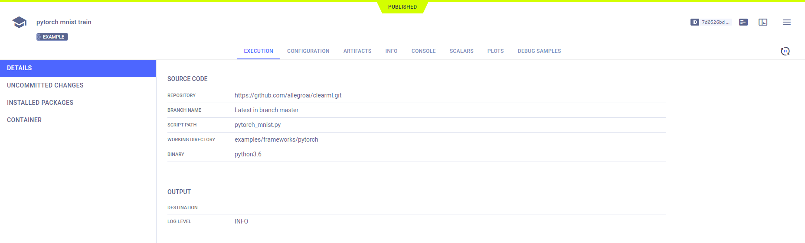
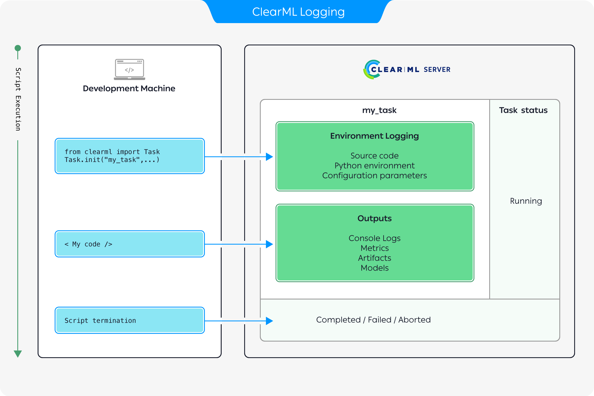
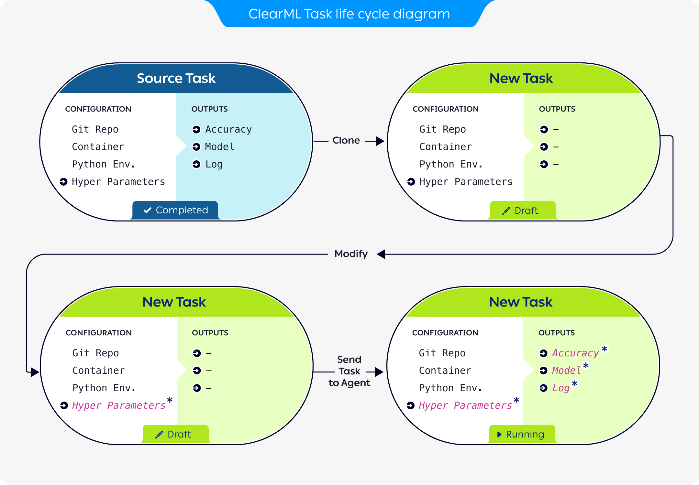

**ClearML Task** lies at the heart of ClearML's experiment manager. 

A Task is a single code execution session, which can represent an experiment, a step in a workflow, a workflow controller, 
or any custom implementation you choose.

To transform an existing script into a **ClearML Task**, one must call the [Task.init()](../references/sdk/task.md#taskinit) method 
and specify a task name and its project. This creates a Task object that automatically captures code execution 
information as well as execution outputs.

All the information captured by a task is by default uploaded to the [ClearML Server](../deploying_clearml/clearml_server.md) 
and it can be visualized in the [ClearML WebApp](../webapp/webapp_overview.md) (UI). ClearML can also be configured to upload 
model checkpoints, artifacts, and charts to cloud storage (see [Storage](../integrations/storage.md)). Additionally, 
you can work with tasks in Offline Mode, in which all information is saved in a local folder (see 
[Storing Task Data Offline](../guides/set_offline.md)).

In the UI and code, tasks are grouped into [projects](projects.md), which are logical entities similar to folders. Users can decide
how to group tasks, though different models or objectives are usually grouped into different projects.

Tasks that are in the system can be accessed and utilized with code. To [access a task](../clearml_sdk/task_sdk.md#accessing-tasks), it can be identified either by a 
project name & task name combination or by a unique ID. 

It's possible to copy ([clone](../webapp/webapp_exp_reproducing.md)) a task multiple times and to modify it for re-execution.  

## Task Sections

The sections of **ClearML Task** are made up of the information that a task captures and stores, which consists of code 
execution details and execution outputs. This information is used for tracking 
and visualizing results, reproducing, tuning, and comparing experiments, and executing workflows. 

The captured [code execution information](../webapp/webapp_exp_track_visual.md#execution) includes: 
* Git information 
* Uncommitted code modifications
* Python environment
* Execution [configuration](../webapp/webapp_exp_track_visual.md#configuration)

The captured [execution output](../webapp/webapp_exp_track_visual.md#experiment-results) includes:
* [Console output](../webapp/webapp_exp_track_visual.md#console)
* [Scalars](../webapp/webapp_exp_track_visual.md#scalars)
* [Plots](../webapp/webapp_exp_track_visual.md#plots)
* [Debug samples](../webapp/webapp_exp_track_visual.md#debug-samples)
* [Models](artifacts.md) 

To view a more in depth description of each task section, see [Tracking Experiments and Visualizing Results](../webapp/webapp_exp_track_visual.md).

### Artifacts

ClearML allows easy storage of experiments' output products as artifacts that can later be accessed easily and used, 
through the [web UI](../webapp/webapp_overview.md) or programmatically.

ClearML provides methods to easily track files generated throughout your experiments’ execution such as:

- Numpy objects 
- Pandas DataFrames
- PIL
- Files and folders
- Python objects
- and more!

Most importantly, ClearML also logs experiments’ input and output models as well as interim model snapshots (see 
[Models](artifacts.md)).

#### Logging Artifacts 
ClearML provides an explicit logging interface that supports manually reporting a variety of artifacts. Any type of 
artifact can be logged to a task using the [`Task.upload_artifact`](../references/sdk/task.md#upload_artifacts) method. 
See more details in the [Artifacts Reporting example](../guides/reporting/artifacts.md).

ClearML can be configured to upload artifacts to any of the supported types of storage, which include local and shared 
folders, AWS S3 buckets, Google Cloud Storage, and Azure Storage. For more information, see [Storage](../integrations/storage.md). 

:::note Debug Sample Storage
Debug samples are handled differently, see [`Logger.set_default_upload_destination`](../references/sdk/logger.md#set_default_upload_destination)
:::

#### Accessing Artifacts
Artifacts that have been logged can be accessed by other tasks [through the task](../clearml_sdk/task_sdk.md#accessing-tasks) 
they are attached to, and then retrieving the artifact with one of its following methods:
* `get_local_copy()` - caches the files for later use and returns a path to the cached file. 
* `get()` - use for Python objects. The method that returns the Python object.
   
See more details in the [Using Artifacts example](https://github.com/allegroai/clearml/blob/master/examples/reporting/using_artifacts_example.py).

## Task Types
Tasks have a *type* attribute, which denotes their purpose (e.g. training / testing / data processing). This helps to further 
organize projects and ensure tasks are easy to [search and find](../clearml_sdk/task_sdk.md#querying--searching-tasks). 
Available task types are: 
* *training* (default) - Training a model 
* *testing* - Testing a component, for example model performance
* *inference* - Model inference job (e.g. offline / batch model execution)
* *controller* - A task that lays out the logic for other tasks’ interactions, manual or automatic (e.g. a pipeline 
  controller) 
* *optimizer* - A specific type of controller for optimization tasks (e.g. [hyperparameter optimization](hpo.md))
* *service* - Long lasting or recurring service (e.g. server cleanup, auto ingress, sync services etc)
* *monitor* - A specific type of service for monitoring
* *application* - A task implementing  custom applicative logic, like [auto-scaler](../guides/services/aws_autoscaler.md) 
  or [clearml-session](../apps/clearml_session.md)
* *data_processing* - Any data ingress / preprocessing (see [ClearML Data](../clearml_data/clearml_data.md))
* *qc* - Quality Control (e.g. evaluating model performance vs. blind dataset)
* *custom* - A task not matching any of the above

## Task Lifecycle 

ClearML Tasks are created in one of the following methods:
* Manually running code that is instrumented with the ClearML SDK and invokes [`Task.init`](../references/sdk/task.md#taskinit).
* Cloning an existing task.
* Creating a task via CLI using [clearml-task](../apps/clearml_task.md).

### Logging Task Information

The above diagram describes how execution information is recorded when running code instrumented with ClearML:

1. Once a ClearML Task is initialized, ClearML automatically logs the complete environment information 
   including:
   * Source code
   * Python environment 
   * Configuration parameters.
1. As the execution progresses, any outputs produced are recorded including:
   * Console logs
   * Metrics and graphs 
   * Models and other artifacts
1. Once the script terminates, the task will change its status to either `Completed`, `Failed`, or `Aborted` (see [Task states](#task-states) below). 
   
All information logged can be viewed in the [task details UI](../webapp/webapp_exp_track_visual.md). 

### Cloning Tasks

The above diagram demonstrates how a previously run task can be used as a baseline for experimentation:

1. A previously run task is cloned, creating a new task, in `Draft` mode (see [Task states](#task-states) below).  
   The new task retains all the source task's configuration. The original task's outputs are not carried over.
1. The new task's configuration is modified to reflect the desired parameters for the new execution. 
1. The new task is enqueued for execution.
1. A `clearml-agent` servicing the queue pulls the new task and executes it (where ClearML again logs all the execution outputs).

## Task States

The state of a task represents its stage in the task lifecycle. It indicates whether the task is read-write (editable) or 
read-only. For each state, a state transition indicates which actions can be performed on an experiment, and the new state 
after performing an action.

The following table describes the task states and state transitions. 

| State | Description / Usage | State Transition |
|---|---|---|
| *Draft* | The experiment is editable. Only experiments in *Draft* mode are editable. The experiment is not running locally or remotely. | If the experiment is enqueued for a [worker](../fundamentals/agents_and_queues.md) to fetch and execute, the state becomes *Pending*. |
| *Pending* | The experiment was enqueued and is waiting in a queue for a worker to fetch and execute it. | If the experiment is dequeued, the state becomes *Draft*. |
| *Running* | The experiment is running locally or remotely. | If the experiment is manually or programmatically terminated, the state becomes *Aborted*. |
| *Completed* | The experiment ran and terminated successfully. | If the experiment is reset or cloned, the state of the cloned experiment or newly cloned experiment becomes *Draft*. Resetting deletes the logs and output of a previous run. Cloning creates an exact, editable copy. |
| *Failed* | The experiment ran and terminated with an error. | The same as *Completed*. |
| *Aborted* | The experiment ran, and was manually or programmatically terminated. | The same as *Completed*. |
| *Published* | The experiment is read-only. Publish an experiment to prevent changes to its inputs and outputs. | A *Published* experiment cannot be reset. If it is cloned, the state of the newly cloned experiment becomes *Draft*. |

## SDK Interface

See [the task SDK interface](../clearml_sdk/task_sdk.md) for an overview for using the most basic Pythonic methods of the `Task` class. 
See the [Task reference page](../references/sdk/task.md) for a complete list of available methods. 

