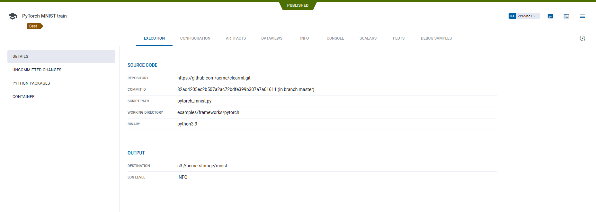

**ClearML Task** lies at the heart of ClearML's experiment manager. 

A Task is a single code execution session, which can represent an experiment, a step in a workflow, a workflow controller, 
or any custom implementation you choose.

To transform an existing script into a **ClearML Task**, one must call the [Task.init()](../references/sdk/task.md#taskinit) method 
and specify a task name and its project. This creates a Task object that automatically captures code execution 
information as well as execution outputs.

All the information captured by a task is by default uploaded to the [ClearML Server](../deploying_clearml/clearml_server.md) 
and it can be visualized in the [ClearML WebApp](../webapp/webapp_overview.md) (UI). ClearML can also be configured to upload 
model checkpoints, artifacts, and charts to cloud storage (see [Storage](../integrations/storage.md)). Additionally, 
there is an option to work with tasks in Offline Mode, in which all information is saved in a local folder (see 
[Storing Task Data Offline](../guides/set_offline.md)).

In the UI and code, tasks are grouped into [projects](projects.md), which are logical entities similar to folders. Users can decide
how to group tasks, though different models or objectives are usually grouped into different projects.

Tasks that are in the system can be accessed and utilized with code. To [access a task](#accessing-tasks), it can be identified either by a 
project name & task name combination or by a unique ID. 

It's possible to copy ([clone](../webapp/webapp_exp_reproducing.md)) a task multiple times and to modify it for re-execution.  



## Task Sections

The sections of **ClearML Task** are made up of the information that a task captures and stores, which consists of code 
execution details and execution outputs. This information is used for tracking 
and visualizing results, reproducing, tuning, and comparing experiments, and executing workflows. 

The captured [code execution information](../webapp/webapp_exp_track_visual.md#execution-details) includes: 
* Git information 
* Uncommitted code modifications
* Python environment
* Execution [configuration](../webapp/webapp_exp_track_visual.md#configuration)

The captured [execution output](../webapp/webapp_exp_track_visual.md#experiment-results) includes:
* [Console output](../webapp/webapp_exp_track_visual.md#console)
* [Scalars](../webapp/webapp_exp_track_visual.md#scalars)
* [Plots](../webapp/webapp_exp_track_visual.md#other-plots)
* [Debug samples](../webapp/webapp_exp_track_visual.md#debug-samples)
* [Models](artifacts.md#models) 

To view a more in depth description of each task section, see [Tracking Experiments and Visualizing Results](../webapp/webapp_exp_track_visual.md).

## Task Types

Tasks have a *type* attribute, which denotes their purpose (Training / Testing / Data processing). This helps to further 
organize projects and ensure tasks are easy to [search and find](#querying--searching-tasks). The default task type is *training*.
Available task types are: 
- Experimentation

    - *training*, *testing*, *inference*
    
- Other workflows
     
    - *controller*, *optimizer*
    - *monitor*, *service*, *application*
    - *data_processing*, *qc* 
    - *custom*

## Task Lifecycle 

ClearML Tasks are created in one of the following methods:
* Manually running code that is instrumented with the ClearML SDK and invokes `Task.init()`.
* Cloning an existing task.
* Creating a task via CLI using [clearml-task](../apps/clearml_task.md).

### Logging Task Information


The above diagram describes how execution information is recorded when running code instrumented with ClearML:

1. Once a ClearML Task is initialized, ClearML automatically logs the complete environment information 
   including:
   * Source code
   * Python environment 
   * Configuration parameters.
1. As the execution progresses, any outputs produced are recorded including:
   * Console logs
   * Metrics and graphs 
   * Models and other artifacts
1. Once the script terminates, the task will change its status to either `Completed`, `Failed`, or `Aborted` (see [Task states](#task-states) below). 
   
All information logged can be viewed in the [task details UI](../webapp/webapp_exp_track_visual.md). 

### Cloning Tasks


The above diagram demonstrates how a previously run task can be used as a baseline for experimentation:

1. A previously run task is cloned, creating a new task, in `Draft` mode (see [Task states](#task-states) below).  
   The new task retains all the source task's configuration. The original task's outputs are not carried over.
1. The new task's configuration is modified to reflect the desired parameters for the new execution. 
1. The new task is enqueued for execution.
1. A `clearml-agent` servicing the queue pulls the new task and executes it (where ClearML again logs all the execution outputs).

## Task States

The state of a Task represents its stage in the Task lifecycle. It indicates whether the Task is read-write (editable) or 
read-only. For each state, a state transition indicates which actions can be performed on an experiment, and the new state 
after performing an action.

The following table describes the Task states and state transitions. 

| State | Description / Usage | State Transition |
|---|---|---|
| *Draft* | The experiment is editable. Only experiments in *Draft* mode are editable. The experiment is not running locally or remotely. | If the experiment is enqueued for a [worker](../fundamentals/agents_and_queues.md) to fetch and execute, the state becomes *Pending*. |
| *Pending* | The experiment was enqueued and is waiting in a queue for a worker to fetch and execute it. | If the experiment is dequeued, the state becomes *Draft*. |
| *Running* | The experiment is running locally or remotely. | If the experiment is manually or programmatically terminated, the state becomes *Aborted*. |
| *Completed* | The experiment ran and terminated successfully. | If the experiment is reset or cloned, the state of the cloned experiment or newly cloned experiment becomes *Draft*. Resetting deletes the logs and output of a previous run. Cloning creates an exact, editable copy. |
| *Failed* | The experiment ran and terminated with an error. | The same as *Completed*. |
| *Aborted* | The experiment ran, and was manually or programmatically terminated. | The same as *Completed*. |
| *Published* | The experiment is read-only. Publish an experiment to prevent changes to its inputs and outputs. | A *Published* experiment cannot be reset. If it is cloned, the state of the newly cloned experiment becomes *Draft*. |


## Usage

### Task Creation

`Task.init()` is the main method used to create Tasks in ClearML. It will create a Task, and populate it with:
* A link to the running git repository (including commit ID and  local uncommitted changes)
* Python packages used (i.e. directly imported Python packages, and the versions available on the machine)
* Argparse arguments (default and specific to the current execution)
* Reports to Tensorboard & Matplotlib and model checkpoints.

:::note
ClearML object (e.g. task, project) names are required to be at least 3 characters long
:::

```python
from clearml import Task


task = Task.init(
    project_name='example',    # project name of at least 3 characters
    task_name='task template', # task name of at least 3 characters
    task_type=None,
    tags=None,
    reuse_last_task_id=True,
    continue_last_task=False,
    output_uri=None,
    auto_connect_arg_parser=True,
    auto_connect_frameworks=True,
    auto_resource_monitoring=True,
    auto_connect_streams=True,    
)
```

When a Task is initialized, it automatically captures parameters and outputs from supported frameworks. To control what ClearML
automatically logs, see this [FAQ](../faq.md#controlling_logging).

Once a Task is created, the Task object can be accessed from anywhere in the code by calling [`Task.current_task`](../references/sdk/task.md#taskcurrent_task).

If multiple Tasks need to be created in the same process (for example, for logging multiple manual runs), 
make sure to close a Task, before initializing a new one. To close a task simply call `task.close` 
(see example [here](../guides/advanced/multiple_tasks_single_process.md)).

When initializing a Task, its project needs to be specified. If the project entered does not exist, it will be created. 
Projects can be divided into subprojects, just like folders are broken into sub-folders.
For example:
```python
Task.init(project_name='main_project/sub_project', task_name='test')
```

Nesting projects works on multiple levels. For example: `project_name=main_project/sub_project/sub_sub_project` 


#### Task Reuse
Every `Task.init` call will create a new Task for the current execution.
In order to mitigate the clutter that a multitude of debugging Tasks might create, a Task will be reused if:
* The last time it was executed (on this machine) was under 72 hours ago (configurable, see 
  `sdk.development.task_reuse_time_window_in_hours` in the [`sdk.development` section](../configs/clearml_conf.md#sdkdevelopment) of 
  the ClearML configuration reference)
* The previous Task execution did not have any artifacts / models

It's possible to always create a new Task by passing `reuse_last_task_id=False`.

See full `Task.init` documentation [here](../references/sdk/task.md#taskinit).

### Empty Task Creation

A Task can also be created without the need to execute the code itself.
Unlike the runtime detections, all the environment and configuration details needs to be provided explicitly.

For example:
```python
task = Task.create(
    project_name='example', 
    task_name='task template',
    repo='https://github.com/allegroai/clearml.git',
    branch='master',
    script='examples/reporting/html_reporting.py',
    working_directory='.',
    docker=None,
)
```

See [`Task.create`](../references/sdk/task.md#taskcreate) in the Python SDK reference.

### Accessing Tasks
A Task can be identified by its project and name, and by a unique identifier (UUID string). The name and project of 
a Task can be changed after an experiment has been executed, but its ID can't be changed.

:::tip Locating Task IDs
To locate a task ID, go to the task's info panel in the [WebApp](../webapp/webapp_overview.md). In the top of the panel, 
to the right of the task name, click `ID` and the task ID appears
:::

Programmatically, Task objects can be retrieved by querying the system based on either the Task ID or a project and name 
combination. If a project / name combination is used, and multiple Tasks have the exact same name, the function will return
the *last modified Task*.

For example:
* Accessing a Task object with a Task ID:
```python
a_task = Task.get_task(task_id='123456deadbeef')
```
* Accessing a Task with a project / name:
```python
a_task = Task.get_task(project_name='examples', task_name='artifacts')
```

Once a Task object is obtained, it's possible to query the state of the Task, reported scalars, etc.
The Task's outputs, such as artifacts and models, can also be retrieved. 

### Querying / Searching Tasks

Searching and filtering Tasks can be done via the [web UI](../webapp/webapp_overview.md), but also programmatically.
Input search parameters into the `Task.get_tasks` method, which returns a list of Task objects that match the search. 

For example:
```python
task_list = Task.get_tasks(
    task_ids=None,  # type Optional[Sequence[str]]
    project_name=None,  # Optional[str]
    task_name=None,  # Optional[str]
    task_filter=None  # Optional[Dict]
)
```

It's possible to also filter Tasks by passing filtering rules to `task_filter`. 
  For example:
```python
task_filter={
    # only Tasks with tag `included_tag` and without tag `excluded_tag`
    'tags': ['included_tag', '-excluded_tag'],
    # filter out archived Tasks
    'system_tags': ['-archived'],
    # only completed & published Tasks
    'status': ['completed', 'published'],
    # only training type Tasks
    'type': ['training'],
    # match text in Task comment or task name
    'search_text': 'reg_exp_text'
}
```

### Cloning & Executing Tasks

Once a Task object is created, it can be a copied (cloned). `Task.clone` returns a copy of the original Task (`source_task`). 
By default, the cloned Task is added to the same project as the original, and it's called "Clone Of ORIGINAL_NAME", but 
the name / project / comment of the cloned Task can be directly overridden.

```python
cloned = Task.clone(
    source_task=task,  # type: Optional[Union[Task, str]]
    # override default name
    name='newly created task',  # type: Optional[str]
    comment=None,  # type: Optional[str]
    # insert cloned Task into a different project
    project=None,  # type: Optional[str]
)
```

A cloned Task starts in [draft](#task-states) mode, so its Task configurations can be edited (see 
[Task.set_parameters](../references/sdk/task.md#set_parameters)).
Once a Task is modified, launch it by pushing it into an execution queue, then a [ClearML Agent](../clearml_agent.md) will pull 
it from the queue and execute the Task.

```python
Task.enqueue(
    task=task,  # type: Union[Task, str]
    queue_name='default',  # type: Optional[str] 
    queue_id=None  # type: Optional[str]
)
```

See enqueue [example](https://github.com/allegroai/clearml/blob/master/examples/automation/task_piping_example.py).

### Advanced Remote Execution

A compelling workflow is:
1. Running code on the development machine for a few iterations, or just setting up the environment.
1. Moving the execution to a beefier remote machine for the actual training.

For example, to stop the current manual execution, and then re-run it on a remote machine, simply add the following 
function call to the code:
```python
task.execute_remotely(
    queue_name='default',  # type: Optional[str]
    clone=False,  # type: bool
    exit_process=True  # type: bool
)
```

Once the function is called on the machine, it will stop the local process and enqueue the current Task into the *default* 
queue. From there, an agent will be able to pick it up and launch it.

See the [Remote Execution](https://github.com/allegroai/clearml/blob/master/examples/advanced/execute_remotely_example.py) example. 

#### Remote Function Execution
A specific function can also be launched on a remote machine with `create_function_task`.

For example:
```python
def run_me_remotely(some_argument):
    print(some_argument)

a_func_task = task.create_function_task(
    func=run_me_remotely,  # type: Callable
    func_name='func_id_run_me_remotely',  # type:Optional[str]
    task_name='a func task',  # type:Optional[str]
    # everything below will be passed directly to our function as arguments
    some_argument=123
)
```
Arguments passed to the function will be automatically logged under the `Function` section in the Hyperparameters tab. 
Like any other arguments, they can be changed from the UI or programmatically.

:::note
Function Tasks must be created from within a regular Task, created by calling `Task.init()`
:::

