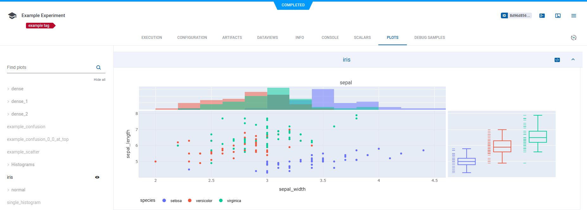

So, we've already [installed ClearML's python package](ds_first_steps.md) and ran our first experiment!

Now, we'll learn how to track Hyperparameters, Artifacts and Metrics!

## Accessing Experiments

Every previously executed experiment is stored as a Task.
A Task has a project and a name, both can be changed after the experiment has been executed.
A Task is also automatically assigned an auto-generated unique identifier (UUID string) that cannot be changed and always locates the same Task in the system.

It's possible to retrieve a Task object programmatically by querying the system based on either the Task ID,
or project & name combination. It's also possible to query tasks based on their properties, like Tags.

```python
prev_task = Task.get_task(task_id='123456deadbeef')
```

Once we have a Task object we can query the state of the Task, get its Model, scalars, parameters, etc.

## Log Hyperparameters

For full reproducibility, it's paramount to save Hyperparameters for each experiment. Since Hyperparameters can have substantial impact
on Model performance, saving and comparing these between experiments is sometimes the key to understanding model behavior.

ClearML supports logging `argparse` module arguments out of the box, so once ClearML is integrated into the code, it automatically logs all parameters provided to the argument parser.

It's also possible to log parameter dictionaries (very useful when parsing an external config file and storing as a dict object),
whole configuration files or even custom objects or [Hydra](https://hydra.cc/docs/intro/) configurations!

```python
params_dictionary = {'epochs': 3, 'lr': 0.4}
task.connect(params_dictionary)
```

Check [this](../../fundamentals/hyperparameters.md) out for all Hyperparameter logging options.

## Log Artifacts

ClearML allows you to easily store the output products of an experiment - Model snapshot / weights file, a preprocessing of your data, feature representation of data and more!

Essentially, artifacts are files (or python objects) uploaded from a script and are stored alongside the Task.
These Artifacts can be easily accessed by the web UI or programmatically.

Artifacts can be stored anywhere, either on the ClearML server, or any object storage solution or shared folder.
See all [storage capabilities](../../integrations/storage.md).


### Adding Artifacts

Uploading a local file containing the preprocessed results of the data:
```python
task.upload_artifact('/path/to/preprocess_data.csv', name='data')
```

We can also upload an entire folder with all its content by passing the folder (the folder will be zipped and uploaded as a single zip file).
```python
task.upload_artifact('/path/to/folder/', name='folder')
```

Lastly, we can upload an instance of an object; Numpy/Pandas/PIL Images are supported with npz/csv.gz/jpg formats accordingly.
If the object type is unknown ClearML pickles it and uploads the pickle file.

```python
numpy_object = np.eye(100, 100)
task.upload_artifact(name='features', artifact_object=numpy_object)
```

Check out all [artifact logging](../../clearml_sdk/task_sdk.md#artifacts) options.

### Using Artifacts

Logged Artifacts can be used by other Tasks, whether it's a pre-trained Model or processed data.
To use an Artifact, first we have to get an instance of the Task that originally created it,
then we either download it and get its path, or get the Artifact object directly.

For example, using a previously generated preprocessed data.

```python
preprocess_task = Task.get_task(task_id='preprocessing_task_id')
local_csv = preprocess_task.artifacts['data'].get_local_copy()
```

The `task.artifacts` is a dictionary where the keys are the Artifact names, and the returned object is the Artifact object.
Calling `get_local_copy()` returns a local cached copy of the artifact. Therefore, next time we execute the code, we don't
need to download the artifact again.
Calling `get()` gets a deserialized pickled object.

Check out the [artifacts retrieval](https://github.com/allegroai/clearml/blob/master/examples/reporting/artifacts_retrieval.py) example code.

### Models

Models are a special kind of artifact.
Models created by popular frameworks (such as PyTorch, TensorFlow, Scikit-learn) are automatically logged by ClearML.
All snapshots are automatically logged. In order to make sure we also automatically upload the model snapshot (instead of saving its local path),
we need to pass a storage location for the model files to be uploaded to.

For example, upload all snapshots to an S3 bucket:
```python
task = Task.init(
    project_name='examples',
    task_name='storing model',
    output_uri='s3://my_models/'
)
```

Now, whenever the framework (TensorFlow/Keras/PyTorch etc.) stores a snapshot, the model file is automatically uploaded to the bucket to a specific folder for the experiment.

Loading models by a framework is also logged by the system; these models appear in an experiment's **Artifacts** tab,
under the "Input Models" section.

Check out model snapshots examples for [TensorFlow](https://github.com/allegroai/clearml/blob/master/examples/frameworks/tensorflow/tensorflow_mnist.py),
[PyTorch](https://github.com/allegroai/clearml/blob/master/examples/frameworks/pytorch/pytorch_mnist.py),
[Keras](https://github.com/allegroai/clearml/blob/master/examples/frameworks/keras/keras_tensorboard.py),
[Scikit-Learn](https://github.com/allegroai/clearml/blob/master/examples/frameworks/scikit-learn/sklearn_joblib_example.py).

#### Loading Models
Loading a previously trained model is quite similar to loading artifacts.

```python
prev_task = Task.get_task(task_id='the_training_task')
last_snapshot = prev_task.models['output'][-1]
local_weights_path = last_snapshot.get_local_copy()
```

Like before we have to get the instance of the Task training the original weights files, then we can query the task for its output models (a list of snapshots), and get the latest snapshot.
:::note
Using TensorFlow, the snapshots are stored in a folder, meaning the `local_weights_path` will point to a folder containing our requested snapshot.
:::
As with Artifacts, all models are cached, meaning the next time we run this code, no model needs to be downloaded.
Once one of the frameworks will load the weights file, the running Task will be automatically updated with “Input Model” pointing directly to the original training Task’s Model.
This feature allows you to easily get a full genealogy of every trained and used model by your system!

## Log Metrics

Full metrics logging is the key to finding the best performing model!
By default, everything that's reported to Tensorboard & Matplotlib is automatically captured and logged.

Since not all metrics are tracked that way, it's also possible to manually report metrics using the `logger` object.

It's possible to log everything, from time series data to confusion matrices to HTML, Audio and Video, to custom plotly graphs! Everything goes!



Once everything is neatly logged and displayed, using the [comparison tool](../../webapp/webapp_exp_comparing.md) makes it easy to find the best configuration!


## Track Experiments

The experiment table is a powerful tool for creating dashboards and views of your own projects, your team's projects, or the entire development.


### Creating Leaderboards
Customize the [experiments table](../../webapp/webapp_exp_table.md) to fit your own needs, adding desired views of parameters, metrics and tags.
It's possible to filter and sort based on parameters and metrics, so creating custom views is simple and flexible.

Create a dashboard for a project, presenting the latest Models and their accuracy scores, for immediate insights.

It can also be used as a live leaderboard, showing the best performing experiments' status, updated in real time.
This is helpful to monitor your projects' progress, and share it across the organization.

Any page is sharable by copying the URL from the address bar, allowing you to bookmark leaderboards or send an exact view of a specific experiment or a comparison view.

It's also possible to tag Tasks for visibility and filtering allowing you to add more information on the execution of the experiment.
Later you can search based on task name and tag in the search bar, and filter experiments based on their tags, parameters, status and more.

## What's Next?

This covers the Basics of ClearML! Running through this guide we've learned how to log Parameters, Artifacts and Metrics!

If you want to learn more look at how we see the data science process in our [best practices](best_practices.md) page,
or check these pages out:

- Scale you work and deploy [ClearML Agents](../../clearml_agent.md)
- Develop on remote machines with [ClearML Session](../../apps/clearml_session.md)
- Structure your work and put it into [Pipelines](../../pipelines/pipelines.md)
- Improve your experiments with [Hyperparameter Optimization](../../fundamentals/hpo.md)
- Check out ClearML's integrations to [external libraries](../../integrations/libraries.md).

## YouTube Playlist

All these tips and tricks are also covered by our YouTube Getting Started series, go check it out :)

[](https://www.youtube.com/watch?v=kyOfwVg05EM&list=PLMdIlCuMqSTnoC45ME5_JnsJX0zWqDdlO&index=3)