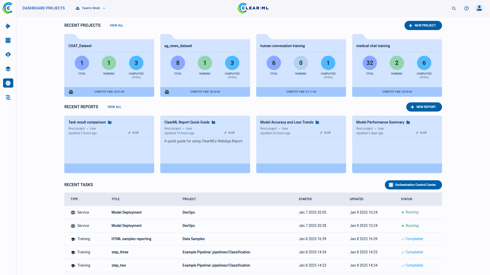

ClearML is an open source platform that automates and simplifies developing and managing machine learning solutions
for thousands of data science teams all over the world.
It is designed as an end-to-end MLOps suite allowing you to focus on developing your ML code & automation,
while ClearML ensures your work is reproducible and scalable.

## Getting Started

<iframe style={{position: 'absolute', top: '0', left: '0', bottom: '0', right: '0', width: '100%', height: '100%'}} 
        src="https://www.youtube.com/embed/s3k9ntmQmD4" 
        title="YouTube video player" 
        frameborder="0" 
        allow="accelerometer; autoplay; clipboard-write; encrypted-media; gyroscope; picture-in-picture; fullscreen" 
        allowfullscreen>
</iframe>

 
    

###  Friendly Tutorials to Get You Started

<table>
<tbody>
  <tr>
    <td><a href="https://github.com/allegroai/clearml/blob/master/docs/tutorials/Getting_Started_1_Experiment_Management.ipynb"><b>Step 1</b></a> - Experiment Management</td>
    <td className="align-center"></td>
  </tr>
  <tr>
    <td><a href="https://github.com/allegroai/clearml/blob/master/docs/tutorials/Getting_Started_2_Setting_Up_Agent.ipynb"><b>Step 2</b></a> - Remote Execution Agent Setup</td>
    <td className="align-center"></td>
  </tr>
  <tr>
    <td><a href="https://github.com/allegroai/clearml/blob/master/docs/tutorials/Getting_Started_3_Remote_Execution.ipynb"><b>Step 3</b></a> - Remotely Execute Tasks</td>
    <td className="align-center"></td>
  </tr>
</tbody>
</table>

### Read a Little More

Want a more in depth introduction to ClearML? Choose where you want to get started: 

    <ol>
        <li>
            <i>
                
            </i>
            <h4>Data Scientists</h4>
            
Learn how to use ClearML's experiment tracking and management tools, and more!

            
                <a href="getting_started/ds/ds_first_steps">START HERE</a>
            
        </li>
        <li>
            <i>
                
            </i>
            <h4>MLOps Engineers</h4>
            
Learn how to use ClearML's automation, orchestration, and tracking tools

            
                <a href="getting_started/mlops/mlops_first_steps">START HERE</a>
            
        </li>
        <li>
            <i>
                
            </i>
            <h4>DevOps Engineers</h4>
            
Learn learn how to deploy and configure a ClearML Server

            
                <a href="./deploying_clearml/clearml_server#deployment">START HERE</a>
            
        </li>
    </ol>

## What Can You Do with ClearML?

- [Track and upload](../fundamentals/task.md) metrics and models with only 2 lines of code
- [Reproduce](../webapp/webapp_exp_reproducing.md) experiments with 3 mouse clicks
- [Create bots](../guides/services/slack_alerts.md) that send you Slack messages based on experiment behavior (for example,
alert you whenever your model improves in accuracy)
- Manage your [data](../clearml_data/clearml_data.md) - store, track, and version control 
- Remotely execute experiments on any compute resource you have available with [ClearML Agent](../clearml_agent.md)  
- Automatically scale cloud instances according to your resource needs with ClearML's [GPU Compute](../webapp/applications/apps_gpu_compute.md), 
[AWS Autoscaler](../webapp/applications/apps_aws_autoscaler.md), and [GCP Autoscaler](../webapp/applications/apps_gcp_autoscaler.md)
GUI applications
- Run [hyperparameter optimization](../fundamentals/hpo.md) 
- Build [pipelines](../pipelines/pipelines.md) from code 
- Much more!

## Who We Are
ClearML is supported by you :heart: and the [clear.ml](https://clear.ml) team, which helps enterprise companies build scalable MLOps.

Join the ClearML community! Your contributions, questions, and input are always welcome. For more information, see [Community Resources](../community.md).  
