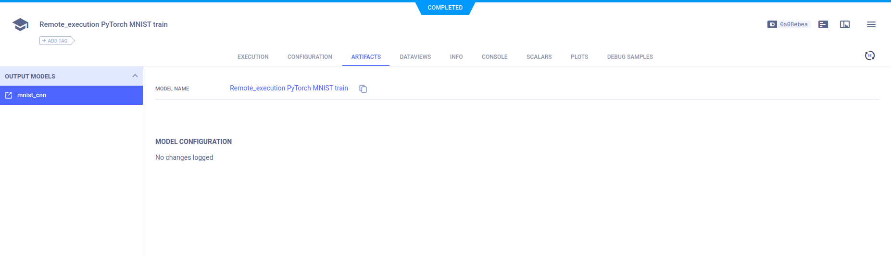

The [execute_remotely_example](https://github.com/allegroai/clearml/blob/master/examples/advanced/execute_remotely_example.py)
script demonstrates the use of the [`execute_remotely`](../../references/sdk/task.md#execute_remotely/) method. 

The script does the following: 
* Trains a simple deep neural network on the PyTorch built-in MNIST dataset.
* Uses ClearML's automatic and explicit logging.
* Creates an experiment named `remote_execution pytorch mnist train`, which is associated with the `examples` project.

## Execution Flow

The following describes the code's execution flow: 
1. The training runs for one epoch. 
1. The code passes the `execute_remotely` method which terminates the local execution of the code.
1. Execution switches to remote execution by the agent listening to queue specified in the `queue_name` parameter of the method. 

The `execute_remotely` method is especially helpful when running code on a development machine for a few iterations
to debug and to make sure the code doesn't crash, or setting up an environment. After that, the training can be 
moved to be executed by a stronger machine.

## Scalars

In the example script's `train` function, the following code explicitly reports scalars to **ClearML**:

```python
Logger.current_logger().report_scalar(
    "train", "loss", iteration=(epoch * len(train_loader) + batch_idx), value=loss.item())
```

In the `test` method, the code explicitly reports `loss` and `accuracy` scalars.

```python
Logger.current_logger().report_scalar(
    "test", "loss", iteration=epoch, value=test_loss)
Logger.current_logger().report_scalar(
    "test", "accuracy", iteration=epoch, value=(correct / len(test_loader.dataset)))
```    

These scalars can be visualized in plots, which appear in the ClearML web UI, in the experiment's
page **>** **RESULTS** **>** **SCALARS**. 


## Hyperparameters

ClearML automatically logs command line options defined with `argparse`. They appear in **CONFIGURATIONS** **>** **HYPER PARAMETERS** **>** **Args**.


## Console

Text printed to the console for training progress, as well as all other console output, appear in **RESULTS** **>** **CONSOLE**.


## Artifacts

Model artifacts associated with the experiment appear in the info panel of the **EXPERIMENTS** tab and in 
the info panel of the **MODELS** tab.  




