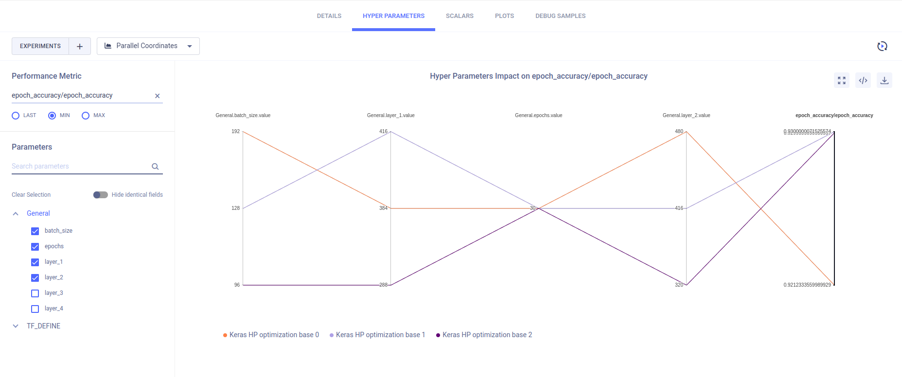

The [manual_random_param_search_example.py](https://github.com/allegroai/clearml/blob/master/examples/automation/manual_random_param_search_example.py) 
script demonstrates a random parameter search by automating the execution of an experiment multiple times, each time with 
a different set of random hyperparameters. 

This example accomplishes the automated random parameter search by doing the following:

1. Creating a template Task named `Keras HP optimization base`. To create it, run the [base_template_keras_simple.py](https://github.com/allegroai/clearml/blob/master/examples/optimization/hyper-parameter-optimization/base_template_keras_simple.py)
script. This experiment must be executed first, so it will be stored in the server, and then it can be accessed, cloned, 
   and modified by another Task. 
1. Creating a parameter dictionary, which is connected to the Task by calling [Task.connect](../../references/sdk/task.md#connect) 
   so that the parameters are logged by ClearML.
1. Adding the random search hyperparameters and parameters defining the search (e.g., the experiment name, and number of 
   times to run the experiment).
1. Creating a Task object referencing the template experiment, `Keras HP optimization base`. See [Task.get_task](../../references/sdk/task.md#taskget_task).
1. For each set of parameters:
    1. Cloning the Task object. See [Task.clone](../../references/sdk/task.md#taskclone).
    1. Getting the newly cloned Task's parameters. See [Task.get_parameters](../../references/sdk/task.md#get_parameters)
    1. Setting the newly cloned Task's parameters to the search values in the parameter dictionary (Step 1). See [Task.set_parameters](../../references/sdk/task.md#set_parameters).
    1. Enqueuing the newly cloned Task to execute. See [Task.enqueue](../../references/sdk/task.md#taskenqueue).

When the example script runs, it creates an experiment named `Random Hyper-Parameter Search Example` in
the `examples` project. This starts the parameter search, and creates the experiments:

* `Keras HP optimization base 0`
* `Keras HP optimization base 1`
* `Keras HP optimization base 2`.

When these experiments are completed, their [results can be compared](../../webapp/webapp_exp_comparing.md).

