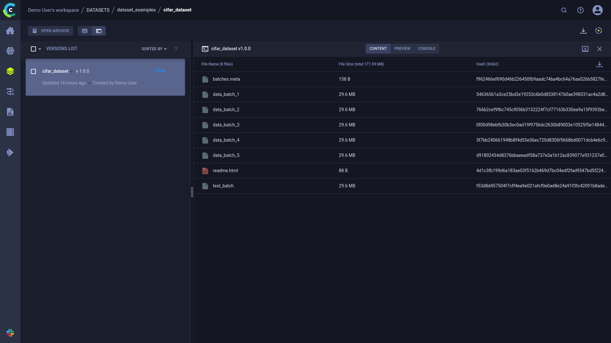

In this tutorial, we are going to manage the CIFAR dataset with `clearml-data` CLI, and then use ClearML's [`Dataset`](../../references/sdk/dataset.md) 
class to ingest the data.

## Creating the Dataset

### Downloading the Data
Before we can register the CIFAR dataset with `clearml-data`, we need to obtain a local copy of it.

Execute this python script to download the data
```python
from clearml import StorageManager

manager = StorageManager()
dataset_path = manager.get_local_copy(
    remote_url="https://www.cs.toronto.edu/~kriz/cifar-10-python.tar.gz"
)
# make sure to copy the printed value
print("COPY THIS DATASET PATH: {}".format(dataset_path))
```

Expected response:
```bash
COPY THIS DATASET PATH: ~/.clearml/cache/storage_manager/global/f2751d3a22ccb78db0e07874912b5c43.cifar-10-python_artifacts_archive_None
```
The script prints the path to the downloaded data. It will be needed later on.

### Creating the Dataset
To create the dataset, execute the following command:
 ```
 clearml-data create --project dataset_examples --name cifar_dataset
 ```

Expected response:
```
clearml-data - Dataset Management & Versioning CLI 
Creating a new dataset: 
New dataset created id=ee1c35f60f384e65bc800f42f0aca5ec
```
Where `ee1c35f60f384e65bc800f42f0aca5ec` is the dataset ID.

## Adding Files
Add the files we just downloaded to the dataset: 

```
clearml-data add --files <dataset_path>
```

where `dataset_path` is the path that was printed earlier, which denotes the location of the downloaded dataset.

:::note
There's no need to specify a `dataset_id`, since the `clearml-data` session stores it.
:::

## Finalizing the Dataset
Run the [`close`](../../references/sdk/dataset.md#close) command to upload the files (it'll be uploaded to ClearML Server by default):<br/>

```
clearml-data close 
```

This command sets the dataset task's status to *completed*, so it will no longer be modifiable. This ensures future
reproducibility. 

Information about the dataset can be viewed in the WebApp, in the dataset's [details panel](../../webapp/datasets/webapp_dataset_viewing.md#version-details-panel). 
In the panel's **CONTENT** tab, you can see a table summarizing version contents, including file names, file sizes, and hashes.



## Using the Dataset

Now that we have a new dataset registered, we can consume it.

The [data_ingestion.py](https://github.com/allegroai/clearml/blob/master/examples/datasets/data_ingestion.py) example 
script demonstrates using the dataset within Python code.

```python
dataset_name = "cifar_dataset"
dataset_project = "dataset_examples"

from clearml import Dataset

dataset_path = Dataset.get(
    dataset_name=dataset_name, 
    dataset_project=dataset_project,
    alias="Cifar dataset"
).get_local_copy()

trainset = datasets.CIFAR10(
    root=dataset_path,
    train=True,
    download=False,
    transform=transform
)
```

In cases like this, where you use a dataset in a task, you can have the dataset's ID stored in the task’s 
hyperparameters. Passing `alias=<dataset_alias_string>` stores the dataset’s ID in the 
`dataset_alias_string` parameter in the experiment's **CONFIGURATION > HYPERPARAMETERS > Datasets** section. This way 
you can easily track which dataset the task is using. 

The Dataset's [`get_local_copy`](../../references/sdk/dataset.md#get_local_copy) method will return a path to the cached, 
downloaded dataset. Then we provide the path to PyTorch's dataset object.

The script then trains a neural network to classify images using the dataset created above.