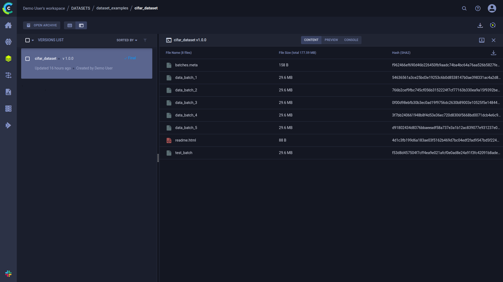

The [dataset_creation.py](https://github.com/allegroai/clearml/blob/master/examples/datasets/dataset_creation.py) and 
[data_ingestion.py](https://github.com/allegroai/clearml/blob/master/examples/datasets/data_ingestion.py) 
together demonstrate how to use ClearML's [`Dataset`](../../references/sdk/dataset.md) class to create a dataset and 
subsequently ingest the data. 

## Dataset Creation

The [dataset_creation.py](https://github.com/allegroai/clearml/blob/master/examples/datasets/dataset_creation.py) script 
demonstrates how to do the following:
* Create a dataset and add files to it
* Upload the dataset to the ClearML Server
* Finalize the dataset


### Downloading the Data

We first need to obtain a local copy of the CIFAR dataset.

 ```python
 from clearml import StorageManager

 manager = StorageManager()
 dataset_path = manager.get_local_copy(
     remote_url="https://www.cs.toronto.edu/~kriz/cifar-10-python.tar.gz"
 )
```

This script downloads the data and `dataset_path` contains the path to the downloaded data. 

### Creating the Dataset

```python
from clearml import Dataset

dataset = Dataset.create(dataset_name="cifar_dataset", dataset_project="dataset examples" )
 ```

This creates a data processing task called `cifar_dataset` in the `dataset examples` project, which
can be viewed in the WebApp.

### Adding Files

```python
dataset.add_files(path=dataset_path)
```

This adds the downloaded files to the current dataset.  

### Uploading the Files

```python
dataset.upload()
```
This uploads the dataset to the ClearML Server by default. The dataset's destination can be changed by specifying the 
target storage with the `output_url` parameter of the [`upload`](../../references/sdk/dataset.md#upload) method. 

### Finalizing the Dataset

Run the [`finalize`](../../references/sdk/dataset.md#finalize) command to close the dataset and set that dataset's tasks
status to *completed*. The dataset can only be finalized if it doesn't have any pending uploads. 

```python
dataset.finalize()
```

After a dataset has been closed, it can no longer be modified. This ensures future reproducibility. 

The information about the dataset, including a list of files and their sizes, can be viewed
in the WebApp, in the dataset task's **ARTIFACTS** tab.



## Data Ingestion

Now that we have a new dataset registered, we can consume it!

The [data_ingestion.py](https://github.com/allegroai/clearml/blob/master/examples/datasets/data_ingestion.py) script 
demonstrates data ingestion using the dataset created in the first script.

```python
dataset_name = "cifar_dataset"
dataset_project = "dataset_examples"

dataset_path = Dataset.get(
    dataset_name=dataset_name, 
    dataset_project=dataset_project
).get_local_copy()
```

The script above gets the dataset and uses the [`Dataset.get_local_copy`](../../references/sdk/dataset.md#get_local_copy) 
method to return a path to the cached, read-only local dataset. 

If you need a modifiable copy of the dataset, use the following: 
```python
Dataset.get(dataset_name, dataset_project).get_mutable_local_copy("path/to/download")
```

The script then creates a neural network to train a model to classify images from the dataset that was
created above.