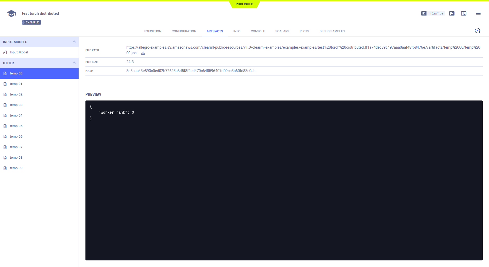
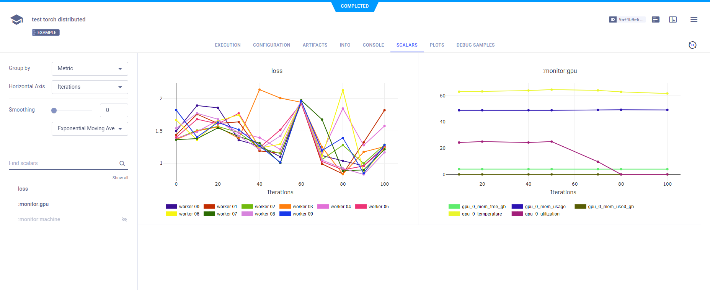
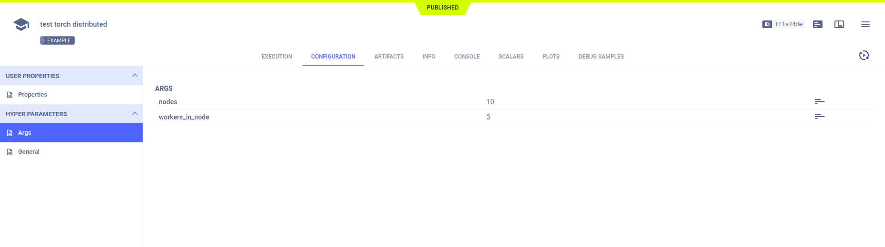
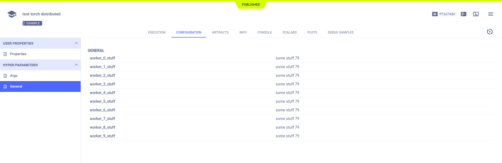
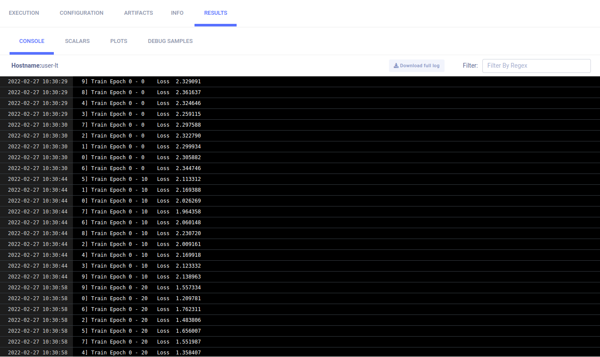

The [pytorch_distributed_example.py](https://github.com/allegroai/clearml/blob/master/examples/frameworks/pytorch/pytorch_distributed_example.py) 
script demonstrates integrating ClearML into code that uses the [PyTorch Distributed Communications Package](https://pytorch.org/docs/stable/distributed.html) 
(`torch.distributed`). 

The script initializes a main Task and spawns subprocesses, each for an instance of that Task. 
The Task in each subprocess trains a neural network over a partitioned dataset (the torchvision built-in [MNIST](https://pytorch.org/vision/stable/datasets.html#mnist) 
dataset), and reports (uploads) the following to the main Task:

* Artifacts - A dictionary containing different key-value pairs.
* Scalars - Loss reported as a scalar during training in each Task in a subprocess.
* Hyperparameters - Hyperparameters created in each Task are added to the hyperparameters in the main Task.

Each Task in a subprocess references the main Task by calling [Task.current_task](../../references/sdk/task.md#taskcurrent_task), which always returns 
the main Task.

When the script runs, it creates an experiment named `test torch distributed`, which is associated with the `examples` project.

## Artifacts

The example uploads a dictionary as an artifact in the main Task by calling the [Task.upload_artifact](../../references/sdk/task.md#upload_artifact) 
method on [`Task.current_task`](../../references/sdk/task.md#taskcurrent_task) (the main Task). The dictionary contains the [`dist.rank`](https://pytorch.org/docs/stable/distributed.html#torch.distributed.get_rank) 
of the subprocess, making each unique.

```python
Task.current_task().upload_artifact(
    'temp {:02d}'.format(dist.get_rank()), 
    artifact_object={'worker_rank': dist.get_rank()}
)
```

All of these artifacts appear in the main Task under **ARTIFACTS** **>** **OTHER**.



## Scalars

Loss is reported to the main Task by calling the [Logger.report_scalar](../../references/sdk/logger.md#report_scalar) 
method on `Task.current_task().get_logger`, which is the logger for the main Task. Since `Logger.report_scalar` is called 
with the same title (`loss`), but a different series name (containing the subprocess' `rank`), all loss scalar series are 
logged together.

```python
Task.current_task().get_logger().report_scalar(
    'loss', 
    'worker {:02d}'.format(dist.get_rank()), 
    value=loss.item(), 
    iteration=i
)
```

The single scalar plot for loss appears in **SCALARS**.



## Hyperparameters

ClearML automatically logs the argparse command line options. Since the [`Task.connect`](../../references/sdk/task.md#connect) 
method is called on [`Task.current_task`](../../references/sdk/task.md#taskcurrent_task), they are logged in the main Task. A different hyperparameter key is used in each 
subprocess, so they do not overwrite each other in the main Task.

```python
param = {'worker_{}_stuff'.format(dist.get_rank()): 'some stuff ' + str(randint(0, 100))}
Task.current_task().connect(param)
```

All the hyperparameters appear in **CONFIGURATION** **>** **HYPERPARAMETERS**.





## Console

Output to the console, including the text messages printed from the main Task object and each subprocess appear in **CONSOLE**.

