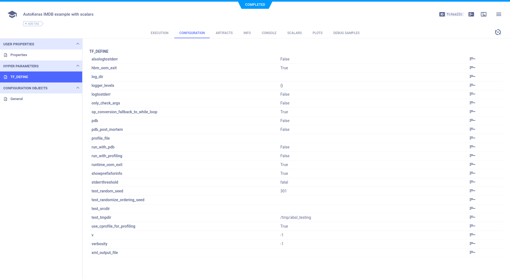
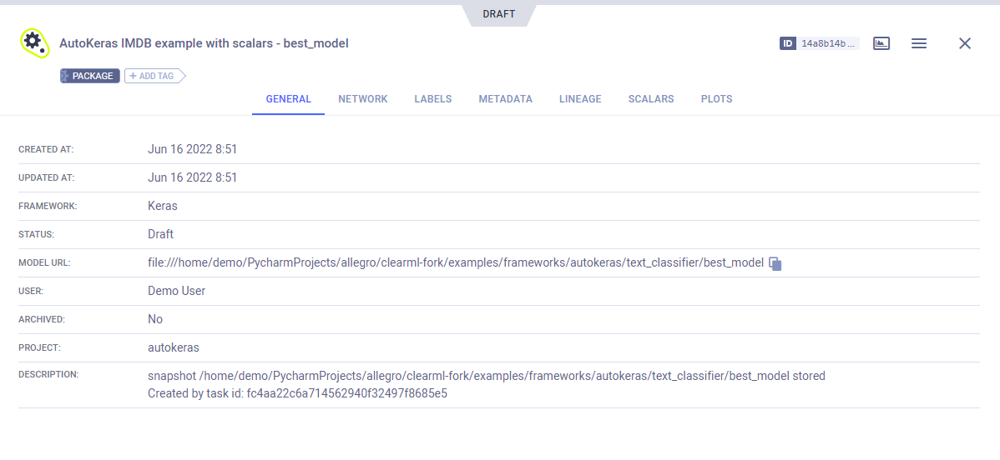

The [autokeras_imdb_example.py](https://github.com/allegroai/clearml/blob/master/examples/frameworks/autokeras/autokeras_imdb_example.py) example 
script demonstrates the integration of ClearML into code, which uses [autokeras](https://github.com/keras-team/autokeras). 

The example does the following: 
* Trains text classification networks on the Keras built-in [IMDB](https://keras.io/api/datasets/imdb/) dataset, using 
the autokeras [TextClassifier](https://autokeras.com/text_classifier/) class, and searches for the best model. 
* Uses two TensorBoard callbacks, one for training and one for testing. 
* ClearML automatically logs everything the code sends to TensorBoard. 
* Creates an experiment named `autokeras imdb example with scalars`, which is associated with the `autokeras` project.

## Scalars

The loss and accuracy metric scalar plots appear in **SCALARS**, along with the resource utilization plots, 
which are titled **:monitor: machine**.

## Hyperparameters

ClearML automatically logs TensorFlow Definitions. They appear in **CONFIGURATION** **>** **HYPERPARAMETERS** **>** **TF_DEFINE**.

## Console

Text printed to the console for training progress, as well as all other console output, appear in **CONSOLE**.

## Artifacts

Models created by the experiment appear in the experiment’s **ARTIFACTS** tab.

Clicking on the model's name takes you to the [model’s page](../../../webapp/webapp_model_viewing.md), where you can view 
the model’s details and access the model.

