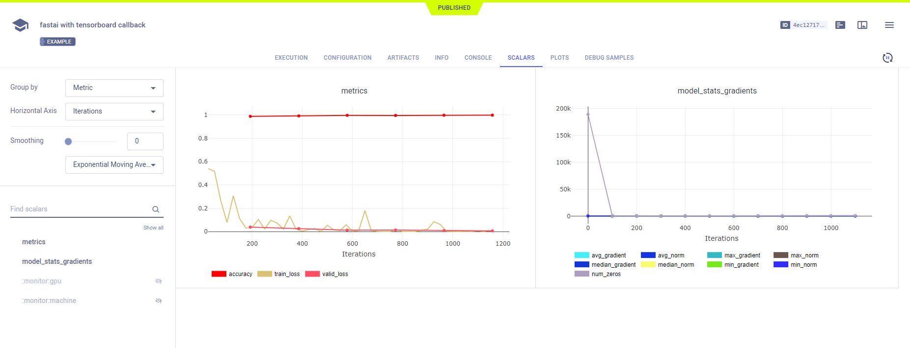

The [fastai_with_tensorboard.py](https://github.com/allegroai/clearml/blob/master/examples/frameworks/fastai/fastai_with_tensorboard.py) 
example demonstrates the integration of **ClearML** into code that uses fastai and TensorBoard. 

The example code does the following:
1. Trains a simple deep neural network on the fastai built-in MNIST dataset (see the [fast.ai](https://docs.fast.ai) documentation).
1. Uses the fastai `LearnerTensorboardWriter` callback, and **ClearML** automatically logs TensorBoard through the callback. 
1. During script execution, creates an experiment named `fastai with tensorboard callback`, which is associated with the `examples` project.

## Scalars

**ClearML** automatically logs the histogram output to TensorBoard. They appear in **RESULTS** **>** **PLOTS**.

## Plots

Histograms output to TensorBoard. They appear in **RESULTS** **>** **PLOTS**.

## Logs

Text printed to the console for training progress, as well as all other console output, appear in **RESULTS** **>** **CONSOLE**.

