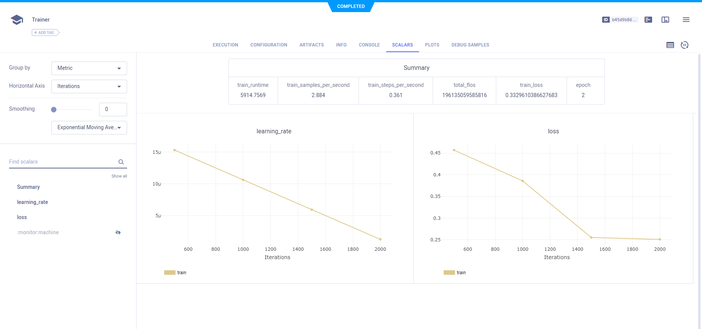

The [HuggingFace Transformers example](https://github.com/allegroai/clearml/blob/master/examples/frameworks/huggingface/transformers.ipynb)
demonstrates how to integrate ClearML into your Transformer's PyTorch [Trainer](https://huggingface.co/docs/transformers/v4.34.1/en/main_classes/trainer) 
code. When ClearML is installed, the Trainer by default uses the built-in [`ClearMLCallback`](https://huggingface.co/docs/transformers/v4.34.1/en/main_classes/callback#transformers.integrations.ClearMLCallback),
so ClearML automatically logs Transformers models, parameters, scalars, and more. 

In the example, ClearML is installed and set up in the training environment. This way ClearML can log models, 
parameters, scalars, and more.

When the example runs, it creates a ClearML task called "Trainer" in the "HuggingFace Transformers" projects. To change the task’s name 
or project, use the `CLEARML_PROJECT` and `CLEARML_TASK` environment variables.

For more information about integrating ClearML into your Transformers code, see [HuggingFace Transformers](../../../integrations/transformers.md).

## WebApp

### Hyperparameters

ClearML automatically captures all the PyTorch trainer [parameters](https://huggingface.co/docs/transformers/v4.34.1/en/main_classes/trainer#transformers.TrainingArguments). 
Notice in the code example that only a few of the `TrainingArguments` are explicitly set:

```python
training_args = TrainingArguments(
     output_dir="path/to/save/folder/",
     learning_rate=2e-5,
     per_device_train_batch_size=8,
     per_device_eval_batch_size=8,
     num_train_epochs=2,
)
```

ClearML captures the arguments specified in the preceding code, as well the rest of the `TrainingArguments` and their default
values. 

View the parameters in the experiment's **CONFIGURATION** tab **> Hyperparameters** section.


### Models 

In order for ClearML to log the models created during training, the `CLEARML_LOG_MODEL` environment variable is set to `True`. 

ClearML automatically captures the model snapshots created by the Trainer, and saves them as artifacts. View the snapshots in the 
experiment's **ARTIFACTS** tab.


### Scalars

ClearML automatically captures the Trainer's scalars, which can be viewed in the experiment's **Scalars** tab.




