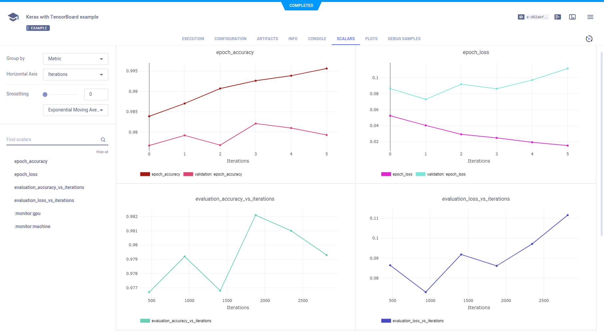
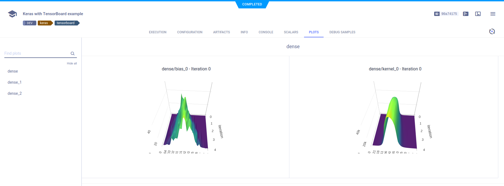
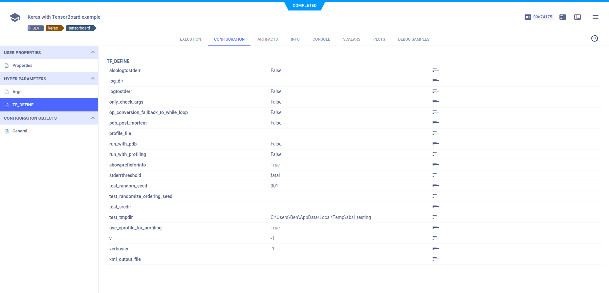
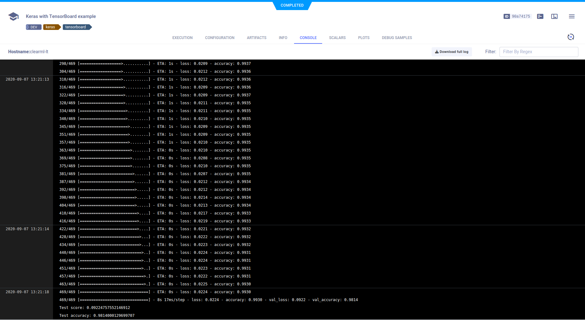
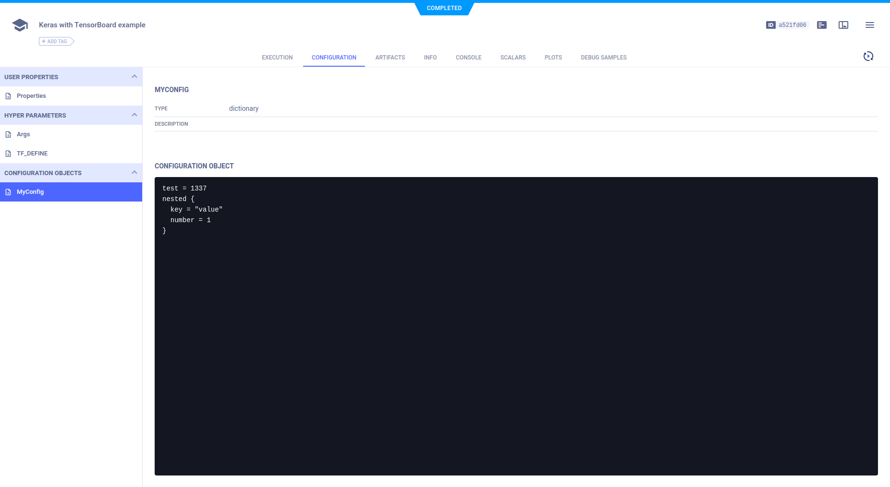

The [ClearML_keras_TB_example.ipynb](https://github.com/allegroai/clearml/blob/master/examples/frameworks/keras/jupyter_keras_TB_example.ipynb) 
example demonstrates **ClearML** automatically logging code, which is running in Jupyter Notebook and is using Keras and TensorBoard. 

The example script does the following:
1. Trains a simple deep neural network on the Keras built-in [MNIST](https://keras.io/api/datasets/mnist/#load_data-function) 
   dataset.
1. Builds a sequential model using a categorical crossentropy loss objective function.
1. Specifies accuracy as the metric, and uses two callbacks: a TensorBoard callback and a model checkpoint callback.
1. During script execution, creates an experiment named `Keras with TensorBoard example` which is associated with the `Colab notebooks` project.

:::note
In the ``clearml`` GitHub repository, this example includes a clickable icon to open the notebook in Google Colab.
:::

## Scalars

The loss and accuracy metric scalar plots appear in **RESULTS** **>** **SCALARS**, along with the resource utilization plots, 
which are titled **:monitor: machine**.

## Histograms

Histograms for layer density appear in **RESULTS** **>** **PLOTS**.

## Hyperparameters

**ClearML** automatically logs TensorFlow Definitions, which appear in **CONFIGURATIONS** **>** **HYPER PARAMETERS** **>** **TF_DEFINE**.

## Log

Text printed to the console for training progress, as well as all other console output, appear in **RESULTS** **>** **CONSOLE**.

## Configuration objects

The configuration appears in **CONFIGURATIONS** **>** **CONFIGURATION OBJECTS** **>** **General**. 

