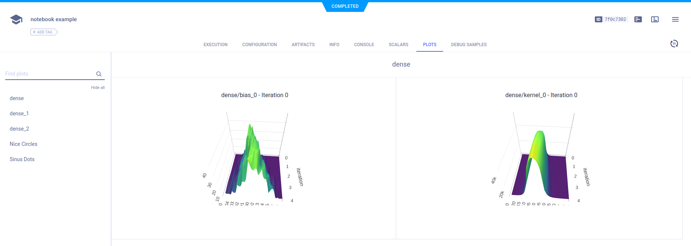
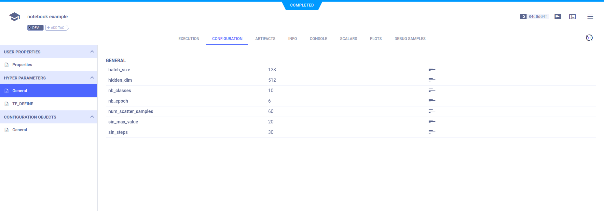
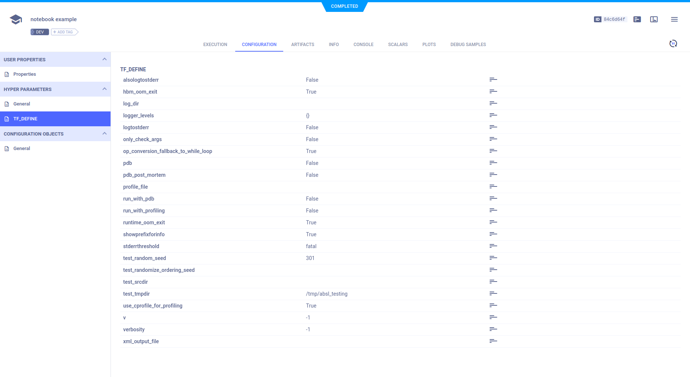
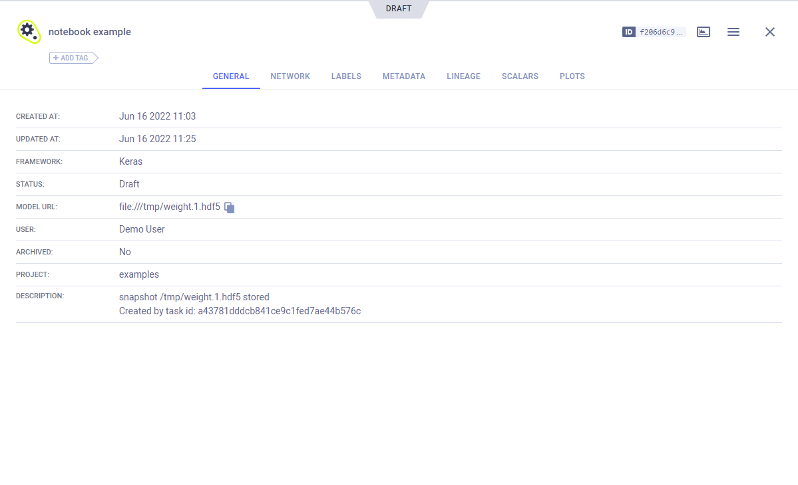

The [jupyter.ipynb](https://github.com/allegroai/clearml/blob/master/examples/frameworks/keras/jupyter.ipynb) example 
demonstrates ClearML's automatic logging of code running in a Jupyter Notebook that uses Keras and Matplotlib. 

The example does the following: 
1. Trains a simple deep neural network on the Keras built-in [MNIST](https://keras.io/api/datasets/mnist/#load_data-function) 
   dataset.
1. Builds a sequential model using a categorical cross entropy loss objective function. 
   
1. Specifies accuracy as the metric, and uses two callbacks: a TensorBoard callback and a model checkpoint callback. 
   
1. During script execution, creates an experiment named `notebook example` which is associated with the `examples` project.

## Scalars

The loss and accuracy metric scalar plots appear in **SCALARS**, along with the resource utilization plots, which are titled **:monitor: machine**.


## Plots

The example calls Matplotlib methods to create several sample plots, and TensorBoard methods to plot histograms for layer density. 
They appear in **PLOTS**.




## Debug Samples

The example calls Matplotlib methods to log debug sample images. They appear in **DEBUG SAMPLES**.


## Hyperparameters

ClearML automatically logs TensorFlow Definitions. A parameter dictionary is logged by connecting it to the Task, by 
calling the [Task.connect](../../../references/sdk/task.md#connect) method. 

```python
task_params = {'num_scatter_samples': 60, 'sin_max_value': 20, 'sin_steps': 30}
task_params = task.connect(task_params)
```
Later in the Jupyter Notebook, more parameters are added to the dictionary.

```python
task_params['batch_size'] = 128
task_params['nb_classes'] = 10
task_params['nb_epoch'] = 6
task_params['hidden_dim'] = 512
```

Parameter dictionaries appear in **CONFIGURATION** **>** **HYPER PARAMETERS** **>** **General**.



The TensorFlow Definitions appear in the **TF_DEFINE** subsection.



## Console

Text printed to the console for training appears in **CONSOLE**.


## Artifacts

Model artifacts associated with the experiment appear in the experiment info panel (in the **EXPERIMENTS** tab), and in the model info panel (in the **MODELS** tab).  

The experiment info panel shows model tracking, including the model name and design in **ARTIFACTS** **>** **Output Model**.


The model info panel contains the model details, including the model URL, framework, and snapshot locations.

