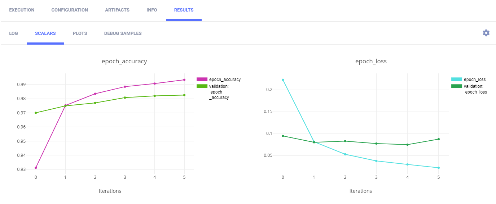
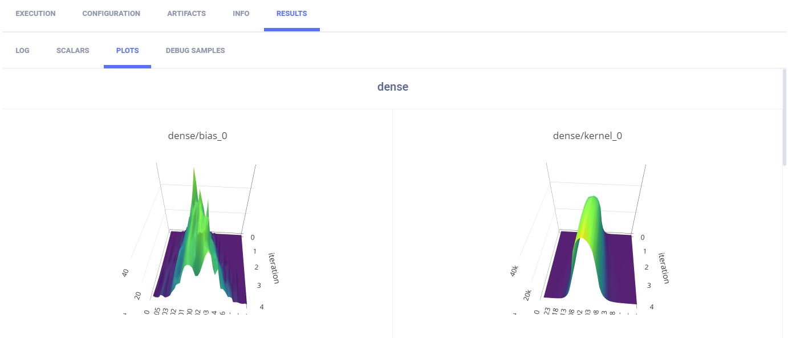
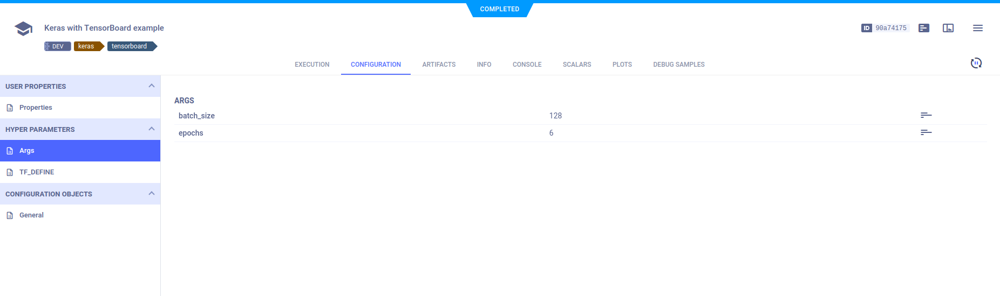
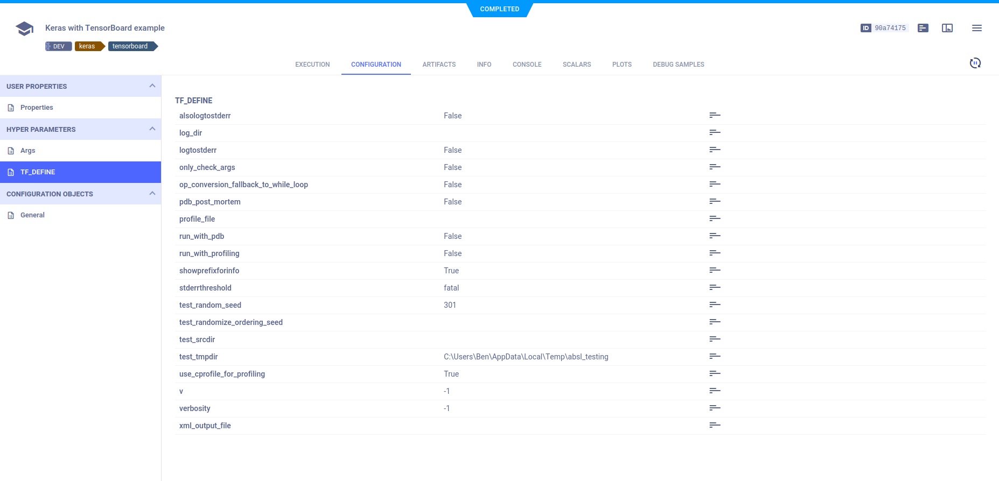
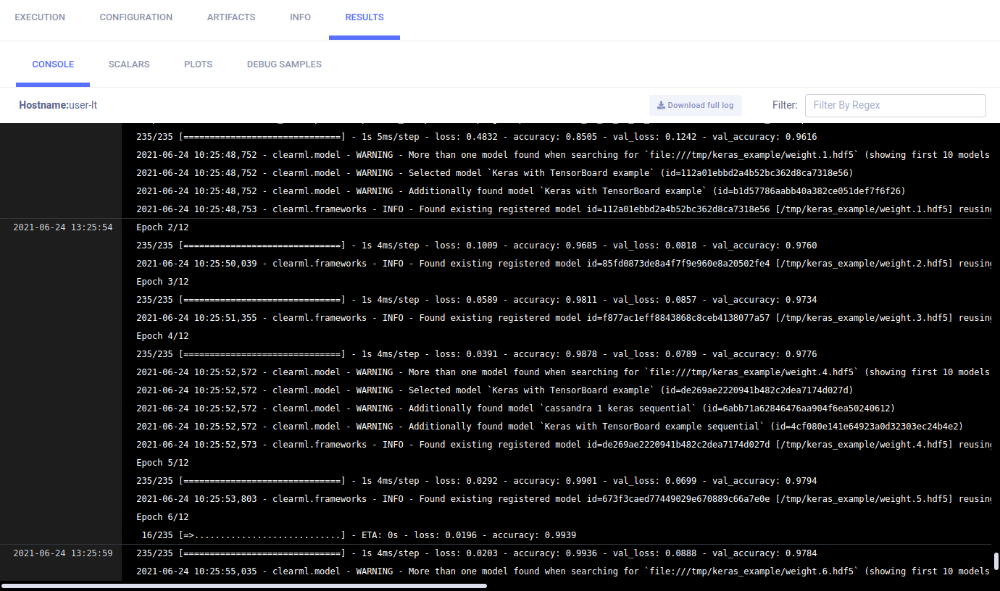
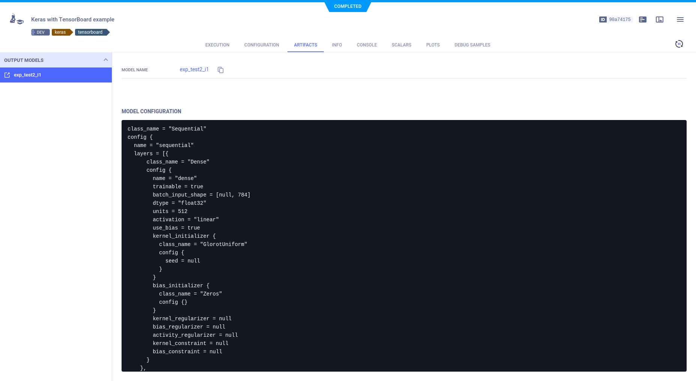

The example below demonstrates the integration of ClearML into code which uses Keras and TensorBoard.
View it in [script](https://github.com/allegroai/clearml/blob/master/examples/frameworks/keras/keras_tensorboard.py)
or in [Jupyter Notebook](https://github.com/allegroai/clearml/blob/master/examples/frameworks/keras/jupyter_keras_TB_example.ipynb).

:::note
The example in [Jupyter Notebook](https://github.com/allegroai/clearml/blob/master/examples/frameworks/keras/jupyter_keras_TB_example.ipynb) 
includes a clickable icon to open the notebook in Google Colab.
:::

The example script does the following:
1. Trains a simple deep neural network on the Keras built-in [MNIST](https://keras.io/api/datasets/mnist/#load_data-function) 
   dataset.
1. Builds a sequential model using a categorical cross entropy loss objective function.
1. Specifies accuracy as the metric, and uses two callbacks: a TensorBoard callback and a model checkpoint callback.
1. During script execution, creates an experiment named `Keras with TensorBoard example`, which is associated with the 
   `examples` project (in script) or the `Colab notebooks` project (in Jupyter Notebook) .


## Scalars

The loss and accuracy metric scalar plots appear in **SCALARS**, along with the resource utilization plots, 
which are titled **:monitor: machine**.



## Histograms

Histograms for layer density appear in **PLOTS**.



## Hyperparameters

ClearML automatically logs command line options generated with `argparse`, and TensorFlow Definitions.

Command line options appear in **CONFIGURATION** **>** **HYPER PARAMETERS** **>** **Args**.



TensorFlow Definitions appear in **TF_DEFINE**.



## Console

Text printed to the console for training progress, as well as all other console output, appear in **CONSOLE**.



## Configuration Objects

In the experiment code, a configuration dictionary is connected to the Task by calling the [`Task.connect`](../../../references/sdk/task.md#connect) 
method. 

```python
task.connect_configuration(
   name="MyConfig" 
   configuration={'test': 1337, 'nested': {'key': 'value', 'number': 1}}
)
```

It appears in **CONFIGURATION** **>** **CONFIGURATION OBJECTS** **>** **MyConfig**. 

