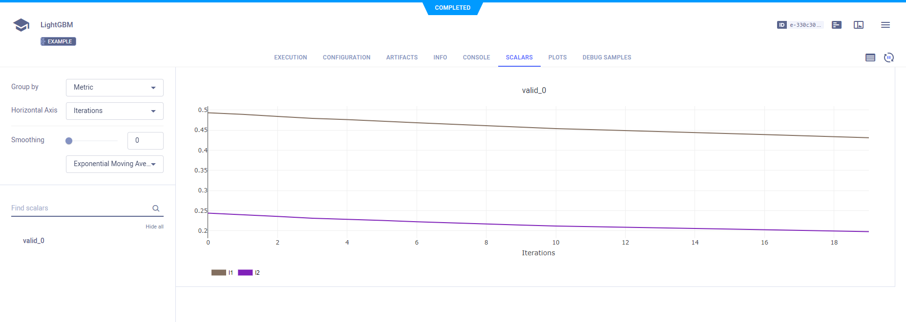

The [lightgbm_example](https://github.com/allegroai/clearml/blob/master/examples/frameworks/lightgbm/lightgbm_example.py) 
script demonstrates the integration of ClearML into code that uses LightGBM. 

The example script does the following: 
* Creates a dataset for LightGBM to train a model
* Specifies configuration which are automatically captured by ClearML
* Saves model which ClearML automatically captures
* Creates an experiment named `LightGBM`, which is associated with the `examples` project.

## Scalars

The scalars logged in the experiment can be visualized in a plot, which appears in the ClearML web UI, in the **experiment's page > SCALARS**.

## Hyperparameters

ClearML automatically logs the configurations applied to LightGBM. They appear in **CONFIGURATIONS > HYPERPARAMETERS > GENERAL**.

## Artifacts

Models created by the experiment appear in the experiment’s **ARTIFACTS** tab. ClearML automatically logs and tracks 
models and any snapshots created using LightGBM. 

## Console

All other console output appears in **CONSOLE**.

