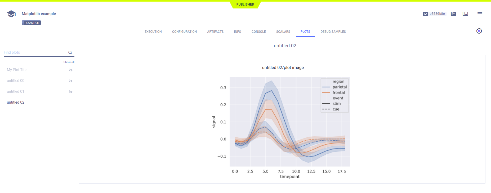

The [jupyter_matplotlib_example.ipynb](https://github.com/allegroai/clearml/blob/master/examples/frameworks/matplotlib/jupyter_matplotlib_example.ipynb) 
example demonstrates the integration of **ClearML** into code running in Jupyter Notebook, which uses `matplotlib` to plot 
scatter diagrams, and show images. **ClearML** automatically logs the diagrams and images. When the script runs, ClearML 
creates an experiment named `Matplotlib example` which is associated with the `Colab notebooks` project.

:::note 
In the ``clearml`` GitHub repository, this example includes a clickable icon to open the notebook in Google Colab.
:::

## Plots

The scatter plots appear in the **ClearML Web UI**, in **RESULTS** **>** **PLOTS**.

## Debug samples

The images appear in **RESULTS** **>** **DEBUG SAMPLES**. Each debug sample image is associated with a metric.

View the debug sample in the image viewer.

