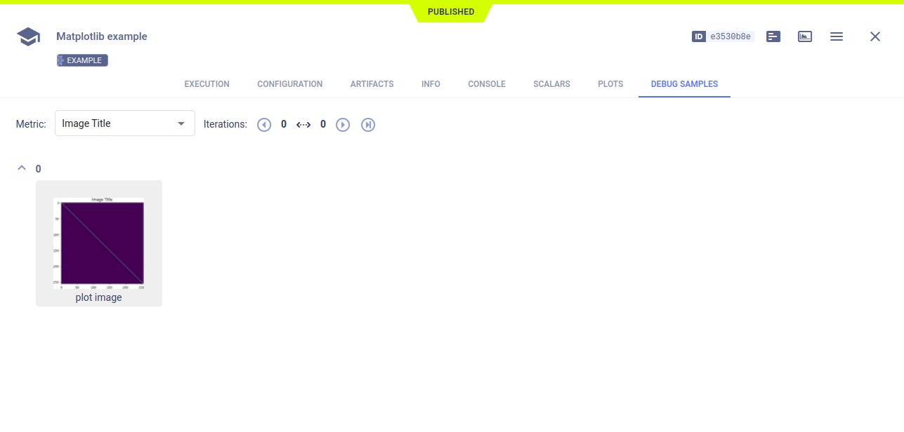

The [matplotlib_example.py](https://github.com/allegroai/clearml/blob/master/examples/frameworks/matplotlib/matplotlib_example.py) 
example demonstrates integrating **ClearML** into code that uses `matplotlib` to plot scatter diagrams, and show images. 
**ClearML** automatically logs the diagrams and images. When the script runs, it creates an experiment named `Matplotlib example`, 
which is associated with the `examples` project.

## Plots

The scatter plots appear in the **ClearML Web UI**, in **RESULTS** **>** **PLOTS**.

## Debug Samples

The images appear in **RESULTS** **>** **DEBUG SAMPLES**. Each debug sample image is associated with a metric.

View the debug sample in the image viewer.

