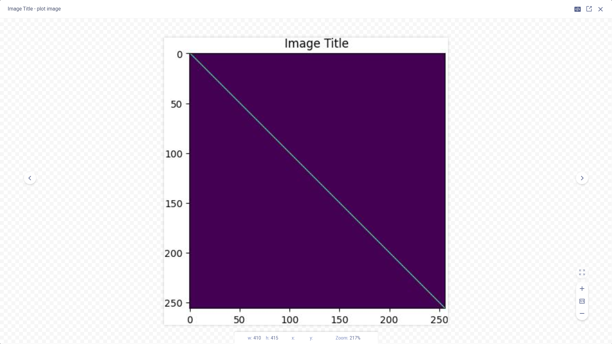

The example below demonstrates integrating ClearML into code that uses `matplotlib` to plot scatter diagrams, and 
show images. ClearML automatically logs the diagrams and images. 

View the example in [script](https://github.com/allegroai/clearml/blob/master/examples/frameworks/matplotlib/matplotlib_example.py) 
or in [Jupyter Notebook](https://github.com/allegroai/clearml/blob/master/examples/frameworks/matplotlib/jupyter_matplotlib_example.ipynb).

:::note 
The example in [Jupyter Notebook](https://github.com/allegroai/clearml/blob/master/examples/frameworks/matplotlib/jupyter_matplotlib_example.ipynb) 
includes a clickable icon to open the notebook in Google Colab.
:::

When the example runs, it creates an experiment named `Matplotlib example`
in the `examples` project (in script) or the `Colab notebooks` project (in Jupyter Notebook).

## Plots

The scatter plots appear in the **ClearML Web UI**, in **PLOTS**.

## Debug Samples

The images appear in **DEBUG SAMPLES**. Each debug sample image is associated with a metric.

View the debug sample in the image viewer.

