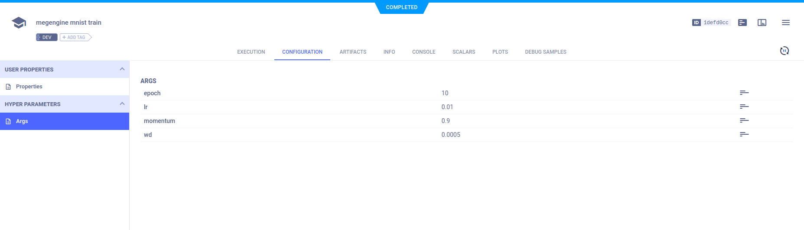
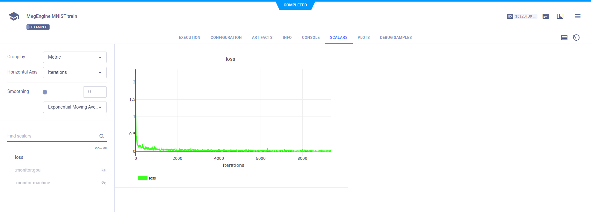
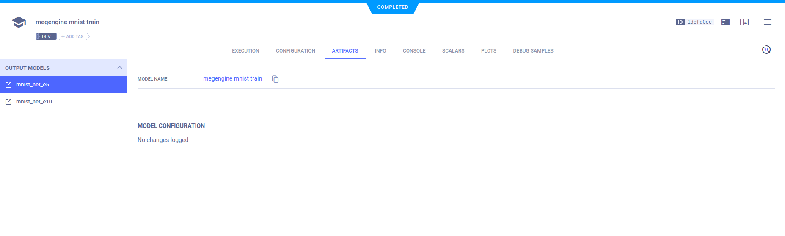
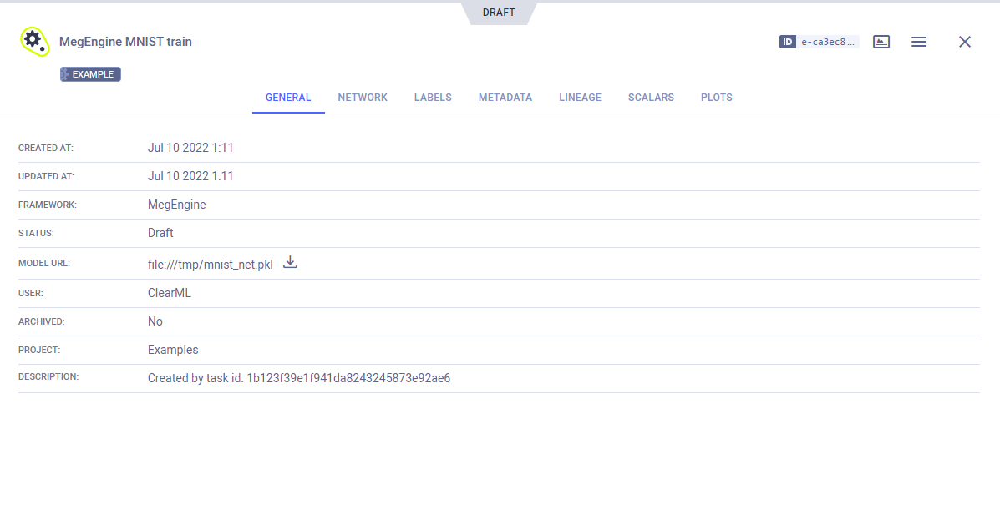
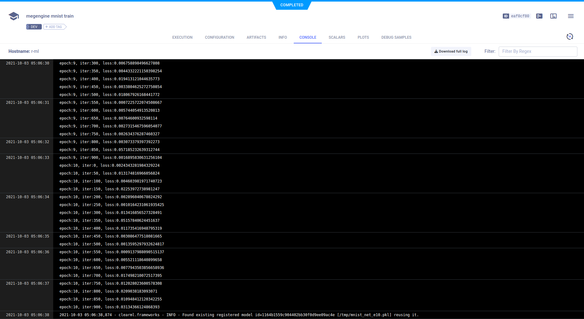

The [megengine_mnist.py](https://github.com/allegroai/clearml/blob/master/examples/frameworks/megengine/megengine_mnist.py) 
example demonstrates the integration of ClearML into code that uses [MegEngine](https://github.com/MegEngine/MegEngine) 
and [TensorBoardX](https://github.com/lanpa/tensorboardX). ClearML automatically captures models saved with `megengine`.

The example script does the following:
* Trains a simple deep neural network on MegEngine's built-in [MNIST](https://megengine.org.cn/doc/stable/en/reference/api/megengine.data.dataset.MNIST.html)
  dataset.
* Creates a TensorBoardX `SummaryWriter` object to log scalars during training.  
* Creates a ClearML experiment named `megengine mnist train`, which is associated with the `examples` project.

## Hyperparameters

ClearML automatically logs command line options defined with `argparse`. They appear in the experiment's **CONFIGURATION** 
tab under **HYPERPARAMETERS** **>** **Args**.

## Scalars

The example script's `train` function calls TensorBoardX's `SummaryWriter.add_scalar` method to report `loss`. 
ClearML automatically captures the data that is added to the `SummaryWriter` object.  

These scalars can be visualized in plots, which appear in the ClearML [WebApp](../../../webapp/webapp_home.md), in the 
experiment's **SCALARS** tab.

## Models

ClearML automatically captures the model logged using the `megengine.save` method, and saves it as an artifact.

View saved snapshots in the experiment's **ARTIFACTS** tab.

 

To view the model details, click the model name in the **ARTIFACTS** page, which will open the model's info tab. Alternatively, download the model.

The model info panel contains the model details, including: 
* Model URL
* Framework
* Snapshot locations.

## Console

All console output during the script’s execution appears in the experiment’s **CONSOLE** page.

