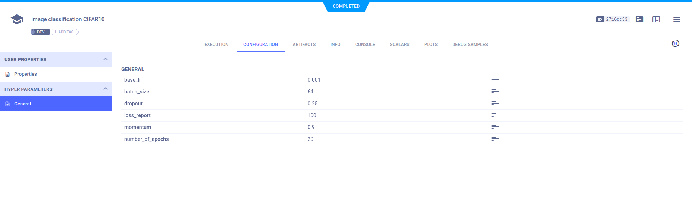
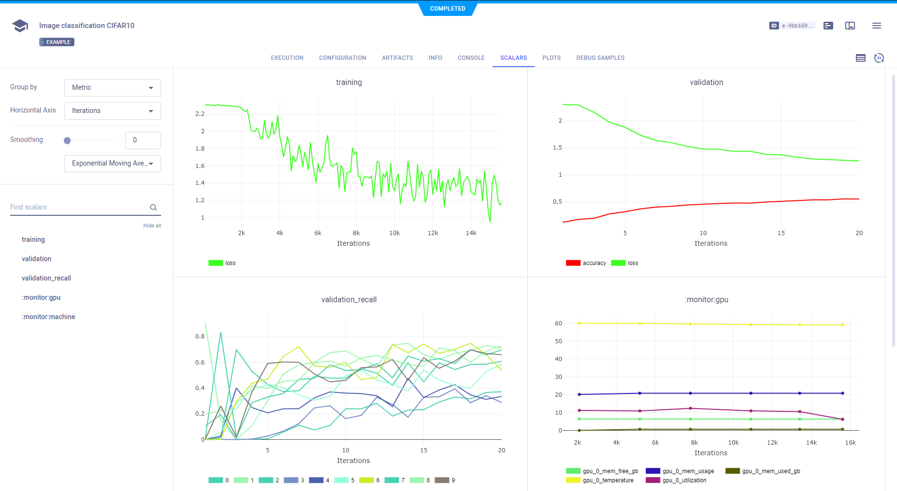

The [cifar_ignite.py](https://github.com/allegroai/clearml/blob/master/examples/frameworks/ignite/cifar_ignite.py) example 
script integrates **ClearML** into code that uses [Pytorch Ignite](https://github.com/pytorch/ignite). 
The script creates a neural network to train a model to classify images from the CIFAR10 dataset. 

The example script does the following:
* Creates a [ClearML Task](../../../fundamentals/task.md) named 'image classification CIFAR10', which is associated with the 'Image Example' project.
* Calls the [`Task.connect`](../../../references/sdk/task.md#connect) method to report configurations.
* Uses `ignite`'s `TensorboardLogger` and attaches handlers to it. See [`TensorboardLogger`](https://github.com/pytorch/ignite/blob/master/ignite/contrib/handlers/tensorboard_logger.py). 
* Uses **ClearML**'s automatic logging to capture information and outputs logged with `TensorboardLogger`.

## Hyperparameters

Parameters are explicitly reported to **ClearML** using the `task.connect` method.  

```python
params = {'number_of_epochs': 20, 'batch_size': 64, 'dropout': 0.25, 'base_lr': 0.001, 'momentum': 0.9, 'loss_report': 100}
params = task.connect(params)  # enabling configuration override by clearml
```
The hyperparameter configurations can be viewed in the WebApp in the experiment's page, in the **CONFIGURATION** tab. 



## Ignite Tensorboard Logger

`TensorboardLogger` is a handler to log metrics, parameters, and gradients when training a model. When **ClearML** is integrated
into a script which uses `TensorboardLogger`, all information logged through the handler is automatically captured by **ClearML**. 

Integrate **TensorboardLogger** with the following steps:
1. Create a `TensorboardLogger` object. 
   
  ```python
  from ignite.contrib.handlers import TensorboardLogger

  tb_logger = TensorboardLogger(log_dir="cifar-output")
  ```

1. Later in the code, attach additional handlers to the `TensorboardLogger` object. 
   For example:

    ```python
    # Log trainer loss every 100 iterations (as configured in the `loss_report` parameter):
    
    tb_logger.attach_output_handler(
    trainer,
    event_name=Events.ITERATION_COMPLETED(every=params.get('loss_report')),
    tag="training",
    output_transform=lambda loss: {"loss": loss},
    )
    ```
   
## Scalars 

In the example, the code creates `trainer` and `evaluator` engines with a supervised update function, using `ignite`'s 
`create_supervised_trainer` and `create_supervised_evaluator` methods.

The `attach_output_handler` method is used on both the `trainer` and `evaluator` engines 
so all metrics are logged after each epoch. 

View the scalars in the experiment's page in the **ClearML Web UI**, in **RESULTS** **>** **SCALARS**.




## Model snapshots

To save input snapshots, `torch.save` is used:

```python
torch.save(net.state_dict(), PATH)
```

**ClearML** automatically captures the model and saves it as an artifact. 

View saved snapshots in the experiment's **ARTIFACTS** tab.


To view the model, in the **ARTIFACTS** tab, click the model name (or download it).


## Debug Samples

ClearML automatically tracks image logged to TensorboardLogger. They appear in **RESULTS** **>** **DEBUG SAMPLES**.


## Ignite ClearMLLogger

Pytorch Ignite also offers a `ClearMLLogger` handler to log metrics, text, model/optimizer parameters, plots during 
training and validation.

For more information, see the [Pytorch Ignite ClearMLLogger](https://pytorch.org/ignite/generated/ignite.contrib.handlers.clearml_logger.html)
example.

