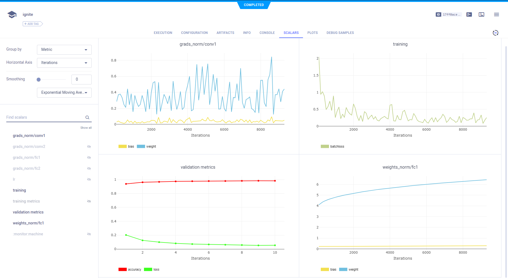
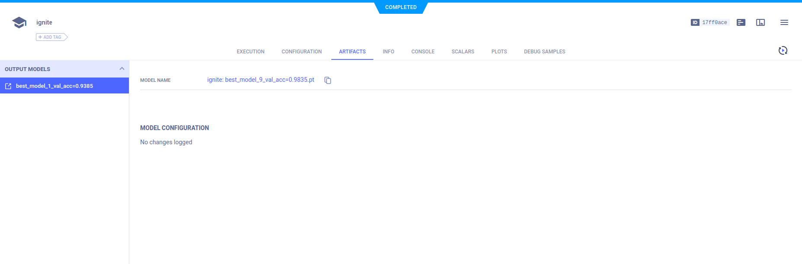

Integrate **ClearML** into code using [ignite](https://github.com/pytorch/ignite). 
Use ignite's `ClearMLLogger`, and the handlers that can be attached to it. See ignite's [handler](https://github.com/pytorch/ignite/blob/master/ignite/contrib/handlers/trains_logger.py). 

:::note 
If you are not already using **ClearML**, see our [Getting Started](/getting_started/ds/ds_first_steps.md).
:::

## Ignite ClearMLLogger

Integrate **ClearML** with the following steps:
1. Create an Ignite `ClearMLLogger` object. 
  
1. When the code runs, it connects to the **ClearML** backend, and creates a Task (experiment) in **ClearML**.
  ```python
  from ignite.contrib.handlers.clearml_logger import *

  clearml_logger = ClearMLLogger(project_name="examples", task_name="ignite")
  ```
1. Later in the code, attach any of the **ClearML** handlers to the `ClearMLLogger` object.
   
  For example, attach the `OutputHandler` and log training loss at each iteration:
  ```python
    clearml_logger.attach(trainer,
        log_handler=OutputHandler(tag="training",
        output_transform=lambda loss: {"loss": loss}),
        event_name=Events.ITERATION_COMPLETED)
  ```
    
### ClearMLLogger parameters

The following are the `ClearMLLogger` method parameters:

* `project_name` (optional[str]) – The name of the project in which the experiment will be created. If the project does not exist, it is created. If `project_name` is `None`, the repository name becomes the project name.
* `task_name` (optional[str]) – The name of Task (experiment). If `task_name` is `None`, the Python experiment script’s file name becomes the Task name.
* `task_type` (optional[str]) – The name of the experiment. 

    The `task_type` values include:
    
    * `TaskTypes.training` (default)
    * `TaskTypes.train`
    * `TaskTypes.testing`
    * `TaskTypes.inference`
        
* `report_freq` (optional[int]) – The histogram processing frequency (handles histogram values every X calls to the handler). Affects `GradsHistHandler` and `WeightsHistHandler`. Default value is `100`.    
* `histogram_update_freq_multiplier` (optional[int]) – The histogram report frequency (report first X histograms and once every X reports afterwards). Default value is `10`.
* `histogram_granularity` (optional[int]): Optional. Histogram sampling granularity. Default is `50`.

<a name="visualizing" class="tr_top_negative"></a>  

## Logging 

### Ignite engine output and / or metrics

To log scalars, Ignite engine's output and / or metrics, use the `OutputHandler`. 

* Log training loss at each iteration:
```python
# Attach the logger to the trainer to log training loss at each iteration
clearml_logger.attach(trainer,
    log_handler=OutputHandler(tag="training",
    output_transform=lambda loss: {"loss": loss}),
    event_name=Events.ITERATION_COMPLETED)
```

* Log metrics for training:
    
```python
# Attach the logger to the evaluator on the training dataset and log NLL, Accuracy metrics after each epoch
# We setup `global_step_transform=global_step_from_engine(trainer)` to take the epoch
# of the `trainer` instead of `train_evaluator`.
clearml_logger.attach(train_evaluator,
    log_handler=OutputHandler(tag="training",
        metric_names=["nll", "accuracy"],
        global_step_transform=global_step_from_engine(trainer)),
    event_name=Events.EPOCH_COMPLETED)
```

* Log metrics for validation:
                    
```python
# Attach the logger to the evaluator on the validation dataset and log NLL, Accuracy metrics after
# each epoch. We setup `global_step_transform=global_step_from_engine(trainer)` to take the epoch of the
# `trainer` instead of `evaluator`.
clearml_logger.attach(evaluator,
    log_handler=OutputHandler(tag="validation",
        metric_names=["nll", "accuracy"],
        global_step_transform=global_step_from_engine(trainer)),
    event_name=Events.EPOCH_COMPLETED)
```

### Optimizer parameters

To log optimizer parameters, use `OptimizerParamsHandler`:
```python
# Attach the logger to the trainer to log optimizer's parameters, e.g., learning rate at each iteration
clearml_logger.attach(trainer, 
    log_handler=OptimizerParamsHandler(optimizer),
    event_name=Events.ITERATION_STARTED)
```
    
### Model weights

To log model weights as scalars, use `WeightsScalarHandler`:

```python
# Attach the logger to the trainer to log model's weights norm after each iteration
clearml_logger.attach(trainer,
    log_handler=WeightsScalarHandler(model, reduction=torch.norm),
    event_name=Events.ITERATION_COMPLETED)
```

To log model weights as histograms, use `WeightsHistHandler`:

```python
# Attach the logger to the trainer to log model's weights norm after each iteration
clearml_logger.attach(trainer,
    log_handler=WeightsHistHandler(model),
    event_name=Events.ITERATION_COMPLETED)
```
    

## Model snapshots

To save input snapshots as **ClearML** artifacts, use `ClearMLSaver`:

```python
to_save = {"model": model}
    
handler = Checkpoint(to_save, ClearMLSaver(clearml_logger), n_saved=1,
    score_function=lambda e: 123, score_name="acc",
    filename_prefix="best",
    global_step_transform=global_step_from_engine(trainer))
    
validation_evaluator.add_event_handler(Events.EVENT_COMPLETED, handler)
```

## Visualizing experiment results

When the code with an ignite `ClearMLLogger` object and attached [handlers](https://github.com/pytorch/ignite/blob/master/ignite/contrib/handlers/trains_logger.py)
runs, the experiment results can be visualized in the **ClearML Web UI**. 

The `ignite` repository contains an MNIST ClearMLLogger example, [mnist_with_clearml_logger.py](https://github.com/pytorch/ignite/blob/master/examples/contrib/mnist/mnist_with_clearml_logger.py). 

Run this code and visualize the experiment results in the **ClearML Web UI**.

### Scalars

View the scalars, including training and validation metrics, in the experiment's page in the **ClearML Web UI**, under 
**RESULTS** **>** **SCALARS**.




### Model snapshots

To save model snapshots, use `ClearMLServer`.


```python
handler = Checkpoint(
        {"model": model},
        ClearMLSaver(clearml_logger, dirname="~/.clearml/cache/"),
        n_saved=1,
        score_function=lambda e: 123,
        score_name="acc",
        filename_prefix="best",
        global_step_transform=global_step_from_engine(trainer),
    )
```

<br/>    

View saved snapshots in the **ARTIFACTS** tab.



To view the model, in the **ARTIFACTS** tab, click the model name (or download it).


