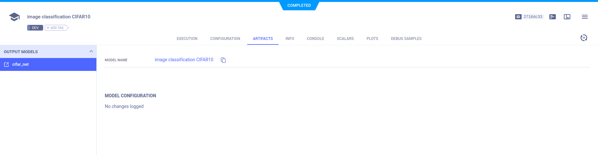

The [cifar_ignite.py](https://github.com/allegroai/clearml/blob/master/examples/frameworks/ignite/cifar_ignite.py) example 
script integrates **ClearML** into code using [ignite](https://github.com/pytorch/ignite). 
The script creates a neural network to train a model to classify images from the CIFAR10 dataset. 

The example script does the following:
* Calls `Task.connect` to report configurations.
* Uses ignite's `TensorboardLogger` and attaches handlers to it. See ignite's [handler](https://github.com/pytorch/ignite/blob/master/ignite/contrib/handlers/trains_logger.py). 
* Uses ClearML's automatic logging to capture data and outputs logged with `TensorboardLogger`.
* Creates an experiment named 'image classification CIFAR10', which is associated with the 'Image Example' project.

:::note 
If you are not already using **ClearML**, see our [Getting Started](../../../getting_started/ds/ds_first_steps.md).
:::

## Logging hyperparameters

Parameters are explicitly reported to ClearML using the `task.connect` method.  

```python
params = {'number_of_epochs': 20, 'batch_size': 64, 'dropout': 0.25, 'base_lr': 0.001, 'momentum': 0.9, 'loss_report': 100}
params = task.connect(params)  # enabling configuration override by clearml
```
The hyperparameter configurations can be viewed in the WebApp in the experiment's page, in the **CONFIGURATION** tab. 

## Ignite Tensorboard Logger

Integrate **TensorboardLogger** with the following steps:
1. Create an ignite `TensorboardLogger` object. 
   
  ```python
    from ignite.contrib.handlers import TensorboardLogger

    tb_logger = TensorboardLogger(log_dir="cifar-output")
  ```

1. Later in the code, attach any of the **TensorBoard** handlers to the `TensorboardLogger` object (see below).

## Logging 

To log scalars, Ignite engine's output and / or metrics, use the `OutputHandler` by attaching it 
to the `TensorboardLogger` object. 

The code also creates a trainer engine with a supervised update function, using ignite's `create_supervised_trainer` method.

* Log trainer loss every 100 iterations:
```python
tb_logger.attach_output_handler(
    trainer,
    event_name=Events.ITERATION_COMPLETED(every=params.get('loss_report')),
    tag="training",
    output_transform=lambda loss: {"loss": loss},
    )
```

* Log metrics for training and validation:

Attach the logger to the evaluator on the validation dataset and log all metrics after
each epoch. We set up `global_step_transform=global_step_from_engine(trainer)` to take the epoch of the
`trainer` instead of `evaluator`

```python
# Attach handler to dump evaluator's metrics every epoch completed
for tag, evaluator in [("training", trainer), ("validation", evaluator)]:
    tb_logger.attach_output_handler(
        evaluator,
        event_name=Events.EPOCH_COMPLETED,
        tag=tag,
        metric_names="all",
        global_step_transform=global_step_from_engine(trainer),
        )
```


## Model snapshots

To save input snapshots, use `torch.save`:

```python
torch.save(net.state_dict(), PATH)
```

**ClearML** automatically captures the model and saves it as an artifact. 

View saved snapshots in the **ARTIFACTS** tab.



To view the model, in the **ARTIFACTS** tab, click the model name (or download it).


### Scalars

View the scalars, including training and validation metrics, in the experiment's page in the **ClearML Web UI**, under 
**RESULTS** **>** **SCALARS**.


## Ignite ClearMLLogger

ClearML automatically captures data and ouputs logged by the TensorboardLogger. Pytorch Ignite also 
offers a ClearMLLogger handler to log metrics, text, model/optimizer parameters, plots during training and validation.

When code with ClearMLLogger integrated into it runs, it connects to the **ClearML** backend, and creates a Task (experiment) in **ClearML**.

The `ignite` repository contains an MNIST ClearMLLogger example, [mnist_with_clearml_logger.py](https://github.com/pytorch/ignite/blob/master/examples/contrib/mnist/mnist_with_clearml_logger.py).
Run this code and visualize the experiment results in the **ClearML Web UI**.

For more information, see [CLEARML_LOGGER](https://pytorch.org/ignite/generated/ignite.contrib.handlers.clearml_logger.html).

