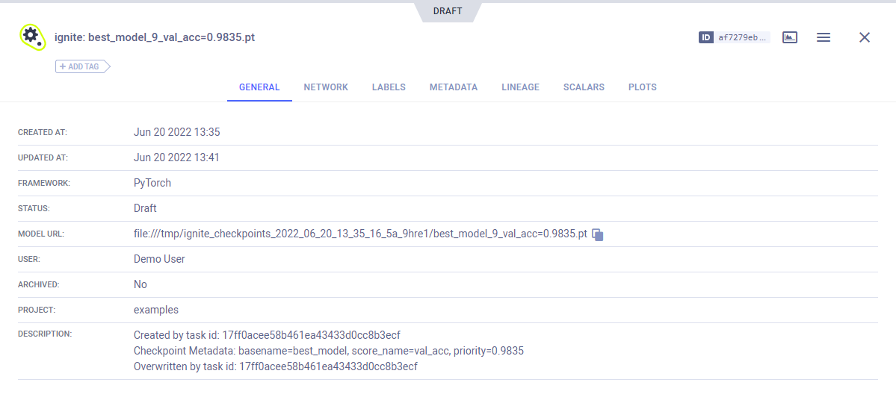

The `ignite` repository contains the [mnist_with_clearml_logger.py](https://github.com/pytorch/ignite/blob/master/examples/contrib/mnist/mnist_with_clearml_logger.py)
example script that uses [ignite](https://github.com/pytorch/ignite) and integrates **ClearMLLogger** and its helper [handlers](https://github.com/pytorch/ignite/blob/master/ignite/contrib/handlers/clearml_logger.py). 

The example script does the following:
* Trains and validates a model to classify images from the MNIST dataset. 
* Uses the following ClearMLLogger helper handlers:
    * **ClearMLSaver** - Saves input snapshots as **ClearML** artifacts
    * **GradsHistHandler** and **WeightsHistHandler** - Logs the model's gradients and weights respectively as histograms.
    * **GradsScalarHandler** and **WeightsScalarHandler** - Logs gradients and weights respectively as scalars.
* Creates a [**ClearML Task**](../../../fundamentals/task.md) named 'ignite', which is associated with the 'examples' 
  project. ClearMLLogger connects to ClearML so everything which is logged through it and its handlers 
  is automatically captured by ClearML. 


:::note 
If you are not already using ClearML, see our [Getting Started](../../../getting_started/ds/ds_first_steps.md) page.
:::

## Ignite ClearMLLogger

Integrate ClearML with the following steps:
1. Create an ignite `ClearMLLogger` object. 
  
1. When the code runs, it connects to the ClearML backend, and creates a task in ClearML.

  ```python
  from ignite.contrib.handlers.clearml_logger import ClearMLLogger

  clearml_logger = ClearMLLogger(project_name="examples", task_name="ignite")
  ```

1. Later in the code, attach any of the ClearML handlers to the `ClearMLLogger` object.
   
  For example, attach the `OutputHandler` and log training loss at each iteration:
  ```python
    clearml_logger.attach(trainer,
        log_handler=OutputHandler(tag="training",
        output_transform=lambda loss: {"loss": loss}),
        event_name=Events.ITERATION_COMPLETED)
  ```

## Logging 

### Ignite Engine Output and / or Metrics

To log scalars, ignite engine's output and / or metrics, use the `OutputHandler`. 

* Log training loss at each iteration:
```python
# Attach the logger to the trainer to log training loss at each iteration
clearml_logger.attach(trainer,
    log_handler=OutputHandler(tag="training",
    output_transform=lambda loss: {"loss": loss}),
    event_name=Events.ITERATION_COMPLETED)
```

* Log metrics for training:
    
```python
# Attach the logger to the evaluator on the training dataset and log NLL, Accuracy metrics after each epoch
# We setup `global_step_transform=global_step_from_engine(trainer)` to take the epoch
# of the `trainer` instead of `train_evaluator`.
clearml_logger.attach(train_evaluator,
    log_handler=OutputHandler(tag="training",
        metric_names=["nll", "accuracy"],
        global_step_transform=global_step_from_engine(trainer)),
    event_name=Events.EPOCH_COMPLETED)
```

* Log metrics for validation:
                    
```python
# Attach the logger to the evaluator on the validation dataset and log NLL, Accuracy metrics after
# each epoch. We setup `global_step_transform=global_step_from_engine(trainer)` to take the epoch of the
# `trainer` instead of `evaluator`.
clearml_logger.attach(evaluator,
    log_handler=OutputHandler(tag="validation",
        metric_names=["nll", "accuracy"],
        global_step_transform=global_step_from_engine(trainer)),
    event_name=Events.EPOCH_COMPLETED)
```

### Optimizer Parameters

The code creates an [optimizer object](https://pytorch.org/docs/stable/optim.html). 
```python
from torch.optim import SGD

optimizer = SGD(model.parameters(), lr=lr, momentum=momentum)
```

To log optimizer parameters, use :
```python
# Attach the logger to the trainer to log optimizer's parameters, e.g., learning rate at each iteration
clearml_logger.attach_opt_params_handler(
        trainer, event_name=Events.ITERATION_COMPLETED(every=100), optimizer=optimizer
```
 
### Model Weights

To log model weights as scalars, use `WeightsScalarHandler`:

```python
from ignite.contrib.handlers.clearml_logger import WeightsScalarHandler

clearml_logger.attach(trainer,
    log_handler=WeightsScalarHandler(model, reduction=torch.norm),
    event_name=Events.ITERATION_COMPLETED)
```

To log model weights as histograms, use `WeightsHistHandler`:

```python
from ignite.contrib.handlers.clearml_logger import WeightsHistHandler

clearml_logger.attach(trainer,
    log_handler=WeightsHistHandler(model),
    event_name=Events.ITERATION_COMPLETED)
```
    

## Model Snapshots

To save input snapshots as **ClearML** artifacts, use `ClearMLSaver`:

```python
from ignite.handlers import Checkpoint
from ignite.contrib.handlers.clearml_logger import ClearMLSaver

handler = Checkpoint(
        {"model": model},
        ClearMLSaver(),
        n_saved=1,
        score_function=lambda e: e.state.metrics["accuracy"],
        score_name="val_acc",
        filename_prefix="best",
        global_step_transform=global_step_from_engine(trainer),
    )

validation_evaluator.add_event_handler(Events.EPOCH_COMPLETED, handler)
```


## Visualizing Experiment Results

When the code runs, the experiment results can be visualized in the [**ClearML Web UI**](../../../webapp/webapp_overview.md). 

### Scalars

View the scalars, including training and validation metrics, in the experiment's page in the **ClearML Web UI**, under 
**RESULTS** **>** **SCALARS**.


<br/>


### Model Snapshots
 

View saved snapshots in the **ARTIFACTS** tab.


To view the model, in the **ARTIFACTS** tab, click the model name (or download it).


