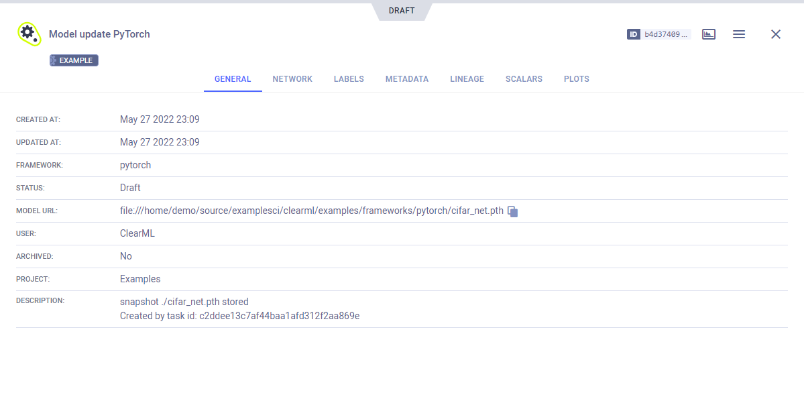
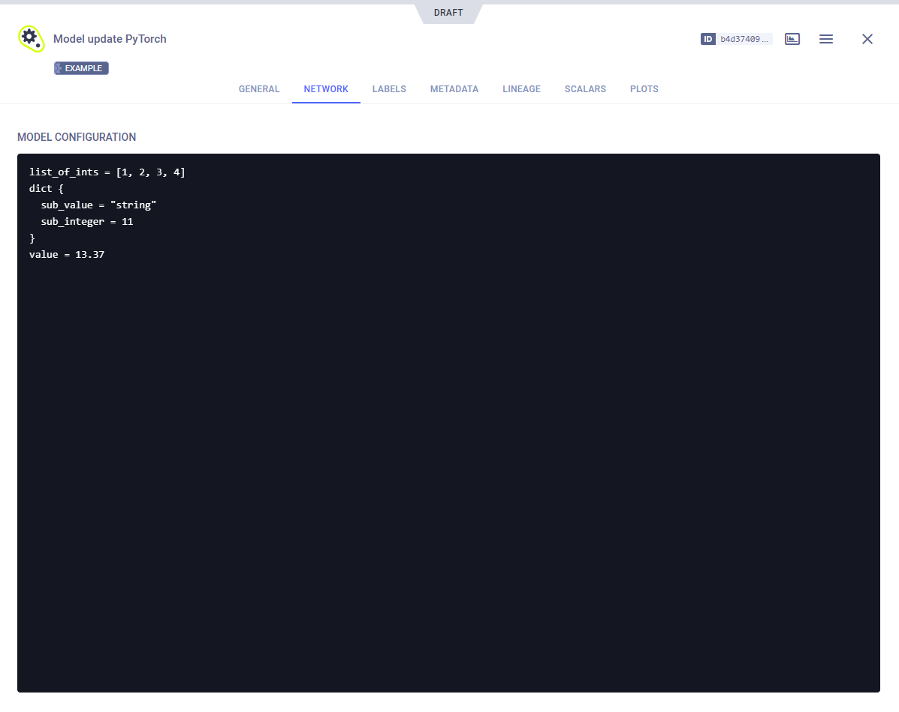

The [pytorch_model_update.py](https://github.com/allegroai/clearml/blob/master/examples/frameworks/pytorch/pytorch_model_update.py) 
example demonstrates training a model and logging it using the [OutputModel](../../../references/sdk/model_outputmodel.md) 
class. 

The example does the following:
* Creates a task named `Model update pytorch` in the `examples` project.
* Trains a neural network on the CIFAR10 dataset for image classification.
* Uses an OutputModel object to log the model, its label enumeration and configuration dictionary.

:::note Disabling automatic framework logging
This example disables the default automatic capturing of PyTorch outputs, to demonstrate how to manually control what is 
logged from PyTorch. See [this FAQ](../../../faq.md#controlling_logging) for more information. 
::: 

## Initialization
An OutputModel object is instantiated for the task. 

```python
from clearml import Task, OutputModel

task = Task.init(
        project_name="examples",
        task_name="Model update pytorch",
        auto_connect_frameworks={"pytorch": False}
)
 
output_model = OutputModel(task=task)
```

## Label Enumeration
The label enumeration dictionary is logged using the [`Task.connect_label_enumeration`](../../../references/sdk/task.md#connect_label_enumeration) 
method which will update the task's resulting model information. The current running task is accessed using the 
[`Task.current_task`](../../../references/sdk/task.md#taskcurrent_task) class method.

```python
# store the label enumeration of the training model
classes = ("plane", "car", "bird", "cat", "deer", "dog", "frog", "horse", "ship", "truck",)
enumeration = {k: v for v, k in enumerate(classes, 1)}
Task.current_task().connect_label_enumeration(enumeration)
```

:::note Directly Setting Model Enumeration
You can set a model's label enumeration directly using the [`OutputModel.update_labels`](../../../references/sdk/model_outputmodel.md#update_labels) 
method.
:::

## Model Configuration

Add a configuration dictionary to the model using the [`OutputModel.update_design`](../../../references/sdk/model_outputmodel.md#update_design) 
method. 

```python
model_config_dict = {
        "list_of_ints": [1, 2, 3, 4],
        "dict": {
            "sub_value": "string",
            "sub_integer": 11
            },
        "value": 13.37
}
 
model.update_design(config_dict=model_config_dict)
```

## Updating Models
To update a model, use [`OutputModel.update_weights()`](../../../references/sdk/model_outputmodel.md#update_weights). 
This uploads the model to the set storage destination (see [Setting Upload Destination](../../../fundamentals/models.md#setting-upload-destination)), 
and registers that location to the task as the output model. 

```python
# CONDITION depicts a custom condition for when to save the model. The model is saved and then updated in ClearML
CONDITION = True

if CONDITION:
        torch.save(net.state_dict(), PATH)
        model.update_weights(weights_filename=PATH)
```

## WebApp
The model appears in the task's **ARTIFACTS** tab. 


Clicking on the model name takes you to the [model's page](../../../webapp/webapp_model_viewing.md), where you can view the 
model's details and access the model.



The model's **NETWORK** tab displays its configuration.



The model's **LABELS** tab displays its label enumeration.


