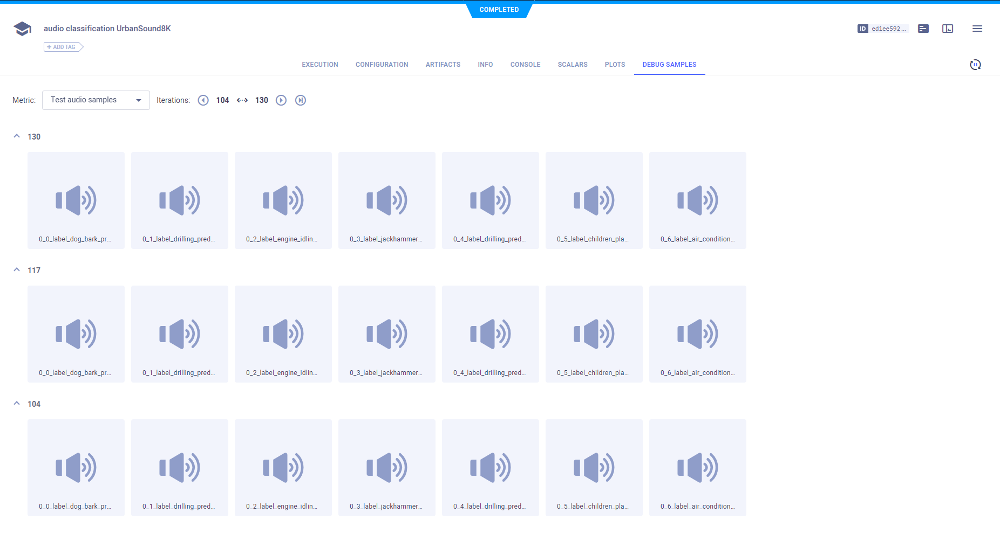
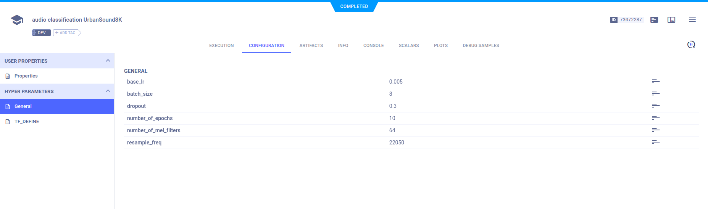
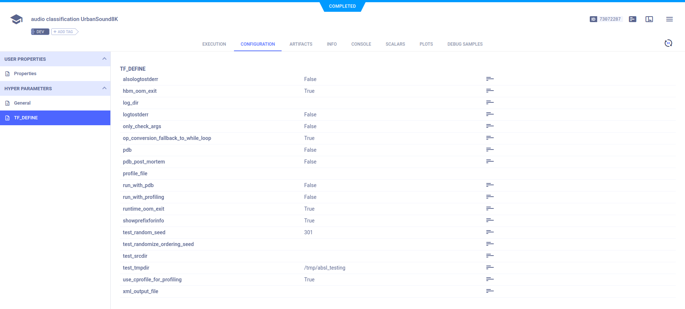
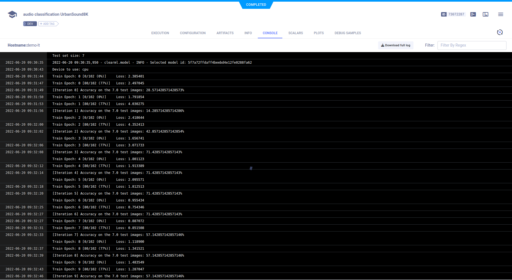

The example [audio_classification_UrbanSound8K.ipynb](https://github.com/allegroai/clearml/blob/master/examples/frameworks/pytorch/notebooks/audio/audio_classifier_UrbanSound8K.ipynb) demonstrates integrating ClearML into a Jupyter Notebook which uses PyTorch, TensorBoard, and TorchVision to train a neural network on the UrbanSound8K dataset for audio classification. The example calls TensorBoard methods in training and testing to report scalars, audio debug samples, and spectrogram visualizations. The spectrogram visualizations are plotted by calling Matplotlib methods. In the example, we also demonstrate connecting parameters to a Task and logging them. When the script runs, it creates an experiment named `audio classification UrbanSound8K` which is associated with the `Audio Example` project.

## Scalars

The accuracy, learning rate, and training loss scalars are automatically logged, along with the resource utilization plots (titled **:monitor: machine**), and appear in **SCALARS**.


## Debug Samples

The audio samples and spectrogram plots are automatically logged and appear in **DEBUG SAMPLES**.

### Audio Samples



By doubling clicking a thumbnail, you can play an audio sample.

### Spectrogram Visualizations


By doubling clicking a thumbnail, you can view a spectrogram plot in the image viewer.


## Hyperparameters

ClearML automatically logs TensorFlow Definitions. A parameter dictionary is logged by connecting it to the Task using 
a call to the [`Task.connect`](../../../../../references/sdk/task.md#connect) method. 

```python
configuration_dict = {
    'number_of_epochs': 10, 
    'batch_size': 4, 
    'dropout': 0.25, 
    'base_lr': 0.001
}
configuration_dict = task.connect(configuration_dict)  # enabling configuration override by clearml
```
Parameter dictionaries appear in **CONFIGURATION** **>** **HYPER PARAMETERS** **>** **General**.



TensorFlow Definitions appear in the **TF_DEFINE** subsection.



## Console

Text printed to the console for training progress, as well as all other console output, appear in **CONSOLE**.

