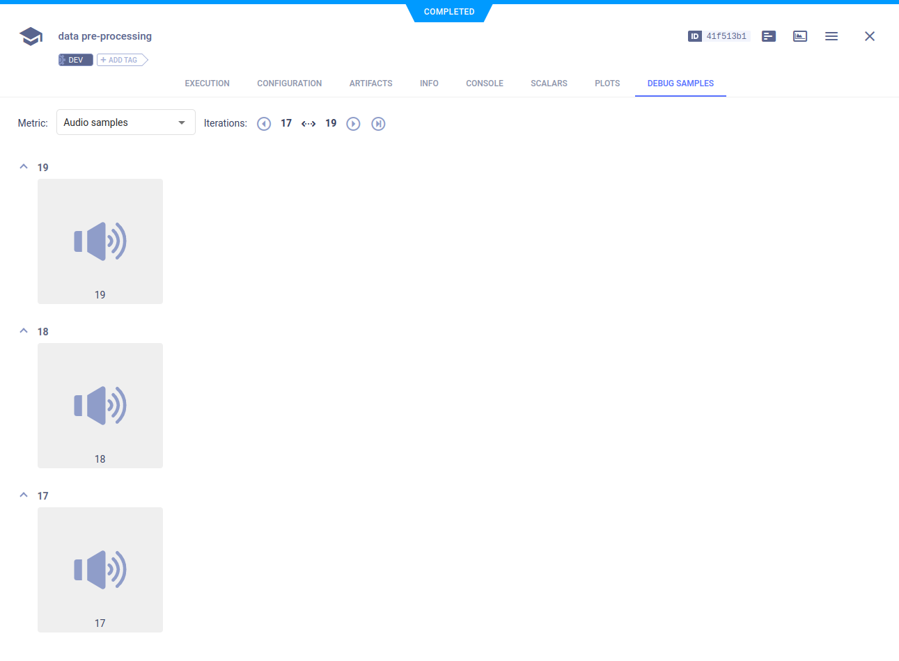
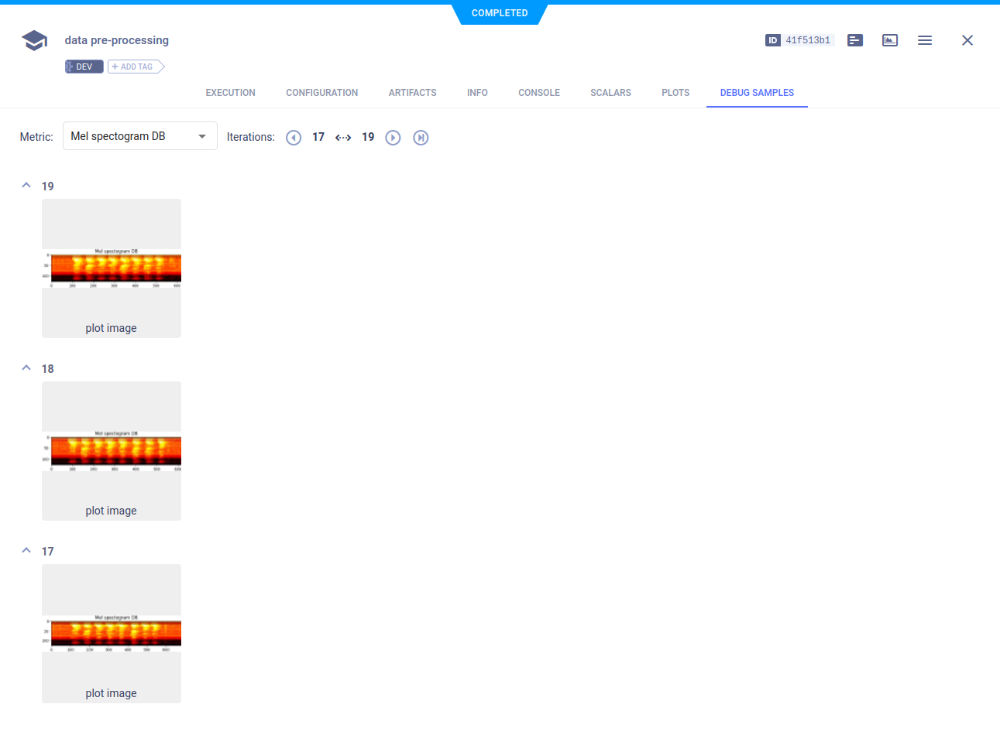

--- 
title: Audio Preprocessing - Jupyter Notebook
---

The example [audio_preprocessing_example.ipynb](https://github.com/allegroai/clearml/blob/master/examples/frameworks/pytorch/notebooks/audio/audio_preprocessing_example.ipynb) 
demonstrates integrating ClearML into a Jupyter Notebook which uses PyTorch and preprocesses audio samples. ClearML automatically logs spectrogram visualizations reported by calling Matplotlib methods, and audio samples reported by calling TensorBoard methods. In the example, we also demonstrate connecting parameters to a Task and logging them. When the script runs, it creates an experiment named `data pre-processing`, which is associated with the `Audio Example` project.

## Plots

ClearML automatically logs the waveform which the example reports by calling a Matplotlib method. These appear in **PLOTS**.

## Debug Samples

ClearML automatically logs the audio samples which the example reports by calling TensorBoard methods, and the spectrogram visualizations reported by calling Matplotlib methods. They appear in **DEBUG SAMPLES**.

### Audio Samples

You can play the audio samples by double-clicking the audio thumbnail.

### Spectrogram Visualizations

You can view the spectrogram visualizations in the **ClearML Web UI** image viewer.

