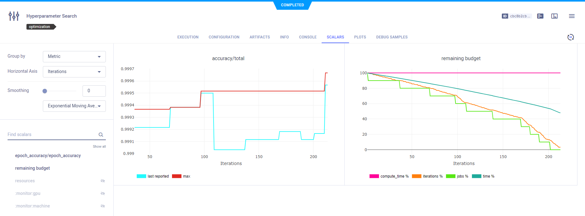
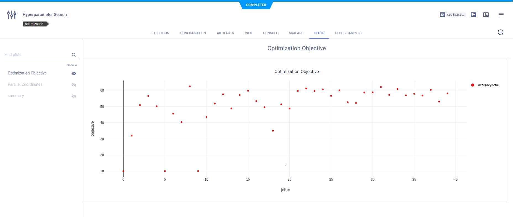
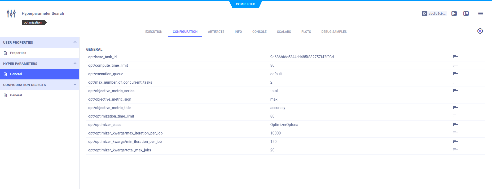
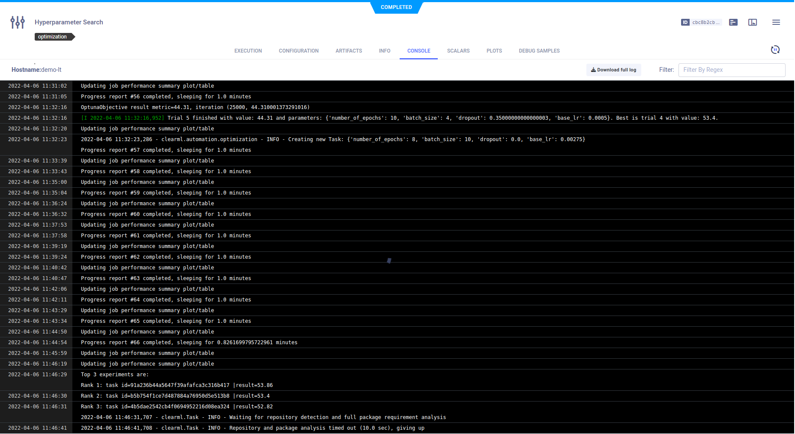
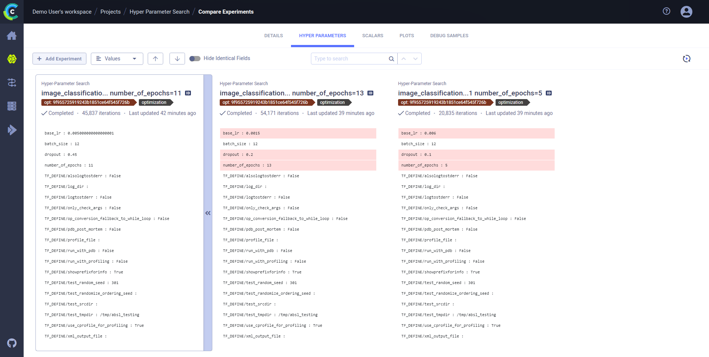
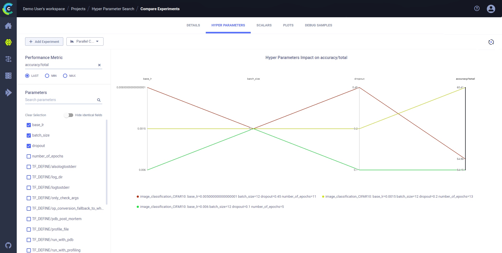
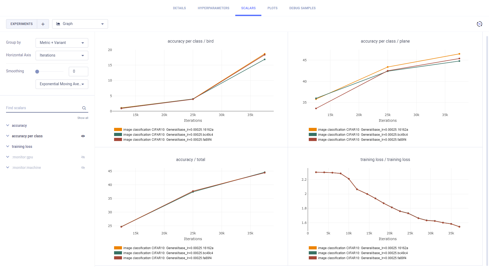
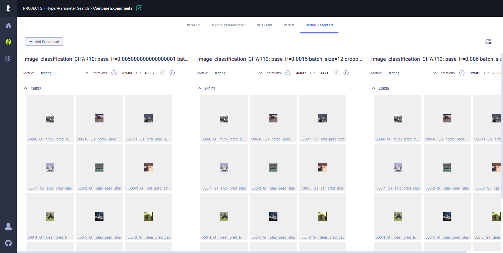

[hyperparameter_search.ipynb](https://github.com/allegroai/clearml/blob/master/examples/frameworks/pytorch/notebooks/image/hyperparameter_search.ipynb) 
demonstrates integrating **ClearML** into a Jupyter Notebook which performs automated hyperparameter optimization. This 
is an example of **ClearML** automation. It creates a **ClearML** 
[HyperParameterOptimizer](../../../../../references/sdk/hpo_optimization_hyperparameteroptimizer.md) 
object, which is a search controller. The search controller's search strategy optimizer is [OptimizerBOHB](../../../../../references/sdk/hpo_hpbandster_bandster_optimizerbohb.md) 
The example maximizes total accuracy by finding an optimal batch size, base learning rate, and dropout. **ClearML** 
automatically logs the optimization's top performing experiments.

The experiment whose hyperparameters are optimized is named `image_classification_CIFAR10`. It is created by running another 
**ClearML** example, [image_classification_CIFAR10.ipynb](https://github.com/allegroai/clearml/blob/master/examples/frameworks/pytorch/notebooks/image/image_classification_CIFAR10.ipynb), which must run before `hyperparameter_search.ipynb`.

When `hyperparameter_search.py` runs, it creates an experiment named `Hyper-Parameter Optimization` which is associated 
with the `Hyper-Parameter Search` project.

The optimizer Task, `Hyper-Parameter Optimization`, and the experiments appear individually in the **ClearML Web UI**.

## Optimizer Task

### Scalars

Scalars for total accuracy and remaining budget by iteration, and a plot of total accuracy by iteration appear in **RESULTS** **>** **SCALARS**. Remaining budget indicates the percentage of total iterations for all jobs left before that total is reached.

These scalars are reported automatically by **ClearML** from `HyperParameterOptimizer` when it runs.

### Plots

A plot for the optimization of total accuracy by job appears in **RESULTS** **>** **SCALARS**.

This is also reported automatically by **ClearML** when `HyperParameterOptimizer` runs.

### Hyperparameters

`HyperParameterOptimizer` hyperparameters, including the optimizer parameters appear in **CONFIGURATIONS** **>** **HYPER PARAMETERS**.

These hyperparameters are those in the optimizer Task, where the `HyperParameterOptimizer` object is created.

    optimizer = HyperParameterOptimizer(
        base_task_id=TEMPLATE_TASK_ID,  # This is the experiment we want to optimize
        # here we define the hyper-parameters to optimize
        hyper_parameters=[
            UniformIntegerParameterRange('number_of_epochs', min_value=5, max_value=15, step_size=1),
            UniformIntegerParameterRange('batch_size', min_value=2, max_value=12, step_size=2),
            UniformParameterRange('dropout', min_value=0, max_value=0.5, step_size=0.05),
            UniformParameterRange('base_lr', min_value=0.0005, max_value=0.01, step_size=0.0005),
        ],
        # this is the objective metric we want to maximize/minimize
        objective_metric_title='accuracy',
        objective_metric_series='total',
        objective_metric_sign='max',  # maximize or minimize the objective metric
        max_number_of_concurrent_tasks=3,  # number of concurrent experiments
        # setting optimizer - clearml supports GridSearch, RandomSearch or OptimizerBOHB
        optimizer_class=OptimizerBOHB,  # can be replaced with OptimizerBOHB
        execution_queue='default',  # queue to schedule the experiments for execution
        optimization_time_limit=30.,  # time limit for each experiment (optional, ignored by OptimizerBOHB)
        pool_period_min=1,  # Check the experiments every x minutes
        # set the maximum number of experiments for the optimization.
        # OptimizerBOHB sets the total number of iteration as total_max_jobs * max_iteration_per_job
        total_max_jobs=12,
        # setting OptimizerBOHB configuration (ignored by other optimizers)
        min_iteration_per_job=15000,  # minimum number of iterations per experiment, till early stopping
        max_iteration_per_job=150000,  # maximum number of iterations per experiment
    )

### Console

All console output from `Hyper-Parameter Optimization` appears in **RESULTS** tab, **CONSOLE** sub-tab.

## Experiments Comparison

**ClearML** automatically logs each job, meaning each experiment that executes with a set of hyperparameters, separately. Each appears as an individual experiment in the **ClearML Web UI**, where the Task name is `image_classification_CIFAR10` and the hyperparameters appended.

For example:

`image_classification_CIFAR10: base_lr=0.0075 batch_size=12 dropout=0.05 number_of_epochs=6`

Use the **ClearML Web UI** [experiment comparison](../../../../../webapp/webapp_exp_comparing.md) to visualize the following:

* Side by side hyperparameter value comparison
* Metric comparison by hyperparameter
* Scalars by specific values and series
* Plots
* Debug images

### Side by Side Hyperparameter Value Comparison

In the experiment comparison window, **HYPER PARAMETERS** tab, select **Values** in the list (the right of **+ Add Experiment**), and hyperparameter differences appear with a different background color.

### Metric Comparison by Hyperparameter

Select **Parallel Coordinates** in the list, click a **Performance Metric**, and then select the checkboxes of the hyperparameters.

### Scalar Values Comparison

In the **SCALARS** tab, select **Last Values**, **Min Values**, or **Max Values**. Value differences appear with a different background color.

### Scalar Series Comparison

Select **Graph** and the scalar series for the jobs appears, where each scalar plot shows the series for all jobs.

### Debug Samples Comparison

In the **DEBUG SAMPLES** tab, debug images appear.

