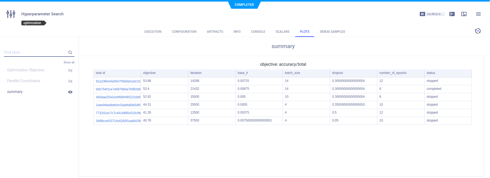

[hyperparameter_search.ipynb](https://github.com/allegroai/clearml/blob/master/examples/frameworks/pytorch/notebooks/image/hyperparameter_search.ipynb) 
demonstrates using ClearML's [HyperParameterOptimizer](../../../../../references/sdk/hpo_optimization_hyperparameteroptimizer.md)
class to perform automated hyperparameter optimization (HPO). 

The code creates a HyperParameterOptimizer object, which is a search controller. The search controller uses the
[Optuna](../../../../../references/sdk/hpo_optuna_optuna_optimizeroptuna.md) search strategy optimizer. 
The example maximizes total accuracy by finding an optimal number of epochs, batch size, base learning rate, and dropout. ClearML 
automatically logs the optimization's top performing experiments.

The experiment whose hyperparameters are optimized is named `image_classification_CIFAR10`. It is created by running another 
ClearML example, [image_classification_CIFAR10.ipynb](https://github.com/allegroai/clearml/blob/master/examples/frameworks/pytorch/notebooks/image/image_classification_CIFAR10.ipynb), 
which must run before `hyperparameter_search.ipynb`.

The optimizer Task, `Hyperparameter Optimization`, and the experiments appear individually in the [ClearML Web UI](../../../../../webapp/webapp_overview.md).

## Optimizer Task

### Hyperparameters

The `HyperParameterOptimizer`'s configuration, which is provided when the object instantiated, are stored under the 
optimizer task's **CONFIGURATION** **>** **HYPERPARAMETERS**.

```python
optimizer = HyperParameterOptimizer(
    base_task_id=TEMPLATE_TASK_ID,  # This is the experiment we want to optimize
    # here we define the hyperparameters to optimize
    hyper_parameters=[
        UniformIntegerParameterRange('number_of_epochs', min_value=2, max_value=12, step_size=2),
        UniformIntegerParameterRange('batch_size', min_value=2, max_value=16, step_size=2),
        UniformParameterRange('dropout', min_value=0, max_value=0.5, step_size=0.05),
        UniformParameterRange('base_lr', min_value=0.00025, max_value=0.01, step_size=0.00025),
    ],
    # setting the objective metric we want to maximize/minimize
    objective_metric_title='accuracy',
    objective_metric_series='total',
    objective_metric_sign='max',  # maximize or minimize the objective metric

    # setting optimizer - clearml supports GridSearch, RandomSearch, OptimizerBOHB and OptimizerOptuna
    optimizer_class=OptimizerOptuna,
    
    # Configuring optimization parameters
    execution_queue='dan_queue',  # queue to schedule the experiments for execution
    max_number_of_concurrent_tasks=2,  # number of concurrent experiments
    optimization_time_limit=60.,  # set the time limit for the optimization process
    compute_time_limit=120,  # set the compute time limit (sum of execution time on all machines)
    total_max_jobs=20,  # set the maximum number of experiments for the optimization. 
                        # Converted to total number of iteration for OptimizerBOHB
    min_iteration_per_job=15000,  # minimum number of iterations per experiment, till early stopping
    max_iteration_per_job=150000,  # maximum number of iterations per experiment
)
```


### Console

All console output appears in the optimizer task's **CONSOLE**.


### Scalars

Scalar metrics for total accuracy and remaining budget by iteration, and a plot of total accuracy by iteration appear in the 
experiment's **SCALARS** tab. Remaining budget indicates the percentage of total iterations for all jobs left before that total is reached.

ClearML automatically reports the scalars generated by `HyperParameterOptimizer`.


### Plots

The optimization task automatically records and monitors the different trial tasks' configuration and execution details, and 
provides a summary of the optimization results in tabular and parallel coordinate formats. View these plots in the task's 
**PLOTS**. 





## Experiments Comparison

## Experiments Comparison

ClearML automatically logs each job, meaning each experiment that executes with a set of hyperparameters, separately. Each appears as an individual experiment in the ClearML Web UI, where the Task name is `image_classification_CIFAR10` and the hyperparameters appended.
For example: `image_classification_CIFAR10: base_lr=0.0075 batch_size=12 dropout=0.05 number_of_epochs=6`

Use the ClearML Web UI [experiment comparison](../../../../../webapp/webapp_exp_comparing.md) to visualize the following:

* Side by side hyperparameter value comparison
* Metric comparison by hyperparameter
* Scalars by specific values and series
* Plots
* Debug images

### Side by Side Hyperparameter Value Comparison

In the experiment comparison window, **HYPERPARAMETERS** tab, select **Values** in the list (the right of **+ Add Experiment**), and hyperparameter differences appear with a different background color.


### Metric Comparison by Hyperparameter

Select **Parallel Coordinates** in the list, click a **Performance Metric**, and then select the checkboxes of the hyperparameters.


### Scalar Values Comparison

In the **SCALARS** tab, select **Last Values**, **Min Values**, or **Max Values**. Value differences appear with a different background color.


### Scalar Series Comparison

Select **Graph** and the scalar series for the jobs appears, where each scalar plot shows the series for all jobs.


### Debug Samples Comparison

In the **DEBUG SAMPLES** tab, debug images appear.

