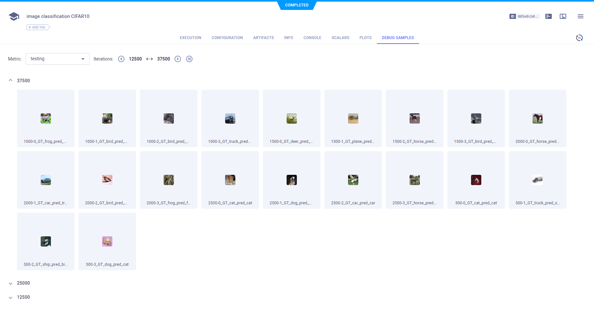
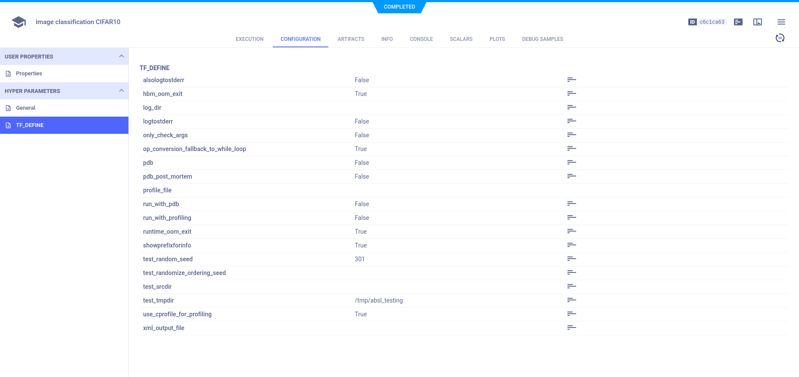
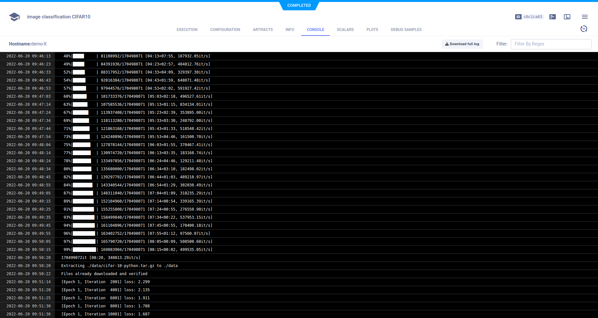

The example [image_classification_CIFAR10.ipynb](https://github.com/allegroai/clearml/blob/master/examples/frameworks/pytorch/notebooks/image/image_classification_CIFAR10.ipynb) 
demonstrates integrating ClearML into a Jupyter Notebook, which uses PyTorch, TensorBoard, and TorchVision to train a 
neural network on the CIFAR10 dataset for image classification. ClearML automatically logs the example script's 
calls to TensorBoard methods in training and testing which report scalars and image debug samples, as well as the model 
and console log. In the example, we also demonstrate connecting parameters to a Task and logging them. When the script runs, 
it creates an experiment named `image_classification_CIFAR10` which is associated with the `Image Example` project.

Another example optimizes the hyperparameters for this image classification example (see the [Hyperparameter Optimization - Jupyter Notebook](hyperparameter_search.md) documentation page). This image classification example must run before the hyperparameter optimization example.

## Scalars

The accuracy, accuracy per class, and training loss scalars are automatically logged, along with the resource utilization plots (titled **:monitor: machine**), and appear **SCALARS**.

## Debug Samples

The image samples are automatically logged and appear in **DEBUG SAMPLES**.

By doubling clicking a thumbnail, you can view a spectrogram plot in the image viewer.

## Hyperparameters

ClearML automatically logs TensorFlow Definitions. A parameter dictionary is logged by connecting it to the Task using 
a call to the [Task.connect](../../../../../references/sdk/task.md#connect) method.

    configuration_dict = {'number_of_epochs': 3, 'batch_size': 4, 'dropout': 0.25, 'base_lr': 0.001}
    configuration_dict = task.connect(configuration_dict)  # enabling configuration override by clearml

Parameter dictionaries appear in **CONFIGURATION** **>** **HYPERPARAMETERS** **>** **General**.

TensorFlow Definitions appear in the **TF_DEFINE** subsection.

## Console

Text printed to the console for training progress, as well as all other console output, appear in **CONSOLE**.

