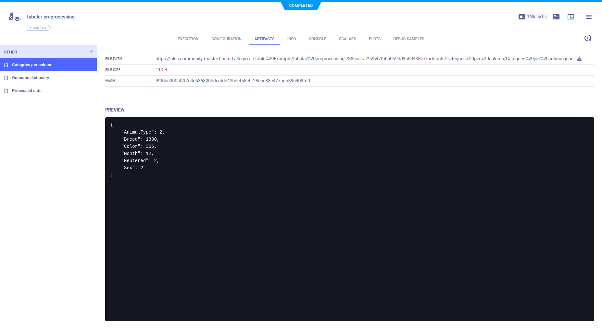
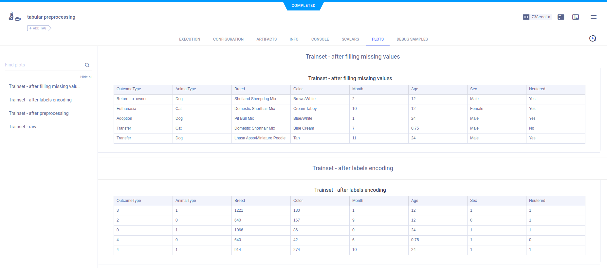
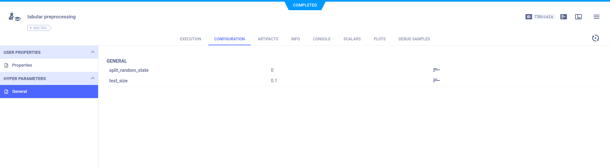
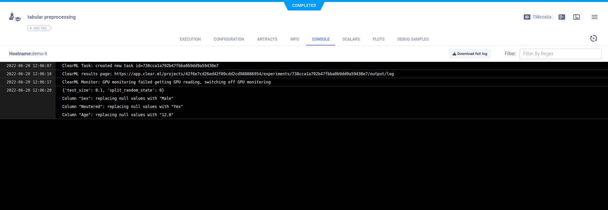

The [download_and_preprocessing.ipynb](https://github.com/allegroai/clearml/blob/master/examples/frameworks/pytorch/notebooks/table/download_and_preprocessing.ipynb) example demonstrates ClearML storing preprocessed tabular data as artifacts, and explicitly reporting the tabular data in the **ClearML Web UI**. When the script runs, it creates an experiment named `tabular preprocessing` which is associated with the `Table Example` project.

This tabular data is prepared for another script, [train_tabular_predictor.ipynb](https://github.com/allegroai/clearml/blob/master/examples/frameworks/pytorch/notebooks/table/train_tabular_predictor.ipynb), which trains a network with it. 

## Artifacts

The example code preprocesses the downloaded data using Pandas DataFrames, and stores it as three artifacts:

* `Categories per column` - Number of unique values per column of data.
* `Outcome dictionary` - Label enumeration for training.
* `Processed data` - A dictionary containing the paths of the training and validation data.

Each artifact is uploaded by calling the [Task.upload_artifact](../../../../../references/sdk/task.md#upload_artifact) 
method. Artifacts appear in the **ARTIFACTS** tab.



## Plots (tables)

The example code explicitly reports the data in Pandas DataFrames by calling the [Logger.report_table](../../../../../references/sdk/logger.md#report_table)
method.

For example, the raw data is read into a Pandas DataFrame named `train_set`, and the `head` of the DataFrame is reported.

```python
train_set = pd.read_csv(Path(path_to_ShelterAnimal) / 'train.csv')
Logger.current_logger().report_table(
    title='ClearMLet - raw',series='pandas DataFrame',iteration=0, table_plot=train_set.head()
)
```

The tables appear in **PLOTS**.    



## Hyperparameters

A parameter dictionary is logged by connecting it to the Task using a call to the [`Task.connect`](../../../../../references/sdk/task.md#connect) 
method.

```python
logger = task.get_logger()
configuration_dict = {'test_size': 0.1, 'split_random_state': 0}
configuration_dict = task.connect(configuration_dict)
```

Parameter dictionaries appear in the **General** subsection.    



## Console

Output to the console appears in **CONSOLE**.

