This example demonstrates an ML pipeline which preprocesses data in two concurrent steps, trains two networks, where each 
network's training depends upon the completion of its own preprocessed data, and picks the best model. It is implemented 
using the [PipelineController](../../../../../references/sdk/automation_controller_pipelinecontroller.md) 
class.

The pipeline uses four Tasks (each Task is created using a different notebook): 

* The pipeline controller Task ([tabular_ml_pipeline.ipynb](https://github.com/allegroai/clearml/blob/master/examples/frameworks/pytorch/notebooks/table/tabular_ml_pipeline.ipynb))
* A data preprocessing Task ([preprocessing_and_encoding.ipynb](https://github.com/allegroai/clearml/blob/master/examples/frameworks/pytorch/notebooks/table/preprocessing_and_encoding.ipynb))
* A training Task ([train_tabular_predictor.ipynb](https://github.com/allegroai/clearml/blob/master/examples/frameworks/pytorch/notebooks/table/train_tabular_predictor.ipynb))
* A better model comparison Task ([pick_best_model.ipynb](https://github.com/allegroai/clearml/blob/master/examples/frameworks/pytorch/notebooks/table/pick_best_model.ipynb))

The `PipelineController` class includes functionality to create a pipeline controller, add steps to the pipeline, pass data from one step to another, control the dependencies of a step beginning only after other steps complete, run the pipeline, wait for it to complete, and cleanup afterwards.

In this pipeline example, the data preprocessing Task and training Task are each added to the pipeline twice (each is in two steps). When the pipeline runs, the data preprocessing Task and training Task are cloned twice, and the newly cloned Tasks execute. The Task they are cloned from, called the base Task, does not execute. The pipeline controller passes different data to each cloned Task by overriding parameters. In this way, the same Task can run more than once in the pipeline, but with different data.

:::note Download Data
The data download Task is not a step in the pipeline, see [download_and_split](https://github.com/allegroai/clearml/blob/master/examples/frameworks/pytorch/notebooks/table/download_and_split.ipynb).
:::
    
## Pipeline Controller and Steps

In this example, a pipeline controller object is created.

```python
pipe = PipelineController(    
    project="Tabular Example",
    name="tabular training pipeline", 
    add_pipeline_tags=True, 
    version="0.1"
)
```
    
### Preprocessing Step

Two preprocessing nodes are added to the pipeline. These steps will run concurrently.

```python
pipe.add_step(
   name='preprocessing_1', 
   base_task_project='Tabular Example', 
   base_task_name='tabular preprocessing',
   parameter_override={
      'General/data_task_id': TABULAR_DATASET_ID,
      'General/fill_categorical_NA': 'True',
      'General/fill_numerical_NA': 'True'
   }
)
pipe.add_step(
   name='preprocessing_2', 
   base_task_project='Tabular Example', 
   base_task_name='tabular preprocessing',
   parameter_override={
      'General/data_task_id': TABULAR_DATASET_ID,
      'General/fill_categorical_NA': 'False',
      'General/fill_numerical_NA': 'True'
   }
)

```    
    

The preprocessing data Task fills in values of `NaN` data based on the values of the parameters named `fill_categorical_NA` 
and `fill_numerical_NA`. It will connect a parameter dictionary to the Task which contains keys with those same names. 
The pipeline will override the values of those keys when the pipeline executes the cloned Tasks of the base Task. In this way, 
two sets of data are created in the pipeline.

<Collapsible type="info" title="ClearML tracks and reports the preprocessing step">

In the preprocessing data Task, the parameter values in ``data_task_id``, ``fill_categorical_NA``, and ``fill_numerical_NA`` are overridden.
```python
configuration_dict = {
   'data_task_id': TABULAR_DATASET_ID,
   'fill_categorical_NA': True, 
   'fill_numerical_NA': True
}
configuration_dict = task.connect(configuration_dict)  # enabling configuration override by clearml
```

ClearML tracks and reports each instance of the preprocessing Task.

The raw data appears as a table in **PLOTS**.

These images are from one of the two preprocessing Tasks.
   
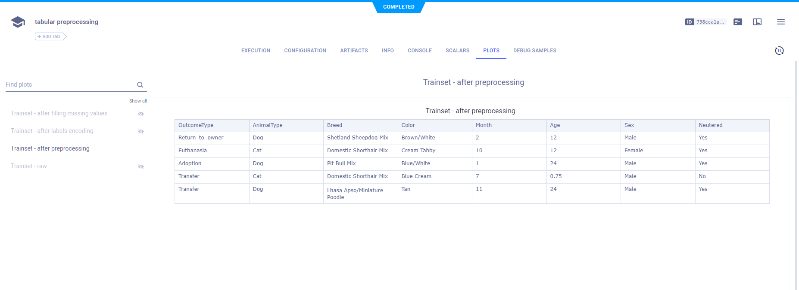

The data after filling NA values is also reported.
   
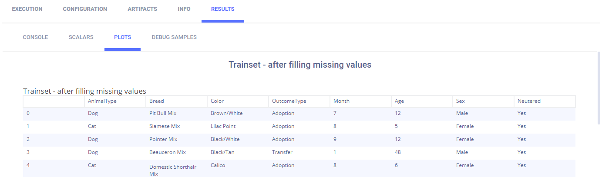
   
After an outcome dictionary (label enumeration) is created, it appears in **ARTIFACTS** **>** **OTHER** **>** **Outcome Dictionary**.

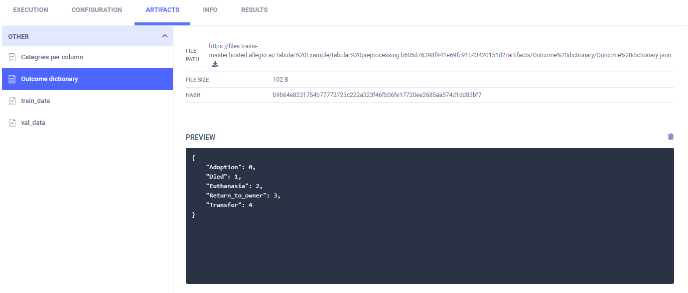

The training and validation data is labeled with the encoding and reported as table.
   
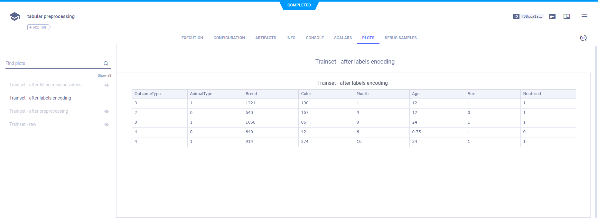

The column categories are created and uploaded as artifacts, which appear in appears in **ARTIFACTS** **>** **OTHER** **>** **Outcome Dictionary**.
   
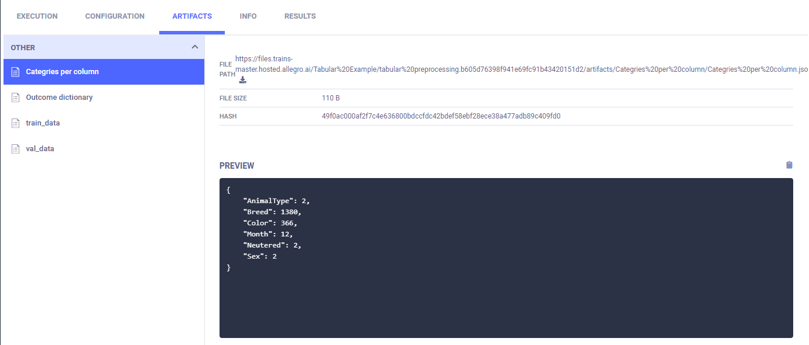

Finally, the training data and validation data are stored as artifacts.
   
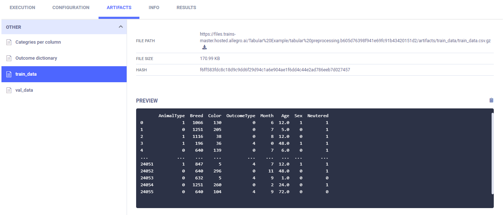   

</Collapsible>
   

### Training Step

Each training node depends upon the completion of one preprocessing node. The parameter `parents` is a list of step names indicating all steps that must complete before the new step starts. In this case, `preprocessing_1` must complete before `train_1` begins, and `preprocessing_2` must complete before `train_2` begins.

The ID of a Task whose artifact contains a set of preprocessed data for training will be overridden using the `data_task_id` key. Its value takes the form `${<stage-name>.<part-of-Task>}`. In this case, `${preprocessing_1.id}` is the ID of one of the preprocessing node Tasks. In this way, each training Task consumes its own set of data.

```python
pipe.add_step(
   name='train_1', 
   parents=['preprocessing_1'],
   base_task_project='Tabular Example', 
   base_task_name='tabular prediction',
   parameter_override={
      'General/data_task_id': '${preprocessing_1.id}'
   }
)
pipe.add_step(
   name='train_2', 
   parents=['preprocessing_2'],
   base_task_project='Tabular Example', 
   base_task_name='tabular prediction',
   parameter_override={
      'General/data_task_id': '${preprocessing_2.id}'
   }
)
```
   
<Collapsible type="info" title="ClearML tracks and reports the training step">

In the training Task, the ``data_task_id`` parameter value is overridden. This allows the pipeline controller to pass a 
different Task ID to each instance of training, where each Task has an artifact containing different data.
  
```python
configuration_dict = {
    'data_task_id': TABULAR_DATASET_ID, 
    'number_of_epochs': 15, 'batch_size': 100, 'dropout': 0.3, 'base_lr': 0.1
}
configuration_dict = task.connect(configuration_dict)  # enabling configuration override by clearml
   ```
    
ClearML tracks and reports the training step with each instance of the newly cloned and executed training Task.

ClearML automatically logs training loss and learning. They appear in **SCALARS**.

The following images show one of the two training Tasks.

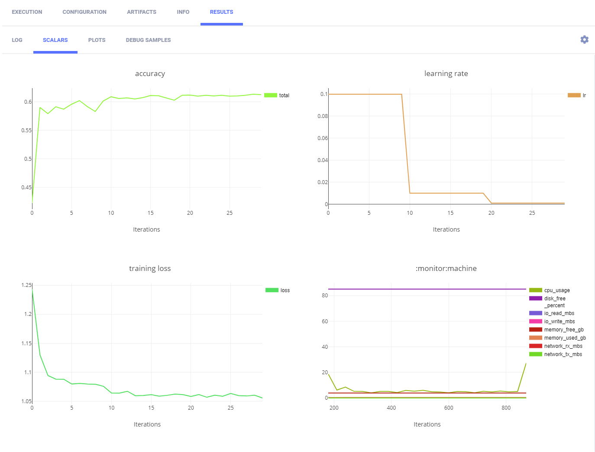

Parameter dictionaries appear in the **General** subsection.

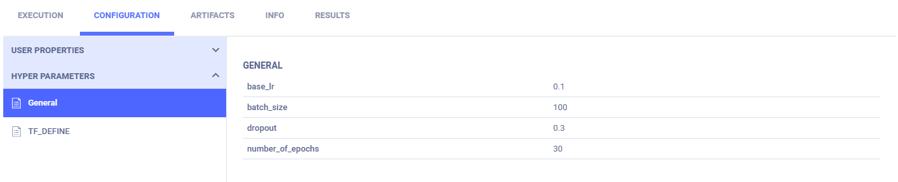
   
The TensorFlow Definitions appear in the **TF_DEFINE** subsection.

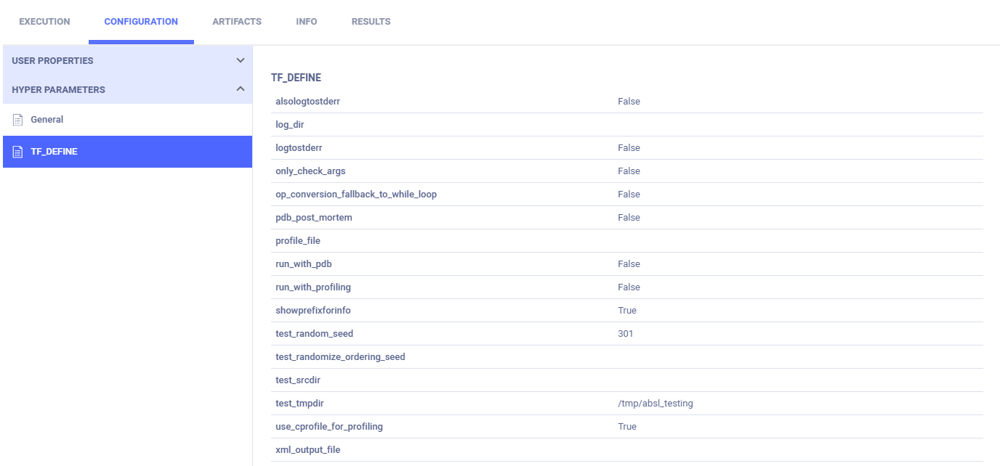
   
</Collapsible>
   

### Best Model Step

The best model step depends upon both training nodes completing and takes the two training node Task IDs to override.

```python
pipe.add_step(
   name='pick_best', 
   parents=['train_1', 'train_2'],
   base_task_project='Tabular Example', 
   base_task_name='pick best model',
   parameter_override={
      'General/train_tasks_ids': '[${train_1.id}, ${train_2.id}]'
   }
)           
```
       
The IDs of the training Tasks from the steps named `train_1` and `train_2` are passed to the best model Task. They take the form `${<stage-name>.<part-of-Task>}`.           

<Collapsible type="info" title="ClearML tracks and reports the best model step">

In the best model Task, the `train_tasks_ids` parameter is overridden with the Task IDs of the two training tasks.

```python
configuration_dict = {
   'train_tasks_ids': 
      ['c9bff3d15309487a9e5aaa00358ff091', 'c9bff3d15309487a9e5aaa00358ff091']
}
configuration_dict = task.connect(configuration_dict)  # enabling configuration override by clearml
```

The logs show the Task ID and accuracy for the best model in **CONSOLE**.
   
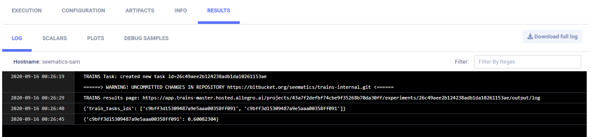
   
The link to the model details is in **ARTIFACTS** **>** **Output Model** .
        
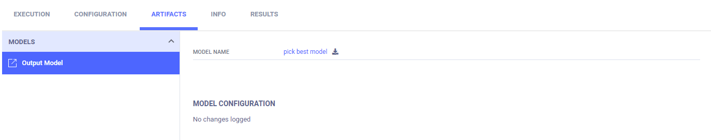
   
The model details appear in the **MODELS** table **>** **>GENERAL**.
   
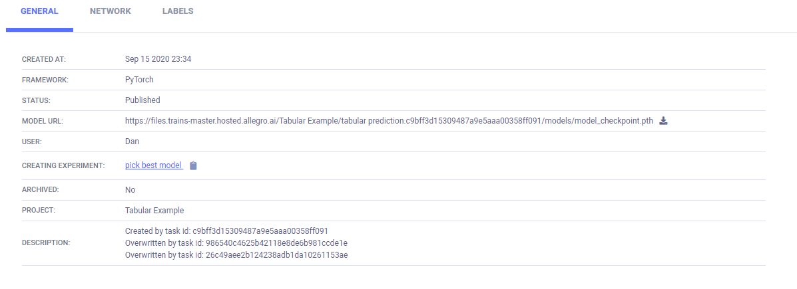
   
</Collapsible>
   

### Pipeline Start, Wait, and Cleanup

Once all steps are added to the pipeline, start it. Wait for it to complete. Finally, cleanup the pipeline processes.

```python
# Starting the pipeline (in the background)
pipe.start()
# Wait until pipeline terminates
pipe.wait()
# cleanup everything
pipe.stop()
```

<Collapsible type="info" title="ClearML tracks and reports the pipeline's execution">

ClearML reports the pipeline with its steps in **PLOTS**.
   
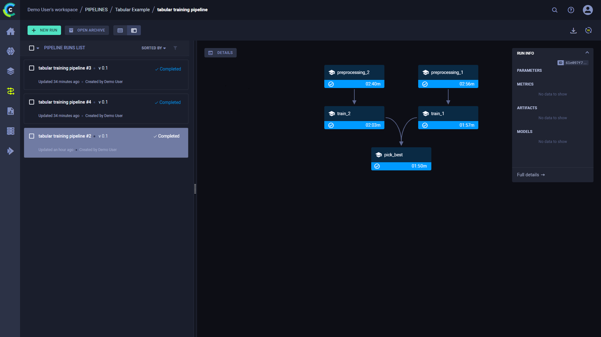
   
By hovering over a step or path between nodes, you can view information about it.
       
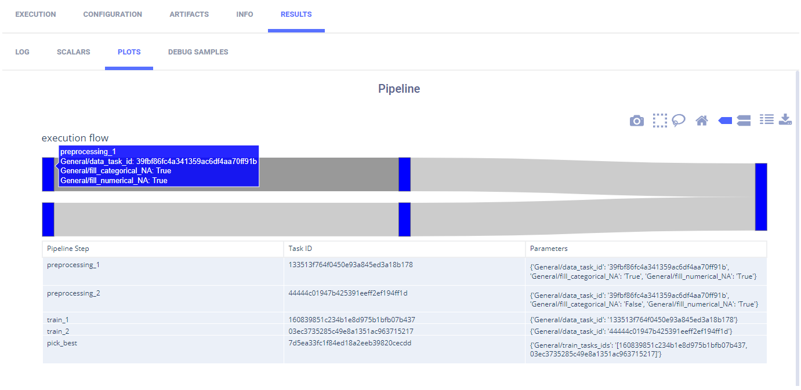
   
</Collapsible>


## Running the Pipeline

**To run the pipeline:**

1. Download the data by running the notebook [download_and_split.ipynb](https://github.com/allegroai/clearml/blob/master/examples/frameworks/pytorch/notebooks/table/download_and_split.ipynb).

1. Run the script for each of the steps, if the script has not run once before.

    * [preprocessing_and_encoding.ipynb](https://github.com/allegroai/clearml/blob/master/examples/frameworks/pytorch/notebooks/table/preprocessing_and_encoding.ipynb)
    * [train_tabular_predictor.ipynb](https://github.com/allegroai/clearml/blob/master/examples/frameworks/pytorch/notebooks/table/train_tabular_predictor.ipynb)
    * [pick_best_model.ipynb](https://github.com/allegroai/clearml/blob/master/examples/frameworks/pytorch/notebooks/table/pick_best_model.ipynb).

1. Run the pipeline controller one of the following two ways:

    * Run the notebook [tabular_ml_pipeline.ipynb](https://github.com/allegroai/clearml/blob/master/examples/frameworks/pytorch/notebooks/table/tabular_ml_pipeline.ipynb).
    * Remotely execute the Task - If the Task `tabular training pipeline` which is associated with the project `Tabular Example` already exists in ClearML Server, clone it and enqueue it to execute.  
      

:::note 
If you enqueue a Task, a worker must be listening to that queue for the Task to execute.
:::