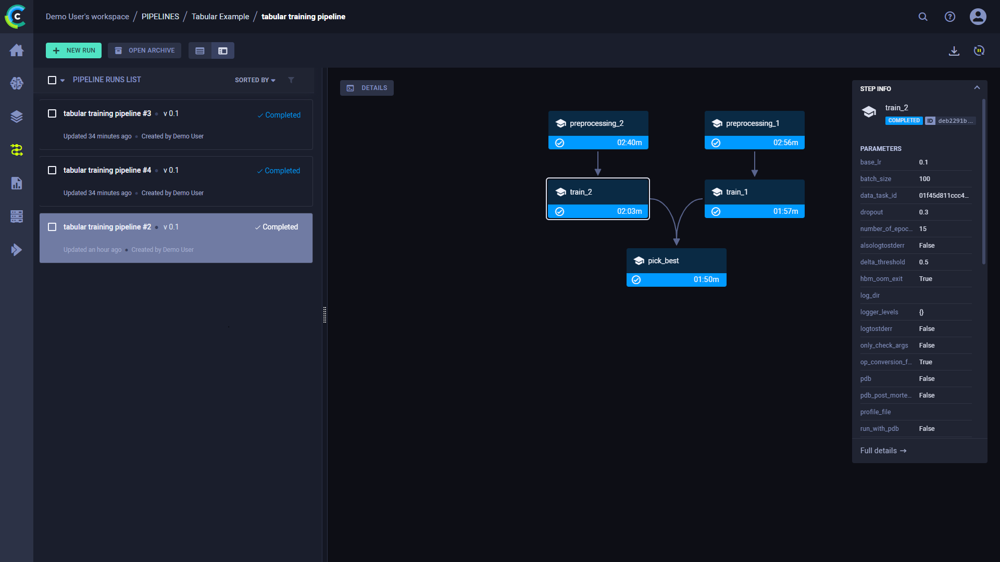

This example demonstrates an ML pipeline which preprocesses data in two concurrent steps, trains two networks, where each 
network's training depends upon the completion of its own preprocessed data, and picks the best model. It is implemented 
using the [PipelineController](../../../../../references/sdk/automation_controller_pipelinecontroller.md) 
class.

The pipeline uses four Tasks (each Task is created using a different notebook): 

* The pipeline controller Task ([tabular_ml_pipeline.ipynb](https://github.com/allegroai/clearml/blob/master/examples/frameworks/pytorch/notebooks/table/tabular_ml_pipeline.ipynb))
* A data preprocessing Task ([preprocessing_and_encoding.ipynb](https://github.com/allegroai/clearml/blob/master/examples/frameworks/pytorch/notebooks/table/preprocessing_and_encoding.ipynb))
* A training Task ([train_tabular_predictor.ipynb](https://github.com/allegroai/clearml/blob/master/examples/frameworks/pytorch/notebooks/table/train_tabular_predictor.ipynb))
* A better model comparison Task ([pick_best_model.ipynb](https://github.com/allegroai/clearml/blob/master/examples/frameworks/pytorch/notebooks/table/pick_best_model.ipynb))

The `PipelineController` class includes functionality to create a pipeline controller, add steps to the pipeline, pass data from one step to another, control the dependencies of a step beginning only after other steps complete, run the pipeline, wait for it to complete, and cleanup afterwards.

In this pipeline example, the data preprocessing Task and training Task are each added to the pipeline twice (each is in two steps). When the pipeline runs, the data preprocessing Task and training Task are cloned twice, and the newly cloned Tasks execute. The Task they are cloned from, called the base Task, does not execute. The pipeline controller passes different data to each cloned Task by overriding parameters. In this way, the same Task can run more than once in the pipeline, but with different data.

:::note Download Data
The data download Task is not a step in the pipeline, see [download_and_split](https://github.com/allegroai/clearml/blob/master/examples/frameworks/pytorch/notebooks/table/download_and_split.ipynb).
:::
    
## Pipeline Controller and Steps

In this example, a pipeline controller object is created.

```python
pipe = PipelineController(    
    project="Tabular Example",
    name="tabular training pipeline", 
    add_pipeline_tags=True, 
    version="0.1"
)
```
    
### Preprocessing Step

Two preprocessing nodes are added to the pipeline. These steps will run concurrently.

```python
pipe.add_step(
   name='preprocessing_1', 
   base_task_project='Tabular Example', 
   base_task_name='tabular preprocessing',
   parameter_override={
      'General/data_task_id': TABULAR_DATASET_ID,
      'General/fill_categorical_NA': 'True',
      'General/fill_numerical_NA': 'True'
   }
)
pipe.add_step(
   name='preprocessing_2', 
   base_task_project='Tabular Example', 
   base_task_name='tabular preprocessing',
   parameter_override={
      'General/data_task_id': TABULAR_DATASET_ID,
      'General/fill_categorical_NA': 'False',
      'General/fill_numerical_NA': 'True'
   }
)
```    

The preprocessing data Task fills in values of `NaN` data based on the values of the parameters named `fill_categorical_NA` 
and `fill_numerical_NA`. It will connect a parameter dictionary to the Task which contains keys with those same names. 
The pipeline will override the values of those keys when the pipeline executes the cloned Tasks of the base Task. In this way, 
two sets of data are created in the pipeline.
 
### Training Step

Each training node depends upon the completion of one preprocessing node. The parameter `parents` is a list of step names indicating all steps that must complete before the new step starts. In this case, `preprocessing_1` must complete before `train_1` begins, and `preprocessing_2` must complete before `train_2` begins.

The ID of a Task whose artifact contains a set of preprocessed data for training will be overridden using the `data_task_id` key. Its value takes the form `${<stage-name>.<part-of-Task>}`. In this case, `${preprocessing_1.id}` is the ID of one of the preprocessing node Tasks. In this way, each training Task consumes its own set of data.

```python
pipe.add_step(
   name='train_1', 
   parents=['preprocessing_1'],
   base_task_project='Tabular Example', 
   base_task_name='tabular prediction',
   parameter_override={
      'General/data_task_id': '${preprocessing_1.id}'
   }
)
pipe.add_step(
   name='train_2', 
   parents=['preprocessing_2'],
   base_task_project='Tabular Example', 
   base_task_name='tabular prediction',
   parameter_override={
      'General/data_task_id': '${preprocessing_2.id}'
   }
)
```
   
### Best Model Step

The best model step depends upon both training nodes completing and takes the two training node Task IDs to override.

```python
pipe.add_step(
   name='pick_best', 
   parents=['train_1', 'train_2'],
   base_task_project='Tabular Example', 
   base_task_name='pick best model',
   parameter_override={
      'General/train_tasks_ids': '[${train_1.id}, ${train_2.id}]'
   }
)           
```
       
The IDs of the training Tasks from the steps named `train_1` and `train_2` are passed to the best model Task. They take the form `${<stage-name>.<part-of-Task>}`.           

### Set Default Execution Queue
Set the default execution queue for pipeline steps that did not specify an execution queue. The pipeline steps will be 
enqueued for execution in this queue.

```python
pipe.set_default_execution_queue(default_execution_queue="default")
```

:::note
Make sure to assign a [ClearML Agent](../../../../../clearml_agent.md) to the queue which the steps are enqueued, so they will be executed
:::

### Pipeline Execution

Start the pipeline! [`PipelineController.start()`](../../../../../references/sdk/automation_controller_pipelinecontroller.md#start) launches 
the pipeline controller through the services queue, unless otherwise specified. The pipeline steps are enqueued to their 
respective queues or in the default execution queue.

To launch the pipeline controller locally use [`PipelineController.start_locally()`](../../../../../references/sdk/automation_controller_pipelinecontroller.md#start_locally) 
instead. To run the pipeline steps locally as well, pass `run_pipeline_steps_locally=True`.

Once the pipeline starts, wait for it to complete. Finally, clean up the pipeline processes.

```python
# Starting the pipeline (in the background)
pipe.start()
# Wait until pipeline terminates
pipe.wait()
# cleanup everything
pipe.stop()
```

## Running the Pipeline

**To run the pipeline:**

1. Download the data by running the notebook [download_and_split.ipynb](https://github.com/allegroai/clearml/blob/master/examples/frameworks/pytorch/notebooks/table/download_and_split.ipynb).
1. Run the script for each of the steps, if the script has not run once before.
    * [preprocessing_and_encoding.ipynb](https://github.com/allegroai/clearml/blob/master/examples/frameworks/pytorch/notebooks/table/preprocessing_and_encoding.ipynb)
    * [train_tabular_predictor.ipynb](https://github.com/allegroai/clearml/blob/master/examples/frameworks/pytorch/notebooks/table/train_tabular_predictor.ipynb)
    * [pick_best_model.ipynb](https://github.com/allegroai/clearml/blob/master/examples/frameworks/pytorch/notebooks/table/pick_best_model.ipynb).
1. Run the pipeline controller one of the following two ways:
    * Run the notebook [tabular_ml_pipeline.ipynb](https://github.com/allegroai/clearml/blob/master/examples/frameworks/pytorch/notebooks/table/tabular_ml_pipeline.ipynb).
    * If you have already run the pipeline, you can rerun it via the UI (see [Pipeline Runs](../../../../../pipelines/pipelines.md#pipeline-runs)).   
      
:::note 
If you enqueue a Task, a [ClearML Agent](../../../../../clearml_agent.md) must be listening to that queue for the Task to execute.
:::

## WebApp

View the pipeline’s structure and the execution status of every step, as well as its 
configuration parameters and output in the [WebApp](../../../../../webapp/pipelines/webapp_pipeline_viewing.md).
   

   
Click on a step node the execution graph to view its details, including its parameters and metrics.
       

   
To view a step’s details panel, click **DETAILS** and then click on a step node, or hover over a step node and click .
The details panel includes the **PREVIEW** tab, where you can view the plots attached to a step. 


For more information on the pipeline UI, see [Pipeline Run Details](../../../../../webapp/pipelines/webapp_pipeline_viewing.md).
