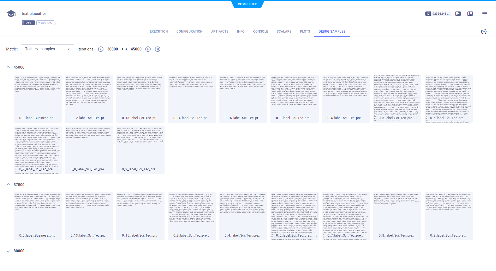

The example [text_classification_AG_NEWS.ipynb](https://github.com/allegroai/clearml/blob/master/examples/frameworks/pytorch/notebooks/text/text_classification_AG_NEWS.ipynb) 
demonstrates using Jupyter Notebook for ClearML, and the integration of ClearML into code which trains a network 
to classify text in the `torchtext` [AG_NEWS](https://pytorch.org/text/stable/datasets.html#ag-news) dataset, and then applies the model to predict the classification of sample text. 

ClearML automatically logs the scalars and text samples reported with TensorBoard methods. The example code explicitly logs parameters to the Task. When the script runs, it creates an experiment named `text classifier` in the `Text Example` project.

## Scalars

Accuracy, learning rate, and training loss appear in **SCALARS**, along with the resource utilization plots, which are titled **:monitor: machine**.


## Debug Samples

ClearML automatically logs the text samples reported to TensorBoard. They are displayed in the experiment's **Debug Samples**.



## Hyperparameters

A parameter dictionary is logged by connecting it to the Task using [`Task.connect()`](../../../../../references/sdk/task.md#connect):

```python
configuration_dict = {
    'number_of_epochs': 6, 'batch_size': 16, 'ngrams': 2, 'base_lr': 1.0
}
# enabling configuration override by clearml
configuration_dict = task.connect(configuration_dict)  
```
    
The parameters are displayed in the experiment's **CONFIGURATION** **>** **HYPERPARAMETERS** **>** **General** section.


## Console

Text printed to the console for training progress, as well as all other console output, appear in **CONSOLE**.


